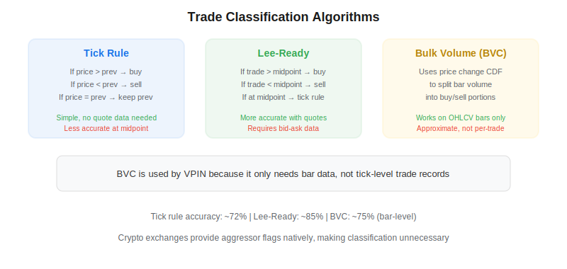
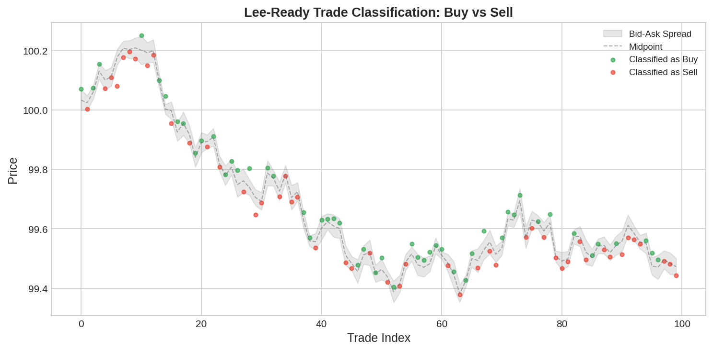

Trade classification is the process of determining whether each trade in a market was initiated by a buyer (aggressor bought from a resting sell order) or a seller (aggressor sold into a resting buy order). This classification is fundamental to market microstructure analysis and is required for computing metrics like [VPIN](https://paperswithbacktest.com/wiki/vpin-volume-synchronized-probability-informed-trading), [Kyle's Lambda](https://paperswithbacktest.com/wiki/kyles-lambda), and order flow toxicity indicators. Marcos Lopez de Prado discusses trade classification in the context of building microstructure features for ML models.

## Why Trade Classification Matters

Order flow direction contains information that raw prices do not. A stock rising on heavy buy-initiated volume tells a different story than one rising on sell-initiated volume (short covering). For algo traders building strategies based on [tick imbalance bars](https://paperswithbacktest.com/wiki/tick-imbalance-bars-tibs) or VPIN, the accuracy of trade classification directly affects signal quality.



## The Tick Rule

The tick rule is the simplest classification method. It uses the price change from the previous trade to infer direction:

- If $p_t > p_{t-1}$ → **buy** (uptick)
- If $p_t < p_{t-1}$ → **sell** (downtick)
- If $p_t = p_{t-1}$ → use the previous classification (continuation)

The tick rule requires only trade prices — no quote data needed. Its accuracy is approximately 72% on equity markets.

## The Lee-Ready Algorithm

Lee and Ready (1991) improve on the tick rule by using quote data. Each trade is compared to the midpoint of the prevailing bid-ask quote:

- If $p_t > \frac{\text{bid} + \text{ask}}{2}$ → **buy**
- If $p_t < \frac{\text{bid} + \text{ask}}{2}$ → **sell**
- If $p_t = \text{midpoint}$ → fall back to tick rule

Lee-Ready achieves approximately 85% accuracy but requires synchronized bid-ask quote data, which is more expensive and complex to handle.



## Bulk Volume Classification (BVC)

Easley, Lopez de Prado, and O'Hara (2012) introduced BVC as a simpler alternative that works on OHLCV bar data rather than individual trades. For each bar, the fraction classified as buy volume is:

$$V^B = V \cdot \Phi\left(\frac{\Delta P}{\sigma_{\Delta P}}\right)$$

where $\Delta P$ is the price change over the bar, $\sigma_{\Delta P}$ is its standard deviation, and $\Phi(\cdot)$ is the standard normal CDF. The remainder is sell volume: $V^S = V - V^B$.

BVC is the classification method used in VPIN because it only requires bar data, making it applicable to any instrument with OHLCV history.

## Python Implementation

```python
import numpy as np
import pandas as pd
from scipy.stats import norm

def tick_rule(prices):
    diff = prices.diff()
    signs = np.sign(diff)
    signs = signs.replace(0, np.nan).ffill().fillna(1)
    return signs.astype(int)

def lee_ready(trade_prices, bid, ask):
    midpoint = (bid + ask) / 2
    classified = np.where(trade_prices > midpoint, 1,
                 np.where(trade_prices < midpoint, -1, np.nan))
    classified = pd.Series(classified, index=trade_prices.index)
    # Fill midpoint trades with tick rule
    tick = tick_rule(trade_prices)
    classified = classified.fillna(tick)
    return classified.astype(int)

def bulk_volume_classification(close, volume, window=20):
    dp = close.diff()
    sigma = dp.rolling(window).std()
    z = dp / sigma.replace(0, np.nan)
    buy_frac = z.apply(norm.cdf)
    buy_vol = volume * buy_frac
    sell_vol = volume * (1 - buy_frac)
    return buy_vol, sell_vol

# Example
np.random.seed(42)
n = 500
prices = pd.Series(100 + np.cumsum(np.random.normal(0, 0.05, n)))
signs = tick_rule(prices)
print(f"Buy-initiated: {(signs == 1).sum()}, Sell-initiated: {(signs == -1).sum()}")
```

## Accuracy Comparison

| Method | Data Required | Accuracy | Speed |
|---|---|---|---|
| Tick rule | Trade prices only | ~72% | Very fast |
| Lee-Ready | Trades + bid/ask quotes | ~85% | Moderate |
| BVC | OHLCV bars | ~75% (bar-level) | Fast |
| Aggressor flag (crypto) | Exchange-provided | ~100% | Instant |

Modern cryptocurrency exchanges provide aggressor flags natively in their trade data, making classification unnecessary for crypto markets.

## Limitations and Risks

All classification algorithms are approximate — some trades genuinely occur at the midpoint and cannot be reliably classified. The tick rule's continuation assumption breaks down with stale prices. Lee-Ready's accuracy degrades when quotes are stale or the spread is very tight. BVC introduces approximation error because it works at the bar level rather than individual trades. For [high-frequency trading](https://paperswithbacktest.com/wiki/high-frequency-trading-ii-limit-order-book) applications, exchange-provided aggressor flags or level-3 data are preferred.

## Conclusion

Trade classification bridges the gap between raw market data and information-rich microstructure features. Whether you're computing VPIN, building [tick imbalance bars](https://paperswithbacktest.com/wiki/tick-imbalance-bars-tibs), or analyzing order flow patterns, the accuracy of your trade classification directly impacts the quality of your trading signals. Choose the method that matches your data availability — tick rule for trade-only data, Lee-Ready for Level 1, and BVC for bar-level analysis.

---

**Explore further on PapersWithBacktest:**
- Browse [backtested microstructure strategies](https://paperswithbacktest.com/strategies) with Python code and performance metrics
- Access [clean historical market data](https://paperswithbacktest.com/datasets) for equities, crypto, and futures
- Take the [algo trading course](https://paperswithbacktest.com/course) — 60+ video lessons and notebooks
- Related wiki pages: [VPIN](https://paperswithbacktest.com/wiki/vpin-volume-synchronized-probability-informed-trading) · [Kyle's Lambda](https://paperswithbacktest.com/wiki/kyles-lambda) · [Tick Imbalance Bars](https://paperswithbacktest.com/wiki/tick-imbalance-bars-tibs)
