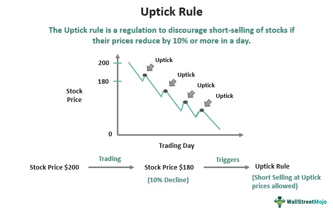

## Table of Contents

## What is the tick rule?

The tick rule is a way to figure out if a stock's price is going up or down. It looks at the last trade price compared to the one before it. If the last trade price is higher, it's called an uptick. If it's lower, it's called a downtick. If the price stays the same, it's called a zero tick.

This rule is important for traders because it helps them understand the market's direction. For example, if there are more upticks than downticks, it might mean the stock's price is going up. Traders use this information to make decisions about buying or selling stocks.

## Why is the tick rule important in financial markets?

The tick rule is important in financial markets because it helps traders see if a stock's price is going up or down. By looking at whether the last trade was an uptick, downtick, or zero tick, traders can get a quick idea of the market's direction. This information is really useful for making smart choices about when to buy or sell stocks. If a trader sees more upticks, they might think the stock's price will keep going up, so they might decide to buy. On the other hand, if they see more downticks, they might think the price will go down and decide to sell.

Understanding the tick rule also helps traders follow market trends and make better predictions. For example, if a stock has been showing a lot of upticks over a short period, it might be a sign that the stock is gaining popularity and its price could keep rising. This can help traders decide if they want to jump on the trend or wait it out. Overall, the tick rule gives traders a simple but powerful tool to understand and react to the ever-changing stock market.

## How does the tick rule affect stock prices?

The tick rule doesn't directly change stock prices, but it helps traders understand how prices are moving. When traders see a lot of upticks, it means the stock's price is going up more often than it's going down. This can make traders feel more confident about buying the stock, which can push the price up even more. On the other hand, if there are a lot of downticks, it might make traders want to sell the stock, which can cause the price to go down.

By watching the tick rule, traders can get a quick idea of the market's direction. If they see more upticks than downticks, they might think the stock's price will keep going up, so they might decide to buy. If they see more downticks, they might think the price will keep going down and decide to sell. This way, the tick rule helps traders make decisions that can affect how stock prices move, even though it doesn't change the prices itself.

## What is the difference between an uptick and a downtick?

An uptick happens when the price of the last trade is higher than the price of the trade before it. For example, if a stock was traded at $10 last time and then at $10.05 this time, that's an uptick. It shows that the stock's price is going up a little bit.

A downtick is the opposite. It happens when the price of the last trade is lower than the price of the trade before it. If a stock was traded at $10 last time and then at $9.95 this time, that's a downtick. It means the stock's price is going down a little bit.

These terms help traders understand if a stock's price is moving up or down. By watching upticks and downticks, traders can make better choices about buying or selling stocks.

## Can you explain the historical context of the tick rule?

The tick rule has been around for a long time to help traders understand stock price movements. It started becoming important in the early 20th century when stock markets were growing and getting more complex. Back then, traders needed a simple way to see if a stock's price was going up or down. The tick rule gave them that tool by looking at whether the last trade price was higher or lower than the one before it.

Over the years, the tick rule has stayed important, even as technology and trading methods changed. In the 1930s, the U.S. Securities and Exchange Commission (SEC) started using the tick rule more officially to help keep the stock market fair and stable. Even today, with computers doing a lot of the trading, the tick rule still helps traders make quick decisions about buying or selling stocks based on short-term price changes.

## How has the tick rule evolved over time?

The tick rule started a long time ago, back when the stock market was growing and getting more complicated. Traders needed a simple way to know if a stock's price was going up or down. So, they began using the tick rule. It just looked at whether the last trade price was higher or lower than the one before it. This helped traders make quick decisions about buying or selling stocks.

Over the years, the tick rule kept being important even as technology changed how trading worked. In the 1930s, the U.S. Securities and Exchange Commission (SEC) started using the tick rule more officially. They wanted to make sure the stock market stayed fair and stable. Today, even with computers doing a lot of the trading, the tick rule still helps traders understand short-term price changes and make smart choices about their stocks.

## What are the current regulations regarding the tick rule?

The current regulations about the tick rule are set by the U.S. Securities and Exchange Commission (SEC). The SEC uses the tick rule to help keep the stock market fair and stable. They look at whether the last trade was an uptick or a downtick to understand the market's direction. This helps traders make smart choices about buying or selling stocks.

These regulations have changed a bit over time, but the basic idea of the tick rule has stayed the same. Traders still use it to see if a stock's price is going up or down. The SEC makes sure that everyone follows these rules so the stock market works well for everyone.

## How do traders use the tick rule in their strategies?

Traders use the tick rule to understand if a stock's price is going up or down. They look at whether the last trade was an uptick, which means the price went up a little, or a downtick, which means the price went down a little. By watching these ticks, traders can see if more people are buying or selling the stock. If they see a lot of upticks, it might mean the stock's price will keep going up, so they might decide to buy. If they see a lot of downticks, it might mean the price will keep going down, so they might decide to sell.

The tick rule helps traders make quick decisions. For example, if a trader sees a stock with many upticks in a short time, they might think it's a good time to buy because the stock seems to be getting more popular. On the other hand, if they see a lot of downticks, they might want to sell before the price drops even more. By using the tick rule, traders can follow market trends and make choices that fit their trading strategies.

## What are the criticisms of the tick rule?

Some people think the tick rule has problems. One big criticism is that it can be too simple. The tick rule just looks at if the last trade price was higher or lower than the one before it. But the stock market is really complicated, and there are a lot of other things that can affect prices. So, using just the tick rule might not give traders all the information they need to make the best choices.

Another criticism is that the tick rule can be hard to use in today's fast markets. With computers doing a lot of trading, prices can change very quickly. This makes it tough for traders to keep up with all the upticks and downticks. Some people think that because of this, the tick rule might not be as useful as it used to be. They say traders need more advanced tools to understand the market better.

## How does the tick rule impact market volatility?

The tick rule can affect how much the stock market goes up and down, which we call market volatility. When traders see a lot of upticks, they might think the stock's price will keep going up. This can make more people want to buy the stock, which can push the price up even more and make the market more volatile. On the other hand, if traders see a lot of downticks, they might think the price will keep going down. This can make more people want to sell the stock, which can push the price down and also make the market more volatile.

But the tick rule doesn't always make the market more volatile. Sometimes, it can help traders understand the market better and make smarter choices. If traders use the tick rule to see the overall direction of the market, they might be able to predict big changes in price and act in a way that makes the market less wild. So, while the tick rule can add to market volatility by making traders react quickly to small price changes, it can also help calm things down if traders use it to understand bigger trends.

## What are the potential future changes to the tick rule?

As the stock market keeps changing, the tick rule might change too. People who study the market are always looking for ways to make it better. They might think about making the tick rule more detailed, so it can show more than just if the last trade price was higher or lower. They could add more information about why prices are going up or down, like news or other market changes. This could help traders understand the market better and make smarter choices.

Another possible change could be using new technology to make the tick rule easier to use. Right now, with computers doing a lot of trading, prices can change very fast. So, the tick rule might need to be updated to keep up with these quick changes. Maybe they could use special computer programs that watch the ticks and help traders see the market's direction in real-time. This would make the tick rule more useful in today's fast markets.

## How do different countries implement the tick rule?

Different countries use the tick rule in their own ways to help traders understand stock price changes. In the United States, the Securities and Exchange Commission (SEC) uses the tick rule to keep the stock market fair and stable. They look at whether the last trade price was higher or lower than the one before it. This helps traders see if a stock's price is going up or down and make smart choices about buying or selling.

In other countries, like the United Kingdom, the tick rule is used in a similar way but with some differences. The Financial Conduct Authority (FCA) oversees the rules and makes sure they help keep the market working well. They might use the tick rule to watch for big changes in stock prices and make sure traders are following the rules. Even though the basic idea of the tick rule is the same around the world, each country might change it a bit to fit their own market needs.

## References & Further Reading

[1]: ["Quantitative Trading: How to Build Your Own Algorithmic Trading Business"](https://www.amazon.com/Quantitative-Trading-Build-Algorithmic-Business/dp/0470284889) by Ernest P. Chan

[2]: Bergstra, J., Bardenet, R., Bengio, Y., & Kégl, B. (2011). ["Algorithms for Hyper-Parameter Optimization."](https://dl.acm.org/doi/10.5555/2986459.2986743) Advances in Neural Information Processing Systems 24.

[3]: ["Advances in Financial Machine Learning"](https://resources.caih.jhu.edu/textbooks/Resources/_pdfs/Advances_In_Financial_Machine_Learning.pdf) by Marcos Lopez de Prado

[4]: ["Evidence-Based Technical Analysis: Applying the Scientific Method and Statistical Inference to Trading Signals"](https://www.amazon.com/Evidence-Based-Technical-Analysis-Scientific-Statistical/dp/0470008741) by David Aronson

[5]: ["Machine Learning for Algorithmic Trading"](https://github.com/PacktPublishing/Machine-Learning-for-Algorithmic-Trading-Second-Edition) by Stefan Jansen