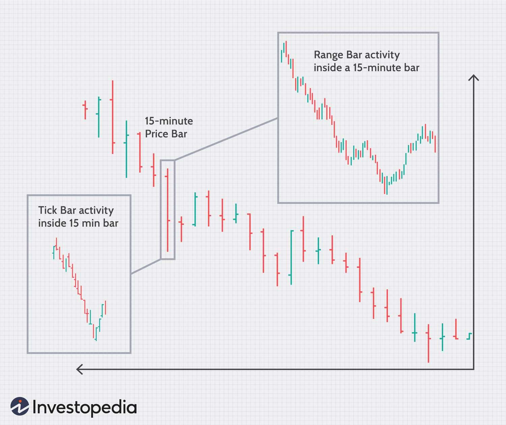

Algorithmic trading has profoundly transformed financial markets by employing systematic and efficient strategies to execute trades. Central to this approach is the utilization of various data structures known as bars, which are used to segment and analyze financial data. Traditionally, time bars have been the cornerstone, sampling data at regular time intervals, typically minutes, hours, or days. However, as trading technology and market dynamics have evolved, so has the need for more sophisticated methodologies that can capture the intricacies of market movements. 

This evolution has led to the development of advanced techniques such as tick bars and tick runs bars (TRBs). Unlike time bars, which might overlook critical market activities occurring in short time frames, these newer methodologies provide a more detailed and responsive picture of market data. Tick bars, for instance, are formed after a specified number of trades, thus offering a volume-based view, while tick runs bars are created when sequences of similar trades—either buys or sells—reach a predefined threshold. This capability is particularly valuable for detecting anomalies in order flows and potential shifts in market sentiment.



In this article, we focus on tick runs bars within the framework of algorithmic trading. We discuss how TRBs enhance trading strategies by offering a more precise representation of market conditions compared to traditional bars. This precision becomes crucial in developing strategies that can adapt to volatile and rapidly changing markets, ultimately improving trade execution and market prediction.

## Table of Contents

## Understanding Tick Runs Bars (TRBs)

Tick Runs Bars (TRBs) present a refined approach to sampling financial market data by focusing on the sequence of trades. Unlike conventional data structures such as time bars, which divide data into fixed intervals regardless of market activity, TRBs form bars based on trade accumulation reaching a specified threshold. This threshold is typically set to detect an imbalance in buying and selling activity, which might signify significant market movements or anomalies.

The traditional time bar approach often fails to capture the nuances of rapid market changes because it aggregates data at constant intervals. This can lead to missed signals during periods of intense trading activity or overrepresentation of less significant data during quieter times. In contrast, TRBs account for actual trade flows by adjusting the data collection process dynamically. The formation of a TRB happens not at a uniform time interval but when the [volume](/wiki/volume-trading-strategy) or count of consecutive buys or sells surpasses a predetermined level.

This methodology provides a more detailed representation of market sentiment since it reflects the real-time action rather than adhering to arbitrary time frames. For instance, during a buying spree, a tick run bar will consolidate this information into a single bar once the buying volume surpasses the set threshold. Similarly, a concentrated selling phase will result in another bar, indicating potential market imbalance.

By using TRBs, traders can gain insights into periods of informed trading or identify occluded patterns that time bars might overlook. This approach assists in recognizing the ebb and flow of market dynamics, offering a more nuanced view of the supply and demand pressures at play. Effective implementation of TRBs can thus enhance the precision of [algorithmic trading](/wiki/algorithmic-trading) strategies, allowing traders to respond swiftly and accurately to emerging market trends.

## Advantages of Using TRBs in Algo Trading

Tick Runs Bars (TRBs) offer several advantages in algorithmic trading by providing a more precise representation of market dynamics than traditional time-based bars. Unlike time bars, which aggregate market data at uniform intervals without regard for the underlying trade activity, TRBs are constructed when a sequence of either buy or sell trades surpasses a predefined threshold. This approach enables the detection of informed trading behavior and other anomalies with greater accuracy.

One significant advantage of TRBs is their ability to capture the directional flow of trades without offsetting against opposing directions. This means TRBs record uninterrupted sequences of buying or selling pressure, effectively reflecting shifts in market sentiment. Such detailed captures play a critical role in understanding the prevailing market mood, which time bars often obscure due to their static time constraints.

By incorporating TRBs into trading strategies, traders benefit from improved resolution in analyzing market data. This heightened sensitivity is particularly advantageous in volatile markets where rapid sentiment changes can substantially impact asset prices. For example, TRBs can aid in identifying [momentum](/wiki/momentum) shifts faster than time-based indicators, allowing algorithms to respond more quickly to emerging patterns.

Moreover, TRBs facilitate the implementation of more responsive algorithmic strategies. In Python, for example, algorithms can be developed to dynamically track runs of trades and adjust trading signals accordingly:

```python
def calculate_TRB(trade_data, threshold):
    run_length = 0
    direction = None
    trb_list = []

    for trade in trade_data:
        if direction is None or trade['type'] == direction:
            run_length += 1
        else:
            if run_length > threshold:
                trb_list.append({'direction': direction, 'length': run_length})
            direction = trade['type']
            run_length = 1

    if run_length > threshold:
        trb_list.append({'direction': direction, 'length': run_length})

    return trb_list
```

This piece of code demonstrates how to accumulate sequences of similar trades and log them once a specified threshold is exceeded. Such dynamic mechanisms are vital for adapting to swiftly changing market conditions, enhancing trade execution efficiency.

In conclusion, the application of TRBs leads to the development of more agile trading strategies by capturing nuanced market movements that time bars might miss. This capability translates into improved decision-making processes, ultimately offering traders a competitive edge in the financially sophisticated arena of algorithmic trading.

## Implementing Tick Runs Bars in Trading Strategies

Implementing Tick Runs Bars (TRBs) in trading strategies necessitates access to high-frequency trade data and efficient mechanisms for counting and analyzing sequences of trades. This implementation begins with acquiring granular data, typically from a data provider or exchange, to capture each trade's time, price, and volume. This high-resolution data enables the identification of streaks of trades in one direction, a fundamental requirement for constructing TRBs.

To analyze these sequences effectively, traders often employ algorithms that dynamically adjust the threshold for determining runs based on current market conditions. A common technique used is the exponentially weighted moving average (EWMA), which allows for the dynamic estimation of expected run lengths. The formula for EWMA is:

$$
\text{EWMA}_t = \alpha \times x_t + (1 - \alpha) \times \text{EWMA}_{t-1}
$$

where $\alpha$ is a smoothing constant $(0 < \alpha < 1)$, and $x_t$ is the trade value at time $t$. This approach helps to smooth out noise and detect significant shifts in trading patterns, essential for setting adaptive thresholds for TRBs.

Once the TRBs are constructed, they form the basis for developing and testing trading strategies. Backtesting these strategies involves running them against historical data to validate their effectiveness. This process helps in refining parameters, such as the run-length threshold, to optimize performance. Traders typically use metrics such as Sharpe ratio, drawdown, and win-loss ratio to evaluate the performance comprehensively.

Python programming can facilitate the implementation of TRBs. Here's a simple example outlining the process:

```python
import numpy as np

def calculate_ewma(prices, alpha=0.3):
    ewma_values = np.zeros(len(prices))
    ewma_values[0] = prices[0]
    for t in range(1, len(prices)):
        ewma_values[t] = alpha * prices[t] + (1 - alpha) * ewma_values[t-1]
    return ewma_values

# Example usage
trade_prices = [100, 102, 101, 103, 107, 105]
ewma_values = calculate_ewma(trade_prices)
print(ewma_values)
```

This code snippet calculates the EWMA for a series of trade prices, providing a basis for adjusting thresholds dynamically in response to market conditions.

Lastly, the integration of TRBs into trading strategies does not end with [backtesting](/wiki/backtesting); traders must continuously monitor and adapt their models to align with real-time market dynamics, ensuring robustness against overfitting and maintaining adaptability to evolving market structures.

## Challenges and Considerations

Tick Runs Bars (TRBs) present significant potential in improving trading strategies, but their implementation is fraught with certain challenges. The first major challenge is the requirement for high-frequency trading data. Unlike traditional financial data available over time intervals such as seconds, minutes, or hours, TRBs necessitate data recorded at each transaction or tick. Access to such detailed data is often expensive and may not be readily available to all market participants. High-frequency data providers often charge substantial fees, making it a costly endeavor, especially for smaller trading firms or individual traders.

Another critical consideration is the computational resources required for processing and analyzing high-frequency data to construct TRBs. Real-time processing demands powerful computing capabilities and advanced infrastructure. High-frequency data involve large volumes and require rapid processing to be actionable in trading strategies. Implementing TRBs requires computational systems capable of handling this data efficiently, necessitating investment in high-performance hardware and software, as well as robust data management systems.

Overfitting is another potential pitfall when utilizing TRBs in algorithmic trading strategies. Models that perform well over historical data due to overfitting may fail under new market conditions. Overfitting occurs when a model is excessively tailored to fit the historical data, capturing noise rather than true market signals. This could lead to poor predictive performance in live trading scenarios where market dynamics may differ from past conditions. 

To mitigate overfitting, regular performance validation using out-of-sample data is essential. Techniques such as cross-validation and regularization can be employed to ensure the model's robustness. Additionally, constant monitoring and updating of the trading models to adapt to evolving market conditions are crucial. Incorporating adaptive algorithms that adjust parameters in real-time based on market feedback can help maintain the relevance and efficacy of trading strategies using TRBs. 

In summary, while TRBs offer a nuanced perspective on market activities, their implementation requires careful attention to data acquisition costs, computational demands, and the prevention of overfitting to ensure sustainable and effective trading strategies.

## Conclusion

Tick Runs Bars (TRBs) have emerged as a sophisticated instrument for algorithmic traders, providing enhanced insights into market dynamics compared to traditional time bars. These advanced data structures offer the advantage of adapting to the market's actual activity, rather than conforming to arbitrary time intervals, which can obscure critical market information. The use of TRBs enables traders to detect subtle changes in market sentiment and informed trading activities, leading to potentially significant improvements in trading performance.

Despite their advantages, the application of TRBs poses several challenges, most notably the requirement for high-frequency trading data. Such data is often expensive and difficult to procure, posing a barrier to entry for some traders. Furthermore, the analysis and interpretation of TRBs necessitate substantial computational resources, demanding reliable and high-performing infrastructure. There's also a risk of overfitting, which can lead to strategies that perform well on past data but falter under live market conditions. Therefore, it's crucial for traders to design adaptive models capable of adjusting to the dynamic and evolving financial landscape.

As algorithmic trading continues to evolve, embracing cutting-edge tools like TRBs can position traders advantageously in the competitive financial markets. By staying updated with technological advancements and refining trading strategies to incorporate newer, more informative data structures, traders can better harness opportunities for improved returns. Consequently, the potential for TRBs to enhance algorithmic trading strategies makes them a valuable asset for traders seeking an edge in ever-complex financial environments.

## References & Further Reading

Marcos Lopez de Prado's "Advances in Financial Machine Learning" is a seminal resource for understanding the intersection of [machine learning](/wiki/machine-learning) techniques and financial markets. This work covers topics such as the use of machine learning algorithms to improve the prediction and execution of trades, and the construction of more efficient trading strategies. The book emphasizes the importance of feature engineering and validation techniques in the context of financial data, making it a vital reference for those interested in algorithmic trading and quantitative finance.

Easley, Lopez de Prado, and O’Hara's "The Microstructure of Financial Markets" provides an in-depth analysis of the intricacies of financial markets, focusing on the influence of market microstructure on trading and price formation. This resource discusses various aspects of high-frequency trading, the role of informed trading, and the dynamics of order flows. The work is instrumental in understanding how the microstructure affects market efficiency and how advanced data structures like Tick Runs Bars can be applied to analyze these phenomena more effectively.

Investopedia offers accessible articles on algorithmic trading and financial data types, providing a solid foundation for beginners and a quick reference for experienced traders. These articles cover definitions, explanations of key concepts, and practical applications of various trading strategies. Investopedia’s content spans from basic introductions to complex topics like high-frequency trading, offering a comprehensive overview of the tools and techniques employed in algorithmic trading today.

These resources collectively offer both theoretical insights and practical guidance on leveraging advanced data structures such as Tick Runs Bars in algorithmic trading, equipping traders with the knowledge needed to refine their strategies and improve execution in the fast-paced financial markets.