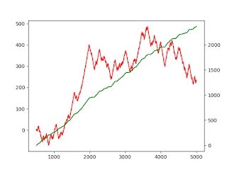

## Table of Contents

## What are Tick Runs Bars (TRBs) and how do they differ from traditional candlestick charts?

Tick Runs Bars (TRBs) are a type of chart used in trading that focuses on the number of trades, or ticks, rather than time. In a TRB, a new bar is created after a certain number of trades have happened, no matter how long it takes. This means that TRBs can show more about the activity and interest in a stock or asset, because each bar represents the same amount of trading activity, not the same amount of time.

Traditional candlestick charts, on the other hand, are based on time. Each candlestick shows the price movement within a set time period, like a minute, an hour, or a day. The main difference between TRBs and candlestick charts is what they measure. While candlestick charts are great for seeing how prices change over fixed time periods, TRBs give traders a better sense of market activity and momentum, because they show how quickly trades are happening.

## How are TRBs calculated and what data points are used in their construction?

TRBs are calculated by counting the number of trades, or ticks, that happen in the market. When a certain number of ticks is reached, a new bar is created on the chart. For example, if you set your TRB to form a new bar after every 100 ticks, the chart will show a new bar every time 100 trades have been made, no matter how long it takes. This means that during busy trading times, bars might form quickly, and during quiet times, it might take longer for a new bar to appear.

The data points used to construct TRBs are similar to those used in other types of charts. Each bar on a TRB shows the opening price, the highest price, the lowest price, and the closing price during the period when the set number of ticks was reached. So, if a bar represents 100 ticks, the opening price is the price at the start of those 100 ticks, the high is the highest price reached during those ticks, the low is the lowest price, and the close is the price at the end of the 100 ticks. This gives traders a clear picture of price movement and market activity based on the number of trades.

## What are the advantages of using TRBs over other types of price charts?

TRBs help traders see how busy the market is. Each bar on a TRB shows the same number of trades, not the same amount of time. This means that during busy times, bars will appear quickly, and during quiet times, it might take longer for a new bar to show up. This can help traders understand when the market is moving a lot and when it's calm. Knowing this can be useful for making decisions about when to buy or sell.

Another advantage of TRBs is that they can show changes in market activity more clearly than time-based charts like candlesticks. If a lot of trades happen in a short time, it might mean that something important is happening in the market. TRBs can help traders spot these moments better because they focus on the number of trades, not just the time. This can be really helpful for traders who want to react quickly to what's happening in the market.

## Can you explain the concept of 'ticks' in the context of TRBs?

In the world of trading, a 'tick' is just another word for a trade. When someone buys or sells something, that's one tick. In Tick Runs Bars (TRBs), ticks are really important because they decide when a new bar shows up on the chart. If you set your TRB to make a new bar after every 100 ticks, then every time 100 trades happen, you'll see a new bar on your chart.

TRBs are different from other charts because they care more about how many trades happen, not how much time goes by. This means that if the market is busy and lots of people are trading, you'll see new bars appear quickly. But if the market is quiet and not many trades are happening, it might take a while for a new bar to show up. This helps traders see how active the market is and make better decisions about when to buy or sell.

## How do TRBs help in identifying market trends and patterns?

TRBs help traders see market trends and patterns by showing how busy the market is. Each bar on a TRB shows the same number of trades, not the same amount of time. This means that if a lot of trades are happening quickly, you'll see new bars appear fast. This can tell you that the market is moving a lot, which might mean a trend is starting or changing. By watching how quickly new bars show up, traders can spot when the market is getting more active or starting to calm down.

Another way TRBs help with trends and patterns is by showing price movements clearly. Each bar has an opening price, a high price, a low price, and a closing price, just like other charts. But because TRBs focus on the number of trades, you can see how the price is changing as more people buy or sell. If the price is going up and new bars are appearing quickly, it might mean the market is getting excited about a new trend. If the price is going down and bars are coming slowly, it could mean the market is losing interest. This helps traders see patterns and make better guesses about where the market might go next.

## What are some common strategies traders use with TRBs?

Traders often use TRBs to spot when the market is getting busy or quiet. They look at how fast new bars show up on the chart. If new bars are coming quickly, it means a lot of trades are happening, and the market might be starting a new trend. Traders might decide to buy or sell based on this. For example, if they see the market getting busy and the price going up, they might buy, hoping the trend will keep going. If the market is quiet and the price is going down, they might sell or wait for a better time to buy.

Another strategy is to watch the price movements on TRBs. Each bar shows the highest and lowest prices during a set number of trades. Traders look at these prices to see if there are patterns. If the price keeps going up and making higher highs and higher lows, it might mean a strong uptrend is happening. If the price is going down with lower highs and lower lows, it might be a downtrend. Traders can use this information to decide when to get in or out of the market. They might buy when they see the start of an uptrend and sell when they think a downtrend is starting.

## How can TRBs be integrated into an existing trading platform or software?

To add TRBs to a trading platform or software, you need to make sure the platform can handle custom charts. Most trading platforms let you add new types of charts by using special tools or coding. You would need to write a program that counts the number of trades and makes a new bar on the chart every time a certain number of trades happens. This program would use the platform's tools to show the opening, high, low, and closing prices for each bar, just like other charts do.

Once you have the program ready, you can add it to the trading platform. This might mean putting the program into the platform's code or using a special feature that lets you add new charts. After it's added, traders can use TRBs to see how busy the market is and make better trading decisions. They can watch how fast new bars show up and look at the price movements to spot trends and patterns.

## What are the limitations or potential drawbacks of using TRBs?

One limitation of using TRBs is that they might not work well for all types of trading. If you're a day trader who looks at very short time periods, TRBs can be great because they show how busy the market is right now. But if you're a long-term investor who doesn't care about quick changes, TRBs might not be as useful. They focus on the number of trades, not the time, so they might not give you the big picture over weeks or months.

Another drawback is that TRBs can be hard to understand at first. If you're used to looking at regular candlestick charts, it might take some time to get used to TRBs. They show information in a different way, and you need to learn how to read them correctly. This can be a bit confusing, especially if you're new to trading or if you're trying to use TRBs with other types of charts at the same time.

## How do TRBs perform in different market conditions, such as high volatility or low liquidity?

In high volatility markets, TRBs can be really helpful. When the market is moving a lot and prices are changing quickly, TRBs show new bars faster because more trades are happening. This helps traders see how busy the market is and make quick decisions. If you see new bars coming quickly and the price going up or down a lot, it means the market is excited and a big trend might be starting. This can be a good time to buy or sell, depending on what you think will happen next.

In low liquidity markets, TRBs might not be as useful. When not many people are trading, it takes longer for a new bar to show up on a TRB. This can make it hard to see what's happening in the market because there's not enough activity. If you're waiting for a new bar and it takes a long time to come, it might mean the market is quiet and not much is happening. This can make it harder to spot trends or make good trading decisions because there's less information to work with.

## Can TRBs be customized for specific trading styles or asset classes?

TRBs can be changed to fit different ways of trading or different things you want to trade. If you like to trade quickly during the day, you can set your TRB to make a new bar after just a few trades. This helps you see what's happening in the market right away. If you trade things that don't move much, like some stocks or currencies, you might want to set your TRB to make a new bar after more trades. This way, you can still see changes in the market even if it's not very busy.

For different types of things you might trade, like stocks, forex, or cryptocurrencies, you can also change how TRBs work. Stocks might have different trading patterns than cryptocurrencies, so you might need to set your TRB differently for each one. By changing the number of trades needed for a new bar, you can make sure your TRB shows you the information you need to make good trading choices for whatever you're trading.

## What advanced technical indicators work best with TRBs?

When using TRBs, some advanced technical indicators that work well are the Relative Strength Index (RSI) and the Moving Average Convergence Divergence (MACD). The RSI helps you see if a stock or asset is overbought or oversold. This can be really useful with TRBs because you can see how busy the market is and then use the RSI to decide if it's a good time to buy or sell. If the market is busy and the RSI shows the asset is overbought, it might be a good time to sell. If the market is quiet and the RSI shows it's oversold, it might be a good time to buy.

Another good indicator to use with TRBs is the MACD. This indicator helps you see the strength and direction of a trend. When you see new bars coming quickly on a TRB, you can use the MACD to check if the trend is strong or if it might be about to change. If the MACD shows a strong trend and the TRB shows a lot of activity, it can give you more confidence in your trading decisions. These indicators can help you make better choices by giving you more information about what's happening in the market.

## How can one backtest trading strategies using TRBs and what tools are available for this purpose?

Backtesting trading strategies with TRBs means you look at old market data to see how your strategy would have worked in the past. You can do this by using special software that lets you set up TRBs and run your trading rules on historical data. You would tell the software how many trades you want for each bar and what your buying and selling rules are. Then, the software will go through the old data and show you how your strategy would have done. This helps you see if your strategy is good or if you need to change it before you use it with real money.

There are a few tools you can use for backtesting with TRBs. One popular tool is TradingView, which lets you create custom charts and backtest strategies. You can set up TRBs in TradingView and then use its built-in backtesting features to see how your strategy would have worked. Another tool is MetaTrader, which is often used by forex traders. It has a programming language called MQL4 or MQL5 that you can use to create TRBs and backtest your strategies. Both of these tools are easy to use and can help you see if your TRB strategy is a good one.

## How can Tick Runs Bars be implemented in trading strategies?

Implementing Tick Runs Bars (TRBs) in trading strategies necessitates access to high-frequency trade data and efficient mechanisms for counting and analyzing sequences of trades. This implementation begins with acquiring granular data, typically from a data provider or exchange, to capture each trade's time, price, and volume. This high-resolution data enables the identification of streaks of trades in one direction, a fundamental requirement for constructing TRBs.

To analyze these sequences effectively, traders often employ algorithms that dynamically adjust the threshold for determining runs based on current market conditions. A common technique used is the exponentially weighted moving average (EWMA), which allows for the dynamic estimation of expected run lengths. The formula for EWMA is:

$$
\text{EWMA}_t = \alpha \times x_t + (1 - \alpha) \times \text{EWMA}_{t-1}
$$

where $\alpha$ is a smoothing constant $(0 < \alpha < 1)$, and $x_t$ is the trade value at time $t$. This approach helps to smooth out noise and detect significant shifts in trading patterns, essential for setting adaptive thresholds for TRBs.

Once the TRBs are constructed, they form the basis for developing and testing trading strategies. Backtesting these strategies involves running them against historical data to validate their effectiveness. This process helps in refining parameters, such as the run-length threshold, to optimize performance. Traders typically use metrics such as Sharpe ratio, drawdown, and win-loss ratio to evaluate the performance comprehensively.

Python programming can facilitate the implementation of TRBs. Here's a simple example outlining the process:

```python
import numpy as np

def calculate_ewma(prices, alpha=0.3):
    ewma_values = np.zeros(len(prices))
    ewma_values[0] = prices[0]
    for t in range(1, len(prices)):
        ewma_values[t] = alpha * prices[t] + (1 - alpha) * ewma_values[t-1]
    return ewma_values

# Example usage
trade_prices = [100, 102, 101, 103, 107, 105]
ewma_values = calculate_ewma(trade_prices)
print(ewma_values)
```

This code snippet calculates the EWMA for a series of trade prices, providing a basis for adjusting thresholds dynamically in response to market conditions.

Lastly, the integration of TRBs into trading strategies does not end with [backtesting](/wiki/backtesting); traders must continuously monitor and adapt their models to align with real-time market dynamics, ensuring robustness against overfitting and maintaining adaptability to evolving market structures.

## References & Further Reading

Marcos Lopez de Prado's "Advances in Financial Machine Learning" is a seminal resource for understanding the intersection of [machine learning](/wiki/machine-learning) techniques and financial markets. This work covers topics such as the use of machine learning algorithms to improve the prediction and execution of trades, and the construction of more efficient trading strategies. The book emphasizes the importance of feature engineering and validation techniques in the context of financial data, making it a vital reference for those interested in algorithmic trading and quantitative finance.

Easley, Lopez de Prado, and O’Hara's "The Microstructure of Financial Markets" provides an in-depth analysis of the intricacies of financial markets, focusing on the influence of market microstructure on trading and price formation. This resource discusses various aspects of high-frequency trading, the role of informed trading, and the dynamics of order flows. The work is instrumental in understanding how the microstructure affects market efficiency and how advanced data structures like Tick Runs Bars can be applied to analyze these phenomena more effectively.

Investopedia offers accessible articles on algorithmic trading and financial data types, providing a solid foundation for beginners and a quick reference for experienced traders. These articles cover definitions, explanations of key concepts, and practical applications of various trading strategies. Investopedia’s content spans from basic introductions to complex topics like high-frequency trading, offering a comprehensive overview of the tools and techniques employed in algorithmic trading today.

These resources collectively offer both theoretical insights and practical guidance on leveraging advanced data structures such as Tick Runs Bars in algorithmic trading, equipping traders with the knowledge needed to refine their strategies and improve execution in the fast-paced financial markets.

