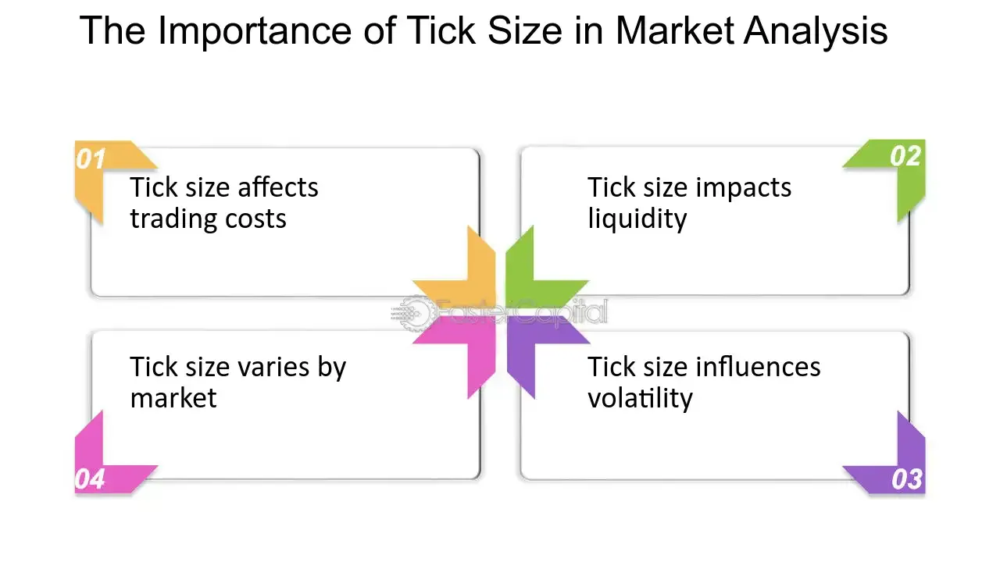

## Table of Contents

## What is a tick size in financial markets?

A tick size in financial markets is the smallest amount by which the price of a security can move. It's like the smallest step on a ladder that the price can take. For example, if a stock's tick size is $0.01, the price can move from $10.00 to $10.01, but not to $10.005.

Different markets and securities can have different tick sizes. For instance, stocks usually have a tick size of one cent, but some might have a larger tick size. In contrast, futures contracts might have a tick size of a fraction of a cent. The tick size is important because it affects how prices can change and how traders can buy and sell securities.

## Why is tick size important for traders and investors?

Tick size is important for traders and investors because it affects how much the price of a security can change. If the tick size is small, like one cent, the price can move up or down in tiny steps. This can be good for traders who want to buy and sell quickly, as they can make small profits from small price changes. On the other hand, if the tick size is larger, the price can only move in bigger steps, which might make it harder to make small profits but can make the market more stable.

Another reason tick size matters is that it can affect how easy it is to trade a security. If the tick size is too small, there might be too many small price changes, which can make the market confusing and hard to follow. But if the tick size is too big, it might be hard to find someone to trade with at the exact price you want. So, finding the right tick size is important for making sure the market works well for everyone.

## How does tick size affect market liquidity?

Tick size can affect how easy it is to buy and sell securities in the market, which we call market liquidity. If the tick size is small, like one cent, it can make the market more liquid because traders can buy and sell at many different prices. This means there are more chances for traders to find someone to trade with, making it easier to do business.

On the other hand, if the tick size is large, it might make the market less liquid. With a bigger tick size, there are fewer price levels where traders can buy or sell. This can make it harder to find someone to trade with at the exact price you want, which can slow down trading and make the market less active. So, the right tick size is important for keeping the market liquid and easy to use.

## What are the standard tick sizes for different types of securities?

For stocks, the standard tick size is usually one cent. This means the price of a stock can go up or down by one cent at a time. But, some stocks might have a bigger tick size, like five or ten cents, especially if they are less common or less traded. The idea is to make sure the market works well for everyone, so the tick size can change depending on the stock.

Futures contracts have different tick sizes, which can be very small. For example, a futures contract might have a tick size of a quarter of a cent or even smaller. This is because futures are often traded in big amounts, so even a tiny change in price can mean a lot of money. The exact tick size for a futures contract depends on what the contract is for, like oil or corn, and can be different for each one.

Options also have their own tick sizes. Usually, the tick size for options is five or ten cents. But, like with stocks and futures, the tick size can change based on how much the option is traded and what it's for. The goal is to make sure the market stays easy to use and fair for everyone trading options.

## How have tick sizes changed over time and why?

Over time, tick sizes have changed a lot, especially for stocks. In the past, the standard tick size for stocks was an eighth of a dollar, or $0.125. This was before electronic trading became common. But as technology got better and trading became faster, the tick size got smaller. In the 1990s and 2000s, the U.S. moved to a tick size of one cent for most stocks. This made it easier for traders to buy and sell at more prices, which helped make the market more liquid and active. But it also made trading more complicated because there were so many small price changes.

Sometimes, people worry that a tick size that's too small might make the market too busy and confusing. So, there have been experiments to see if making the tick size bigger could help. For example, in 2016, the U.S. tried making the tick size five cents for some smaller stocks to see if it would help them get traded more. The idea was to make it easier for these stocks to be bought and sold by giving them more space between price levels. But, the results were mixed, and it showed that finding the right tick size is tricky and depends a lot on what kind of security you're talking about and how it's traded.

## What is the impact of tick size on the bid-ask spread?

The tick size can affect how much it costs to trade a security, which we call the bid-ask spread. The bid-ask spread is the difference between the highest price someone is willing to pay for a security (the bid) and the lowest price someone is willing to sell it for (the ask). If the tick size is small, like one cent, the bid-ask spread can be very small too. This is because traders can make bids and asks at many different prices, which helps keep the spread narrow. A smaller spread means it's cheaper to trade, which is good for everyone in the market.

On the other hand, if the tick size is large, the bid-ask spread can be bigger. With a bigger tick size, there are fewer price levels where traders can make bids and asks. This means the difference between the bid and the ask can be larger, making it more expensive to trade. A larger spread can make the market less attractive for traders, especially those who trade a lot and want to keep their costs down. So, finding the right tick size is important for keeping the bid-ask spread reasonable and the market working well for everyone.

## How does tick size influence trading strategies?

Tick size can change how traders plan their trades. If the tick size is small, like one cent, traders can make small profits from tiny price changes. This is good for traders who like to buy and sell a lot in a short time, like day traders. They can use strategies that focus on quick trades and small profits, knowing they can get in and out of the market easily. But, if the tick size is big, traders need to think differently. They might have to hold onto their trades longer, waiting for the price to move enough to make a profit. This can lead to strategies that focus on bigger price moves and longer time frames.

The tick size also affects how traders think about the cost of trading. With a small tick size, the cost to buy and sell, which we call the bid-ask spread, can be very low. This makes it cheaper for traders to do a lot of trades, so they might use strategies that involve trading often. But, if the tick size is big, the bid-ask spread can be higher, making each trade more expensive. Traders might then use strategies that involve fewer trades and focus on making bigger profits from each one. So, the tick size is an important thing for traders to think about when they are planning their moves in the market.

## What are the regulatory considerations regarding tick size?

Regulators pay close attention to tick size because it affects how well the market works. They want to make sure that the tick size helps keep the market fair and easy to use for everyone. If the tick size is too small, it might make the market too busy and hard to follow. But if it's too big, it might make trading harder and more expensive. So, regulators try to find the right balance that keeps the market working well for all kinds of traders and investors.

Sometimes, regulators do experiments to see if changing the tick size can help certain parts of the market. For example, they might try making the tick size bigger for smaller stocks to see if it helps them get traded more. These experiments help regulators learn what works best and make rules that keep the market healthy. But, it's a tricky job because what works for one type of security might not work for another, so regulators have to keep watching and adjusting the rules to make sure the market stays fair and efficient.

## How can tick size analysis be used to assess market quality?

Tick size analysis can help us understand how well the market is working. By looking at the tick size, we can see if it's easy or hard for people to buy and sell things in the market. If the tick size is small, like one cent, it can make the market more active because people can trade at many different prices. This can make the market more liquid, which means it's easier to find someone to trade with. But if the tick size is too small, it might make the market too busy and confusing, which can be bad for some traders.

On the other hand, if the tick size is big, it might make the market less active. With a bigger tick size, there are fewer prices where people can trade, which can make it harder to find someone to buy or sell with. This can make the market less liquid and more expensive to trade in. So, by studying the tick size, we can see if the market is working well for everyone or if it needs to be changed to make it better.

## What empirical studies have been conducted on tick size and their findings?

Researchers have done a lot of studies on tick size to see how it affects the market. One big study was done by the U.S. Securities and Exchange Commission (SEC) in 2016. They tried making the tick size bigger for some smaller stocks to see if it would help them get traded more. They found that making the tick size bigger did make the bid-ask spread bigger, which made trading more expensive. But it didn't really help the smaller stocks get traded more, so the experiment showed that changing the tick size can have mixed results.

Another study looked at how tick size affects market liquidity. They found that when the tick size is small, like one cent, the market can be more liquid because there are more prices where people can trade. But if the tick size is too small, it can make the market too busy and hard to follow. On the other hand, when the tick size is big, it can make the market less liquid because there are fewer prices where people can trade. This can make trading harder and more expensive. So, finding the right tick size is important for keeping the market working well for everyone.

## How do different exchanges implement tick size rules and what are the implications?

Different exchanges can have their own rules about tick size, and these rules can change depending on what kind of security is being traded. For example, in the U.S., the New York Stock Exchange (NYSE) and the NASDAQ both use a tick size of one cent for most stocks. But they might have different rules for less common stocks or other types of securities like futures and options. This means that traders need to know the specific tick size rules for each exchange they use, because it can affect how they trade and how much it costs them.

The way exchanges set their tick size rules can have a big impact on how easy it is to trade on that exchange. If an exchange has a small tick size, like one cent, it can make the market more active and easier for traders to buy and sell quickly. But if the tick size is too small, it might make the market too busy and hard to follow. On the other hand, if an exchange has a big tick size, it might make trading more expensive and harder to do. So, exchanges need to find the right balance to make sure their market works well for everyone.

## What advanced statistical methods can be used for in-depth tick size analysis?

Advanced statistical methods can help us understand tick size better. One way to do this is by using regression analysis. This method looks at how tick size affects things like the bid-ask spread and how much people trade. By studying this data, we can see if a smaller or bigger tick size makes the market work better or worse. Another method is time series analysis, which looks at how tick size changes over time and how it affects the market. This can help us see if changing the tick size makes the market more or less active and if it helps or hurts traders.

Another useful method is event study analysis. This looks at what happens to the market when the tick size changes. For example, if a regulator decides to make the tick size bigger for some stocks, we can study how this change affects trading and the bid-ask spread. This can help us understand if the change was good or bad for the market. Finally, machine learning can be used to find patterns in the data that are hard to see with other methods. By using these advanced tools, we can get a deeper understanding of how tick size affects the market and make better decisions about how to set it.

## References & Further Reading

[1]: Harris, L. (1997). ["Decimalization: A Review of the Arguments and Evidence"](https://www.acsu.buffalo.edu/~keechung/MGF743/Readings/G2%20Decimalization.pdf). Financial Review.

[2]: Angel, J. J. (1997). ["Tick Size, Share Prices, and Stock Splits."](https://onlinelibrary.wiley.com/doi/10.1111/j.1540-6261.1997.tb04817.x) The Journal of Finance, 52(2), 655-681.

[3]: ["Algorithmic Trading: Winning Strategies and Their Rationale"](https://www.amazon.com/Algorithmic-Trading-Winning-Strategies-Rationale/dp/1118460146) by Ernest P. Chan

[4]: Easley, D., O'Hara, M., & Saar, G. (2001). ["How Stock Splits Affect Trading: A Microstructure Approach."](https://www.cambridge.org/core/journals/journal-of-financial-and-quantitative-analysis/article/abs/how-stock-splits-affect-trading-a-microstructure-approach/88966FF3F4C0D2ED9523BB207527CF6C) The Review of Financial Studies, 14(1), 108–154.

[5]: ["Advances in Financial Machine Learning"](https://www.amazon.com/Advances-Financial-Machine-Learning-Marcos/dp/1119482089) by Marcos Lopez de Prado