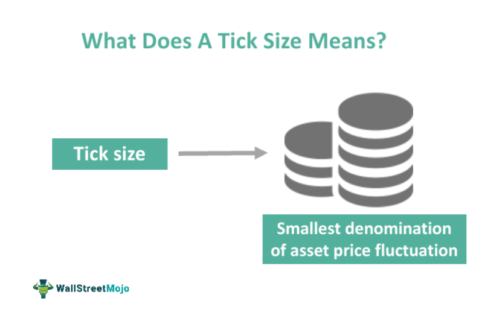

Tick size is a critical concept in financial markets, representing the minimum price movement of a trading instrument. This parameter is essential in influencing various market dynamics and trading strategies. Tick size not only affects liquidity, volatility, and price discovery but also plays a significant role in optimizing algorithmic trading systems. In financial markets, accurate knowledge of tick size helps traders and algorithms execute trades more efficiently, minimizing costs and maximizing potential returns.

The impact of tick size on market dynamics cannot be overstated. It directly influences the bid-ask spread, which is a fundamental element of market liquidity. A smaller tick size can narrow this spread, thereby increasing liquidity and making the market more competitive. Conversely, a larger tick size may result in wider spreads, potentially reducing liquidity. This intricacy demonstrates the delicate balance that tick size maintains within the market structure.



Volatility and price discovery are also heavily impacted by tick size. A smaller tick size allows for more precise price adjustments, facilitating effective price discovery. However, this increased granularity may also lead to heightened short-term volatility. Algorithmic trading systems must consequently manage the trade-off between efficient price discovery and market stability, ensuring that algorithms are capable of rapid decision-making in swiftly changing environments.

Algorithmic trading strategies are particularly dependent on an understanding of tick size. Traders adapt their methods to fit the tick size of the markets in which they operate. Smaller tick sizes often favor high-frequency and scalping strategies, while larger tick sizes may necessitate more strategic, long-term planning due to elevated transaction costs. As a result, algorithmic traders continuously refine their systems using a variety of methodologies, including machine learning, to maintain optimal performance across diverse market conditions.

In summary, tick size is an integral part of market mechanics that significantly influences trading behaviors and strategies, especially within the context of algorithmic trading. A comprehensive understanding of tick size is crucial for enhancing trade execution, improving market efficiency, and achieving stability in the ever-evolving financial landscape.

## Table of Contents

## Understanding Tick Size

Tick size is the smallest possible price movement of a trading instrument on an exchange. It determines the minimal increment by which the price of a security can change, playing a fundamental role in the microstructure of financial markets. Different asset classes, including equities, futures, and options, have varying tick sizes that are often dictated by the respective exchanges and regulatory bodies. For example, the tick size for major currency futures might be predefined at a fraction of a unit, such as 0.0001, whereas stock prices on certain exchanges may move in increments of $0.01 or $0.10, depending on the stock price range and other regulatory considerations.

The determination of tick size is not arbitrary; it has been shaped by a combination of empirical evidence, market behavior, and regulatory changes over time. Historically, the tick size in equity markets was significantly larger until the process of decimalization transformed the landscape. Before decimalization, prices were quoted in fractions of a dollar, such as 1/16 or 1/8, which effectively meant larger tick sizes. This system changed significantly in the early 2000s, when the United States and other countries adopted decimalization, allowing stocks to be quoted in increments of $0.01. This shift was intended to increase price competition and reduce trading costs for investors by enabling more finely granular price movements.

However, the change in tick size influences trading costs, [liquidity](/wiki/liquidity-risk-premium), and market structure. A smaller tick size can lead to tighter bid-ask spreads, which generally reduces transaction costs and fosters greater market liquidity. Conversely, if the tick size is too small, it could exacerbate market [volatility](/wiki/volatility-trading-strategies) by encouraging high-frequency trading and potentially resulting in less stable price discovery. Therefore, the selection of an appropriate tick size remains a vital consideration for market stability and efficiency.

The implications of tick size are not limited to trading costs and liquidity; they also affect the overall market structure by influencing how market participants, including algorithmic traders and institutional investors, position their orders. A careful balance between the need for narrow spreads and the prevention of excessive market volatility is necessary to maintain a functional and efficient market environment. Understanding how tick sizes influence these dynamics helps in appreciating their critical impact on financial markets.

## Impact on Market Liquidity

Tick size plays a crucial role in determining market liquidity through its effect on the bid-ask spread, which represents the difference between the highest price a buyer is willing to pay (bid) and the lowest price a seller is willing to accept (ask). A smaller tick size enables this spread to narrow, facilitating more competitive trading environments. This reduction in spreads generally enhances liquidity, making it easier for traders to enter and [exit](/wiki/exit-strategy) positions with minimal price impact. The increased liquidity provided by smaller tick sizes is particularly beneficial for high-frequency traders and market makers, who rely on rapid order execution and minimal transaction costs to maximize profitability.

Conversely, larger tick sizes result in wider spreads. While this may reduce liquidity by increasing transaction costs, it can also lead to decreased price volatility. With wider spreads, market participants might be less inclined to engage in aggressive trading tactics, leading to more stable price movements over short time frames. This potential reduction in short-term volatility can be advantageous for certain types of investors and traders, particularly those employing longer-term strategies who may prioritize stability over rapid execution.

To illustrate, consider a financial instrument with a bid-ask spread that narrows from \$0.05 to \$0.01 due to a reduction in tick size. In this scenario, the lower spread reduces the cost of trading, thereby attracting more market participants and orders, which enhances overall liquidity. Mathematically, if $S$ represents the spread, a decrease in $S$ from a larger tick size ($S_L$) to a smaller tick size ($S_S$) can be modeled as:

$$
S_L > S_S
$$

where $S_S$ supports higher liquidity through lower transaction costs. This mathematical relationship underscores the critical nature of tick size in shaping market dynamics and trading behaviors. Overall, the bid-ask spread's sensitivity to tick size is a fundamental consideration for traders and exchanges seeking to optimize market conditions and align them with their strategic objectives.

## Price Discovery and Volatility

Tick size is a fundamental element in the process of price discovery in financial markets. It defines the smallest increment by which the price of a security can change, directly impacting the granularity of price movements. Precise price adjustments are facilitated through the determination of appropriate tick sizes, allowing markets to reflect the underlying asset's value accurately.

Small tick sizes enhance the frequency and detail of price updates. This results in price changes that more closely track underlying supply and demand dynamics. For instance, a security with a smaller tick size can experience more granular price updates, leading to potential short-term volatility. In such scenarios, the market is more responsive to small orders and incremental changes in trading interest, reflecting a higher degree of price sensitivity. The increased granularity can lead to higher price volatility as market participants react to subtle shifts in information and market sentiment.

From an algorithmic perspective, managing the equilibrium between efficient price discovery and market stability is crucial. High-frequency trading algorithms, which benefit from smaller tick sizes, are able to exploit these frequent changes in price to execute trades that capitalize on short-lived [arbitrage](/wiki/arbitrage) opportunities. However, these algorithms must also be designed to avoid contributing to excessive market instability. For instance, they may include volatility filters to prevent executing trades in conditions where high volatility might indicate a noise-driven market rather than one driven by genuine price discovery.

The mathematical relationship among tick size, price volatility, and market liquidity can be represented in models that simulate different scenarios of market conditions and trading activities. These models may implement differential equations to predict market responses to tick size changes or employ statistical models that assess the probability of price changes under different tick sizes.

Algorithmic trading strategies must adapt to varying tick sizes by incorporating [machine learning](/wiki/machine-learning) techniques. These strategies can dynamically adjust to market conditions, effectively balancing the need for rapid price discovery with the necessity for market stability. Machine learning models can analyze historical trading data to forecast the potential impacts of tick size modifications and refine trading algorithms accordingly.

In summary, tick size is integral to the accurate and efficient operation of price discovery mechanisms. It affects how quickly and efficiently a market reflects new information through price changes. While smaller tick sizes can enhance this responsiveness, they pose challenges in managing associated increases in volatility, requiring sophisticated algorithmic strategies to ensure stable and efficient market conditions.

## Strategies for Trading with Different Tick Sizes

Traders adjust their strategies depending on the tick size that characterizes the market in which they operate. This adjustment is crucial because tick size not only influences transaction costs but also affects the feasibility and effectiveness of various trading strategies.

When operating in a market with larger tick sizes, traders often gravitate towards longer-term strategic planning. This preference is primarily due to the increased transaction costs associated with larger tick sizes. When the smallest price increment is significant, it can lead to wider bid-ask spreads, thus escalating the cost of trading. As a consequence, traders might adopt position trading, which involves holding securities for extended periods to capitalize on longer-term market trends, thereby diluting the impact of higher per-trade costs over time.

In contrast, markets characterized by smaller tick sizes are conducive to more aggressive trading tactics. The decreased transaction costs in such environments enable traders to pursue strategies like [scalping](/wiki/gamma-scalping), where the aim is to exploit small price movements over very short time frames. Scalping requires high liquidity and narrow spreads, conditions often met in markets with minimal tick sizes. Traders employ advanced trading platforms to facilitate the high-frequency execution and monitoring required for such fast-paced strategies. These platforms often leverage [algorithmic trading](/wiki/algorithmic-trading) software that quickly identifies and acts on slight price differentials to yield profits.

Code implementation skills are particularly beneficial for traders who engage in environments with smaller tick sizes. By utilizing Python, for example, traders can build algorithms to execute trades when specific market conditions are met. An exemplary Python snippet for a simple trade execution might look like this:

```python
import ccxt  # Cryptocurrency trading library

# Initialize exchange
exchange = ccxt.binance({
    'apiKey': 'YOUR_API_KEY',
    'secret': 'YOUR_SECRET',
})

# Define trading parameters
symbol = 'BTC/USDT'
amount = 0.01
price = 40000  # Hypothetical price point

# Create a limit buy order
order = exchange.create_limit_buy_order(symbol, amount, price)
print(f"Placed order: {order}")
```

Using such strategies optimally requires a deep understanding of how tick size interacts with market dynamics. Continual advancements in trading technologies enable participants to refine their approaches, ensuring efficient operations and striving for profitability relative to the tick size.

## Algorithmic Trading and Tick Size

Algorithmic traders utilize tick size information to fine-tune trading algorithms, optimizing their performance in a fast-paced market environment. Tick size, which represents the smallest price increment a security can move, plays a crucial role in determining the granularity of price data available to traders. On exchanges where tick size is small, traders can benefit from enhanced data granularity, enabling high-frequency trading ([HFT](/wiki/high-frequency-trading-strategies)) strategies. These strategies capitalize on minor price movements and require quick, precise execution of trades.

In high-frequency trading, smaller tick sizes allow for more frequent updates to a security's price, providing a richer data set for algorithmic systems to analyze. This increased granularity aids in capturing fleeting price inefficiencies across markets, enhancing the potential for profit in a highly competitive space. The ability to process vast amounts of data swiftly is crucial; therefore, algorithms are designed to operate in tandem with advanced computational infrastructure.

Adaptability is vital for these trading algorithms, as they must efficiently manage trading across varying tick sizes. Machine learning (ML) techniques are often employed to maintain this adaptability. Machine learning models can train on historical market data to anticipate future price movements, adjusting trading strategies accordingly. For instance, supervised learning algorithms might predict price trends based on past tick data, refining their predictions with each executed trade.

Consider the following simple Python example, demonstrating how an algorithm might dynamically adjust its strategy based on tick size:

```python
import numpy as np
from sklearn.linear_model import LinearRegression

# Simulated market data with varying tick sizes
price_data = np.array([[100.1, 0.01], [100.15, 0.05], [100.2, 0.1], [100.25, 0.05]])
ticks = price_data[:, 1]
prices = price_data[:, 0]

# Simple model to demonstrate adaptability to tick size
model = LinearRegression()
model.fit(ticks.reshape(-1, 1), prices)

# Predict next price adjustment
pred_tick_size = 0.02
predicted_price = model.predict(np.array([[pred_tick_size]]))
print(f"Predicted price with tick size {pred_tick_size}: {predicted_price[0]}")
```

In the context of varying tick sizes, such algorithms use pattern recognition and predictive analytics to refine their trading strategies continually. The integration of machine learning assists in detecting subtle market shifts, thereby optimizing the timing and execution of trades to complement the given market structure.

Furthermore, algorithmic systems must ensure efficiency by considering transaction costs influenced by tick size. With smaller tick sizes, transaction costs might increase due to a higher [volume](/wiki/volume-trading-strategy) of trades executed to achieve the desired position. Thus, algorithms need to balance trade execution with cost-effective strategies.

The ongoing evolution of market structures and algorithmic techniques necessitates that trading systems remain scalable and efficient amid fluctuating tick sizes. As such, the integration of tick size information into algorithmic models is essential for sustaining competitive advantage and enhancing market performance in algorithmic trading environments.

## Challenges and Future Considerations

The process of determining the optimal tick size requires careful consideration of various factors, including liquidity, volatility, and regulatory compliance. Achieving a balance among these elements is essential for ensuring that markets function efficiently while meeting investor and regulatory expectations. Liquidity is significantly influenced by tick size; a smaller tick size often enhances market liquidity by narrowing bid-ask spreads and facilitating more competitive trading. However, this can lead to increased short-term volatility as securities experience more frequent price changes. Conversely, larger tick sizes can stabilize markets by reducing volatility but may also widen spreads, impacting liquidity negatively.

The evolution of technology plays a crucial role in how tick sizes are determined and utilized in modern financial markets. Advances in trading platforms and computing power allow for the analysis of large datasets, enabling market participants to assess the impact of different tick sizes on market dynamics. This technological evolution supports the development of sophisticated algorithms that can adapt to varying tick sizes, optimizing trade execution and strategy performance. Financial institutions increasingly rely on machine learning and [artificial intelligence](/wiki/ai-artificial-intelligence) to refine these algorithms, ensuring they remain effective despite changes in market structure and tick size policies.

Regulatory considerations are also paramount in shaping the future of tick size in algorithmic trading. Regulators are tasked with ensuring market integrity and protecting investors, which can necessitate changes to tick size regulations to prevent practices like market manipulation or ensure fair access to trading opportunities. As markets become more global and interconnected, harmonizing tick size policies across different jurisdictions presents an additional challenge. Regulators must collaborate internationally to establish standards that maintain market stability while supporting technological advancement.

In conclusion, the future of tick size in algorithmic trading is intricately linked to technological progress and regulatory frameworks. The continued development of sophisticated algorithms and machine learning tools will enhance the ability of traders to adapt to various tick sizes, optimizing strategies for different market conditions. Simultaneously, regulators will need to adapt to ensure that these innovations contribute positively to market efficiency and stability. Through ongoing analysis and adaptation, market participants can navigate the complexities of tick size impacts, leveraging technology and regulation to achieve optimal trading outcomes.

## Conclusion

Tick size plays a crucial role in shaping trading strategies and influencing market behaviors, with its significance particularly pronounced in algorithmic trading. By understanding and navigating the impact of tick size, traders can optimize their strategies to enhance both trading efficiency and market stability. A well-chosen tick size can minimize transaction costs, narrow bid-ask spreads, and improve liquidity, thus fostering a more dynamic trading environment. 

Algorithmic trading, which heavily relies on precision and speed, benefits significantly from appropriate tick size adjustments. For smaller tick sizes, trading algorithms can capitalize on high-frequency trading opportunities, leveraging data granularity to execute trades with greater accuracy. Conversely, with larger tick sizes, algorithms may shift focus towards longer-term strategies that account for higher transaction costs and potentially reduced volatility. 

The dynamic nature of financial markets necessitates continuous analysis and adaptation to tick size changes. As technology evolves, trading platforms and algorithms must also advance, incorporating sophisticated mechanisms to adjust and optimize strategies in response to varying tick sizes. This ongoing adaptability is essential for maintaining efficiency and competitiveness in ever-changing market conditions. 

In conclusion, the effective management of tick size is integral not only to individual trading success but also to the overall health and stability of financial markets. As market dynamics evolve, traders and algorithms must remain responsive and agile, ensuring that the potential benefits of tick size adjustments are fully realized.

## References & Further Reading

[1]: Harris, L. (1991). ["Stock Price Clustering and Discreteness."](https://www.acsu.buffalo.edu/~keechung/MGF743/Readings/Stock%20price%20clustering%20and%20price%20discreteness.pdf) The Journal of Finance, 46(1), 297-325.

[2]: Bikker, J.A., & Spierdijk, L. (2017). ["The Impact of Market Structure on Market Liquidity: Evidence from European Stock Markets."](https://www.semanticscholar.org/paper/The-Impact-of-Market-Structure,-Contestability-and-Bikker-Spierdijk/219855351c1ca79850a75a2d84b0c47c9641b92f) European Journal of Finance, 23(9), 794-821.

[3]: Easley, D., & O'Hara, M. (1987). ["Price, Trade Size, and Information in Securities Markets."](https://www.sciencedirect.com/science/article/pii/0304405X87900298) The Journal of Financial Economics, 19(1), 69-90.

[4]: O'Hara, M. (2015). ["High-Frequency Market Microstructure."](https://www.sciencedirect.com/science/article/pii/S0304405X15000045) Annual Review of Financial Economics, 7, 133-152.

[5]: Lopez de Prado, M. (2018). ["Advances in Financial Machine Learning."](https://www.amazon.com/Advances-Financial-Machine-Learning-Marcos/dp/1119482089) Wiley.

[6]: Foucault, T., Pagano, M., & Röell, A. (2013). ["Market Liquidity: Theory, Evidence, and Policy."](https://academic.oup.com/book/55158) Oxford University Press.

[7]: Harris, R. S. (2003). ["Trading and Exchanges: Market Microstructure for Practitioners."](https://academic.oup.com/book/52292) Oxford University Press.

[8]: Angel, J. J., Harris, L. E., & Spatt, C. S. (2015). ["Equity Trading in the 21st Century: An Update."](https://papers.ssrn.com/sol3/papers.cfm?abstract_id=1584026) The Journal of Finance, 70(5), 2155-2184.