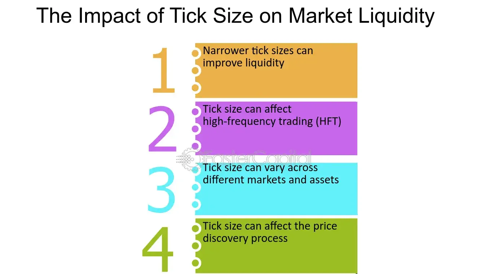

## Table of Contents

## What is a tick size in financial markets?

A tick size in financial markets is the smallest amount by which the price of a security can move. It's like the smallest step up or down that the price can take. For example, if the tick size for a stock is $0.01, the price can only change in one-cent increments, going from $10.00 to $10.01, but not to $10.005.

Tick sizes can vary depending on the type of security and the market it's traded on. For stocks, the tick size is often $0.01, but for some other financial instruments like futures or options, it might be different. The tick size is important because it affects how prices are set and how traders can buy and sell securities. It helps keep the market orderly and can impact trading strategies.

## How does tick size affect trading?

Tick size can really change how people trade. If the tick size is small, like one cent, traders can make smaller moves with the price. This can be good because it lets them be more exact with their trading. But it can also make the market more busy, with lots of little changes happening all the time. Traders might use computers to make quick trades and take advantage of these small changes.

On the other hand, if the tick size is bigger, like ten cents, it can make the market less busy. The price can only change in bigger steps, so there might be fewer trades happening. This can make the market feel more stable, but it can also make it harder for traders to get the exact price they want. They might have to wait longer or accept a price that's not perfect for them. So, the tick size can affect how easy or hard it is to trade, and how much the price moves around.

## What is the purpose of changing tick sizes?

Changing tick sizes is done to make the market work better. If the tick size is too big, it can be hard for traders to get the price they want. They might have to wait longer or take a price that's not perfect for them. By making the tick size smaller, it becomes easier for traders to buy and sell at the price they want. This can make the market more active and help more trades happen.

On the other hand, if the tick size is too small, the market can get too busy. Prices might change a lot, and traders might use computers to make quick trades and take advantage of these small changes. By making the tick size bigger, it can slow things down and make the market more stable. This can help stop the market from being too crazy and help traders feel more sure about their trades.

So, changing tick sizes is all about finding the right balance. It's about making sure the market is easy to use but also stable and fair for everyone.

## How do tick sizes impact liquidity?

Tick sizes can affect how easy it is to buy and sell things in the market, which is called [liquidity](/wiki/liquidity-risk-premium). If the tick size is small, like one cent, it can make it easier for traders to find the price they want. This means more people can trade, and the market can become more liquid. More trades happening means it's easier to buy or sell without waiting too long or moving the price too much.

On the other hand, if the tick size is big, like ten cents, it can make the market less liquid. With bigger steps in price, it can be harder for traders to agree on a price. This might mean fewer trades happen, and it can take longer to buy or sell. A bigger tick size can make the market feel slower and less active, which can affect how easy it is to trade.

So, the tick size is important for liquidity. A smaller tick size can make the market more liquid by allowing more trades, while a bigger tick size can make it less liquid by slowing things down. Finding the right tick size helps keep the market working well for everyone.

## Can tick size changes influence market volatility?

Yes, changing the tick size can affect how much the market moves around, which we call [volatility](/wiki/volatility-trading-strategies). If the tick size is small, like one cent, the price can change in smaller steps. This can make the market more active, with lots of little changes happening all the time. Traders might use computers to make quick trades and take advantage of these small changes, which can make the market feel more up and down. So, a smaller tick size can lead to more volatility because the price can move more often.

On the other hand, if the tick size is big, like ten cents, it can make the market less busy. The price can only change in bigger steps, so there might be fewer trades happening. This can make the market feel more stable, with less jumping around. A bigger tick size can help calm things down and make the market less volatile because it's harder for the price to move quickly. So, the size of the tick can really change how wild or calm the market feels.

## What are the historical examples of tick size adjustments?

In the past, the U.S. stock market made a big change to the tick size. In 2001, they switched from a tick size of 1/16 of a dollar to a smaller tick size of one cent. Before this, prices could only change in steps of 1/16 of a dollar, like $10.0625 or $10.09375. After the change, prices could move in smaller steps, like $10.01 or $10.02. This made it easier for traders to buy and sell at the price they wanted, and it made the market more active.

Another example happened in 2016 when the U.S. Securities and Exchange Commission (SEC) tried a new rule called the Tick Size Pilot Program. They wanted to see if making the tick size bigger for some small stocks would help them. They changed the tick size from one cent to five cents for these stocks. The idea was to see if a bigger tick size could make the market more stable and help these small stocks. The program ran for two years, and they learned a lot about how tick sizes affect the market.

These examples show how changing the tick size can have a big impact on how the market works. The 2001 change made the market more active and easier to trade, while the 2016 pilot program tried to help small stocks by making the market more stable. Both changes were about finding the right balance to make the market work better for everyone.

## How do different markets set their tick sizes?

Different markets set their tick sizes based on what works best for them. For example, in the U.S. stock market, the tick size is usually one cent for most stocks. This small tick size helps traders get the exact price they want and makes the market more active. But not all markets use the same tick size. Some markets, like those for futures or options, might use different tick sizes. For example, a futures contract might have a tick size of a quarter of a cent, while an options contract might have a tick size of five cents. Each market looks at what kind of trading happens there and what tick size will help the market work well.

Sometimes, markets change their tick sizes to see if it makes things better. For example, the U.S. stock market once used a tick size of 1/16 of a dollar, but they changed it to one cent to make trading easier. Other times, markets might try a bigger tick size for certain stocks to see if it helps them. The idea is to find the right balance between making the market active and keeping it stable. Each market looks at its own needs and the needs of its traders to decide what tick size to use.

## What are the arguments for and against larger tick sizes?

People who like bigger tick sizes say they can make the market more stable. When the tick size is bigger, the price can only change in bigger steps. This can slow things down and make the market feel less wild. It can also help small stocks by giving them more room to grow. Traders might be more willing to buy and hold these stocks if they know the price won't jump around too much. So, a bigger tick size can make the market feel safer and help small stocks do better.

On the other hand, people who don't like bigger tick sizes say they can make the market less active. When the tick size is bigger, it can be harder for traders to get the exact price they want. They might have to wait longer or take a price that's not perfect for them. This can make the market feel slower and less fun to trade in. A bigger tick size can also make it harder for traders to use computers to make quick trades and take advantage of small changes in the price. So, a bigger tick size can make the market less exciting and less easy to trade in.

## How do tick sizes affect the bid-ask spread?

Tick sizes can change how big the difference is between what someone wants to buy a stock for and what someone else wants to sell it for. This difference is called the bid-ask spread. If the tick size is small, like one cent, the bid-ask spread can be small too. Traders can make smaller steps with the price, so they can get closer to the price they want. This makes it easier for them to buy and sell, and the market can feel more active.

On the other hand, if the tick size is big, like ten cents, the bid-ask spread can be bigger too. With bigger steps in price, it can be harder for traders to agree on a price. They might have to wait longer or take a price that's not perfect for them. This can make the market feel slower and less easy to trade in. So, the size of the tick can really change how big the bid-ask spread is and how easy it is to trade.

## What research methods are used to study tick size impact?

Researchers use different ways to study how tick size changes affect the market. One way is to look at past data, called historical analysis. They collect information about prices, trading volumes, and how easy it was to buy and sell before and after a tick size change. By comparing this data, they can see if the market got more active or more stable, and if it was easier or harder to trade. Another way is to use computer models, called simulations. Researchers create a pretend market on a computer and change the tick size to see what happens. This helps them understand how different tick sizes might affect the real market without actually changing it.

Another method is to do experiments, like the Tick Size Pilot Program in the U.S. in 2016. They changed the tick size for some small stocks and watched what happened. This real-world test helped them see how a bigger tick size affected things like how easy it was to trade, how much the price moved around, and how well the small stocks did. Researchers also use surveys and interviews to ask traders and market experts what they think about tick size changes. This helps them understand the human side of trading and how people feel about different tick sizes.

## How do algorithmic traders adapt to tick size changes?

Algorithmic traders use computers to make quick trades based on rules they set up. When the tick size changes, they have to change their rules to fit the new size. If the tick size gets smaller, they might need to make their trades smaller too. This can help them take advantage of the smaller price changes that happen more often. They might also need to trade more often to make the same amount of money, because each trade makes less money when the tick size is smaller.

If the tick size gets bigger, algorithmic traders might need to make their trades bigger too. This can help them make more money with each trade, but they might not be able to trade as often. They might also need to wait longer to find the right price to trade at, because the bigger tick size means the price can only change in bigger steps. So, algorithmic traders have to be smart and change their rules to fit the new tick size, so they can keep making money in the market.

## What are the long-term effects of tick size on market structure?

Changing the tick size can have big effects on how the market works over time. If the tick size is small, like one cent, it can make the market more active. More people can trade, and the market can become more liquid. This means it's easier to buy and sell things without waiting too long or moving the price too much. But it can also make the market more up and down, with lots of little changes happening all the time. Traders might use computers to make quick trades and take advantage of these small changes, which can make the market feel more wild.

On the other hand, if the tick size is big, like ten cents, it can make the market less active. With bigger steps in price, it can be harder for traders to agree on a price. This might mean fewer trades happen, and it can take longer to buy or sell. A bigger tick size can make the market feel slower and more stable, with less jumping around. This can help stop the market from being too crazy and help traders feel more sure about their trades. So, the size of the tick can really change how the market works over time, making it more or less active, liquid, and stable.

## What is the impact on market liquidity?

Tick size plays a crucial role in determining market liquidity through its effect on the bid-ask spread, which represents the difference between the highest price a buyer is willing to pay (bid) and the lowest price a seller is willing to accept (ask). A smaller tick size enables this spread to narrow, facilitating more competitive trading environments. This reduction in spreads generally enhances liquidity, making it easier for traders to enter and [exit](/wiki/exit-strategy) positions with minimal price impact. The increased liquidity provided by smaller tick sizes is particularly beneficial for high-frequency traders and market makers, who rely on rapid order execution and minimal transaction costs to maximize profitability.

Conversely, larger tick sizes result in wider spreads. While this may reduce liquidity by increasing transaction costs, it can also lead to decreased price volatility. With wider spreads, market participants might be less inclined to engage in aggressive trading tactics, leading to more stable price movements over short time frames. This potential reduction in short-term volatility can be advantageous for certain types of investors and traders, particularly those employing longer-term strategies who may prioritize stability over rapid execution.

To illustrate, consider a financial instrument with a bid-ask spread that narrows from \$0.05 to \$0.01 due to a reduction in tick size. In this scenario, the lower spread reduces the cost of trading, thereby attracting more market participants and orders, which enhances overall liquidity. Mathematically, if $S$ represents the spread, a decrease in $S$ from a larger tick size ($S_L$) to a smaller tick size ($S_S$) can be modeled as:

$$
S_L > S_S
$$

where $S_S$ supports higher liquidity through lower transaction costs. This mathematical relationship underscores the critical nature of tick size in shaping market dynamics and trading behaviors. Overall, the bid-ask spread's sensitivity to tick size is a fundamental consideration for traders and exchanges seeking to optimize market conditions and align them with their strategic objectives.

## References & Further Reading

[1]: Harris, L. (1991). ["Stock Price Clustering and Discreteness."](https://www.acsu.buffalo.edu/~keechung/MGF743/Readings/Stock%20price%20clustering%20and%20price%20discreteness.pdf) The Journal of Finance, 46(1), 297-325.

[2]: Bikker, J.A., & Spierdijk, L. (2017). ["The Impact of Market Structure on Market Liquidity: Evidence from European Stock Markets."](https://www.semanticscholar.org/paper/The-Impact-of-Market-Structure,-Contestability-and-Bikker-Spierdijk/219855351c1ca79850a75a2d84b0c47c9641b92f) European Journal of Finance, 23(9), 794-821.

[3]: Easley, D., & O'Hara, M. (1987). ["Price, Trade Size, and Information in Securities Markets."](https://www.sciencedirect.com/science/article/pii/0304405X87900298) The Journal of Financial Economics, 19(1), 69-90.

[4]: O'Hara, M. (2015). ["High-Frequency Market Microstructure."](https://www.sciencedirect.com/science/article/pii/S0304405X15000045) Annual Review of Financial Economics, 7, 133-152.

[5]: Lopez de Prado, M. (2018). ["Advances in Financial Machine Learning."](https://www.amazon.com/Advances-Financial-Machine-Learning-Marcos/dp/1119482089) Wiley.

[6]: Foucault, T., Pagano, M., & Röell, A. (2013). ["Market Liquidity: Theory, Evidence, and Policy."](https://academic.oup.com/book/55158) Oxford University Press.

[7]: Harris, R. S. (2003). ["Trading and Exchanges: Market Microstructure for Practitioners."](https://academic.oup.com/book/52292) Oxford University Press.

[8]: Angel, J. J., Harris, L. E., & Spatt, C. S. (2015). ["Equity Trading in the 21st Century: An Update."](https://papers.ssrn.com/sol3/papers.cfm?abstract_id=1584026) The Journal of Finance, 70(5), 2155-2184.