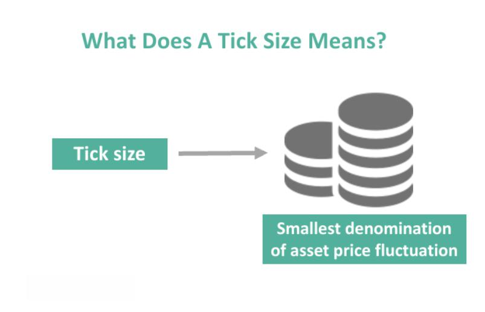

Tick size trading plays a pivotal role in financial markets by determining the minimum price movement of a financial instrument. It is a crucial factor in established trading dynamics and for traders using algorithmic strategies. Algorithmic trading involves deploying automated and complex mathematical models for decision-making in financial markets, enabling trades at speeds and frequencies impossible for human traders. This article aims to investigate the intricacies of tick size trading - from its historical background and significance in shaping trading strategies to its integration with algorithmic approaches.

Tick size has profound impacts on market liquidity and pricing. A smaller tick size can enhance market liquidity by allowing tighter spreads, encouraging more participants to trade. Consequently, it can lead to more competitive pricing and increased market depth. Conversely, a larger tick size might reduce liquidity but improve price discovery by limiting the frequency of price changes. Understanding these dynamics is vital for traders, especially those employing algorithms, which rely on precise entry and exit points to maximize efficiency and profitability.



The primary intent of this article is to explore examples of tick size trading, understand the requirements for successful trading, and analyze how these strategies align with algorithmic trading techniques. By examining the effects of tick sizes in various market conditions and discussing real-world applications, we provide insights into optimizing trading strategies for better outcomes.

Traders need a thorough comprehension of tick size to effectively leverage algorithmic trading. Algorithms are often designed to capitalize on market inefficiencies, and tick size can create such opportunities. By understanding how tick sizes influence market dynamics, traders can develop strategies that exploit minute price movements to generate profits. Knowledge of tick size is thus indispensable for these traders, allowing for the fine-tuning of strategies and improving trading accuracy.

This sets the groundwork for a comprehensive exploration of tick size trading concepts, providing explanations, examples, and considerations for traders seeking to integrate these strategies into their trading frameworks effectively. Moreover, the understanding of evolving market conditions and technological advancements further highlights the need to continuously adapt and update strategies to maintain a competitive edge in the fast-paced world of algorithmic trading.

## Table of Contents

## Understanding Tick Size in Trading

Tick size refers to the minimum price movement or the smallest increment by which the price of a financial instrument can change. It plays a critical role in financial trading, influencing liquidity, volatility, and market depth. A smaller tick size allows for finer price adjustments, potentially leading to tighter bid/ask spreads and increased trading activity, while a larger tick size can lead to greater price jumps, affecting market dynamics and spread costs.

**Effects on Trading Strategies and Market Dynamics**

Tick size impacts various trading strategies, particularly those that depend on small price movements like [scalping](/wiki/gamma-scalping) and high-frequency trading ([HFT](/wiki/high-frequency-trading-strategies)). Traders utilizing these strategies rely on small, consistent profits generated from minute price changes. A smaller tick size provides greater precision, enabling traders to enter and [exit](/wiki/exit-strategy) positions more effectively. Conversely, larger tick sizes can restrict this precision, altering the profitability of these strategies by increasing potential slippage and transaction costs.

**Relationship Between Tick Size and Price Execution**

The tick size directly influences price execution, as it determines the granularity at which trades can occur. Smaller tick sizes typically result in more competitive pricing, with more price points available between the bid and ask, thereby reducing the spread. This improved price granularity can enhance [liquidity](/wiki/liquidity-risk-premium) and offer better price discovery. For example, if a stock has a one-cent tick size, the prices can be adjusted more precisely than if the tick size were five cents, allowing for more nuanced order placement and execution.

**Historical Examples of Tick Size Changes**

Historically, changes in tick size have had significant impacts on market behavior. For instance, the decimalization of stock prices on U.S. exchanges in 2001 reduced the tick size from fractions of a dollar to one cent. This change led to narrower bid-ask spreads and increased market liquidity, but also greater competition among market makers, which impacted their profit margins due to tighter spreads. Such historical shifts illustrate the profound effect of tick size on market microstructure and trading behavior.

**Regulatory Perspective on Tick Size**

Regulators play a pivotal role in determining appropriate tick sizes to ensure fair and orderly markets. They assess factors such as market structure, trading activity, and the nature of financial instruments. Decisions on tick size are intended to balance the need for liquidity, cost-effectiveness, and efficient price discovery. Regulatory bodies across different jurisdictions may set varying tick sizes based on local market conditions and objectives, impacting how financial instruments are traded globally.

**Variation Across Financial Instruments and Exchanges**

Tick sizes vary significantly across financial instruments and exchanges, reflecting the differing liquidity profiles and trading volumes. For example, highly liquid stocks on major exchanges like the NYSE or NASDAQ typically have smaller tick sizes than less frequently traded stocks. Similarly, derivatives markets may set tick sizes based on the [volatility](/wiki/volatility-trading-strategies) and notional value of the contract. Each exchange implements tick size regimes tailored to its specific trading ecosystem, influencing how strategies are developed and executed.

Understanding tick size is essential for traders aiming to optimize their strategies and improve execution efficiency. It affects not only the execution quality but also the profitability of different trading approaches, making it a critical consideration for those using algorithmic strategies where precision and speed are paramount.

## Examples of Tick Size Trading Strategies

Tick size trading strategies are specialized techniques that leverage the smallest possible price movement in a financial market. These strategies can be highly effective in specific market conditions and are often used in conjunction with [algorithmic trading](/wiki/algorithmic-trading) and sophisticated technology infrastructures. 

**Scalping and Tick Size**

Scalping is a popular trading strategy that relies heavily on tick size for profitability. This technique involves entering and exiting trades multiple times within a short period, usually seconds or minutes, to capture small price changes. Since scalpers seek to exploit minute fluctuations dictated by tick size, they require precise execution and minimal slippage. The profitability of scalping can be augmented by a smaller tick size, as it allows for finer price granularity and more precise entry and exit points.

**High-Frequency Trading (HFT) and Tick Sizes**

High-frequency trading (HFT) represents another trading strategy intrinsically linked to tick size variations. HFT entails the use of complex algorithms to execute a large number of orders at extremely high speeds. The tick size influences the pricing increments available to HFT strategies, which in turn affects the profitability and the spread capture potential. Smaller tick sizes can provide HFT firms with additional opportunities to capture small profit margins and exploit price discrepancies between different trading platforms.

**Algorithms Designed for Tick Size Manipulation**

There are specific algorithms designed to capitalize on variations in tick sizes. An example includes market-making algorithms, which provide liquidity by submitting buy and sell orders around the current market price. These algorithms can be optimized to take advantage of the smallest price changes, particularly in markets with high liquidity and low transaction costs.

Consider a Python pseudocode snippet of a simple market-making algorithm that leverages tick size:

```python
class MarketMaker:
    def __init__(self, tick_size, spread):
        self.tick_size = tick_size
        self.spread = spread

    def place_orders(self, current_price):
        buy_price = current_price - (self.spread * self.tick_size)
        sell_price = current_price + (self.spread * self.tick_size)
        # Submit buy and sell orders at calculated prices
        submit_order('buy', buy_price)
        submit_order('sell', sell_price)
```

**Case Studies of Tick Size Trading Implementations**

There are documented case studies that showcase successful tick size trading strategies. For instance, during periods of regulatory changes or market structure reforms, some trading firms have been able to adjust their algorithms favorably. An example involves a shift in tick sizes by exchanges, which can disrupt the price levels at which existing orders reside, allowing opportunistic traders to reconfigure their strategies dynamically to benefit from new price increments.

**Market Conditions Favoring Tick Size Strategies**

Specific market conditions can enhance the efficacy of tick size trading strategies. These include markets with high liquidity, where tighter spreads and smaller tick sizes allow for more granular price movements. Additionally, rapidly changing markets may benefit algorithmic strategies that can quickly adapt to new tick size settings, capitalizing on the swift execution to gain a competitive edge.

Tick size trading strategies, through their association with highly precise and nimble trading techniques like scalping and HFT, underscore the critical role of tick size in the development and implementation of advanced trading algorithms. When combined with the right market conditions and technological tools, these strategies can provide a significant advantage to traders seeking to exploit minor price changes efficiently.

## Trading Requirements for Tick Size Strategies

Engaging in tick size trading involves adhering to specific technical and operational requirements to maximize efficiency and effectiveness. One of the primary considerations is the importance of latency and speed in executing trades. In the context of tick size trading, where profit margins can be minimal, the speed at which trades are executed becomes critical. Lower latency can provide traders with a competitive edge, allowing them to respond to market movements and exploit price differentials more effectively than rivals. 

The infrastructure supporting tick size trading is equally crucial. This infrastructure typically includes sophisticated trading platforms capable of handling high volumes of transactions quickly and efficiently. These platforms must be integrated with reliable data feeds to provide real-time market data and analytics. Advanced computational resources are often needed to process data and execute trades seamlessly. Furthermore, access to colocation services—where trading servers are placed physically close to exchange servers—can significantly reduce latency.

Risk management is an integral aspect of tick size trading strategies. Effective risk management involves setting predefined limits on trades, using stop-loss orders, and regularly assessing market conditions to avoid significant losses. Given that tick size trading usually involves frequent and rapid trades, it's imperative to have automated systems in place to enforce these risk controls without delay.

Regulatory and compliance considerations also play a major role in tick size trading. Traders must ensure their practices comply with local and international trading regulations, which can vary across different jurisdictions and exchanges. Keeping abreast of changes in regulatory frameworks and implementing necessary compliance checks into trading systems helps avoid legal pitfalls and associated penalties.

The skill sets and knowledge base required for tick size trading extend beyond understanding basic trading principles. Traders must possess a deep comprehension of market microstructures and the specific characteristics of tick size dynamics. Additionally, proficiency in quantitative analysis, programming skills—particularly in languages like Python or C++—and familiarity with [machine learning](/wiki/machine-learning) techniques can enhance the development of sophisticated trading algorithms. Continuous education and adaptation to evolving market and technological trends are essential for maintaining a competitive edge in this trading approach.

## Integrating Tick Size Strategies with Algorithmic Trading

Algorithmic trading plays a crucial role in optimizing tick size strategies by enhancing efficiency in trade execution and leveraging minute price movements. Algorithms can efficiently manage large volumes of trades, offering speed and precision that is impossible to achieve manually. This efficiency is pivotal in tick size trading, which relies on exploiting small price changes, usually within a single tick size, to achieve profitability.

Algorithms are capable of processing vast amounts of market data in real-time, identifying profitable opportunities, and executing trades at speeds measured in microseconds. By quickly adapting to market conditions, these algorithms optimize the entry and exit points for trades, reducing the market impact and enhancing execution quality. High-frequency trading (HFT) is an example where algorithms capitalize on tick-size variations, executing a large number of trades within short time frames to capture small profits.

Machine learning and [artificial intelligence](/wiki/ai-artificial-intelligence) (AI) have further advanced tick size algo trading. By employing techniques such as [reinforcement learning](/wiki/reinforcement-learning) and [deep learning](/wiki/deep-learning), traders can develop predictive models that anticipate market movements based on historical data and current market indicators. These AI-driven algorithms can continuously learn and adapt, optimizing trading strategies to improve decision-making and execution.

However, integrating tick size strategies with algorithms presents challenges. One significant issue is latency; the speed at which orders are placed and executed is critical. Even a minimal delay can result in missed opportunities or losses. Therefore, reducing latency through infrastructure improvements, such as the use of co-location services where trading servers are physically closer to the exchange servers, is essential. Moreover, sophisticated risk management systems are necessary to manage the high-frequency and high-[volume](/wiki/volume-trading-strategy) nature of tick size trading, as small miscalculations can lead to significant financial losses.

Developing and testing algorithms for tick size trading requires robust financial models and [backtesting](/wiki/backtesting) mechanisms. Ensuring that the algorithms can perform effectively across various market conditions is crucial. Backtesting involves simulating the algorithm's trading decisions on historical data to evaluate performance and refine strategies. Python libraries like pandas and NumPy are often used in backtesting to handle large datasets and perform statistical analyses efficiently.

Several platforms and tools facilitate the integration of tick size strategies with algorithmic trading. QuantConnect and QuantStart provide environments for developing, testing, and deploying trading algorithms. They offer extensive libraries and community support, enabling traders to implement complex strategies. These platforms allow for quantitative analysis and provide APIs to access real-time market data and historical datasets, essential for testing and refining algorithms.

In conclusion, algorithmic trading significantly enhances tick size strategies by improving trade execution efficiency and enabling sophisticated data analysis. Despite challenges like managing latency and ensuring robust risk management, the integration of AI and machine learning provides powerful tools for optimizing these strategies. With the aid of platforms and tools designed for algorithmic trading, traders can effectively harness tick size opportunities, potentially leading to improved trading performance.

## Case Studies and Real-World Applications

Tick size trading has been a key focus in the evolution of trading strategies, particularly with the increasing integration of algorithmic trading. This section presents case studies and real-world applications, illustrating how traders have successfully applied tick size strategies, and analyzing how market conditions can affect outcomes.

### Case Studies of Successful Tick Size Trading

One notable case study involves a proprietary trading firm that implemented a tick size strategy in the equity markets. By leveraging the changes in tick size, the firm optimized their execution algorithms to capitalize on narrow spreads. The strategy was particularly successful during periods of high volatility, where rapid price movements created more frequent trading opportunities.

Another example includes a [hedge fund](/wiki/hedge-fund-trading-strategies) that used a high-frequency trading (HFT) algorithm to exploit tick size variations in the foreign exchange market. By prioritizing markets with differing tick sizes, the fund could execute trades with high precision, yielding significant returns during periods of currency market instability.

### Impact of Market Conditions

Tick size trading outcomes are highly dependent on market conditions. During volatile market periods, traders can benefit from increased price movements within each tick. Conversely, during stable periods, the opportunities become limited as prices are less likely to fluctuate within the available tick sizes. Liquidity levels also play a crucial role; higher liquidity typically results in narrower spreads and more consistent tick size opportunities.

### Lessons Learned from Past Implementations

Key lessons from these implementations emphasize the importance of understanding tick size dynamics and market liquidity. Effective tick size strategies require a comprehensive analysis of the underlying market mechanics and the ability to adapt to changing conditions. Additionally, integrating advanced statistical models and machine learning techniques can enhance the predictive power of tick size execution algorithms, leading to improved profitability.

### Technological Advancements Influencing Tick Size Trading

Technology has significantly advanced tick size trading strategies. The development of low-latency trading platforms and high-speed data feeds has allowed traders to execute trades faster and more efficiently. Machine learning algorithms are increasingly being used to identify optimal tick size opportunities, analyze historical data, and forecast future price movements with greater accuracy.

Python and other programming languages have become essential tools for developing and testing these algorithms. For example, a simple Python script using libraries such as `pandas` and `NumPy` can be used to backtest tick size strategies, allowing traders to simulate their strategies under different market conditions.

```python
import pandas as pd
import numpy as np

# Sample data for price movements
data = pd.DataFrame({
    'Price': [100, 100.05, 99.95, 100.10, 100.15],
    'Volume': [200, 180, 220, 210, 190]
})

# Define tick size
tick_size = 0.05

# Calculate price changes
data['Price Change'] = data['Price'].diff()

# Identify profitable trades
data['Profitable'] = np.where(data['Price Change'].abs() >= tick_size, True, False)

print(data)
```

### Future Potential and Evolving Landscape

The future potential for tick size and algorithmic trading is vast, with ongoing developments in artificial intelligence poised to transform trading strategies further. Innovations such as quantum computing might reduce computational constraints, leading to even quicker execution speeds and more sophisticated modeling capabilities.

Furthermore, regulatory changes could influence tick size settings, thus impacting trading opportunities. Traders must stay informed about these changes to adapt their strategies accordingly.

### Implications of Technological Innovations

Technological innovations continue to shape trading strategies and market behavior by enabling more precise execution and advanced data analysis capabilities. The integration of machine learning and AI into tick size trading provides a competitive edge by enhancing decision-making processes and adapting to market shifts in real-time.

In conclusion, the evolution of tick size trading in conjunction with technological advancements presents substantial opportunities for traders. By leveraging these innovations, traders can optimize their strategies to navigate market complexities more effectively.

## Conclusion

The article has explored the multifaceted role of tick size in trading, particularly within the sphere of algorithmic trading. A thorough understanding of tick size is critical for traders employing algorithmic strategies, as it directly influences price movements, liquidity, and execution precision. Strategies such as scalping and high-frequency trading (HFT) often hinge on exploiting tick size variations to achieve profitability, highlighting the need for traders to be acutely aware of these nuances.

Looking ahead, tick size and algorithmic trading are poised for significant advancements. Innovations in technology, machine learning, and artificial intelligence are expected to enhance the precision and efficiency of trading algorithms. Such developments will likely lead to more sophisticated and adaptive trading strategies that can better navigate varying market conditions.

Traders are encouraged to seek further resources and stay updated on the latest research and innovations related to tick size trading. Keeping abreast of these changes is vital not only to refine existing strategies but also to capitalize on new opportunities that arise from evolving market dynamics.

As a call to action, traders should rigorously evaluate their current strategies with a particular focus on tick size considerations. Understanding the intricacies of tick size could provide a competitive edge, improving both strategic planning and execution. Moreover, staying informed about market changes and technological advancements will ensure traders are well-positioned to adapt to and benefit from the continuously evolving trading landscape.

## References & Further Reading

[1]: Harris, L. (2003). "Trading and Exchanges: Market Microstructure for Practitioners." Oxford University Press.

[2]: O'Hara, M. (1995). "Market Microstructure Theory." Wiley.

[3]: Biais, B., Glosten, L., & Spatt, C. (2005). "Market Microstructure: A Survey of Microfoundations, Empirical Results, and Policy Implications." Journal of Financial Markets, 8(2), 217-264.

[4]: Hasbrouck, J. (2007). "Empirical Market Microstructure: The Institutions, Economics, and Econometrics of Securities Trading." Oxford University Press.

[5]: Zhang, H., & Powell, W. B. (2017). ["Iterative Meta-model-based Optimization with Direct Search"](https://www.sciencedirect.com/science/article/abs/pii/S1569190X21001040). Operations Research, 65(3), 732-747.

[6]: "Algorithmic Trading and DMA: An introduction to direct access trading strategies" by Barry Johnson

[7]: Bouchaud, J.-P., Farmer, J. D., & Lillo, F. (2009). ["How Markets Slowly Digest Changes in Supply and Demand"](https://arxiv.org/abs/0809.0822). Handbook of Financial Markets: Dynamics and Evolution, 57-160.

[8]: "Algorithmic and High-Frequency Trading" by Álvaro Cartea, Sebastian Jaimungal, and José Penalva.

[9]: Chan, E. (2013). "Algorithmic Trading: Winning Strategies and Their Rationale." Wiley Trading.

[10]: "The Science of Algorithmic Trading and Portfolio Management" by Robert Kissell.