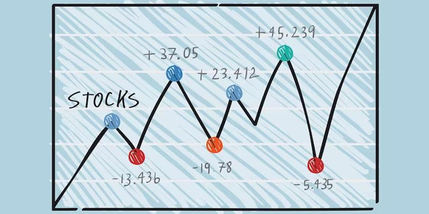

## Table of Contents

## What is tick size in trading?

Tick size in trading refers to the smallest increment by which the price of a security can move. It's like the smallest step on a ladder that the price can take. For example, if a stock has a tick size of $0.01, the price can move from $10.00 to $10.01, but not to $10.005.

Different markets and securities can have different tick sizes. Stocks, for instance, usually have a tick size of one cent, but some might have larger tick sizes depending on their price or the exchange's rules. Understanding tick size is important for traders because it affects how they can place orders and how prices change in the market.

## Why is tick size important in financial markets?

Tick size is important in financial markets because it affects how prices change and how traders can buy or sell securities. Imagine you want to buy a stock, and the smallest price change allowed is one cent. This means you can't offer to buy the stock at a price that's halfway between two cents. Knowing the tick size helps traders decide the best price to buy or sell at, which can make a big difference in their profits or losses.

Also, tick size can influence how liquid a market is. Liquidity means how easily you can buy or sell something without affecting its price too much. If the tick size is too big, it might be harder for traders to agree on a price, which can make the market less liquid. On the other hand, a smaller tick size can make it easier for traders to find a price they agree on, which can make the market more liquid. So, setting the right tick size is important for keeping the market fair and efficient for everyone.

## How does tick size affect liquidity?

Tick size can make a big difference in how easy it is to buy or sell things in the market, which we call [liquidity](/wiki/liquidity-risk-premium). If the tick size is too big, like a dollar instead of a cent, it can be harder for buyers and sellers to agree on a price. Imagine you want to buy a stock at $10.00, but the seller wants $11.00. With a big tick size, you can't meet in the middle, so fewer trades happen, and the market becomes less liquid.

On the other hand, if the tick size is smaller, like a cent, it's easier for people to find a price they both like. You might offer $10.00, and the seller might accept $10.01. This small difference means more trades can happen, making the market more liquid. So, a smaller tick size can help keep the market moving smoothly and make it easier for everyone to trade.

## What is the relationship between tick size and price volatility?

Tick size can affect how much a price moves up and down, which we call price [volatility](/wiki/volatility-trading-strategies). If the tick size is big, like a dollar, the price can only move in big steps. This means if there's a lot of buying or selling, the price can jump a lot, making it seem more volatile. Imagine if you can only move in big steps; even small changes can feel like big jumps.

On the other hand, if the tick size is small, like a cent, the price can move in tiny steps. This can make the market seem less volatile because the price can change more smoothly. It's like walking up a gentle slope instead of big stairs. So, a smaller tick size can help make the price changes look smoother and less jumpy.

## How is tick size determined by different exchanges?

Different exchanges decide on tick size based on what they think will work best for their market. They look at things like how much the prices usually change, how many people are trading, and what kind of things are being traded. For example, if the prices move a lot, they might pick a bigger tick size to keep things simple. But if lots of people are trading and prices are moving smoothly, they might go for a smaller tick size to make it easier for everyone to trade.

Sometimes, the rules for tick size can change depending on the price of the thing being traded. For stocks, if the price is low, the tick size might be smaller, like a penny. But if the price is high, the tick size could be bigger, like ten cents. This helps make sure the market stays fair and works well for everyone, no matter how much the thing costs.

## Can tick size impact the trading strategy of retail investors?

Tick size can definitely affect how retail investors trade. If the tick size is big, it means the smallest price change is bigger. This can make it harder for retail investors to get the exact price they want. For example, if they want to buy a stock at $10.00 but the tick size is $0.10, they might have to pay $10.10 instead. This can make their trading strategy more challenging because they have to think about how much extra they might have to pay or get.

On the other hand, if the tick size is small, like a penny, it's easier for retail investors to find a good price. They can put in orders that are very close to what they want. This can help them be more precise with their trading and maybe even save a bit of money. So, knowing the tick size can help retail investors decide the best way to buy or sell their stocks.

## What historical changes have been made to tick sizes and why?

In the past, the U.S. stock market used to have a tick size of one-eighth of a dollar, or $0.125. This was a big step for prices to move. But in 1997, the SEC, which is like the boss of the stock market, decided to change it to one-sixteenth of a dollar, or $0.0625. They did this because they thought smaller steps would make trading fairer and easier for everyone. Then, in 2001, they made an even bigger change by switching to a decimal system, where the smallest step became one cent. This made it much easier for people to trade at prices that were very close to what they wanted.

These changes happened because the SEC wanted to make the market better. They thought that smaller tick sizes would help more people trade and make the market more liquid. When the tick size was big, like one-eighth of a dollar, it was harder for people to agree on prices. But with smaller tick sizes, like one cent, it became easier for buyers and sellers to find a price they both liked. This helped make the market more active and fair for everyone, from big investors to regular people trading at home.

## How does tick size influence market microstructure?

Tick size plays a big role in how the market works, which we call market microstructure. It's like the rules of the game that everyone has to follow. When the tick size is big, like a dollar, it can make the market less smooth. Imagine trying to walk up big stairs instead of a gentle slope. Big tick sizes can make it harder for people to agree on prices, so fewer trades happen. This can make the market less liquid, which means it's harder to buy or sell things without moving the price a lot.

On the other hand, when the tick size is small, like a penny, it can make the market work better. Small tick sizes let prices move in tiny steps, which makes it easier for buyers and sellers to find a price they both like. This can make the market more liquid, so more trades can happen. It's like walking up a gentle slope instead of big stairs. So, the size of the tick can change how easy or hard it is to trade, and it can affect how the whole market runs.

## What are the effects of tick size on high-frequency trading?

Tick size can really change how high-frequency trading works. High-frequency traders use computers to buy and sell things very quickly, often in just a few seconds. If the tick size is big, like a dollar, it can be harder for these traders to make money. That's because the price can only move in big steps, so they might miss out on small price changes that they could use to make a profit. Big tick sizes can also make the market less liquid, which means it's harder for high-frequency traders to find someone to trade with quickly.

On the other hand, if the tick size is small, like a penny, it can help high-frequency traders a lot. Small tick sizes let prices move in tiny steps, so these traders can take advantage of even the smallest price changes. This can make the market more liquid, which is great for high-frequency traders because they can buy and sell things more easily and quickly. So, a smaller tick size can make high-frequency trading more profitable and efficient.

## How do different asset classes handle tick size?

Different types of things you can trade, like stocks, bonds, and options, each have their own way of setting tick size. For stocks, the tick size is usually a penny, but it can be bigger if the stock price is high. This helps keep the market fair and easy to trade in. Bonds, on the other hand, often have bigger tick sizes because they don't change price as often as stocks. So, a bond might move in steps of a quarter of a dollar or even a dollar.

Options have a special way of dealing with tick sizes too. The tick size for options can depend on how much the option costs. If an option is cheap, the tick size might be a penny, but if it's more expensive, the tick size could be bigger, like five or ten cents. This helps make sure that trading options is smooth and fair for everyone. Each asset class sets its tick size to match how it usually trades, making sure the market works well for everyone involved.

## What are the regulatory considerations regarding tick size?

Regulators, like the SEC in the U.S., think a lot about tick size because it can change how the market works. They want to make sure the market is fair and easy for everyone to use. If the tick size is too big, it can make it hard for people to trade, and the market might not work as well. So, regulators look at things like how much prices usually change and how many people are trading to decide what the best tick size should be. They want to make sure that the tick size helps keep the market liquid and lets people trade at prices that are close to what they want.

Sometimes, regulators change the tick size to make the market better. For example, the SEC changed the tick size for stocks from one-eighth of a dollar to one-sixteenth, and then to a penny. They did this because they thought smaller steps would make trading easier and fairer. Regulators keep an eye on how the market is doing and might change the tick size again if they think it will help. They want to make sure that everyone, from big investors to people trading at home, can use the market in a way that's fair and efficient.

## How can traders adapt their strategies to different tick sizes across markets?

Traders need to know about tick sizes because they can change how they buy and sell things. If the tick size is big, like a dollar, traders have to be careful because they can't get the exact price they want. They might have to pay more or get less than they hoped for. This means they need to think about how much extra they might have to spend or lose. For example, if a trader wants to buy a stock at $10.00 but the tick size is a dollar, they might have to pay $11.00 instead. So, they need to plan their trades carefully and maybe wait for a better price.

On the other hand, if the tick size is small, like a penny, traders can be more exact with their prices. They can put in orders that are very close to what they want, which can help them save money or make more profit. For example, if a trader wants to buy a stock at $10.00 and the tick size is a penny, they can offer $10.01 and still get a good deal. So, traders need to know the tick size of each market they trade in and change their strategies to fit. This way, they can make the best trades no matter what the tick size is.

## References & Further Reading

[1]: Harris, L. (2003). "Trading and Exchanges: Market Microstructure for Practitioners." Oxford University Press.

[2]: O'Hara, M. (1995). "Market Microstructure Theory." Wiley.

[3]: Biais, B., Glosten, L., & Spatt, C. (2005). "Market Microstructure: A Survey of Microfoundations, Empirical Results, and Policy Implications." Journal of Financial Markets, 8(2), 217-264.

[4]: Hasbrouck, J. (2007). "Empirical Market Microstructure: The Institutions, Economics, and Econometrics of Securities Trading." Oxford University Press.

[5]: Zhang, H., & Powell, W. B. (2017). ["Iterative Meta-model-based Optimization with Direct Search"](https://www.sciencedirect.com/science/article/abs/pii/S1569190X21001040). Operations Research, 65(3), 732-747.

[6]: "Algorithmic Trading and DMA: An introduction to direct access trading strategies" by Barry Johnson

[7]: Bouchaud, J.-P., Farmer, J. D., & Lillo, F. (2009). ["How Markets Slowly Digest Changes in Supply and Demand"](https://arxiv.org/abs/0809.0822). Handbook of Financial Markets: Dynamics and Evolution, 57-160.

[8]: "Algorithmic and High-Frequency Trading" by Álvaro Cartea, Sebastian Jaimungal, and José Penalva.

[9]: Chan, E. (2013). "Algorithmic Trading: Winning Strategies and Their Rationale." Wiley Trading.

[10]: "The Science of Algorithmic Trading and Portfolio Management" by Robert Kissell.