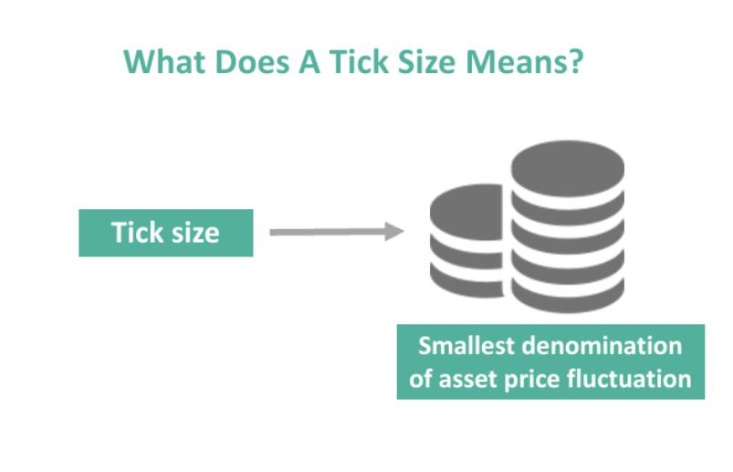

In financial markets, 'tick size' defines the smallest price increment at which securities are quoted. It functions as a foundational element across various trading instruments, including stocks, bonds, and futures. This concept influences trading dynamics by dictating the minimal price changes that can occur. Understanding tick size is particularly crucial for algorithmic traders. These traders devise strategies that depend on accurate and minute price movements to capitalize on market opportunities. By leveraging the precise nature of tick size, algorithmic trading systems can enhance order execution, optimize entry and exit strategies, and improve overall trading efficiency. Knowing the role of tick size helps traders develop methodologies that align with market microstructures, ultimately leading to more effective trading strategies.

## Table of Contents



## Tick Size in Bonds

In financial markets, the concept of tick size is crucial for understanding how bond prices are quoted and traded. U.S. mortgage bonds and specific corporate bonds utilize a tick size of one thirty-second (1/32) of one percent. This means that the smallest incremental change in these bond prices is $\frac{1}{32}\%$, providing granularity in how these securities are valued and traded. Such precision is essential for traders to execute transactions with favorable pricing, optimize yield, and manage portfolios effectively.

Additionally, bond prices in the U.S. may incorporate a 'plus,' representing one sixty-fourth (1/64) of one percent, or half a tick, further refining price adjustments. This level of detail allows traders to make more nuanced pricing decisions, particularly in volatile market conditions.

Contrastingly, European and Asian markets often quote bond prices using decimal systems, where the tick size is typically 1/100 of 1%. This approach standardizes price movements across different markets, facilitating cross-border trading and investment. The decimalization of bond pricing in these regions allows for straightforward conversion and comparison of bond yields, providing a more intuitive understanding of bond value fluctuations.

In conclusion, tick size in bonds significantly impacts trading strategies by determining the minimal price movement and enabling precise control over pricing and execution. Understanding these variations in tick size across different markets is vital for traders who seek to optimize their bond trading strategies and capitalize on market efficiencies.

## Tick Size in Stocks and Futures

Tick size represents the smallest increment by which stock and futures prices can change, playing a crucial role in market dynamics by balancing the priorities of price and time in transactions. This balancing act ensures that the marketplace remains fair and efficient, accommodating diverse trading strategies and ensuring fluid price discovery.

In essence, tick size influences the granularity of price movements in the market. A smaller tick size allows for more precise pricing, letting traders better express their demand for a security. For instance, U.S. stocks often have a tick size of $0.01, meaning prices can fluctuate by just one cent. This granularity can enhance [liquidity](/wiki/liquidity-risk-premium), as it may encourage more extensive participation by allowing traders to make finer adjustments to their pricing strategies.

Moreover, tick sizes can be either fixed or variable, depending on the market structure and region. For example, in the United States, tick sizes are usually fixed, providing a straightforward trading environment where traders know the minimum price change at any given time. In contrast, European markets often incorporate variable tick sizes that may change based on the trading price of the security. This approach can sometimes offer greater flexibility, as the tick size adapts to the price level, potentially increasing efficiency in price discovery for securities trading at higher prices.

The choice between fixed and variable tick sizes impacts trading strategies. Fixed tick sizes offer predictability, making them well-suited for straightforward algorithmic strategies that rely on consistent price movements. Variable tick sizes, however, require more sophisticated algorithms that can dynamically adjust to changing tick increments. Understanding these distinctions is vital for algorithmic traders, as they need to tailor their strategies according to the market's tick size structure to optimize execution and manage risks effectively.

## Importance of Tick Size in Algorithmic Trading

Tick size plays a vital role in [algorithmic trading](/wiki/algorithmic-trading), as it directly influences order execution and market liquidity dynamics. In essence, tick size determines the minimum price alteration that can occur within a trading instrument, thereby affecting the precision and granularity of price changes that traders must navigate.

For algorithmic traders, the tick size is a double-edged sword. On one hand, a smaller tick size offers a higher number of price levels between any two price points, granting traders the opportunity to make more precise moves in the market. This increased granularity allows algorithmic trading systems to fine-tune their strategies and potentially capture smaller price discrepancies. However, this comes with the trade-off of potentially reduced willingness among market participants to post limit orders in advance. The minimal price jumps associated with a smaller tick size may not provide adequate incentives for traders, leading to decreased liquidity at certain price levels.

Conversely, a larger tick size can enhance time priority. This means that trades with the same price are executed in the order of arrival, encouraging participants to make decisions more quickly to secure their place in the queue. While this enhances the competitive aspect of order prioritization, it can also reduce the overall price granularity available in the market. A coarser tick size results in fewer price points between trading levels, which might limit the ability of algorithmic systems to exploit price inefficiencies. Moreover, execution efficiency can be impacted, as the prominence of larger tick intervals can lead to increased slippage when trades are executed at less optimal prices due to fewer available levels.

In Python, the implications of different tick sizes can be illustrated by simulating a simplified [order book](/wiki/order-book-trading-strategies):

```python
# Simulation of price levels with different tick sizes
def generate_price_levels(base_price, num_ticks, tick_size):
    price_levels = [base_price + (i * tick_size) for i in range(num_ticks)]
    return price_levels

# Example with a small tick size
small_tick_size_prices = generate_price_levels(100, 5, 0.01)
# Example with a large tick size
large_tick_size_prices = generate_price_levels(100, 5, 0.05)

print("Small Tick Size Price Levels:", small_tick_size_prices)
print("Large Tick Size Price Levels:", large_tick_size_prices)
```

In this example, the impact of a small versus large tick size is evident in the generated price levels. The choice of tick size can substantially shape trading strategies, influencing everything from order placement to routing decisions and overall market behavior. Understanding these nuances is critical for algorithmic traders aiming to enhance their execution strategies and optimize their interaction with market liquidity.

## Regulatory Influences on Tick Size

MiFID II, implemented in 2019, sets minimum tick sizes for equity and equity-like instruments in European markets. This regulation is designed to harmonize trading practices, ensuring consistency and stability across various trading venues. Tick size regulation under MiFID II is critical for creating a transparent and efficient marketplace. By establishing minimum price increments, MiFID II aims to prevent excessive order fragmentation and promote liquidity.

For algorithmic traders, compliance with tick size regulations is crucial. Market stability, a key goal of MiFID II, relies on the seamless integration of these regulations across all multilateral trading facilities (MTFs). Algorithmic order routing systems must account for these tick size rules to maintain proficiency and precision in trade execution.

The strategic adaptations required for these regulatory changes include updating algorithms to respect the designated tick sizes. This ensures that orders are structured optimally, engaging with the market in a manner that aligns with the regulatory framework. Ignoring compliance can result in inefficiencies or even penalties, underscoring the importance of integrating tick size considerations into algorithmic trading strategies.

Overall, MiFID II's influence on tick sizes encapsulates a broader effort to stabilize European financial markets and protect investors, while laying a foundation for robust and adaptable trading strategies in this regulatory environment.

## Conclusion

Tick size is a fundamental aspect of financial markets, shaping how securities are quoted and traded. It influences pricing precision, market liquidity, and trading strategies, which are core considerations for algorithmic traders striving for optimal performance. A smaller tick size can create more granular price levels, facilitating tight spreads and enhancing market liquidity, yet it may also discourage early order placements by diminishing the impact of small price movements. Conversely, larger tick sizes could prioritize timing over precision, which may improve order execution but at the cost of reduced price granularity.

For algorithmic traders, understanding and leveraging the nuances of tick size is critical to refining trading strategies and achieving efficient execution. Given its substantial impact on order book dynamics and execution priorities, tick size must be carefully considered in the development of trading algorithms. These algorithms, often tasked with executing large [volume](/wiki/volume-trading-strategy)s of trades, rely on precise market data that is inherently influenced by tick size variations.

Moreover, staying informed about tick size regulations is equally vital. Regulatory frameworks such as MiFID II, which standardize tick sizes for equity markets in Europe, significantly influence trading strategies. Compliance with these regulations ensures that algorithmic trading operations can function smoothly across different trading venues and maintain market stability.

In conclusion, tick size is more than just a technical detail; it is a critical component of market microstructure that impacts the efficiency and effectiveness of trading strategies. For algorithmic traders, a keen understanding of tick size dynamics, combined with awareness of regulatory obligations, is essential to navigate the complex landscape of financial markets successfully.

## References & Further Reading

[1]: Harris, L. (2003). ["Trading and Exchanges: Market Microstructure for Practitioners."](https://www.amazon.com/Trading-Exchanges-Market-Microstructure-Practitioners/dp/0195144708) Oxford University Press.

[2]: Hasbrouck, J. (2007). ["Empirical Market Microstructure: The Institutions, Economics, and Econometrics of Securities Trading."](https://academic.oup.com/book/52241) Oxford University Press.

[3]: Madhavan, A. (2000). ["Market Microstructure: A Survey."](https://www.sciencedirect.com/science/article/pii/S1386418100000070) Review of Financial Studies, 13(2), 205-272.

[4]: O’Hara, M. (1995). ["Market Microstructure Theory."](https://www.wiley.com/en-us/Market+Microstructure+Theory-p-9780631207610) Blackwell Publishers.

[5]: Biais, B., & Glosten, L. R., & Spatt, C. (2005). ["Market Microstructure: A Survey of Microfoundations, Empirical Results, and Policy Implications."](https://www.sciencedirect.com/science/article/abs/pii/S1386418104000382) Journal of Economic Literature, 43(4), 1076-1105.