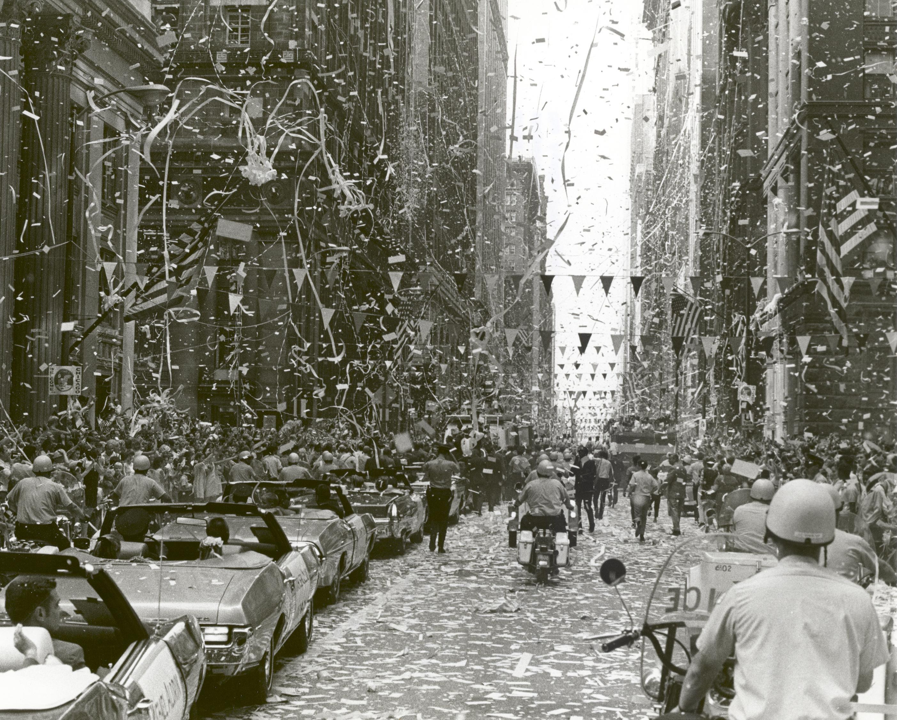

## Table of Contents

## What is a ticker tape?

A ticker tape is a long strip of paper that shows stock prices and other financial information. It was used a long time ago in places like stock exchanges. People would watch the ticker tape to see how stocks were doing. The information on the tape came from a machine called a stock ticker, which printed the data as it came in.

Today, we don't use ticker tapes anymore. Instead, we use computers and the internet to get the same information quickly and easily. But the term "ticker" is still used to talk about the short codes that represent stocks, like "AAPL" for Apple Inc. Even though the old ticker tapes are gone, the idea of getting real-time financial updates is still important in the world of finance.

## What was the original purpose of ticker tapes?

The original purpose of ticker tapes was to give people up-to-date information about stock prices. A long time ago, before computers and the internet, people needed a way to know what was happening with stocks at the stock exchange. The ticker tape machine would print out the latest prices on a long strip of paper, and people could read it to see how their stocks were doing.

This was really important for people who bought and sold stocks. They could make decisions based on the information on the ticker tape. It helped them know when to buy or sell stocks to make money. Even though we don't use ticker tapes anymore, the idea of getting real-time information is still very important in the world of finance today.

## How did ticker tapes function in the past?

In the past, ticker tapes worked by using a machine called a stock ticker. This machine would take information about stock prices from the stock exchange and print it on a long, narrow strip of paper. The paper would come out of the machine slowly, and people would watch it to see the latest prices. Each piece of information on the tape had a special code for the stock, the price, and how many shares were traded. It was like a slow-moving news feed that people could read to know what was happening with stocks.

People who worked at stock exchanges or traded stocks would use ticker tapes to make decisions. If they saw that a stock's price was going up, they might decide to buy it. If the price was going down, they might sell it. The ticker tape was really important because it gave them the latest information they needed to make these decisions. It was a bit like having a newspaper that updated itself all day long, but instead of reading about news, people read about stock prices.

## When were ticker tapes first used?

Ticker tapes were first used in the late 1860s. The first ticker tape machine was invented by Thomas Edison in 1869. Before this, people had to wait for newspapers or messengers to get information about stock prices, which could take a long time.

The ticker tape machine changed everything. It printed stock prices on a long strip of paper that came out of the machine. People could watch the tape and see the latest prices as soon as they changed. This made it much easier for people to buy and sell stocks quickly.

## What is the significance of ticker tapes in financial markets?

Ticker tapes were very important in financial markets because they gave people the latest information about stock prices. Before ticker tapes, people had to wait for newspapers or messengers to find out what was happening with stocks. This could take a long time, and by the time they got the information, the prices might have changed. With ticker tapes, people could see the prices as soon as they changed. This helped them make quick decisions about buying and selling stocks.

The ticker tape machine was invented by Thomas Edison in the late 1860s. It printed stock prices on a long strip of paper that came out of the machine. People would watch the tape and see the latest prices. This made it easier for them to know when to buy or sell stocks. Even though we don't use ticker tapes anymore, the idea of getting real-time information is still very important in the world of finance today.

## How has the technology of ticker tapes evolved over time?

Ticker tapes started a long time ago in the late 1860s when Thomas Edison made the first ticker tape machine. It was a big change because it printed stock prices on a long strip of paper that people could read right away. Before this, people had to wait for newspapers or messengers to get stock price information, which could take a long time. The ticker tape machine made it possible for people to see the latest prices as soon as they changed, helping them make quick decisions about buying and selling stocks.

Over time, the technology of ticker tapes changed a lot. By the 1960s, electronic ticker machines started to replace the old ones that used paper. These new machines showed stock prices on screens instead of printing them on paper. This made it even easier and faster to get information. Today, we don't use ticker tapes at all. Instead, we use computers and the internet to get real-time stock prices. The idea of getting the latest information quickly is still important, but now we do it with modern technology.

## What replaced traditional ticker tapes and why?

Traditional ticker tapes were replaced by electronic ticker machines and later by computers and the internet. In the 1960s, electronic ticker machines started to show stock prices on screens instead of printing them on paper. This was a big change because it made it easier and faster to see the latest prices. People didn't have to wait for the paper to come out of the machine anymore. They could just look at the screen and see the information right away.

Then, as computers and the internet became more common, they took over completely. Now, people can use their computers or smartphones to see stock prices anytime they want. The internet gives them real-time information, just like the old ticker tapes did, but it's much faster and more convenient. This change happened because technology kept getting better, and people wanted quicker and easier ways to get the information they needed.

## Can you explain how modern electronic ticker systems work?

Modern electronic ticker systems work by using computers and the internet to show stock prices and other financial information. Instead of printing on paper like the old ticker tapes, these systems display the information on screens. You can see them on TV, on websites, or even on your smartphone. They update the prices in real-time, which means the information is always the latest. This helps people who buy and sell stocks to make quick decisions based on what's happening right now.

These systems use special codes called "tickers" to represent different stocks. For example, "AAPL" is the ticker for Apple Inc. When you see "AAPL" on an electronic ticker, it means you're looking at the price and other information for Apple's stock. The ticker system gets this information from stock exchanges and updates it very quickly. This way, anyone who needs to know about stock prices can see them right away, without waiting for a paper tape to come out of a machine.

## What are some famous ticker tape parades and their significance?

Ticker tape parades are special celebrations where people throw shredded paper from buildings onto the street. They started in New York City a long time ago, and they are used to honor important people or big events. One famous ticker tape parade happened in 1945 to celebrate the end of World War II. People were so happy that the war was over, and they threw tons of paper from the buildings to show their joy. It was a big party in the streets, and it showed how much the end of the war meant to everyone.

Another famous ticker tape parade was for the Apollo 11 astronauts in 1969. When Neil Armstrong, Buzz Aldrin, and Michael Collins came back from the moon, people wanted to celebrate their amazing achievement. They had a huge parade in New York City, and people threw so much paper that it looked like a big, happy snowstorm. This parade showed how proud and excited people were about the moon landing. It was a way for everyone to come together and celebrate something really special.

## How do ticker tape machines differ from stock quote boards?

Ticker tape machines and stock quote boards are both used to show stock prices, but they work in different ways. A ticker tape machine prints stock prices on a long strip of paper. It was like a slow-moving news feed that people could read to see the latest prices. The machine would print codes for the stocks, the prices, and how many shares were traded. People would watch the paper coming out of the machine to make decisions about buying and selling stocks.

A stock quote board, on the other hand, shows stock prices on a big screen or a board. Instead of printing on paper, it displays the information in a way that everyone can see at once. These boards are often used in places like stock exchanges or on TV. They update the prices quickly, so people can see the latest information without waiting for a paper tape. Both ticker tape machines and stock quote boards help people get the information they need, but they do it in different ways.

## What impact did the ticker tape have on real-time financial reporting?

The ticker tape had a big impact on real-time financial reporting. Before ticker tapes, people had to wait for newspapers or messengers to get information about stock prices. This could take a long time, and by the time they got the information, the prices might have changed. The ticker tape machine changed everything. It printed stock prices on a long strip of paper that came out of the machine. People could watch the tape and see the latest prices as soon as they changed. This made it much easier for people to buy and sell stocks quickly.

Today, we don't use ticker tapes anymore, but the idea of getting real-time information is still very important. Computers and the internet have taken over, giving us even faster and easier ways to see stock prices. The ticker tape was the start of this change. It showed people how important it was to have the latest information right away. This helped make the world of finance faster and more efficient.

## What are the future prospects for ticker tape technology in the digital age?

In the digital age, the future of ticker tape technology is all about using computers and the internet to get stock prices and other financial information. The old ticker tapes that printed on paper are gone, but the idea of getting real-time information is still very important. Now, people use electronic ticker systems that show stock prices on screens. These systems are much faster and easier to use than the old ticker tapes. They can be found on websites, TV, and even on smartphones, so anyone can see the latest stock prices anytime they want.

Looking ahead, ticker tape technology will keep changing as new technology comes out. People will always want the latest information about stocks, so the systems that give them this information will keep getting better. They might use new ways to show the information, like virtual reality or special apps. But no matter how the technology changes, the main goal will stay the same: to help people make quick decisions about buying and selling stocks by giving them the latest information as fast as possible.

## References & Further Reading

[1]: Kirilenko, A. A., Kyle, A. S., Samadi, M., & Tuzun, T. (2017). ["The Flash Crash: The Impact of High Frequency Trading on an Electronic Market"](https://onlinelibrary.wiley.com/doi/abs/10.1111/jofi.12498). The Journal of Finance, 72(3), 1249-1290.

[2]: ["Advances in Financial Machine Learning"](https://www.amazon.com/Advances-Financial-Machine-Learning-Marcos/dp/1119482089) by Marcos Lopez de Prado.

[3]: ["Quantitative Trading: How to Build Your Own Algorithmic Trading Business"](https://books.google.com/books/about/Quantitative_Trading.html?id=j70yEAAAQBAJ) by Ernest P. Chan.

[4]: ["Machine Learning for Algorithmic Trading"](https://github.com/PacktPublishing/Machine-Learning-for-Algorithmic-Trading-Second-Edition) by Stefan Jansen.

[5]: ["Evidence-Based Technical Analysis: Applying the Scientific Method and Statistical Inference to Trading Signals"](https://www.amazon.com/Evidence-Based-Technical-Analysis-Scientific-Statistical/dp/0470008741) by David Aronson.