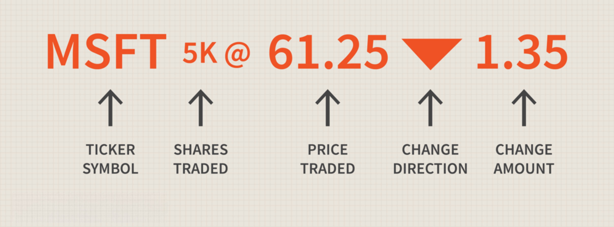

In the rapidly evolving financial markets, algorithmic trading has become a dominant force, leveraging technology to execute trades with precision and efficiency. By automating trade processes through sophisticated computer programs, traders can achieve optimal trade execution, reduce transaction costs, and mitigate human error. This shift has propelled algorithmic trading to the forefront, influencing trading strategies and market dynamics.

This article explores the convergence of three essential components: financial data, stock market ticker tape, and algorithmic trading. Financial data serves as the backbone of trading by providing insights into market trends, stock performance, and economic indicators. The stock market ticker tape, historically a paper-based system for communicating stock prices and transactions, now operates as a digital real-time display of market information crucial for making informed trading decisions. Algorithmic trading utilizes these datasets to execute trades based on predefined criteria, allowing for strategic decision-making that is both swift and data-driven.



Understanding these concepts is essential for both individual investors and institutional players aiming to remain competitive in the modern financial landscape. Mastery of financial data interpretation, comprehension of ticker tape history and its digital transformation, and the effective deployment of algorithmic trading strategies can offer a significant edge in today's markets. This comprehensive overview aims to demystify these complex topics and present a clear understanding of their applications and benefits, equipping investors with the knowledge needed to navigate and succeed in this technology-driven environment.

## Table of Contents

## Understanding Financial Data in the Stock Market

Financial data is fundamental to financial markets, offering insights into market trends, stock performance, and broader economic indicators. Understanding these datasets is imperative for anyone engaged in trading and investment management.

Key financial data elements include stock prices, trading volume, historical performance, and fundamental financial statements from companies. Stock prices provide the current valuation of securities, influencing investor decisions based on whether they are deemed overvalued or undervalued. Trading volume, which indicates the number of shares traded over a certain period, is crucial for understanding market liquidity. Historical performance data offers insights into long-term trends and cyclical patterns, which investors use to predict future performance. Fundamental financial statements such as balance sheets, income statements, and cash flow statements are essential for assessing a company's financial health and intrinsic value.

In the volatile stock market environment, this data forms the basis for developing informed trading strategies. Traders often rely on quantitative models to analyze these datasets, helping to predict price movements and identify investment opportunities. For instance, algorithms can be employed to compute moving averages or other indicators that highlight emerging trends.

Emerging technologies and platforms have revolutionized how financial data is accessed and utilized. Real-time data feeds ensure that traders have the most up-to-date information, enabling them to react rapidly to market changes. This immediacy is especially important for strategies like high-frequency trading, where even milliseconds can influence outcomes.

Understanding how to interpret and leverage this data requires both analytical skills and technological competence. Traders use various tools and programming languages to process and analyze data. For example, Python libraries like Pandas and NumPy are commonly used to handle large datasets and perform numerical analysis. Below is a simple Python snippet illustrating how one might use Pandas to calculate a moving average for stock prices:

```python
import pandas as pd

# Sample data
data = {'Date': ['2023-01-01', '2023-01-02', '2023-01-03'],
        'Stock_Price': [150, 152, 155]}
df = pd.DataFrame(data)

# Calculate 2-day moving average
df['2-day MA'] = df['Stock_Price'].rolling(window=2).mean()

print(df)
```

Successful trading and investment management hinge on the effective use of financial data. Investors who skillfully interpret this data can craft strategies that optimize returns and mitigate risks. As technology continues to evolve, the importance of understanding and effectively manipulating financial data will only grow.

## The Evolution and Relevance of Ticker Tape

Ticker tape, a crucial innovation of the 19th century, transformed the way stock information was disseminated. Initially developed to transmit stock quotes and trades, ticker tape provided investors worldwide with access to real-time market data. This early method involved a telegraphic system where stock prices and trade volumes were printed onto a spool of paper tape. Named for the ticking sound of the stock ticker machine, this invention revolutionized market communication by allowing individuals and brokers to receive timely updates on stock movements.

In the modern era, the traditional paper ticker tape has been replaced by digital displays, which offer a more efficient and comprehensive representation of stock market activity. Today's digital ticker tapes stream real-time data directly to traders' screens, enabling them to monitor stock symbols, trading volumes, trade prices, and price changes instantaneously. This capability is essential for analyzing market conditions and trends, ultimately aiding traders in making informed decisions.

The digital ticker tape remains a vital tool in trading, primarily due to its ability to encapsulate market sentiment and stock movement visually. It acts as an invaluable resource for traders to assess the market pulse and gauge investor sentiment. The continuous stream of data facilitates quick decision-making, which is essential in today's fast-paced financial markets where delays can lead to missed opportunities.

Despite the evolution from paper to digital formats, the core principles of reading and interpreting ticker tape data have persisted. Traders still rely on this information to guide their decisions, applying tried-and-true analysis techniques alongside modern computational methods. The enduring relevance of ticker tape lies in its ability to provide a concise summary of complex market activities, proving that historical methodologies can still offer value amidst technological advancements. 

In summary, while the medium has changed, the significance of ticker tape as a fundamental component in trading has not diminished. It continues to play a critical role as both a historical artifact and a contemporary tool, assisting traders in navigating the intricate dynamics of financial markets with precision and insight.

## What is Algorithmic Trading?

Algorithmic trading, commonly referred to as algo trading, is the practice of using computer algorithms to automate and efficiently execute trading orders with minimal human intervention. By relying on predetermined criteria such as price, [volume](/wiki/volume-trading-strategy), and timing, these algorithms enable traders to implement complex strategies that are executed at optimal times, thus improving the efficiency of trading operations.

Algo trading plays a crucial role in enhancing market [liquidity](/wiki/liquidity-risk-premium) and allows market participants to swiftly capitalize on fleeting trading opportunities. The ability to execute trades rapidly and systematically provides a competitive advantage in the fast-paced financial markets. Furthermore, by minimizing the need for human intervention, [algorithmic trading](/wiki/algorithmic-trading) reduces the risk of errors associated with manual trading processes and mitigates the influence of emotional decision-making, which can often lead to irrational trading choices.

With advancements in technology, particularly in [artificial intelligence](/wiki/ai-artificial-intelligence) (AI) and [machine learning](/wiki/machine-learning), algorithmic trading continues to evolve. These technologies facilitate the incorporation of predictive analytics and real-time data processing into trading algorithms, enabling more sophisticated and adaptive trading models. For instance, machine learning algorithms can analyze vast amounts of financial data to identify patterns and predict future price movements, enhancing the decision-making process in trading strategies.

One prominent example of algorithmic trading is high-frequency trading ([HFT](/wiki/high-frequency-trading-strategies)), which involves executing millions of orders in fractions of a second. HFT algorithms utilize rapid data processing and sophisticated mathematical models to identify [arbitrage](/wiki/arbitrage) opportunities, inefficiencies, and trends within the market. The speed at which these algorithms operate necessitates an infrastructure capable of handling high data throughput and low latency execution.

To illustrate the concept, consider the following Python pseudocode, which represents a simple algorithm based on moving average crossover strategy:

```python
def moving_average(prices, window):
    return sum(prices[-window:]) / window

def moving_average_crossover(prices, short_window, long_window):
    short_ma = moving_average(prices, short_window)
    long_ma = moving_average(prices, long_window)

    if short_ma > long_ma:
        return "Buy"
    elif short_ma < long_ma:
        return "Sell"
    else:
        return "Hold"

prices = [/* list of historical prices */]
signal = moving_average_crossover(prices, short_window=50, long_window=200)
execute_trade(signal)
```

In this example, the algorithm calculates short-term and long-term moving averages to generate trading signals—buy, sell, or hold—based on the crossover of these averages. Such algorithms can be expanded with additional data inputs and refined using machine learning techniques to improve predictive accuracy and financial returns.

Overall, algorithmic trading represents a transformative approach to financial markets, leveraging technology to optimize trade execution and enhance strategic decision-making. As technology continues to advance, algorithmic trading is expected to play an increasingly dominant role in shaping the future of trading and investment practices.

## Integrating Financial Data and Algo Trading

Integrating financial data into algorithmic trading systems has revolutionized how trading strategies are developed and executed. This integration leverages quantitative analysis to create sophisticated algorithms that can process vast amounts of data and make informed trading decisions in real-time.

Real-time data feeds are crucial for algorithmic trading as they provide the necessary information for algorithms to react promptly to market fluctuations. These feeds include stock prices, trading volumes, and other financial indicators. By continuously analyzing this data, algorithms can execute trades with precision, optimizing returns while minimizing risks. For instance, an algorithm might be programmed to buy a stock when its price falls below a certain threshold and sell it when the price rises above another threshold, all based on real-time data inputs.

The combination of data analytics, machine learning, and algorithmic trading enhances the ability to recognize market patterns and forecast future price movements. Machine learning models can be trained on historical data to identify trends and anomalies, providing predictive capabilities that are invaluable for traders. For example, a [neural network](/wiki/neural-network) might be used to predict stock price movements based on historical patterns and current market conditions.

Back-testing is another essential component of integrating financial data into trading systems. By simulating trades using historical data, traders can assess the effectiveness of their algorithms before deploying them in live markets. This process helps identify potential flaws and optimize parameters to enhance performance. Python libraries such as Backtrader or Zipline are commonly used for back-testing strategies, offering tools to simulate trading and evaluate outcomes.

The continuous advancement of technology ensures that datasets are processed efficiently, making trading systems more adaptive and robust. Innovations in big data and cloud computing allow for the handling of large datasets, enabling more complex and data-intensive algorithms. Additionally, financial institutions are increasingly employing natural language processing (NLP) to analyze news and other textual data, further enriching the sources of financial data for trading.

Overall, the integration of financial data and algorithmic trading represents a transformative approach to trading. By leveraging real-time data, advanced analytics, and machine learning, traders can develop strategies that are not only responsive but also predictive of future market conditions, offering a significant edge in today's competitive financial markets.

## Risks and Challenges in Algo Trading

Algorithmic trading, though a powerful tool in the financial markets, presents several risks and challenges that traders and firms must manage diligently. One prominent risk is the occurrence of flash crashes, which are characterized by a rapid market decline followed by an equally swift recovery. These events reflect the vulnerability of automated trading systems as they react to unforeseen market conditions. Such reactions can lead to significant market disruptions, exemplified by the 2010 "Flash Crash" when the U.S. stock market quickly plummeted and recovered, largely attributed to high-frequency trading algorithms[1].

Another critical challenge is the possibility of deploying faulty algorithms. Errors in algorithmic code can have drastic consequences, potentially leading to substantial financial losses. These mistakes often arise from improper testing or coding flaws, underscoring the importance of rigorous validation and simulation before algorithms are implemented in live trading environments. Regular audits and updates to the code can help mitigate risks associated with software malfunctions.

Regulatory and compliance issues also pose considerable challenges. The rapid execution speed and complex strategies involved in algorithmic trading demand stringent oversight to prevent market manipulation and ensure ethical trading practices. Regulatory bodies worldwide have sought to implement measures that enhance transparency and limit the potential for systemic risk introduced by algorithmic trading. Compliance requires firms to maintain detailed records of trading activities and algorithms, ensuring adherence to financial regulations.

Furthermore, traders and financial institutions must continually monitor their algorithms to maintain optimal performance. The dynamic nature of financial markets means that algorithms must adapt to changing conditions and be capable of recognizing evolving patterns. Continuous monitoring enables traders to adjust algorithmic parameters and strategies promptly, reducing the impact of adverse market movements.

In summary, while algorithmic trading offers efficiency and strategic advantages, it necessitates sophisticated risk management frameworks to address the inherent challenges. A proactive approach involving meticulous testing, ongoing monitoring, and adherence to regulatory standards is crucial to harness the benefits of algorithmic trading successfully.

---
[1] Kirilenko, A. A., Kyle, A. S., Samadi, M., & Tuzun, T. (2017). "The Flash Crash: The Impact of High Frequency Trading on an Electronic Market". *The Journal of Finance*, 72(3), 1249-1290.

## The Future of Financial Markets with Algo Trading

The future of trading is poised to be significantly influenced by algorithmic approaches, driven by continuous technological advancements. The integration of artificial intelligence (AI) and big data analytics is set to enhance the capabilities of algorithmic trading systems. AI can process vast quantities of data at high speeds, identifying patterns and trends that might be imperceptible to human traders. Machine learning algorithms can evolve based on market data, improving predictive power and decision-making accuracy. Consequently, this advancement offers traders deeper insights into market dynamics, enabling more strategic and precise trading decisions.

Moreover, the financial industry is moving towards the integration of blockchain and decentralized technologies. Blockchain offers secure, transparent, and tamper-proof systems that can be utilized for various trading applications. Smart contracts, which are self-executing contracts with the terms of the agreement directly written into code, could automate trading processes, reducing the need for intermediaries and potentially lowering transaction costs. Decentralized finance (DeFi) is another revolutionary concept, proposing a shift from traditional, centralized financial services to peer-to-peer systems using blockchain technology, which could further alter trading infrastructures.

Investors must adapt by acquiring skills in data science, programming, and financial market strategies to stay competitive in this technology-driven landscape. Familiarity with Python, for instance, is increasingly important as it is widely used for developing trading algorithms due to its robust libraries and ease of use. Basic knowledge of machine learning and AI principles is also essential, as these technologies become more ingrained in trading processes.

In summary, the fusion of data, technology, and trading strategies promises to redefine financial markets and investment approaches in the coming years. This evolution will lead to faster, more efficient trading systems capable of generating profound insights. Investors who embrace these innovations will be well-positioned to capitalize on the opportunities presented by the rapidly changing financial ecosystem.

## Conclusion

The intersection of financial data, ticker tape, and algorithmic trading represents a significant shift in how markets operate, heralding a new era where technology and finance are intricately intertwined. Understanding these concepts is paramount for traders and investors, as they present opportunities to not only optimize performance but also to manage risk more effectively. Algorithmic trading, fueled by vast quantities of financial data and real-time feeds exemplified by modern ticker tapes, allows for precise and rapid execution of trades, ultimately enhancing market efficiency.

The continuous evolution of technology necessitates adaptability among market participants. Traders and investors must commit to lifelong learning, staying abreast of new tools and methodologies that can be leveraged to gain competitive advantages. This is especially true as artificial intelligence and machine learning become more prevalent, enabling deeper analytical insights and predictive capabilities.

The integration of financial data, ticker tape, and algorithmic trading systems promises a future where trading not only becomes faster and more efficient but also generates insights that were previously unimaginable. These advancements enable the identification of complex market patterns and the anticipation of future movements with greater accuracy.

Investors who embrace these innovations—and who are willing to adapt to the constantly evolving technological landscape—will be well-positioned to thrive. By cultivating skills in data interpretation and algorithmic trading, they can effectively navigate the modern financial ecosystem, capitalizing on the myriad opportunities presented by this technological renaissance. As the integration of these elements continues to deepen, the potential for significant innovation and transformation within financial markets grows, promising a dynamic future for all market participants.

## References & Further Reading

[1]: Kirilenko, A. A., Kyle, A. S., Samadi, M., & Tuzun, T. (2017). ["The Flash Crash: The Impact of High Frequency Trading on an Electronic Market"](https://onlinelibrary.wiley.com/doi/abs/10.1111/jofi.12498). The Journal of Finance, 72(3), 1249-1290.

[2]: ["Advances in Financial Machine Learning"](https://www.amazon.com/Advances-Financial-Machine-Learning-Marcos/dp/1119482089) by Marcos Lopez de Prado.

[3]: ["Quantitative Trading: How to Build Your Own Algorithmic Trading Business"](https://books.google.com/books/about/Quantitative_Trading.html?id=j70yEAAAQBAJ) by Ernest P. Chan.

[4]: ["Machine Learning for Algorithmic Trading"](https://github.com/PacktPublishing/Machine-Learning-for-Algorithmic-Trading-Second-Edition) by Stefan Jansen.

[5]: ["Evidence-Based Technical Analysis: Applying the Scientific Method and Statistical Inference to Trading Signals"](https://www.amazon.com/Evidence-Based-Technical-Analysis-Scientific-Statistical/dp/0470008741) by David Aronson.