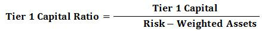

In finance and banking, the integration of metrics and automation has become essential for maintaining both stability and growth. This article focuses on the Tier 1 Capital Ratio, a pivotal banking metric, alongside the transformative impact of algorithmic trading. Within the complex regulatory environment, financial institutions rely on metrics like the Tier 1 Capital Ratio to assess their financial stability effectively. This ratio is a fundamental measure of a bank's financial health, representing the core capital—a safeguard against financial distress, and ensuring the bank's ability to absorb losses.

Algorithmic trading, through the use of sophisticated algorithms and high-speed computing, is revolutionizing traditional markets. It introduces unprecedented efficiencies and speed, allowing trades to be executed with minimal human intervention and at optimal prices. The combination of vast data sets and advanced computational power allows algorithmic trading strategies to operate continuously, enhancing market liquidity and providing tighter bid-ask spreads.

This article seeks to provide a comprehensive understanding of the Tier 1 Capital Ratio and algorithmic trading, emphasizing their importance in contemporary banking and financial markets. Understanding their intersection is vital for stakeholders aiming to maintain competitiveness and compliance in today's intricate financial landscape.

## Table of Contents

## Understanding Tier 1 Capital and Its Importance

Tier 1 Capital represents the foundational financial strength of a banking institution, consisting primarily of core equity capital such as common stock, disclosed reserves, and retained earnings. It functions as the primary bulwark against losses, serving to protect a bank's financial stability and health. The importance of Tier 1 Capital lies in its ability to absorb losses without requiring the bank to cease operations, thus ensuring continued confidence in the financial system.

The Tier 1 Capital Ratio is a critical metric in the banking sector, calculated as the ratio of Tier 1 Capital to the bank's total risk-weighted assets. This ratio is a cornerstone of the Basel III regulatory framework, established to compel banks to maintain adequate levels of high-quality capital and ensure resilience during periods of financial stress. The formula for the Tier 1 Capital Ratio is: 

$$
\text{Tier 1 Capital Ratio} = \left( \frac{\text{Tier 1 Capital}}{\text{Risk-weighted Assets}} \right) \times 100\%
$$

Adherence to Basel III standards necessitates that banks continually assess and adjust their capital holdings to meet or exceed the prescribed capital adequacy levels. A higher Tier 1 Capital Ratio is indicative of a bank's solid financial footing, reflecting its capability to not only support ongoing operations but also withstand unexpected financial shocks. This robust ratio signifies the bank's ability to manage risks effectively, displaying resilience in volatile market conditions.

The focus on Tier 1 Capital and its associated ratio underscores its significance in the regulatory landscape. By ensuring banks maintain a strong capital base, financial systems mitigate systemic risks, instill investor confidence, and enhance long-term sustainability. Thus, the Tier 1 Capital Ratio remains an indispensable tool in measuring and safeguarding the integrity of banking institutions worldwide.

## Algorithmic Trading: A Modern Financial Tool

Algorithmic trading, commonly known as algo trading, involves the use of complex algorithms to execute trade orders in financial markets at optimal prices and speeds. This form of trading typically requires minimal human intervention, relying on pre-programmed instructions to make rapid trading decisions based on fluctuating market data and other variables.

The primary advantage of [algorithmic trading](/wiki/algorithmic-trading) lies in its ability to leverage vast datasets and significant computational power. This enables algo trading systems to operate continuously, 24 hours a day and seven days a week, consistently scanning for market opportunities across multiple trading platforms. The capability of these systems to analyze markets in real-time and execute trades almost instantaneously provides a significant competitive advantage, making algorithmic trading particularly appealing to institutional investors.

The adoption of algorithmic trading has not only enhanced the efficiency of financial markets but also increased market [liquidity](/wiki/liquidity-risk-premium). When markets are more liquid, there are more participants buying and selling at any given time, leading to tighter bid-ask spreads. This means that the cost of trading decreases, and prices are more accurately reflective of the underlying value of the traded asset.

Moreover, algorithmic trading strategies often result in more precise pricing. By minimizing human errors and emotional biases that can affect trading decisions, algorithmic systems can execute a high [volume](/wiki/volume-trading-strategy) of trades at predetermined conditions that align with specific investment strategies. This precision in execution reduces slippage, where the final execution price differs from the expected price, thereby providing a fairer and more transparent market environment.

Overall, algorithmic trading represents a significant advancement in the field of financial markets, streamlining operations while ensuring increased market effectiveness and accuracy.

## Integration of Tier 1 Capital Metrics in Algo Trading

Understanding the capital adequacy of a financial institution is crucial for algorithmic traders seeking to optimize their strategies. By integrating metrics such as the Tier 1 Capital Ratio into their algorithms, traders can thoroughly evaluate the risk profiles of counterparties they intend to engage with. The Tier 1 Capital Ratio, signifying a bank's core capital against its risk-weighted assets, serves as an essential measure of a bank's financial stability. Analyzing this metric allows traders to discern the relative risk levels and financial health of banking institutions, which is critical for making informed trading decisions.

Incorporating banking metrics into algorithmic models enhances decision-making processes, particularly concerning counterparty risk assessments and identifying potential investment opportunities. By accessing real-time data, algorithms can instantaneously adjust to reflect the Tier 1 Capital Ratios of banks, enabling traders to quickly react to fluctuations in financial stability. This continuous integration of up-to-date capital adequacy metrics equips traders with the requisite knowledge to mitigate risks effectively and optimize profit potentials. For example, an algorithm could filter out banks with a ratio below a certain threshold, thus avoiding entities with potentially higher risk exposures.

The fusion of regulatory banking metrics with advanced trading algorithms ensures a strategic alignment between regulatory compliance and technological trading advancements. As regulatory frameworks such as Basel III impose minimum capital requirements to enhance the stability of the banking sector, traders can leverage these standards within their algorithmic models to maintain compliance while seeking competitive advantage. The strategic deployment of these metrics enables traders to not only adhere to regulatory protocols but also optimize their trading techniques in fast-evolving market environments.

The importance of integrating Tier 1 Capital Metrics in algorithmic models is underscored by its ability to provide insights into both banking stability and market opportunities. As these metrics become more seamlessly woven into algorithmic trading strategies, a higher level of accuracy and efficiency in trading operations can be expected. This integration symbolically represents a synergy between traditional banking stability measures and modern financial trading methodologies, resulting in a powerful toolset capable of navigating complex market dynamics.

## The Role of Regulatory Compliance

Regulatory compliance plays a pivotal role in the operational framework of financial institutions, primarily by ensuring adherence to established guidelines such as those outlined in Basel III. Basel III is a comprehensive set of reform measures developed by the Basel Committee on Banking Supervision, intended to strengthen regulation, supervision, and risk management within the banking sector. One of its core mandates is the maintenance of minimum capital requirements, specifically the Tier 1 Capital Ratio.

The Tier 1 Capital Ratio is crucial as it represents a bank’s core capital relative to its risk-weighted assets and serves as a fundamental indicator of financial soundness. A strong ratio not only fulfills regulatory stipulations but also bolsters the confidence of investors and stakeholders, which is vital for the bank's reputation and operational longevity. As per Basel III norms, banks are required to maintain a Tier 1 Capital Ratio above a certain threshold to ensure resilience against potential economic challenges.

Compliance with these regulations ensures long-term sustainability by offering a buffer against financial instability. By maintaining adequate capital reserves, banks can absorb losses during periods of financial distress, reducing the risk of failure. This is particularly significant in preventing systemic risks that could arise from the interconnected nature of financial institutions. Ensuring compliance thus safeguards not only individual banks but also the broader financial system, providing a stable environment conducive to growth and development.

In summary, regulatory compliance, underpinned by frameworks like Basel III, is indispensable for the continued health and robustness of the banking sector. By upholding capital adequacy standards, banks not only secure their future but also contribute to the overall stability and security of the financial landscape.

## Case Studies and Examples

ABC Bank serves as a prime illustration of robust financial health, with a Tier 1 Capital amounting to $5 million against $50 million in risk-weighted assets. This configuration results in a Tier 1 Capital Ratio of 10%, calculated as follows:

$$
\text{Tier 1 Capital Ratio} = \left( \frac{\text{Tier 1 Capital}}{\text{Risk-Weighted Assets}} \right) \times 100 = \left( \frac{5,000,000}{50,000,000} \right) \times 100 = 10\%\]

This considerable ratio underscores ABC Bank's capacity to support its operations and absorb potential financial losses, reflecting its prudent risk management and financial stability. Such robust metrics are instrumental when developing algorithmic trading strategies, as they signal a lower risk profile and a more dependable counterpart for trades.

In contrast, DEF Bank presents a more cautious scenario with a Tier 1 Capital Ratio of 4%. With similar calculations, if DEF Bank holds, for example, Tier 1 Capital of $2 million against $50 million in risk-weighted assets, the formula would be:

$$
\text{Tier 1 Capital Ratio} = \left( \frac{2,000,000}{50,000,000} \right) \times 100 = 4\%\]

This lower ratio indicates undercapitalization, highlighting higher susceptibility to economic fluctuations and potential fiscal strain. Such financial metrics are critical for algorithmic traders who must assess these figures to determine risk profiles accurately.

These examples emphasize the essential nature of scrutinizing Tier 1 Capital Ratios in crafting algorithmic trading strategies. Traders armed with this knowledge can navigate complex market dynamics more effectively, aligning investment decisions with the underlying financial health of banking institutions. Through the integration of these capital metrics, algorithmic models can be finely tuned to account for counterparty risk, ultimately fostering smarter, risk-adjusted trading.

## Conclusion

The interplay between banking metrics and algorithmic trading underscores the changing dynamics of the financial industry. The Tier 1 Capital Ratio is a pivotal element in assessing a bank’s financial resilience. It plays a substantial role within the frameworks of algorithmic trading by equipping traders with indicators of a financial institution's stability. As regulatory measures like Basel III continue to enforce stringent capital requirements, banks strive to maintain robust Tier 1 Capital Ratios. 

This environment of regulatory pressure and capital management facilitates algorithmic traders with opportunities to utilize these metrics for enhanced decision-making. By integrating banking metrics into their models, traders not only achieve a deeper understanding of counterparty risks but also optimize their trading strategies. This integration is crucial in navigating fast-paced markets and ensuring alignment with regulatory obligations.

In an era marked by rapid technological advancements and complex financial systems, the adept combination of banking metrics and algorithmic trading strategies ensures both competitiveness and compliance. Together, they form the foundation of a resilient and dynamic financial landscape, capable of adapting to emerging challenges and opportunities.

## References & Further Reading

[1]: ["Basel III: International Regulatory Framework for Banks."](https://www.bis.org/bcbs/basel3.htm) Bank for International Settlements.

[2]: Hull, J. C. (2018). ["Risk Management and Financial Institutions."](https://books.google.com/books/about/Risk_Management_and_Financial_Institutio.html?id=1J1QDwAAQBAJ) Wiley Finance.

[3]: Lopez de Prado, M. (2018). ["Advances in Financial Machine Learning."](https://www.amazon.com/Advances-Financial-Machine-Learning-Marcos/dp/1119482089) Wiley.

[4]: Schumaker, R. P., Chen, H., & Zhang, M. (2010). ["Textual Analysis of Stock Market Prediction Using Breaking Financial News: The AZFinText System."](https://www.researchgate.net/profile/Rob-Schumaker/publication/220515646_Textual_analysis_of_stock_market_prediction_using_breaking_financial_news_The_AZFin_text_system/links/56d49bd208aefd177b0f5c73/Textual-analysis-of-stock-market-prediction-using-breaking-financial-news-The-AZFin-text-system.pdf) ACM Transactions on Information Systems.

[5]: Tuchman, M. (2021). ["Data-Driven Strategies with Python and Spark in the Algorithmic Trading World."](https://www.linkedin.com/in/dylan-tuchman-206572234) Apress.

[6]: European Banking Authority Report (2019). ["Report on Basel III Monitoring."](https://eba.europa.eu/publications-and-media/press-releases/eba-publishes-its-report-first-mandatory-exercise-basel-iii)

[7]: Chan, E. P. (2009). ["Quantitative Trading: How to Build Your Own Algorithmic Trading Business."](https://github.com/ftvision/quant_trading_echan_book) Wiley Trading.