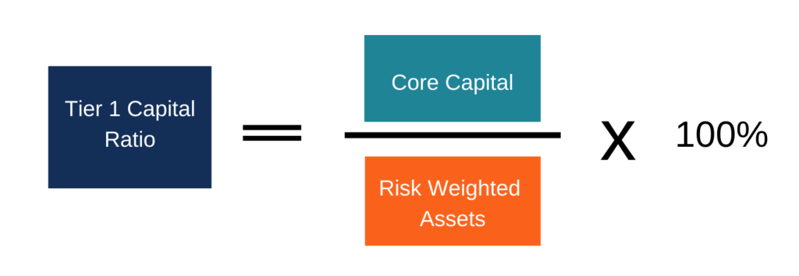

## Table of Contents

## What is Tier 1 Capital?

Tier 1 Capital is a key measure of a bank's financial strength. It includes the bank's core capital, which is made up of things like common stock and retained earnings. These are the most reliable and easily accessible funds that a bank has. Regulators look at Tier 1 Capital to see if a bank can handle financial stress and keep operating safely.

Tier 1 Capital is important because it shows how well a bank can absorb losses without failing. If a bank has a lot of Tier 1 Capital, it means it is in a good position to deal with tough times. This makes customers and investors feel more confident about the bank's stability. Regulators set rules about how much Tier 1 Capital a bank needs to have, to make sure the bank stays strong and safe.

## Why is the Tier 1 Capital Ratio important for banks?

The Tier 1 Capital Ratio is important for banks because it shows how strong and safe a bank is. It tells us if a bank has enough of its own money to cover losses if things go wrong. This ratio is calculated by dividing a bank's Tier 1 Capital by its total risk-weighted assets. A higher ratio means the bank is more likely to handle financial troubles without failing, which makes people trust the bank more.

Regulators use the Tier 1 Capital Ratio to make sure banks are safe and sound. They set minimum levels that banks must meet to keep operating. If a bank's ratio falls below these levels, it might need to get more capital or reduce its risky activities. This helps keep the whole financial system stable and protects customers' money.

## How is Tier 1 Capital different from Tier 2 Capital?

Tier 1 Capital and Tier 2 Capital are both important for banks, but they are different in what they include and how they help the bank. Tier 1 Capital is the bank's core capital. It includes things like common stock and retained earnings. These are the most reliable and easily accessible funds that a bank has. Tier 1 Capital is like the strong foundation of a bank, helping it stay stable even during tough times.

On the other hand, Tier 2 Capital is considered less reliable than Tier 1 Capital. It includes things like revaluation reserves, undisclosed reserves, and subordinated term debt. These are secondary sources of capital that can help a bank absorb losses, but they are not as strong as Tier 1 Capital. Tier 2 Capital acts more like a backup, providing extra support if the bank faces bigger problems than Tier 1 Capital can handle alone.

Regulators look at both Tier 1 and Tier 2 Capital to make sure banks are safe. But they focus more on Tier 1 Capital because it's the most important for keeping a bank strong. Banks need to have enough of both types of capital, but Tier 1 Capital is the key to showing how well a bank can handle financial stress.

## What are the components of Tier 1 Capital?

Tier 1 Capital is made up of the most important and reliable parts of a bank's money. The main part of Tier 1 Capital is common equity, which includes common stock that people buy and the money the bank keeps from its profits, called retained earnings. These are the strongest parts of a bank's money because they are easy to use and can help the bank stay strong even when things get tough.

Another part of Tier 1 Capital is additional paid-in capital, which is the extra money people pay when they buy the bank's stock. There are also some other things that can be included, like non-cumulative perpetual preferred stock, which is a special kind of stock that pays dividends but doesn't build up if the bank can't pay them. All these parts together make up Tier 1 Capital, which is very important for showing how strong and safe a bank is.

## What is the formula for calculating the Tier 1 Capital Ratio?

The Tier 1 Capital Ratio is a way to see how strong a bank is. You calculate it by dividing the bank's Tier 1 Capital by its total risk-weighted assets. Tier 1 Capital includes things like common stock and the money the bank keeps from its profits. Risk-weighted assets are the bank's loans and other investments, but they are adjusted to show how risky they are. A higher Tier 1 Capital Ratio means the bank has more of its own money to cover losses if things go wrong.

Regulators use the Tier 1 Capital Ratio to make sure banks are safe. They set a minimum level that banks must meet. If a bank's ratio is too low, it might need to get more capital or reduce its risky activities. This helps keep the whole financial system stable and protects customers' money. The Tier 1 Capital Ratio is important because it shows how well a bank can handle financial stress and keep operating safely.

## How does the Tier 1 Capital Ratio impact a bank's financial stability?

The Tier 1 Capital Ratio is very important for a bank's financial stability. It tells us how much of the bank's own money it has to cover losses if things go wrong. A higher Tier 1 Capital Ratio means the bank is stronger and can handle tough times better. This makes customers and investors feel more confident about the bank's safety. If the ratio is low, it might mean the bank is at risk and could face problems if it runs into financial trouble.

Regulators pay close attention to the Tier 1 Capital Ratio to make sure banks are safe. They set rules about how high the ratio needs to be. If a bank's ratio falls below these rules, it might need to get more money or cut back on risky activities. This helps keep the whole financial system stable and protects people's money. So, the Tier 1 Capital Ratio is a key way to check if a bank is strong enough to keep going even when things get hard.

## What is considered a good Tier 1 Capital Ratio?

A good Tier 1 Capital Ratio is usually around 10% or higher. This means the bank has enough of its own money to cover losses if things go wrong. Regulators often set a minimum level, like 6% or 8%, but banks that want to be seen as strong and safe usually aim for more than that. A higher ratio makes customers and investors feel more confident because it shows the bank can handle tough times.

Having a good Tier 1 Capital Ratio is important for a bank's stability. If a bank's ratio is too low, it might need to get more money or cut back on risky activities. This helps keep the whole financial system stable and protects people's money. So, a good Tier 1 Capital Ratio is a key sign that a bank is strong enough to keep going even when things get hard.

## How do regulatory requirements affect the Tier 1 Capital Ratio?

Regulatory requirements are rules that banks must follow to stay safe and stable. These rules set a minimum Tier 1 Capital Ratio that banks need to meet. This minimum level, often around 6% or 8%, makes sure banks have enough of their own money to handle losses if things go wrong. If a bank's Tier 1 Capital Ratio falls below this level, regulators might ask the bank to get more money or cut back on risky activities. This helps keep the whole financial system strong and protects people's money.

Banks that want to be seen as strong and safe often aim for a Tier 1 Capital Ratio higher than the minimum required by regulators. A higher ratio, like 10% or more, shows that the bank can handle tough times better. This makes customers and investors feel more confident about the bank's stability. So, regulatory requirements push banks to keep their Tier 1 Capital Ratio at a good level, which is important for the bank's and the financial system's health.

## Can you explain the Basel III requirements related to Tier 1 Capital?

Basel III is a set of rules made to make banks safer and stronger. One big part of these rules is about Tier 1 Capital, which is the most important money a bank has. Basel III says that banks need to have a certain amount of Tier 1 Capital to cover their risks. They set a minimum Tier 1 Capital Ratio of 6%, but they also want banks to have an extra cushion, called a capital conservation buffer, which adds another 2.5%. So, in total, banks should aim for a Tier 1 Capital Ratio of at least 8.5% to be safe.

These rules help make sure banks can handle tough times without failing. If a bank's Tier 1 Capital Ratio falls below the required level, it might need to get more money or cut back on risky activities. This keeps the whole financial system stable and protects people's money. Basel III also looks at other things, like how much of the bank's money comes from common stock, because that's the strongest kind of Tier 1 Capital. By following these rules, banks show they are strong and ready for any financial problems that might come up.

## How do banks manage and improve their Tier 1 Capital Ratio?

Banks manage and improve their Tier 1 Capital Ratio by making sure they have enough of their own money to cover losses if things go wrong. One way they do this is by raising more money from investors. They might sell more common stock, which is a strong part of Tier 1 Capital. Another way is by keeping more of their profits instead of paying them out as dividends. This money, called retained earnings, also adds to their Tier 1 Capital. Banks might also sell off some of their risky assets or stop making new risky loans to lower the amount of risk-weighted assets they have, which can help boost their Tier 1 Capital Ratio.

Sometimes, banks might need to cut back on certain activities that are too risky. By doing this, they can lower their risk-weighted assets and make their Tier 1 Capital Ratio higher. Regulators keep a close eye on these ratios, so banks often try to keep them higher than the minimum required. This shows that the bank is strong and can handle tough times, which makes customers and investors feel more confident. By carefully managing their money and risks, banks can keep their Tier 1 Capital Ratio at a good level and stay safe and stable.

## What are the common challenges banks face in maintaining a high Tier 1 Capital Ratio?

Banks face several challenges when trying to keep their Tier 1 Capital Ratio high. One big challenge is balancing the need for growth with the need for safety. Banks want to make more money by lending and investing, but these activities can be risky. If they take on too much risk, their risk-weighted assets go up, which can lower their Tier 1 Capital Ratio. Banks also have to deal with economic changes. If the economy is doing badly, they might see more losses, which can eat into their Tier 1 Capital and make it harder to keep the ratio high.

Another challenge is meeting regulatory requirements while still trying to please shareholders. Regulators want banks to have a high Tier 1 Capital Ratio to make sure they are safe, but shareholders often want the bank to use its money to pay dividends or buy back stock. This can make it hard for banks to keep enough money as Tier 1 Capital. Banks also have to think about how to raise more capital without scaring off investors. If they keep asking for more money, investors might worry that the bank is in trouble, which can make it even harder to maintain a high Tier 1 Capital Ratio.

## How does the Tier 1 Capital Ratio correlate with a bank's risk profile?

The Tier 1 Capital Ratio shows how much of a bank's own money it has to cover losses if things go wrong. A higher ratio means the bank has more money to handle risks, so it can take on more risky activities without getting into trouble. If a bank has a low Tier 1 Capital Ratio, it means it doesn't have much money to cover losses, so it needs to be careful and avoid taking on too much risk. This way, the Tier 1 Capital Ratio helps show how risky a bank's activities are.

Regulators look at the Tier 1 Capital Ratio to make sure banks are not taking on too much risk. If a bank's ratio is too low, regulators might ask it to get more money or cut back on risky activities. This helps keep the bank and the whole financial system safe. So, the Tier 1 Capital Ratio is a key way to see if a bank is managing its risks well and staying strong enough to handle any problems that might come up.

## What is Tier 1 Capital and Why is it Important?

Tier 1 Capital represents the foundational financial strength of a banking institution, consisting primarily of core equity capital such as common stock, disclosed reserves, and retained earnings. It functions as the primary bulwark against losses, serving to protect a bank's financial stability and health. The importance of Tier 1 Capital lies in its ability to absorb losses without requiring the bank to cease operations, thus ensuring continued confidence in the financial system.

The Tier 1 Capital Ratio is a critical metric in the banking sector, calculated as the ratio of Tier 1 Capital to the bank's total risk-weighted assets. This ratio is a cornerstone of the Basel III regulatory framework, established to compel banks to maintain adequate levels of high-quality capital and ensure resilience during periods of financial stress. The formula for the Tier 1 Capital Ratio is: 

$$
\text{Tier 1 Capital Ratio} = \left( \frac{\text{Tier 1 Capital}}{\text{Risk-weighted Assets}} \right) \times 100\%
$$

Adherence to Basel III standards necessitates that banks continually assess and adjust their capital holdings to meet or exceed the prescribed capital adequacy levels. A higher Tier 1 Capital Ratio is indicative of a bank's solid financial footing, reflecting its capability to not only support ongoing operations but also withstand unexpected financial shocks. This robust ratio signifies the bank's ability to manage risks effectively, displaying resilience in volatile market conditions.

The focus on Tier 1 Capital and its associated ratio underscores its significance in the regulatory landscape. By ensuring banks maintain a strong capital base, financial systems mitigate systemic risks, instill investor confidence, and enhance long-term sustainability. Thus, the Tier 1 Capital Ratio remains an indispensable tool in measuring and safeguarding the integrity of banking institutions worldwide.

## What are some case studies and examples?

ABC Bank serves as a prime illustration of robust financial health, with a Tier 1 Capital amounting to $5 million against $50 million in risk-weighted assets. This configuration results in a Tier 1 Capital Ratio of 10%, calculated as follows:

$$
\text{Tier 1 Capital Ratio} = \left( \frac{\text{Tier 1 Capital}}{\text{Risk-Weighted Assets}} \right) \times 100 = \left( \frac{5,000,000}{50,000,000} \right) \times 100 = 10\%\]

This considerable ratio underscores ABC Bank's capacity to support its operations and absorb potential financial losses, reflecting its prudent risk management and financial stability. Such robust metrics are instrumental when developing algorithmic trading strategies, as they signal a lower risk profile and a more dependable counterpart for trades.

In contrast, DEF Bank presents a more cautious scenario with a Tier 1 Capital Ratio of 4%. With similar calculations, if DEF Bank holds, for example, Tier 1 Capital of $2 million against $50 million in risk-weighted assets, the formula would be:

$$
\text{Tier 1 Capital Ratio} = \left( \frac{2,000,000}{50,000,000} \right) \times 100 = 4\%\]

This lower ratio indicates undercapitalization, highlighting higher susceptibility to economic fluctuations and potential fiscal strain. Such financial metrics are critical for algorithmic traders who must assess these figures to determine risk profiles accurately.

These examples emphasize the essential nature of scrutinizing Tier 1 Capital Ratios in crafting algorithmic trading strategies. Traders armed with this knowledge can navigate complex market dynamics more effectively, aligning investment decisions with the underlying financial health of banking institutions. Through the integration of these capital metrics, algorithmic models can be finely tuned to account for counterparty risk, ultimately fostering smarter, risk-adjusted trading.

## References & Further Reading

[1]: ["Basel III: International Regulatory Framework for Banks."](https://www.bis.org/bcbs/basel3.htm) Bank for International Settlements.

[2]: Hull, J. C. (2018). ["Risk Management and Financial Institutions."](https://books.google.com/books/about/Risk_Management_and_Financial_Institutio.html?id=1J1QDwAAQBAJ) Wiley Finance.

[3]: Lopez de Prado, M. (2018). ["Advances in Financial Machine Learning."](https://www.amazon.com/Advances-Financial-Machine-Learning-Marcos/dp/1119482089) Wiley.

[4]: Schumaker, R. P., Chen, H., & Zhang, M. (2010). ["Textual Analysis of Stock Market Prediction Using Breaking Financial News: The AZFinText System."](https://www.researchgate.net/profile/Rob-Schumaker/publication/220515646_Textual_analysis_of_stock_market_prediction_using_breaking_financial_news_The_AZFin_text_system/links/56d49bd208aefd177b0f5c73/Textual-analysis-of-stock-market-prediction-using-breaking-financial-news-The-AZFin-text-system.pdf) ACM Transactions on Information Systems.

[5]: Tuchman, M. (2021). ["Data-Driven Strategies with Python and Spark in the Algorithmic Trading World."](https://www.linkedin.com/in/dylan-tuchman-206572234) Apress.

[6]: European Banking Authority Report (2019). ["Report on Basel III Monitoring."](https://eba.europa.eu/publications-and-media/press-releases/eba-publishes-its-report-first-mandatory-exercise-basel-iii)

[7]: Chan, E. P. (2009). ["Quantitative Trading: How to Build Your Own Algorithmic Trading Business."](https://github.com/ftvision/quant_trading_echan_book) Wiley Trading.