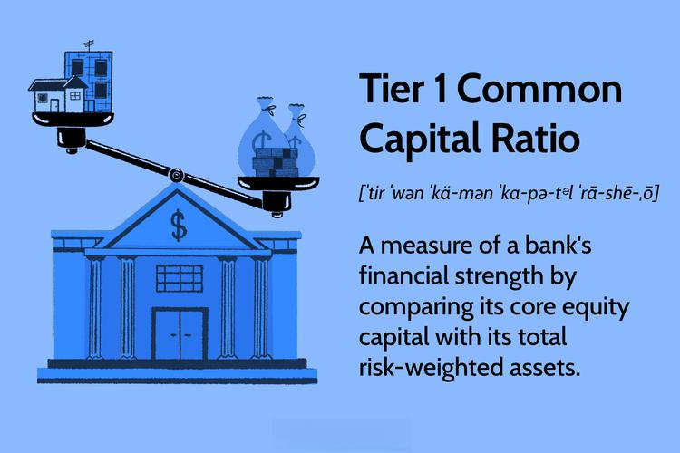

## Table of Contents

## What is the Tier 1 Common Capital Ratio?

The Tier 1 Common Capital Ratio is a measure used to assess a bank's financial strength. It shows how much of a bank's core capital, which includes common equity and retained earnings, is available to cover its risk-weighted assets. This ratio is important because it helps regulators and investors understand how well a bank can handle potential losses.

In simple terms, a higher Tier 1 Common Capital Ratio means a bank is in a better position to absorb losses and is considered more stable. Regulators often set minimum requirements for this ratio to ensure banks maintain enough capital to safeguard against financial difficulties. For example, after the 2008 financial crisis, stricter rules were put in place to make sure banks have enough Tier 1 capital to protect the financial system.

## Why is the Tier 1 Common Capital Ratio important for banks?

The Tier 1 Common Capital Ratio is really important for banks because it shows how strong and stable they are. It measures the amount of a bank's core capital, like common equity and retained earnings, compared to its risk-weighted assets. This ratio helps everyone, from regulators to investors, see if a bank has enough money to handle losses if things go wrong. If a bank has a high Tier 1 Common Capital Ratio, it means they're in a good spot to deal with financial troubles, making them safer and more reliable.

Regulators pay close attention to this ratio because they want to make sure banks are safe and can protect the financial system. After the big financial crisis in 2008, rules got stricter to make sure banks keep enough Tier 1 capital. This helps prevent banks from failing and causing bigger problems in the economy. So, the Tier 1 Common Capital Ratio isn't just a number; it's a key part of making sure banks are strong and can be trusted by customers and investors.

## How is the Tier 1 Common Capital Ratio calculated?

The Tier 1 Common Capital Ratio is calculated by dividing a bank's Tier 1 common capital by its total risk-weighted assets. Tier 1 common capital includes the bank's common equity and retained earnings, which are the most reliable forms of capital because they can absorb losses without the bank having to close down. Risk-weighted assets are the bank's loans and other assets, adjusted for how risky they are. A higher risk asset, like a loan to a risky borrower, will have a higher risk weight, meaning it requires more capital to back it up.

To find the ratio, you take the total Tier 1 common capital and divide it by the total risk-weighted assets. For example, if a bank has $10 billion in Tier 1 common capital and $100 billion in risk-weighted assets, the Tier 1 Common Capital Ratio would be 10% ($10 billion divided by $100 billion). This percentage shows how well the bank can handle potential losses. A higher ratio means the bank is stronger and more able to deal with financial troubles.

## What are the components of Tier 1 capital?

Tier 1 capital is the main measure of a bank's financial strength. It includes common equity, which is the money from the bank's shareholders, and retained earnings, which is the profit the bank has kept instead of paying out as dividends. These are the most important parts of Tier 1 capital because they are the most reliable and can absorb losses without the bank having to shut down.

Sometimes, other things can be included in Tier 1 capital too, like non-cumulative perpetual preferred stock. This is a type of stock that pays dividends, but if the bank can't pay them, it doesn't have to make up for it later. However, these other parts are less common and not as important as common equity and retained earnings. Together, all these parts make up Tier 1 capital, which helps show how strong and stable a bank is.

## What is the difference between Tier 1 and Tier 2 capital?

Tier 1 capital and Tier 2 capital are two types of capital that banks use to show how strong they are financially. Tier 1 capital is the most important because it includes the bank's core capital, like common equity and retained earnings. These are the most reliable forms of capital because they can absorb losses without the bank having to close down. Tier 1 capital helps show how well a bank can handle financial troubles on its own.

Tier 2 capital, on the other hand, is less important and includes things like subordinated debt and some types of preferred stock. These are less reliable because they can't absorb losses as well as Tier 1 capital. Tier 2 capital is more like a backup plan that helps support the bank but isn't as strong as Tier 1 capital. Together, Tier 1 and Tier 2 capital help regulators and investors understand a bank's overall financial health.

## What is considered a good Tier 1 Common Capital Ratio?

A good Tier 1 Common Capital Ratio is usually considered to be around 10% or higher. This means the bank has a strong amount of its own money to cover any losses it might face. Regulators often set a minimum requirement, like 6% or 8%, but banks that want to be seen as really safe and stable usually aim for a higher number. A higher ratio shows that the bank is in a good position to handle financial troubles and is less likely to need help from the government or other banks.

For example, after the big financial crisis in 2008, rules got stricter to make sure banks keep enough Tier 1 capital. Banks with a Tier 1 Common Capital Ratio of 12% or more are often seen as very strong and reliable. This higher ratio gives customers and investors more confidence that the bank can weather tough times and continue to operate safely. So, while the exact number can vary, a Tier 1 Common Capital Ratio of 10% or more is generally seen as a good sign of a bank's financial health.

## How does the Tier 1 Common Capital Ratio impact a bank's stability?

The Tier 1 Common Capital Ratio is a big deal for a bank's stability. It shows how much of the bank's own money, like what shareholders put in and the profits they keep, can be used to cover losses. If this ratio is high, it means the bank has a lot of this strong money to handle tough times. This makes the bank more stable and less likely to run into big problems. People like regulators and investors look at this ratio to see if the bank is safe and can be trusted.

A good Tier 1 Common Capital Ratio, like 10% or more, tells everyone that the bank is in a strong position. After the big financial crisis in 2008, rules got stricter to make sure banks have enough of this kind of money. Banks with a higher ratio, maybe 12% or more, are seen as very stable and reliable. This makes customers and investors feel more confident that the bank can handle any financial storms and keep going strong. So, this ratio is key to showing how stable a bank really is.

## How do regulatory requirements for Tier 1 Common Capital Ratio vary by country?

Regulatory requirements for the Tier 1 Common Capital Ratio can be different from one country to another. This is because each country's financial rules are set by its own regulators, who might have different ideas about how much money banks need to keep to be safe. For example, in the United States, the Federal Reserve might set a minimum Tier 1 Common Capital Ratio of around 6% or 8%. But in Europe, the European Central Bank might have different rules, maybe asking for a slightly higher or lower number. These differences come from how each country sees the risks in its own banking system and what they think is needed to keep banks strong.

Even though the numbers can vary, many countries follow guidelines set by international groups like the Basel Committee on Banking Supervision. This group suggests that banks should have a Tier 1 Common Capital Ratio of at least 6%, but some countries might want their banks to have even more to be extra safe. After the big financial crisis in 2008, many places got stricter about these rules to make sure banks are strong enough to handle problems. So, while the exact numbers might change from country to country, the goal is the same everywhere: to make sure banks have enough of their own money to stay stable and protect people's savings.

## What are the historical trends in Tier 1 Common Capital Ratios for major banks?

Over the years, the Tier 1 Common Capital Ratios of major banks have changed a lot. Before the big financial crisis in 2008, many banks had lower ratios because the rules weren't as strict. They thought they could take more risks without needing as much of their own money to back them up. But when the crisis hit, lots of banks got into trouble because they didn't have enough money to cover their losses. This showed everyone that banks needed to be stronger and have more of their own money to stay safe.

After the crisis, rules got much stricter all over the world. Regulators started asking banks to keep higher Tier 1 Common Capital Ratios, often around 10% or more, to make sure they could handle any future problems. Many big banks worked hard to increase their ratios by raising more money from shareholders or keeping more of their profits. Today, it's common to see major banks with Tier 1 Common Capital Ratios of 12% or even higher, which shows they're much stronger and more stable than they were before the crisis.

## How do changes in the Tier 1 Common Capital Ratio affect a bank's lending capacity?

When a bank's Tier 1 Common Capital Ratio goes up, it can mean the bank has more money of its own to cover losses. This can give the bank more room to lend money to people and businesses. If a bank knows it has a strong cushion of its own money, it might feel safer to give out more loans because it can handle any problems that come up. But there's a balance. If the bank keeps too much of its own money and doesn't lend enough, it might miss out on making money from loans.

On the other hand, if the Tier 1 Common Capital Ratio goes down, it can make the bank more careful about lending. A lower ratio means the bank has less of its own money to cover losses, so it might decide to give out fewer loans to stay safe. Regulators might also step in and tell the bank to hold back on lending until it gets its ratio back up. So, changes in the Tier 1 Common Capital Ratio can really affect how much a bank feels it can lend, trying to balance being safe with making money.

## What are the challenges banks face in maintaining a high Tier 1 Common Capital Ratio?

Keeping a high Tier 1 Common Capital Ratio can be tough for banks. They need to have a lot of their own money, like what shareholders put in and the profits they keep, to cover any losses. This means they might need to raise more money from investors, which can be hard if people don't want to invest in the bank. Or, they might have to keep more of their profits instead of paying them out as dividends, which can make shareholders unhappy because they want to see a return on their investment.

Another challenge is that banks need to balance having enough of their own money with making money from loans. If they keep too much money to boost their Tier 1 Common Capital Ratio, they might not lend as much, and that can hurt their profits. But if they lend too much and their ratio goes down, regulators might step in and tell them to cut back on lending until they get their ratio back up. So, banks have to find the right balance to keep their ratio high while still making money and keeping shareholders happy.

## How do stress tests influence the Tier 1 Common Capital Ratio requirements?

Stress tests are like big checks that regulators do to see how well banks can handle tough times. They pretend that bad things happen, like a big drop in the economy or a lot of people not paying back their loans, and see if the bank still has enough money to stay safe. If a bank doesn't do well in these tests, it might need to have a higher Tier 1 Common Capital Ratio. This means the bank has to keep more of its own money to be ready for any problems that might come up.

After the big financial crisis in 2008, stress tests became really important. Regulators started using them to make sure banks are strong enough to handle future troubles. If a bank's Tier 1 Common Capital Ratio drops too low during a stress test, it has to find ways to get it back up. This could mean raising more money from investors or keeping more profits instead of paying them out as dividends. So, stress tests help make sure banks have enough of their own money to stay stable, even when things get tough.

## What is the Understanding of Tier 1 Common Capital Ratio?

The Tier 1 Common Capital Ratio is a critical metric in evaluating a bank's financial soundness and stability. It forms a subset of the larger Tier 1 Capital framework, focusing specifically on evaluating a bank’s core equity capital compared to its total risk-weighted assets (RWA). The ratio primarily measures the financial strength and capital adequacy of a banking institution, providing insight into its ability to withstand financial stress and absorb potential losses.

**Definition and Components**

Tier 1 Common Capital includes common equity such as common shares, retained earnings, and other comprehensive income. It excludes preferred shares and other forms of hybrid securities included in general Tier 1 Capital. The emphasis is on tangible, high-quality capital that genuinely absorbs losses, thereby providing a robust buffer against potential financial downturns.

**Calculation of the Ratio**

The Tier 1 Common Capital Ratio is calculated using the following formula:

$$
\text{Tier 1 Common Capital Ratio} = \frac{\text{Tier 1 Common Capital}}{\text{Total Risk-Weighted Assets}}
$$

This calculation involves dividing the Tier 1 Common Equity by the bank’s Total Risk-Weighted Assets (RWA). RWAs are adjusted for credit risk, market risk, and operational risk, ensuring a comprehensive assessment of the risk profile of the bank's asset portfolio.

**Role in Assessing Financial Health**

This ratio is vital for understanding a bank's financial health as it highlights the proportion of a bank’s foundational capital relative to its risk exposure. Regulators and investors closely monitor this metric because it serves as an indicator of a bank's ability to endure operational and financial shocks. A higher ratio suggests a stronger capital position, providing confidence to stakeholders and reducing the likelihood of a bank requiring external support during economic downturns.

**Differences from Other Capital Ratios**

While closely related, the Tier 1 Common Capital Ratio is distinct from other ratios such as the overall Tier 1 Capital Ratio and the Total Capital Ratio. The Tier 1 Capital Ratio includes additional components like preferred stock and hybrid securities, presenting a broader view of a bank's capital base. In contrast, the Total Capital Ratio encompasses all forms of capital, including Tier 2 Capital, which further includes subordinated debt and other instruments. Thus, the Tier 1 Common Capital Ratio offers a more stringent look at a bank's most loss-absorbing capital elements.

**Examples and Key Takeaways**

For banking institutions, maintaining a healthy Tier 1 Common Capital Ratio is paramount. For instance, under Basel III regulations, banks are required to maintain a minimum Tier 1 Common Capital Ratio of 4.5%. Failure to meet this requirement can lead to regulatory interventions or restrictions on dividend distributions and share buybacks.

A practical example can be examined through the global financial crisis of 2007-2008, which emphasized the necessity for stronger capital buffers. Following the crisis, banks were mandated to enhance their Tier 1 Common Capital ratios to fortify against similar future vulnerabilities. This adjustment post-crisis signifies the critical insight gained; robust Tier 1 Common Capital ratios are essential for financial stability and confidence.

In conclusion, for banking institutions and regulators alike, the Tier 1 Common Capital Ratio is crucial in safeguarding financial stability by mandating adequate capital levels to support lending and absorb potential losses without jeopardizing the overall economic system.

## What is the interplay between Tier 1 Capital and Algo Trading?

Banks have increasingly turned to [algorithmic trading](/wiki/algorithmic-trading) as a tool to manage capital more efficiently. By leveraging the speed and precision of algorithmic systems, financial institutions can optimize their capital allocation and trading strategies, potentially enhancing their Tier 1 Capital positions. Algorithmic trading allows banks to execute large-scale transactions quickly and with minimal human intervention, reducing transaction costs and allowing for more precise market entry and [exit](/wiki/exit-strategy) points.

### Impact of Trading Algorithms on Tier 1 Capital Positions

Algorithmic trading strategies can significantly influence a bank's Tier 1 Capital position by affecting the risk-weighted assets (RWA) on which these capital ratios are often assessed. When algorithms are designed to manage and mitigate risk effectively, they can help in optimizing the RWA, thus potentially improving a bank’s capital ratios. The formula for the Tier 1 Capital Ratio is as follows:

$$
\text{Tier 1 Capital Ratio} = \frac{\text{Tier 1 Capital}}{\text{Risk-Weighted Assets}}
$$

By efficiently adjusting positions with minimal market impact, algorithms can aid in maintaining desirable RWA levels, thereby potentially enhancing the Tier 1 Capital Ratio.

### Regulatory Challenges

The integration of advanced algorithmic trading systems poses significant regulatory challenges. Regulators must balance the need for stringent capital requirements with the innovative approaches banks use to optimize their capital. Algorithms, particularly in high-frequency trading, introduce complexities regarding market behavior, potentially leading to issues such as flash crashes, market manipulation, and systemic risks. Therefore, ensuring that these algorithms adhere to regulatory standards without stifling innovation poses a considerable challenge.

Regulatory bodies have responded by establishing guidelines and frameworks that require transparency of these algorithms, audit trails, and stress testing to ensure that these trading techniques do not compromise financial stability. Compliance with such requirements necessitates banks to be diligent about back-testing their trading algorithms and ensuring that their systems are robust against market anomalies.

### Strategies for Balancing Risk and Profitability

To balance risk and profitability, banks employ various strategies via algorithmic trading:

1. **Diversification**: Algorithms are designed to execute diversified trading strategies across multiple asset classes and markets, reducing correlation risks.

2. **Dynamic Hedging**: Advanced models continuously assess market conditions and re-hedge positions to mitigate risks associated with market volatility.

3. **Predictive Analytics**: Leveraging machine learning and AI, algorithms can predict market movements and adjust strategies accordingly, aiming for optimal risk-adjusted returns.

4. **Stress Testing and Scenario Analysis**: Proactively scenario testing allows banks to understand how their algorithmic strategies may perform under different market conditions, aiding in risk management and capital planning.

Ultimately, the use of algorithmic trading in managing Tier 1 Capital resonates with both opportunities and challenges. By focusing on risk management and regulatory compliance, banks can strive to harness the benefits of technology while maintaining sound capital positions.

## References & Further Reading

1. Basel Committee on Banking Supervision. "Basel III: A global regulatory framework for more resilient banks and banking systems." Bank for International Settlements, December 2010. Available: [https://www.bis.org/publ/bcbs189.pdf](https://www.bis.org/publ/bcbs189.pdf)

2. Duffie, Darrell, and Kenneth J. Singleton. "Credit risk: pricing, measurement, and management." Princeton University Press, 2012.

3. Hull, John C. "Risk Management and Financial Institutions." John Wiley & Sons, 2018.

4. International Monetary Fund. "Global Financial Stability Report." Various issues. Available: [https://www.imf.org/en/Publications/GFSR](https://www.imf.org/en/Publications/GFSR)

5. Jorion, Philippe. "Value at Risk: The New Benchmark for Managing Financial Risk." McGraw-Hill, 2007.

6. Matthews, K., and J. Thompson. "The Economics of Banking." Wiley, 2014.

7. Molyneux, Philip, and John Thornton. "The determinants of European bank profitability: A note." Journal of Banking & Finance, 1992.

8. Securities and Exchange Commission. "Concept Release on Risk Management Controls for Brokers or Dealers with Market Access." Available: [https://www.sec.gov/rules/concept/2010/34-61358.pdf](https://www.sec.gov/rules/concept/2010/34-61358.pdf)

9. Zhang, Albert. "Algorithmic Trading: Winning Strategies and Their Rationale." Cambridge University Press, 2016.

10. Zohar, Avital. "Algorithmic and High-Frequency Trading." University of Chicago, Working Paper, 2014.

For readers seeking further exploration of banking regulations and algorithmic trading, consider visiting the following:

- The Basel Committee on Banking Supervision [homepage](https://www.bis.org/bcbs/)

- The International Organisation of Securities Commissions [website](https://www.iosco.org/)

- The Financial Stability Board [resources](https://www.fsb.org/publications/) on global financial regulations and practices. 

These references provide a solid foundation for understanding the complex dynamics between banking regulations, capital adequacy, and the technological advancements in algorithmic trading.

