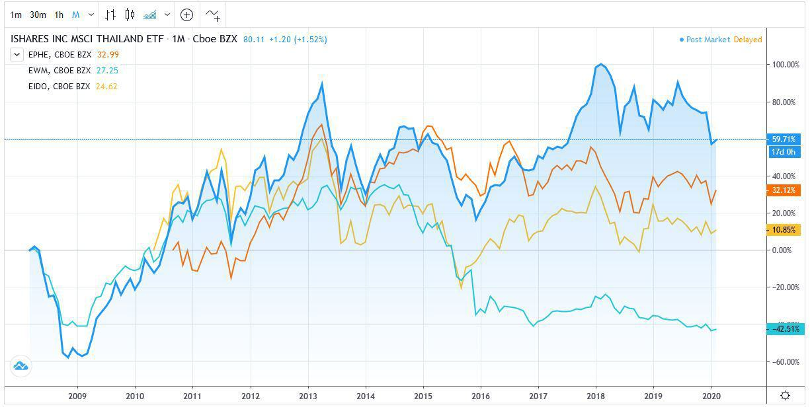

## Table of Contents

## What are Tiger Cub Economies?

Tiger Cub Economies are a group of countries in Southeast Asia that are growing fast, just like the Asian Tigers did before them. The Asian Tigers were Hong Kong, Singapore, South Korea, and Taiwan. They grew very quickly in the late 20th century. The Tiger Cub Economies include Indonesia, Malaysia, the Philippines, Thailand, and Vietnam. These countries are trying to grow their economies by making more things, selling more services, and getting more people to invest in their countries.

These countries are working hard to improve their economies. They are building better roads, schools, and hospitals. They are also trying to make it easier for businesses to start and grow. By doing these things, they hope to attract more foreign money and create more jobs for their people. If they keep working hard, these Tiger Cub Economies could become very strong and important in the world.

## Which countries are considered Tiger Cub Economies?

Tiger Cub Economies are countries in Southeast Asia that are growing quickly. They are trying to be like the Asian Tigers, which were Hong Kong, Singapore, South Korea, and Taiwan. The Tiger Cub Economies include Indonesia, Malaysia, the Philippines, Thailand, and Vietnam. These countries want to grow their economies by making more products, offering more services, and attracting more investment.

These countries are working hard to improve their economies. They are building better roads, schools, and hospitals. They are also making it easier for businesses to start and grow. By doing these things, they hope to bring in more foreign money and create more jobs for their people. If they keep working hard, these Tiger Cub Economies could become very strong and important in the world.

## How did the term 'Tiger Cub Economies' originate?

The term 'Tiger Cub Economies' comes from the idea of young tigers growing up to be strong, just like their parents. The 'parents' in this case are the Asian Tigers, which were Hong Kong, Singapore, South Korea, and Taiwan. These countries grew very fast in the late 20th century and became very important in the world economy. People started calling the fast-growing countries in Southeast Asia 'Tiger Cubs' because they were trying to do the same thing as the Asian Tigers.

The Tiger Cub Economies include Indonesia, Malaysia, the Philippines, Thailand, and Vietnam. These countries are working hard to grow their economies by making more things, selling more services, and getting more people to invest in their countries. They are building better roads, schools, and hospitals, and making it easier for businesses to start and grow. By doing these things, they hope to become strong and important in the world, just like the Asian Tigers before them.

## What are the main economic characteristics of Tiger Cub Economies?

Tiger Cub Economies are known for growing quickly. They are trying to be like the Asian Tigers, which were Hong Kong, Singapore, South Korea, and Taiwan. These countries are working hard to make more things, sell more services, and get more people to invest in their countries. They are building better roads, schools, and hospitals. They are also making it easier for businesses to start and grow. By doing these things, they hope to bring in more foreign money and create more jobs for their people.

The main economic characteristics of Tiger Cub Economies include a focus on manufacturing and services. They are trying to make more products and offer more services to other countries. They also want to attract more foreign investment, which means getting people from other countries to put money into their businesses. To do this, they are improving their infrastructure, which means building better roads, schools, and hospitals. They are also making it easier for businesses to start and grow by reducing red tape and offering incentives. If they keep working hard, these Tiger Cub Economies could become very strong and important in the world.

## How do Tiger Cub Economies differ from the original Asian Tigers?

Tiger Cub Economies are different from the original Asian Tigers because they are newer and are still trying to grow as fast as the Asian Tigers did. The Asian Tigers, which were Hong Kong, Singapore, South Korea, and Taiwan, grew very quickly in the late 20th century. They became very important in the world economy by making a lot of things and selling a lot of services. The Tiger Cub Economies, which include Indonesia, Malaysia, the Philippines, Thailand, and Vietnam, are trying to do the same thing but they are not as far along yet.

Another difference is that the Asian Tigers had a head start. They started growing fast earlier than the Tiger Cub Economies. The Asian Tigers also had different ways of growing their economies. For example, Singapore focused a lot on being a financial center, while South Korea became known for making cars and electronics. The Tiger Cub Economies are still figuring out what they are best at. They are working on building better roads, schools, and hospitals, and making it easier for businesses to start and grow. They hope to catch up to the Asian Tigers and become strong and important in the world economy too.

## What are the key factors driving the growth of Tiger Cub Economies?

The key factors driving the growth of Tiger Cub Economies are their focus on making more things and selling more services. These countries, which include Indonesia, Malaysia, the Philippines, Thailand, and Vietnam, are working hard to build better roads, schools, and hospitals. This helps attract more foreign money and create more jobs for their people. They are also trying to make it easier for businesses to start and grow by reducing red tape and offering incentives. By doing these things, they hope to become strong and important in the world economy.

Another important [factor](/wiki/factor-investing) is the young population in these countries. Many people in the Tiger Cub Economies are young and ready to work. This means there is a big workforce that can help the economy grow. The governments in these countries are also working to improve education and skills training so that their people can get better jobs. If they keep working hard, these Tiger Cub Economies could catch up to the Asian Tigers and become very important in the world.

## What role do government policies play in the development of Tiger Cub Economies?

Government policies are very important for the growth of Tiger Cub Economies. These countries, which include Indonesia, Malaysia, the Philippines, Thailand, and Vietnam, use policies to help their economies grow. They make rules that make it easier for businesses to start and grow. For example, they might reduce red tape, which means making it easier to get permits and licenses. They also offer incentives, like tax breaks, to attract foreign money. By doing these things, the governments help create more jobs and bring in more investment.

Another way government policies help is by improving infrastructure. This means building better roads, schools, and hospitals. Good infrastructure makes it easier for businesses to operate and for people to get to work. It also makes the country more attractive to foreign investors. Governments in Tiger Cub Economies also focus on education and skills training. They want to make sure their people have the skills they need to get good jobs. By working on these things, the governments of Tiger Cub Economies are helping their countries grow and become strong in the world economy.

## How have Tiger Cub Economies impacted global trade and investment?

Tiger Cub Economies have made a big difference in global trade and investment. These countries, like Indonesia, Malaysia, the Philippines, Thailand, and Vietnam, are making more things and selling more services to other countries. This means they are trading more with the rest of the world. They are also attracting more foreign money because people from other countries want to invest in their growing economies. This helps the world economy grow because more countries are buying and selling things.

The growth of Tiger Cub Economies has also changed where global trade and investment happen. More and more, businesses are looking to these countries for new opportunities. They see that these countries are working hard to build better roads, schools, and hospitals, and to make it easier for businesses to start and grow. This makes the Tiger Cub Economies more attractive to foreign investors. As these countries keep growing, they will play an even bigger role in global trade and investment.

## What challenges do Tiger Cub Economies face in sustaining their growth?

Tiger Cub Economies face many challenges in keeping their growth going. One big challenge is making sure their economies stay strong even when the world economy changes. Sometimes, things like a global financial crisis or a big drop in prices for things they sell can hurt their growth. They also need to make sure they don't grow too fast and create problems like too much debt or too many empty buildings. It's like trying to keep a bike going at a good speed without going too fast or too slow.

Another challenge is making sure everyone in the country benefits from the growth. Sometimes, the rich get richer while the poor stay poor. This can cause problems like people being unhappy or even protesting. Tiger Cub Economies also need to keep improving their schools and hospitals so that their people can get better jobs and live healthier lives. If they can solve these challenges, they will have a better chance of keeping their growth going and becoming strong and important in the world.

## How do Tiger Cub Economies manage economic risks and fluctuations?

Tiger Cub Economies try to manage economic risks and fluctuations by being careful and planning ahead. They know that things like a global financial crisis or a big drop in prices for things they sell can hurt their growth. So, they work on having strong banks and good rules to make sure their economies don't get too hurt by these problems. They also try to save money and not borrow too much, so they can handle tough times better. It's like having a safety net to catch them if they fall.

Another way Tiger Cub Economies manage risks is by not relying too much on just one thing. They try to make different kinds of products and sell different kinds of services. This way, if one thing doesn't do well, they can still make money from other things. They also work with other countries to trade and invest, which helps them stay strong even when their own economy has problems. By doing these things, Tiger Cub Economies can keep growing and handle the ups and downs of the world economy.

## What are the future prospects for Tiger Cub Economies in the global economic landscape?

The future looks bright for Tiger Cub Economies in the global economic landscape. These countries, like Indonesia, Malaysia, the Philippines, Thailand, and Vietnam, are working hard to grow their economies. They are making more things and selling more services to other countries. This means they are becoming more important in global trade. They are also attracting more foreign money because people from other countries want to invest in their growing economies. As they keep building better roads, schools, and hospitals, and making it easier for businesses to start and grow, they will likely become even stronger in the world economy.

However, there are challenges that Tiger Cub Economies need to overcome to keep growing. They need to make sure their economies stay strong even when the world economy changes. They also need to make sure everyone in the country benefits from the growth, not just the rich. By solving these problems and continuing to improve their infrastructure and education, Tiger Cub Economies have a good chance of becoming very important players in the global economic landscape. If they can manage these challenges well, their future looks very promising.

## How can international businesses leverage opportunities in Tiger Cub Economies?

International businesses can find many good opportunities in Tiger Cub Economies. These countries, like Indonesia, Malaysia, the Philippines, Thailand, and Vietnam, are growing fast. They are making more things and selling more services, which means there are lots of chances for businesses to sell their products or services there. These countries are also working hard to build better roads, schools, and hospitals, which makes it easier for businesses to operate. By investing in these countries, international businesses can reach new customers and grow their companies.

To take advantage of these opportunities, international businesses need to understand the local markets. They should learn about what people in these countries like to buy and how they like to buy it. It's also important to work with local partners who know the area well. These partners can help businesses navigate the rules and customs of the country. By doing these things, international businesses can make the most of the growing economies in Tiger Cub countries and build strong, successful businesses there.

## References & Further Reading

[1]: Bergstra, J., Bardenet, R., Bengio, Y., & Kégl, B. (2011). ["Algorithms for Hyper-Parameter Optimization."](https://dl.acm.org/doi/10.5555/2986459.2986743) Advances in Neural Information Processing Systems 24.

[2]: ["Advances in Financial Machine Learning"](https://www.amazon.com/Advances-Financial-Machine-Learning-Marcos/dp/1119482089) by Marcos Lopez de Prado

[3]: ["Evidence-Based Technical Analysis: Applying the Scientific Method and Statistical Inference to Trading Signals"](https://www.amazon.com/Evidence-Based-Technical-Analysis-Scientific-Statistical/dp/0470008741) by David Aronson

[4]: ["Machine Learning for Algorithmic Trading"](https://github.com/stefan-jansen/machine-learning-for-trading) by Stefan Jansen

[5]: ["Quantitative Trading: How to Build Your Own Algorithmic Trading Business"](https://www.amazon.com/Quantitative-Trading-Build-Algorithmic-Business/dp/1119800064) by Ernest P. Chan