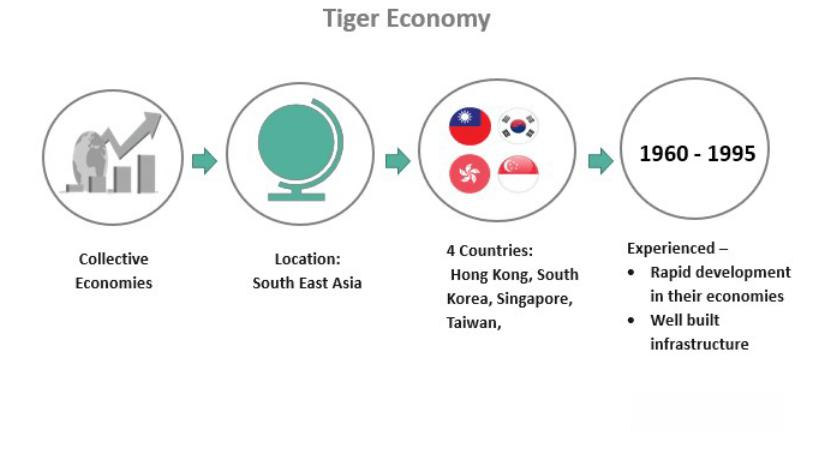

The concept of tiger economies has gained widespread recognition, encapsulating nations that have undergone rapid economic growth and development due to strategic governmental policies, foreign investment, and export-driven strategies. Typically located in Southeast Asia, some of the most prominent examples include Singapore, Hong Kong, South Korea, and Taiwan. These economies have distinguished themselves by transitioning from agrarian bases to dynamic industrial powerhouses, leveraging their strategic geographic locations, skilled labor forces, and favorable business environments to boost economic performance.

Southeast Asia's tiger economies exemplify a model of economic transformation that has raised living standards and drastically improved infrastructure. Characterized by substantial GDP growth rates, these nations have been at the forefront of global economic change. Their export-driven growth strategies have focused on manufacturing and technology sectors, leading to significant contributions to the global supply chain. Singapore, Hong Kong, South Korea, and Taiwan have not only fortified their economic standing but also emerged as critical financial and technological hubs in the region.

This article examines the dynamics shaping the tiger economies, investigating their impressive growth trajectories, inherent challenges, and particularly the role of algorithmic trading within their financial markets. As these economies continue to innovate and modernize, algorithmic trading offers significant opportunities for enhancing financial market efficiency and liquidity. By exploring these aspects, we aim to provide insights into how these economies are setting examples for growth and adaptation in the modern economic landscape, serving as benchmarks for emerging markets worldwide.

## Table of Contents

## Understanding Tiger Economies

Tiger economies are distinguished by their rapid industrialization and robust economic growth, characteristics that have transformed them into powerful economic entities. The hallmark of these economies lies in their ability to attract significant foreign investment, which acts as a catalyst for infrastructure development and the diversification of industries. This investment influx not only spurs the development of infrastructure such as roads, ports, and communication systems but also fosters industrial diversification by encouraging new industries to emerge and expand.

The term "tiger economies" initially referred to the "Four Asian Tigers": Hong Kong, Singapore, South Korea, and Taiwan. These nations showcased remarkable growth rates and rapid industrialization from the 1960s onward, setting a benchmark for economic success. The success of these original tiger economies has inspired other nations in Southeast Asia, such as Indonesia, Malaysia, Thailand, Vietnam, and the Philippines, to pursue similar paths of development. These emerging economies are often referred to as "Tiger Cubs," indicating that they are following in the footsteps of the original tigers.

Despite their impressive growth, tiger economies are not without vulnerabilities. Economic crises, such as the Asian Financial Crisis of the late 1990s, exposed significant weaknesses in these economies, such as over-dependence on exports and high levels of foreign debt. However, their ability to bounce back from such setbacks demonstrates their resilience. These economies have consistently shown a capacity for recovery and sustained growth by implementing economic reforms, enhancing regulatory frameworks, and embracing technological advancements to stabilize and grow their markets.

## Examples of Tiger Economies

Singapore and Hong Kong have long been recognized as prime examples of tiger economies, owing to their transformation into major financial hubs with extensive trading markets. Singapore, for instance, has become a pivotal center for finance and shipping, underpinned by its strategic location and robust regulatory framework. Known for its high-quality infrastructure and business-friendly environment, Singapore consistently attracts significant foreign investment, which has been a driving force for its economic prosperity.[^1]

Hong Kong shares similar accolades as a financial nexus, leveraging its free-market economy and legal transparency. Its proximity to China provides a vital link between Western and Asian markets. Hong Kong's stock market is one of the largest globally, acting as a critical channel for capital flows in and out of the region.[^2]

South Korea exemplifies a tiger economy with its heavy reliance on exports, particularly in robotics and electronics. Samsung and LG are notable conglomerates that have propelled South Korea to the forefront of technological innovation, making it a leader in these sectors.[^3] This export-driven economic model has been pivotal in positioning South Korea as a key player on the world stage.

Taiwan plays an indispensable role in the global technology supply chain. It is renowned for producing semiconductors, which are essential components in various electronic devices. Companies like Taiwan Semiconductor Manufacturing Company (TSMC) have fortified Taiwan's status as a crucial exporter of tech components, influencing the global supply chain significantly.[^4]

Beyond the original Asian Tigers, several Southeast Asian nations have emerged as potential future leaders, often referred to as the 'Tiger Cub Economies.' These include Indonesia, Malaysia, Thailand, Vietnam, and the Philippines. Each of these countries has demonstrated rapid economic growth by embracing industrialization and expanding their export sectors. For instance, Vietnam has seen notable growth in manufacturing, particularly in electronics and textiles, making it one of the fastest-growing economies in the region.[^5]

Indonesia and Malaysia leverage their abundant natural resources to fuel economic growth, while Thailand's diverse industrial base and strategic location have made it a significant manufacturing and automotive hub. The Philippines benefits from a large and young workforce, which supports the growth of its burgeoning services and manufacturing industries. Collectively, these Tiger Cub Economies contribute to the dynamic economic landscape of Southeast Asia, showcasing diverse paths to economic success and modernization.

[^1]: Department of Statistics Singapore. "Singapore Economy." Accessed October 20, 2023.
[^2]: Hong Kong Trade Development Council. "Hong Kong Economy." Accessed October 20, 2023.
[^3]: Korean Statistical Information Service. "Industry Segments." Accessed October 20, 2023.
[^4]: Taiwan Semiconductor Manufacturing Company Limited. "Corporate Overview." Accessed October 20, 2023.
[^5]: World Bank. "Vietnam's Economic Update." Accessed October 20, 2023.

## Economic Growth and Challenges

Tiger economies, renowned for their rapid GDP growth, are not without their challenges. One significant issue is wealth inequality, which has often emerged as a byproduct of swift economic expansion. The focus on urban industries and technology sectors tends to accentuate income disparities between urban and rural areas, and among different socioeconomic groups. Efforts to address wealth inequality are being made, but they remain a formidable challenge.

Over-reliance on exports is another critical challenge facing tiger economies. These economies have traditionally depended heavily on external markets for their products, which exposes them to global economic fluctuations. Diversification of economic activities is seen as necessary to reduce such vulnerabilities and foster more sustainable growth patterns.

The Asian Financial Crisis of 1997-1998 was a pivotal event that underscored the vulnerabilities of overly export-dependent economies. It prompted these economies to undergo significant economic reforms and pursue diversification strategies. By focusing on building robust financial systems, enhancing regulatory frameworks, and developing local markets, these countries sought to augment their economic resilience.

Trade policies and government interventions have been instrumental in sustaining growth in tiger economies. By implementing favorable trade agreements and providing incentives for foreign direct investment (FDI), governments have managed to attract and retain substantial international investments. Such policies have facilitated industrial diversification and the development of infrastructure, further promoting economic stability.

Thus, while growth and challenges coexist in tiger economies, strategic reforms and policies continue to play a crucial role in shaping their economic trajectory.

## Algorithmic Trading in Tiger Economies

Algorithmic trading has seen significant growth in tiger economies, powered by advancements in technology and the modernization of financial markets. This trading method leverages computer algorithms to execute trades at speeds and efficiencies far beyond human capabilities. As these economies have evolved, the adoption of [algorithmic trading](/wiki/algorithmic-trading) has introduced notable changes in market dynamics, enhancing both trading efficiency and [liquidity](/wiki/liquidity-risk-premium).

One of the primary benefits of algorithmic trading in these export-driven economies is its ability to process vast amounts of data rapidly. Algorithms can analyze multiple market variables simultaneously, making quick decisions to buy or sell assets. This capability not only speeds up trading processes but also minimizes human error, which can be costly in fast-paced financial environments. For example, in the technology-driven markets of South Korea and Singapore, algorithmic trading has aligned well with their tech-savvy infrastructures, allowing for seamless integration and operation within their stock exchanges.

Increased market liquidity is another crucial advantage of algorithmic trading. By enabling high-frequency trades, algorithms contribute to a more fluid market environment where assets can be bought and sold more readily. This liquidity is essential for export-led economies as it helps stabilize markets, ensuring that substantial capital flows continue to support economic activities. Enhanced liquidity also attracts further investments from global investors, who seek vibrant and accessible markets for their portfolios.

However, the proliferation of algorithmic trading has also prompted regulatory bodies within tiger economies to enhance oversight and risk management frameworks. The rapid pace of algorithmic trades can lead to unintended market consequences, such as flash crashes, where the market experiences a rapid decline and recovery within a short period. To mitigate such risks, regulatory institutions have implemented various measures. For instance, circuit breakers, which temporarily halt trading during significant market disturbances, have been adopted to prevent extreme [volatility](/wiki/volatility-trading-strategies).

Moreover, regulators in these economies are focusing on scrutinizing algorithmic trading practices to ensure market integrity. This involves monitoring trading algorithms for compliance and transparency, requiring firms to submit their algorithms for review. Additionally, there is an emphasis on promoting a fair trading environment, where smaller investors are not disadvantaged by high-frequency trading practices.

In summary, algorithmic trading exemplifies the ongoing technological evolution in tiger economies. While it offers significant benefits by enhancing trading efficiency and liquidity, it also necessitates robust regulatory frameworks to safeguard market stability and integrity. As these economies continue to grow, the careful integration of algorithmic trading will play a pivotal role in sustaining their financial markets and supporting their economic trajectories.

## Conclusion

Tiger economies exemplify a transformative model of economic growth achieved through strategic industrialization and modernization. These economies have transitioned from largely agrarian bases to becoming industrial powerhouses with prominent global influence. By effectively leveraging foreign investments, these nations have established themselves as critical players in the global market. Their adaptability to technological advancements, including areas such as algorithmic trading, underscores their forward-thinking approach to economic development.

The integration of technological innovations has been crucial in sustaining the competitive edge of tiger economies. Algorithmic trading, for instance, has revolutionized financial markets by enhancing trading efficiency and increasing liquidity. This technological integration not only improves market operations but also attracts further foreign investments, creating a virtuous cycle of growth and modernization.

Despite facing challenges such as economic inequalities and a heavy reliance on certain sectors, tiger economies continue to demonstrate resilience and adaptability. The development and regulatory oversight of algorithmic trading, for example, illustrate their capacity to address and manage risks associated with new financial technologies. These steps are essential to mitigate potential instabilities and to safeguard ongoing growth.

In summary, tiger economies provide a compelling blueprint for how emerging markets can achieve significant economic progression. Through strategic industrial development, effective utilization of foreign investments, and the adoption of cutting-edge technologies, these economies show how countries can elevate their status in the global economic landscape. Their trajectory suggests promising prospects for sustainable growth and positions them as influential models for other aspiring economies worldwide.

## References & Further Reading

[1]: Steger, Manfred B. (2017). ["Globalization: A Very Short Introduction."](https://academic.oup.com/book/28418) Oxford University Press.

[2]: Castells, Manuel. (2010). ["The Rise of the Network Society: The Information Age: Economy, Society, and Culture Vol. I."](https://onlinelibrary.wiley.com/doi/book/10.1002/9781444319514) John Wiley & Sons.

[3]: Kim, Kwang-Yeon, and Jung-Ho Pak. (2018). ["The Asian Financial Crisis: Lessons Learned and Unlearned."](https://www.jstor.org/stable/25773622) International Economic Journal.

[4]: Krugman, Paul. (2013). ["The Return of Depression Economics and the Crisis of 2008."](https://www.amazon.com/Return-Depression-Economics-Crisis-2008/dp/0393337804) W.W. Norton & Company.

[5]: Lewis, Michael. (2014). ["Flash Boys: A Wall Street Revolt."](https://en.wikipedia.org/wiki/Flash_Boys) W.W. Norton & Company.