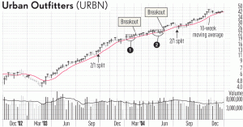

## Table of Contents

## What is a tight market in stock trading?

A tight market in stock trading means that there isn't a big difference between the price someone is willing to buy a stock for and the price someone is willing to sell it for. This happens when there are about the same number of people wanting to buy and sell the stock. Because of this, the price of the stock doesn't change much, and it can be hard to make a lot of money quickly from trading it.

When the market is tight, it can be harder to trade stocks because there might not be enough buyers or sellers at the moment you want to trade. This can make it take longer to buy or sell your stocks. Traders need to be patient and might need to wait for the right moment to make their trades. A tight market can be good for long-term investors who like stability, but it can be challenging for those who want to make quick profits.

## How can a tight market affect stock prices?

In a tight market, the price of a stock doesn't change much. This happens because there are about the same number of people wanting to buy the stock as there are people wanting to sell it. When this balance exists, the price stays pretty steady because there's not a lot of pressure to push it up or down. For example, if someone wants to sell their stock, they usually find a buyer quickly at a similar price, so the stock price doesn't drop much.

This stability can be good for people who want to hold onto their stocks for a long time. They like knowing that the price won't suddenly go up and down a lot. But for people who want to make quick money by buying and selling stocks fast, a tight market can be tough. They might have to wait longer to find the right time to trade, and they might not make as much money as they hoped because the price changes are small.

## What are the signs of a tight market?

You can tell a market is tight when the difference between the price people want to buy a stock for and the price people want to sell it for is very small. This is called a narrow bid-ask spread. When this happens, it means that the number of people wanting to buy and the number of people wanting to sell are pretty much the same. So, the price of the stock doesn't move up or down a lot.

Another sign of a tight market is that the stock price doesn't change much over time. If you look at a chart of the stock's price and see that it stays pretty flat without big ups and downs, that's a good clue. This happens because there isn't a lot of buying or selling pressure pushing the price around. It can make it hard for traders who want to make quick profits, but it's good for people who want to keep their money safe and steady.

## How does a tight market impact trading volume?

In a tight market, the trading [volume](/wiki/volume-trading-strategy) can be lower than usual. This happens because there isn't a big difference between the price people want to buy a stock for and the price people want to sell it for. When the prices are close together, fewer people feel the need to trade quickly. They might wait for a better time to buy or sell, which means fewer trades happen overall.

Even though the trading volume might be lower, the trades that do happen are usually done quickly. This is because when someone wants to sell their stock, they can usually find a buyer at a similar price right away. So, while there might not be a lot of trading going on, the trades that do happen are smooth and fast. This can make the market feel stable, but it can also make it harder for traders who want to make quick profits.

## What strategies can traders use in a tight market?

In a tight market, traders can use a strategy called "range trading." This means they buy a stock when its price is low and sell it when the price goes up a bit. Because the price doesn't change a lot in a tight market, traders can make small profits by doing this over and over. They need to be patient and watch the stock's price carefully to find the best times to buy and sell.

Another strategy is to use "limit orders." This means setting a specific price at which you want to buy or sell a stock. In a tight market, where the price doesn't move much, using limit orders can help traders get the price they want. It's a good way to make sure you don't pay too much when buying or sell for too little when selling.

Traders can also focus on "diversification." This means spreading their money across different stocks or even different types of investments. In a tight market, one stock might not move much, but another might. By having a mix, traders can still find opportunities to make money even when the market is tight. It's a way to reduce risk and keep some chances of making profits.

## How can investors protect their portfolios during a tight market?

In a tight market, investors can protect their portfolios by focusing on diversification. This means spreading their money across different types of investments, like stocks, bonds, and maybe even real estate. When the stock market is tight and prices don't move much, having a mix of investments can help. If one type of investment isn't doing well, another might be doing better. This way, investors can still make some money and keep their portfolio safe.

Another way to protect a portfolio during a tight market is by using a strategy called dollar-cost averaging. This means investing a fixed amount of money at regular times, no matter what the market is doing. By doing this, investors can buy more shares when prices are low and fewer when prices are high. Over time, this can help smooth out the ups and downs of the market and protect their investments. It's a simple but effective way to keep a portfolio stable in a tight market.

## What role do market makers play in a tight market?

Market makers are important in a tight market because they help keep things running smoothly. They do this by always being ready to buy or sell stocks at certain prices. In a tight market, where there isn't a big difference between buying and selling prices, market makers make sure there are always people to trade with. This helps keep the market stable and makes it easier for other people to buy and sell stocks without waiting too long.

Even though trading volume might be lower in a tight market, market makers still play a big role. They help keep the prices from moving too much by stepping in when there aren't enough buyers or sellers. This can make the market feel more stable, which is good for people who want to keep their investments safe. Market makers help make sure that even in a tight market, people can still trade their stocks without big problems.

## How do tight markets influence market liquidity?

In a tight market, there isn't a big difference between the price people want to buy a stock for and the price people want to sell it for. This means the market can be less liquid because fewer people might want to trade. When the prices are close together, people might not feel the need to buy or sell right away. They might wait for a better time, which can make it harder to find someone to trade with quickly.

Even though a tight market can make it harder to trade quickly, market makers help keep things moving. They are always ready to buy or sell stocks at certain prices, which helps keep some level of [liquidity](/wiki/liquidity-risk-premium) in the market. So, while a tight market might make trading a bit slower, market makers make sure there are still people to trade with, which helps keep the market stable and somewhat liquid.

## What historical examples illustrate the effects of a tight market?

One historical example of a tight market was in the late 1990s during the dot-com bubble. Many tech stocks had very stable prices because everyone wanted to buy and sell them at about the same price. This made the market tight, and it was hard for traders to make quick profits. The tight market made it seem like the prices were stable, but it also meant that when the bubble burst, the fall was even harder because so many people were caught off guard by the sudden change.

Another example happened during the financial crisis of 2008. Before the crisis hit, the market for mortgage-backed securities was very tight. These securities were bought and sold at prices that didn't change much because everyone thought they were safe. But when people realized these securities were riskier than they thought, the tight market turned into a big problem. The sudden drop in prices showed how a tight market can hide big risks and make the fall even worse when things go wrong.

## How do regulatory bodies respond to tight market conditions?

Regulatory bodies keep a close eye on the market to make sure it's working fairly and smoothly. When they see a tight market, they might step in to make sure there's enough trading going on. They do this by watching the prices and making sure there are enough buyers and sellers. If they see that the market is too tight and it's hard for people to trade, they might change some rules to help. For example, they might make it easier for market makers to do their job, so there are always people ready to buy and sell stocks.

Sometimes, regulatory bodies also look at how tight markets can affect the whole economy. If a tight market is making it hard for businesses to get the money they need, the regulators might take action to help. They could change rules about how much money banks need to keep on hand or how much they can lend. By doing this, they try to make sure that even in a tight market, the economy keeps running smoothly and people can still invest and trade without too many problems.

## What advanced indicators should expert traders monitor in a tight market?

In a tight market, expert traders should keep an eye on the bid-ask spread. This is the difference between the highest price someone is willing to pay for a stock and the lowest price someone is willing to sell it for. When the market is tight, this spread is usually small. By watching it closely, traders can see if the market is getting tighter or starting to loosen up. If the spread starts to grow, it might mean more people are trying to buy or sell, which could lead to bigger price changes.

Another important thing to watch is the volume profile. This shows how many shares of a stock are traded at different price levels over time. In a tight market, the volume might be low and concentrated around a small range of prices. By looking at the volume profile, traders can see if there are any big changes in trading activity. If they see more volume starting to move outside the usual range, it could be a sign that the market is about to change, and they might need to adjust their trading strategies.

## How can algorithmic trading be adapted for tight market conditions?

In a tight market, where the price of stocks doesn't change much, [algorithmic trading](/wiki/algorithmic-trading) needs to be smart and patient. Traders can use algorithms that focus on small price movements. These algorithms can be set up to buy a stock when its price is a little low and sell it when the price goes up just a bit. This is called range trading. The algorithms need to be good at spotting these small changes and making trades quickly. They also need to be patient and wait for the right moments to trade, because in a tight market, there might not be many chances to make big profits.

Another way to adapt algorithmic trading for a tight market is by using algorithms that can handle a lot of different stocks or other types of investments. This is called diversification. By spreading their money across many stocks, the algorithms can find more chances to make money, even if one stock isn't moving much. These algorithms need to be able to look at a lot of data and make smart decisions about when to buy and sell different stocks. This can help traders make some money even when the market is tight and prices don't change a lot.

## References & Further Reading

[1]: Bergstra, J., Bardenet, R., Bengio, Y., & Kégl, B. (2011). ["Algorithms for Hyper-Parameter Optimization."](https://dl.acm.org/doi/10.5555/2986459.2986743) Advances in Neural Information Processing Systems 24.

[2]: ["Advances in Financial Machine Learning"](https://www.amazon.com/Advances-Financial-Machine-Learning-Marcos/dp/1119482089) by Marcos Lopez de Prado

[3]: ["Evidence-Based Technical Analysis: Applying the Scientific Method and Statistical Inference to Trading Signals"](https://www.amazon.com/Evidence-Based-Technical-Analysis-Scientific-Statistical/dp/0470008741) by David Aronson

[4]: ["Machine Learning for Algorithmic Trading"](https://github.com/stefan-jansen/machine-learning-for-trading) by Stefan Jansen

[5]: ["Quantitative Trading: How to Build Your Own Algorithmic Trading Business"](https://www.amazon.com/Quantitative-Trading-Build-Algorithmic-Business/dp/1119800064) by Ernest P. Chan