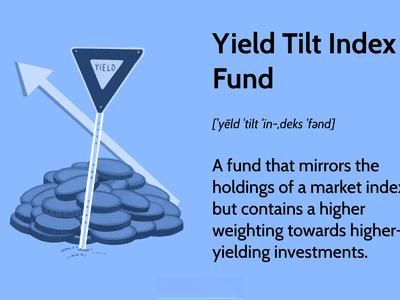

In the complex world of finance, understanding different investment mechanisms is crucial for investors looking to optimize their portfolios. Investors continuously seek strategies that can enhance returns and manage risk effectively. Tilt funds and algorithmic trading represent sophisticated strategies often employed to achieve these goals.

Tilt funds are specialized mutual or exchange-traded funds that aim to outperform standard benchmarks by focusing on specific securities or investment strategies. By leaning towards particular financial metrics or styles, such as stocks with low price-to-earnings (P/E) ratios or high dividend yields, these funds strive to achieve superior returns while maintaining relatively low-risk levels.

Algorithmic trading, on the other hand, involves employing pre-programmed trading instructions that allow for swift and efficient order execution. This strategy leverages computer algorithms to capitalize on market inefficiencies, offering speed and precision that are difficult to achieve through manual trading processes.

This article examines the mechanisms behind tilt funds and algorithmic trading, explaining how they operate and highlighting their potential benefits. We also discuss key considerations for investors looking to incorporate these strategies into their portfolios, providing insight into optimizing performance while managing potential risks. Understanding these mechanisms can empower investors to make informed decisions, ultimately enhancing the effectiveness of their investment strategies.

## Table of Contents

## What is a Tilt Fund?

A tilt fund is a specialized type of mutual or exchange-traded fund (ETF) designed to outperform a standard benchmark index by incorporating specific securities or investment strategies. These funds intentionally tilt their portfolios by emphasizing particular characteristics or metrics, such as stocks with low price-to-earnings (P/E) ratios or high dividend yields, while maintaining a close alignment with their benchmark indices.

The primary objective of tilt funds is to achieve superior returns compared to the benchmark while managing risks within acceptable limits. By strategically selecting and weighting certain securities more heavily than others, tilt funds aim to capture additional value without significantly deviating from the benchmark. This approach seeks to leverage market inefficiencies or specific investment criteria that may indicate potential for better performance.

For instance, a tilt fund might concentrate on stocks exhibiting high dividend yields, attracting investors interested in income generation while maintaining exposure to the broader market. Alternatively, a tilt fund could prioritize equities with low P/E ratios, targeting undervalued companies with growth potential.

Tilt fund strategies often rely on various quantitative models and analyses to determine the optimal tilts, ensuring that the fund maintains a balance between capturing potential outperformance and avoiding excessive [volatility](/wiki/volatility-trading-strategies) or risk. Through this disciplined approach, tilt funds offer investors a nuanced opportunity to enhance their portfolio's performance while adhering to a familiar benchmark framework.

## Examples of Tilted Investments

SPDR's S&P 1500 Value Tilt [ETF](/wiki/etf-trading-strategies) and FlexShares' Morningstar US Market Factor Tilt Index Fund exemplify tilt funds by focusing on certain factors or metrics when selecting securities. SPDR's S&P 1500 Value Tilt ETF is designed to provide investors with increased exposure to stocks possessing lower price-to-earnings (P/E) ratios while maintaining a diverse base linked to the S&P 1500 index. This strategic tilt towards value stocks allows investors to capitalize on undervalued companies that might offer solid future growth, providing an edge over standard benchmark investing.

Similarly, FlexShares' Morningstar US Market Factor Tilt Index Fund seeks to overweight particular segments of the market by focusing on key metrics such as low valuations and favorable price-to-cash flow ratios. This aspect ensures the fund closely follows the US market while giving additional weight to selected securities anticipated to outperform.

**Performance in Different Market Conditions**

The effectiveness of these tilt funds can vary depending on prevailing market conditions. During bullish market phases, where stocks globally increase in value, tilt funds focusing on low P/E ratios may underperform as [growth stocks](/wiki/growth-stocks) tend to lead market gains. Conversely, in bearish market phases or market corrections, these funds might preserve value better than their more growth-oriented counterparts due to investment in more stable, undervalued stocks.

Analyses of past performances indicate that tilt funds like SPDR's S&P 1500 Value Tilt ETF have historically provided more stable returns in volatile markets compared to more aggressive growth funds. For instance, evaluations from past economic downturns reveal that such funds can offer a buffer against declining markets due to their focus on financially robust companies with strong fundamentals.

FlexShares' Morningstar US Market Factor Tilt Index Fund may outperform during periods of economic recovery by capturing gains from undervalued firms as prices rebound to reflect true company values. This dynamic ability provides a tactical advantage by enhancing potential returns while adhering to strong risk management principles embedded in their fund strategies.

In summary, tilt funds present a robust option for investors to align their investments with specific strategic factors, potentially yielding improved returns while managing risk. By concentrating on metrics like low valuations and price-to-cash flow ratios, these funds can adapt their portfolios to suit diverse economic forecasts.

## Weighted Tilting Investment Strategies

Weighted tilt funds offer a strategic approach to investment by allocating a greater proportion of their portfolio to stocks expected to outperform the market average. This method is pivotal for investors seeking to enhance returns while managing risk effectively. By employing a weighted tilt strategy, investors can align their portfolios with specific financial goals, whether they are focused on generating income or capitalizing on undervalued stocks.

A common focus within weighted tilt strategies is stocks with high dividend yields. These stocks can provide an additional income stream, making them attractive to investors aiming for steady cash flow. High dividend yield stocks often belong to established companies with stable earnings, which can add a layer of security to an investment portfolio. For example, a fund manager might increase the allocation of a tilt fund towards sectors like utilities or consumer staples, known for their reliable dividend payouts.

In addition to income generation, weighted tilting can be tailored to value investing. Value investing involves selecting stocks believed to be undervalued by the market. These stocks typically have low price-to-earnings (P/E) ratios, high book-to-market ratios, or other attractive fundamental characteristics. Tilt funds designed with a value investing strategy may adjust their weightings to favor these undervalued stocks, aiming to benefit from their potential upswing as the market adjusts to their true value.

Mathematically, a weighted tilt strategy can be expressed by adjusting the weights $w_i$ of a stock $i$ in the portfolio based on its expected performance. Suppose $\alpha_i$ represents the tilting [factor](/wiki/factor-investing) (predicted performance differential), the weight $w'_i$ becomes:
$$
w'_i = w_i \times (1 + \alpha_i)
$$
Normalization might be necessary to ensure the total of weights remains 1:
$$
w''_i = \frac{w'_i}{\sum_{j=1}^{n} w'_j}
$$

This systematic adjustment ensures that the portfolio not only aligns with expected market outperformers but maintains overall balance.

Weighted tilting provides significant flexibility, allowing investors to customize their strategies according to market conditions and their personal risk tolerance. When implemented effectively, these strategies can achieve superior investment performance while sticking close to fundamental investment principles.

## Algorithmic Trading and Tilt Funds

Algorithmic trading, also known as automated or algo trading, involves the use of computer algorithms to execute trades at optimal speeds and prices. These algorithms are based on a predetermined set of rules and strategies, which can include timing, price, and quantity. The core benefit of [algorithmic trading](/wiki/algorithmic-trading) lies in its ability to process vast amounts of data rapidly and to execute trades instantly, thereby exploiting short-lived opportunities in the market more effectively than human traders.

Tilt funds, which are designed to outperform standard benchmarks by overweighting particular factors or stocks, can significantly benefit from the integration of algorithmic trading. These funds typically focus on specific investment factors such as value, [momentum](/wiki/momentum), or size, by tilting their portfolio to accentuate securities that exhibit desired characteristics. By incorporating algorithmic trading, tilt funds can more adeptly adjust their portfolios in response to shifting market conditions and investor sentiment.

The combination of algorithmic trading with tilt funds potentially enhances the fund's ability to exploit market inefficiencies. Algorithms can continuously monitor for relevant market signals or anomalies, facilitating a dynamic rebalancing of the fund's positions. For instance, an algorithm could be designed to increase exposure to stocks showing a strong momentum pattern or decrease positions in overvalued stocks, thereby aligning with the fund's tilt objectives efficiently.

Moreover, algorithmic trading allows for the precise execution of strategies that align with the tilt fund's goals. For example, a tilted investment strategy prioritizing high-dividend stocks may employ algorithms to identify and capitalize on dividend announcement effects swiftly. This ensures that the fund captures the dividend-related price appreciation efficiently.

The synergy between algorithmic strategies and tilt funds creates a responsive investment mechanism that can adjust in real-time to new information and market dynamics. The use of advanced data analytics and [machine learning](/wiki/machine-learning) within algorithms further enhances this adaptability, providing tilt funds with the tools necessary for predictive modeling and scenario analysis.

Despite the opportunities presented by this synergy, investors must be mindful of the inherent risks. The success of algorithmic strategies depends heavily on the quality of the data and the accuracy of the algorithm's parameters. Technological failures or erroneous data inputs can result in significant financial losses. Hence, robust risk management practices and regular algorithmic audits are crucial components for any investment strategy involving algorithmic trading with tilt funds.

By leveraging algorithmic trading, tilt funds can optimize their investment decisions and exploit market inefficiencies, offering a potent combination for investors seeking to enhance returns while managing risk.

## Pros and Cons of Tilt Funds and Algorithmic Trading

Tilt funds and algorithmic trading are increasingly popular strategies among investors looking to optimize their portfolios. Each approach offers distinct advantages and disadvantages that should be carefully evaluated.

Tilt funds, designed to outperform standard benchmarks, offer potential benefits such as enhanced diversification and the ability to focus on specific investment characteristics, like low price-to-earnings (P/E) ratios or high dividend yields. By strategically tilting towards these characteristics, investors may achieve better returns while keeping risk relatively low. One key advantage of tilt funds is their potential for tailored exposure to desired investment factors, which can be particularly beneficial in achieving specific financial goals, such as income generation or value investing. However, the primary drawback is that these funds may underperform in certain market conditions where their targeted factors do not align with broader market trends. Additionally, over-reliance on specific financial metrics could expose investors to sector-specific risks, reducing the diversification that broader index funds provide.

Algorithmic trading, on the other hand, offers speed and precision by utilizing automated trading programs. This approach can efficiently execute trades at optimal prices, thereby reducing transaction costs and taking advantage of short-lived market inefficiencies. However, algorithmic trading comes with its set of limitations, primarily technological risks. System failures, software glitches, or unexpected market events can lead to significant financial losses. The reliance on algorithms also introduces the risk of over-optimization, where models perform well under historical data but fail in real-time market scenarios due to unanticipated factors.

When crafting a robust investment strategy, investors should consider both the strategic positioning offered by tilt funds and the executional efficiency provided by algorithmic trading. The integration of these strategies necessitates a careful balance to mitigate potential risks while maximizing returns. Ongoing monitoring and adjustments may be required to align with shifting market conditions and ensure the effectiveness of the combined strategy.

## Conclusion

Tilt funds and algorithmic trading have emerged as innovative strategies within modern investment management. These mechanisms offer sophisticated tools that investors can use to optimize their portfolios through better risk management and enhanced return potentials. Understanding the intricate workings of tilt funds, such as their strategic alignment with specific market factors or financial metrics, allows investors to make more informed decisions. These funds present opportunities for diversification while targeting specific investment goals, like generating income or capitalizing on undervalued stocks.

Algorithmic trading complements these funds by employing technology to execute trades swiftly and efficiently, thus exploiting market inefficiencies that may arise. The combination of algorithmic strategies with tilt funds can create a dynamic and responsive investment approach, enhancing the performance and adaptability of investment portfolios.

Continuous learning and staying updated with industry developments are essential for investors to leverage these advanced strategies effectively. The financial markets are ever-evolving, with new tools and techniques emerging regularly. Investors can maintain a competitive edge by seeking ongoing education and being adaptive to changes, ultimately leading to more robust investment outcomes. The future of investment management lies in integrating these innovative strategies, ensuring that investors remain well-positioned in an increasingly complex financial landscape.

## References & Further Reading

[1]: ["Advances in Financial Machine Learning"](https://www.amazon.com/Advances-Financial-Machine-Learning-Marcos/dp/1119482089) by Marcos Lopez de Prado

[2]: ["Evidence-Based Technical Analysis: Applying the Scientific Method and Statistical Inference to Trading Signals"](https://www.amazon.com/Evidence-Based-Technical-Analysis-Scientific-Statistical/dp/0470008741) by David Aronson

[3]: ["Machine Learning for Algorithmic Trading"](https://github.com/stefan-jansen/machine-learning-for-trading) by Stefan Jansen

[4]: ["Quantitative Trading: How to Build Your Own Algorithmic Trading Business"](https://www.amazon.com/Quantitative-Trading-Build-Algorithmic-Business/dp/1119800064) by Ernest P. Chan

[5]: De Prado, M. L. (2018). ["The 10 Reasons Most Machine Learning Funds Fail."](https://papers.ssrn.com/sol3/papers.cfm?abstract_id=3104816) Journal of Investment Management, 16(1), 1-21.

[6]: Hsu, J. C., & Kalesnik, V. (2014). ["Finding Smart Beta in the Factor Zoo."](https://www.researchaffiliates.com/publications/articles/223_finding_smart_beta_in_the_factor_zoo) Financial Analysts Journal, 70(5), 43-52.