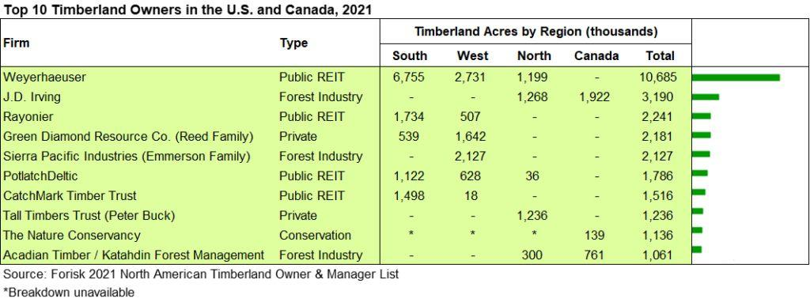

## Table of Contents

## What is a Timber Investment Management Organization (TIMO)?

A Timber Investment Management Organization, or TIMO, is a company that manages investments in forests and timberlands. People and other companies give money to a TIMO, and the TIMO uses that money to buy forest land. The goal is to make money from the trees by selling the timber, or by selling the land itself after it has increased in value.

TIMOs take care of the forests they buy. They plant new trees, take care of the old ones, and decide when to cut them down to sell the wood. They also make sure the forests stay healthy and can keep producing timber for a long time. This way, the investors can earn money from the timber sales and possibly from the land becoming more valuable over time.

## How does a TIMO differ from other types of investment management organizations?

A Timber Investment Management Organization (TIMO) is different from other investment management organizations because it focuses on buying and managing forest land and timber. Most investment management organizations might deal with stocks, bonds, or real estate, but TIMOs are all about trees and the land they grow on. They use the money from investors to buy forests, take care of them, and then sell the timber or the land to make a profit.

Unlike other investment managers who might invest in many different things to spread out risk, TIMOs concentrate their investments in one area: timber. This means they need to know a lot about forests, how to grow trees, and how to sell timber. They also have to think about how to keep the forests healthy for the future, which is different from managing stocks or bonds where you don't have to worry about the health of a forest.

## What are the main services provided by TIMOs?

TIMOs mainly help people and companies invest in forests and timberlands. They use the money from investors to buy forest land. Then, they take care of the forests by planting new trees, looking after the old ones, and deciding when to cut them down to sell the wood. This way, they can make money for the investors from selling timber.

Besides managing the forests, TIMOs also focus on making the land more valuable over time. They do this by keeping the forests healthy and sustainable, so they can keep producing timber for many years. Sometimes, they might sell the land itself if it has become worth more money. So, TIMOs not only help investors earn from timber sales but also from the land's increasing value.

## Who typically invests in TIMOs and why?

People who typically invest in TIMOs are usually big investors like pension funds, university endowments, and wealthy individuals. These investors have a lot of money to put into different types of investments, and they want to spread their money around to lower their risk. Timberlands can be a good way to do this because they are not closely tied to the ups and downs of the stock market.

These investors choose TIMOs because they can offer steady returns over a long time. Forests grow slowly, but when the trees are ready to be cut down and sold, it can bring in a lot of money. Also, the value of the land itself can go up over time, giving investors another way to make money. Plus, investing in forests can be good for the environment, which some investors care about. So, TIMOs can help investors make money while also helping to keep forests healthy for the future.

## What are the key factors to consider when investing in timber through a TIMO?

When thinking about investing in timber through a TIMO, one important thing to consider is the long-term nature of the investment. Forests take a long time to grow, so you need to be ready to wait many years before you see big returns. This means you should be patient and have money that you can keep invested for a long time. Another thing to think about is how the TIMO manages the forests. Good forest management can make the trees grow better and the land become more valuable, so it's important to pick a TIMO that knows how to take care of forests well.

Another key [factor](/wiki/factor-investing) is understanding the risks involved. Even though timberlands can offer steady returns, they can also be affected by things like forest fires, diseases, and changes in the market for timber. It's important to know these risks and think about how they might affect your investment. Also, consider how investing in timber can help diversify your investments. Since timber is not closely tied to the stock market, it can help spread out your risk if you have money in other types of investments too. So, choosing a TIMO that has a good track record and knows how to handle these risks can make a big difference in your investment's success.

## How do TIMOs manage and operate timberlands?

TIMOs manage and operate timberlands by first buying forest land with money from investors. They look for good pieces of land where trees can grow well. Once they have the land, they take care of the forests. This means planting new trees, looking after the old ones, and making sure the forest stays healthy. They also decide when to cut down trees to sell the timber. This is important because selling timber is how they make money for their investors.

Besides taking care of the forests, TIMOs also think about the future. They want the forests to keep producing timber for many years, so they manage the land in a way that keeps it sustainable. This might mean not cutting down too many trees at once and making sure new trees are always growing. Sometimes, if the land becomes more valuable, they might sell it to make even more money for investors. By doing all these things, TIMOs try to make sure the forests are healthy and profitable over the long term.

## What are the potential risks and rewards associated with investing in TIMOs?

Investing in TIMOs can offer good rewards over time. Forests grow slowly, but when the trees are ready to be cut down and sold, it can bring in a lot of money. Also, the value of the land itself can go up, giving investors another way to make money. Since timberlands are not closely tied to the stock market, they can help spread out your risk if you have money in other types of investments too. This means your overall investments might be safer and more stable. Plus, some people like investing in TIMOs because it can be good for the environment, helping to keep forests healthy for the future.

However, there are also risks to consider. Forests can be damaged by things like fires, diseases, or bad weather, which can hurt your investment. The price of timber can also go up and down, depending on what people need and want. This means you might not make as much money as you hoped. Also, because forests take a long time to grow, you need to be patient and ready to wait many years before you see big returns. So, it's important to think about these risks and make sure you're okay with them before you invest in a TIMO.

## How do TIMOs contribute to sustainable forestry practices?

TIMOs help with sustainable forestry by managing forests in a way that keeps them healthy for a long time. They plant new trees after cutting down old ones, making sure the forest can keep growing. They also take care of the land, so it stays good for growing trees in the future. This helps the forests stay strong and able to produce timber for many years.

By doing this, TIMOs make sure that the forests can keep giving us wood without hurting the environment. They think about how to balance cutting down trees with letting the forest grow back. This way, they can keep making money from the timber while also helping the planet. So, investing in TIMOs can be good for both your wallet and the world.

## What is the historical performance of timber investments managed by TIMOs?

Timber investments managed by TIMOs have generally done well over the years. They have given investors steady returns, often better than what you might get from stocks or bonds. This is because timber grows slowly but surely, and when it's time to sell the wood, it can bring in a lot of money. Also, the land where the trees grow can become more valuable over time, which adds to the returns.

However, the performance can change a lot depending on things like the economy, how well the TIMO manages the forests, and what's happening with the price of timber. There have been times when timber prices went down, which made returns lower. But over the long term, timber investments have been a good way to make money while also helping the environment by keeping forests healthy.

## How do regulatory and environmental policies impact TIMO operations?

Regulatory and environmental policies can have a big impact on how TIMOs work. These policies can set rules about how forests should be managed, like how many trees can be cut down each year or what kind of trees need to be planted. Sometimes, these rules can make it harder for TIMOs to make money because they have to follow strict guidelines. For example, if a new law says that they can only cut down a small number of trees, it might take longer to get a good return on their investment.

On the other hand, these policies can also help TIMOs by making sure the forests stay healthy for a long time. Good environmental rules can help keep the land valuable and the timber market strong. This means that even though TIMOs might have to spend more time and money to follow the rules, they can still make good returns if they manage the forests well. So, while regulations can be a challenge, they can also help TIMOs be successful in the long run by promoting sustainable forestry.

## What advanced strategies do TIMOs use to maximize returns on timber investments?

TIMOs use a few smart strategies to make the most money from timber investments. One big strategy is to buy land in places where trees grow well and where there's a good market for timber. They look at things like how fast the trees grow, how much they can sell the wood for, and how the land might become more valuable over time. They also think about how to mix different types of trees and when to cut them down to get the best price. This helps them make more money because they can sell the timber at the right time and in the right place.

Another important strategy is to manage the forests in a way that keeps them healthy and productive for a long time. TIMOs do this by planting new trees after cutting down old ones, taking care of the soil, and making sure the forest can keep growing. They also use technology to help them decide when and where to cut trees, which can save time and money. By doing all these things, TIMOs can keep making money from the timber while also making sure the forests stay good for the future.

## How can investors evaluate the performance and management quality of a TIMO?

Investors can evaluate the performance of a TIMO by looking at how much money it has made over time. They can check the returns the TIMO has given to its investors and see if these returns are good compared to other investments like stocks or bonds. It's also important to look at how the TIMO has done during different times, like when the economy was doing well or not so well. This helps investors see if the TIMO can make money even when things are tough. They can also look at reports and data from the TIMO to see how well the forests are growing and how much timber is being sold.

To check the management quality of a TIMO, investors should see if the people running it know a lot about forests and how to take care of them. They can look at the TIMO's track record to see if it has managed forests well in the past. It's also good to see if the TIMO follows good practices for keeping the forests healthy and sustainable. Investors can talk to other people who have invested with the TIMO or read reviews to get an idea of how well it is managed. By doing all these things, investors can make a smart choice about whether to put their money into a TIMO.

## What is Algorithmic Trading in Timber Investments?

Algorithmic trading, also known as automated trading, utilizes sophisticated algorithms to facilitate trade execution and portfolio management in the timber investment sector. This approach leverages technology to handle complex, data-driven tasks, thereby improving efficiency and decision-making processes.

Key to the success of [algorithmic trading](/wiki/algorithmic-trading) in timber investments is data analysis. By utilizing large datasets, investors can extract valuable insights on market trends and price movements. Machine learning algorithms process this data to identify patterns that might not be immediately apparent to human analysts. For example, a common technique is the use of predictive modeling to forecast timber price fluctuations. Algorithms like random forests or gradient boosting can be applied to historical data to predict future prices accurately. 

The formula for a simple linear regression model, commonly used in predictive analysis, is:

$$
y = \beta_0 + \beta_1x + \epsilon
$$

where:
- $y$ is the dependent variable (e.g., future timber prices),
- $x$ is the independent variable (e.g., historical price data),
- $\beta_0$ is the intercept,
- $\beta_1$ is the slope coefficient,
- $\epsilon$ is the error term.

The integration of algorithmic trading enhances efficiency by automating routine tasks, reducing manual errors, and enabling faster execution of trades. Additionally, this technology can optimize portfolio management by rebalancing investments based on predefined criteria such as risk tolerance and market conditions.

Despite its benefits, algorithmic trading in timber investments presents several challenges. Accurate data is crucial for model reliability, necessitating robust data collection and validation mechanisms. Furthermore, significant technology investments are required to build and maintain sophisticated trading platforms. Regulatory changes also pose risks, as compliance ensures the legitimacy and sustainability of trading practices. Trading algorithms must be continuously updated to align with evolving regulations and market dynamics.

In summary, the application of algorithmic trading in timber investments offers substantial opportunities for enhancing returns and optimizing resource management. However, success depends on the implementation of reliable data strategies, technological infrastructure, and adaptive regulatory compliance. This makes algorithmic trading a promising yet complex component of modern timber investment strategies.

## References & Further Reading

[1]: ["Forest Management and Planning"](https://www.sciencedirect.com/book/9780128094761/forest-management-and-planning) by Peter Bettinger, Kevin Boston, and Jacek Siry

[2]: ["The Management of Industrial Forest Plantations: Theoretical Foundations and Applications"](https://link.springer.com/book/10.1007/978-94-017-8899-1) by José G. Borges, Pau Costa, José L. de C. F. Azevedo

[3]: Washburn, C.L. & Binkley, C.S. (1990). ["Do Forest Assets Hedge Inflation?"](https://www.semanticscholar.org/paper/Do-Forest-Assets-Hedge-Inflation-Washburn-Binkley/4a5e26c8a785e95f099aa4dcb134b0adb9df28e4) Land Economics, 66(3), 234-250.

[4]: ["Algorithmic Trading: Winning Strategies and Their Rationale"](https://www.wiley.com/en-us/Algorithmic+Trading%3A+Winning+Strategies+and+Their+Rationale-p-9781118746912) by Ernie Chan

[5]: ["Introduction to Algorithmic Trading"](https://www.investopedia.com/articles/active-trading/101014/basics-algorithmic-trading-concepts-and-examples.asp) by Barry Johnson