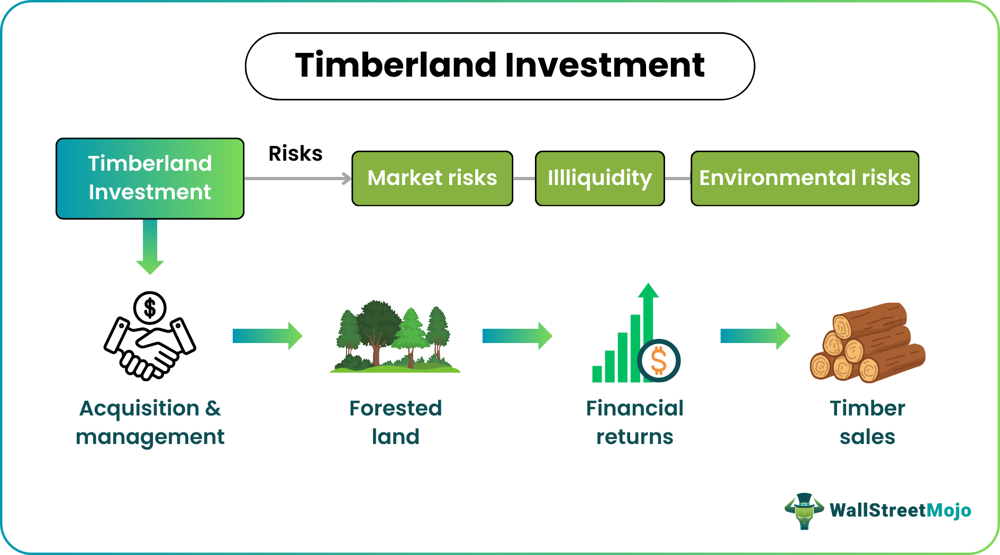

## Table of Contents

## What is timberland investment?

Timberland investment involves buying large areas of forest land to grow and sell trees for wood. People invest in timberland because they can make money from selling the trees when they are ready to be cut down. The value of the land itself can also go up over time, which adds to the investment's worth. Timberland can be a good choice for investors who want to spread their money across different types of investments, as it often grows in value differently from stocks or bonds.

Another reason people invest in timberland is that it can provide a steady income. Trees take many years to grow, but once they are mature, they can be harvested and sold. This means that investors can plan for regular income from their timberland. Also, timberland can help protect against inflation because the price of wood usually goes up when the cost of living increases. This makes timberland a smart choice for people looking for a long-term investment that can offer both growth and income.

## Why might someone consider investing in timberland?

Someone might consider investing in timberland because it can be a good way to make money over time. When you buy timberland, you are buying land with trees that can be cut down and sold as wood. As these trees grow and become ready to harvest, you can sell them and make a profit. Plus, the value of the land itself might go up, which means your investment could be worth more in the future. This makes timberland a good choice for people who want their money to grow slowly but steadily.

Another reason to invest in timberland is that it can give you a regular income. Trees take a long time to grow, but once they are big enough, you can cut them down and sell them. This means you can plan to get money from your timberland at certain times. Timberland can also help protect your money from inflation, which is when the cost of things goes up. The price of wood usually goes up when inflation happens, so your timberland investment can keep its value or even grow when other things become more expensive. This makes timberland a smart choice for people looking for a long-term investment that can offer both growth and income.

## What are the basic risks associated with timberland investment?

One risk of investing in timberland is that natural disasters like fires, storms, or diseases can harm or destroy the trees. If this happens, you might lose a lot of money because the trees you were planning to sell are gone. Another risk is that the price of wood can go down. If fewer people want to buy wood, or if there is too much wood available, the price can drop, and you might not make as much money as you hoped.

Another thing to think about is that it takes a long time for trees to grow. This means you have to wait many years before you can sell them and get your money back. If you need money sooner, timberland might not be the best choice for you. Also, managing timberland can be hard work. You need to know about taking care of trees and the land, and sometimes you might need to hire people to help, which can cost more money.

Lastly, there are risks from changes in laws or rules about forests and land. Governments can change laws about cutting down trees or using the land, which might make it harder or more expensive for you to manage your timberland. This can affect how much money you make from your investment.

## How does the location of timberland affect its investment potential?

The location of timberland can make a big difference in how good an investment it is. If the timberland is close to places where wood is used a lot, like factories or cities, it can be easier and cheaper to get the wood to buyers. This can mean more money for the investor because they spend less on moving the wood. Also, some areas have better soil and weather for growing certain types of trees that are worth more money. If the timberland is in one of these good spots, the trees can grow faster and be worth more when they are sold.

But there are also risks that come with where the timberland is. If the land is in a place where there are often natural disasters like fires or storms, the trees could be damaged or destroyed. This would mean losing money because the trees you planned to sell are gone. Also, if the timberland is far away from where the wood is needed, it can cost a lot to move the wood to buyers. This can eat into the money you make from selling the trees. So, the location of timberland can affect both how much money you can make and how risky the investment is.

## What are the environmental risks involved in timberland investment?

Investing in timberland can come with environmental risks. One big risk is that cutting down trees can hurt the environment. When trees are removed, it can lead to less habitat for animals and plants. This can make it harder for them to live and grow. Also, when trees are cut down, it can cause soil to wash away, which can harm the land and make it harder to grow new trees in the future.

Another risk is that climate change can affect timberland. Changes in weather can make it harder for trees to grow well. For example, if there are more storms or longer dry periods, the trees might not grow as fast or could get sick. This means the trees might not be worth as much money when it's time to sell them. Also, if the area where the timberland is located becomes more prone to wildfires because of climate change, the trees could be destroyed, leading to a big loss for the investor.

Lastly, there's the risk of pollution. If the timberland is near places that pollute the air or water, it can harm the trees and the land. Pollution can make trees grow slower or get sick, which means they won't be as valuable. It can also make the land less healthy, which can affect how well new trees grow in the future. So, it's important for investors to think about these environmental risks when they decide to invest in timberland.

## How do market fluctuations impact timberland investments?

Market fluctuations can change how much money you make from timberland. When the price of wood goes up and down, it affects how much you can sell your trees for. If a lot of people want to buy wood, the price goes up, and you can make more money. But if there's not much demand for wood, the price drops, and you might not make as much as you hoped. This can be a problem if you need to sell your trees at a time when the price is low.

Also, other things in the economy can affect timberland. If the economy is doing well, people might build more houses and need more wood, which can raise the price. But if the economy is bad, people might not build as much, and the price of wood can fall. Interest rates can also play a role. If interest rates go up, it can cost more to borrow money to buy timberland, which might make fewer people want to invest. So, market fluctuations can make timberland a bit risky because you never know exactly what the price of wood will be when it's time to sell your trees.

## What are the tax implications of investing in timberland?

Investing in timberland can have some good tax benefits. When you sell trees that you grew on your timberland, you don't have to pay regular income tax on the money you make. Instead, you pay a special kind of tax called capital gains tax, which is usually lower. Also, if you use the money you make from selling trees to improve your timberland, like planting new trees or fixing roads, you might be able to take those costs off your taxes. This can help you pay less in taxes overall.

But there are some things to watch out for too. If you cut down trees and sell the wood, you might have to pay a special tax called a timber depletion allowance. This tax is based on how much of your timberland's value you used up by cutting down the trees. Also, if you own a lot of timberland, you might have to pay property taxes on it. These taxes can be higher if the land is worth a lot of money. So, it's a good idea to talk to a tax expert to understand all the tax rules that apply to your timberland investment.

## Can you provide examples of successful timberland investments?

One example of a successful timberland investment is the case of Weyerhaeuser Company. They bought a lot of timberland in the United States and Canada. Over time, they managed the land well, growing trees and selling them when they were ready. This helped them make a lot of money. Weyerhaeuser also used the land for other things like making paper and building materials, which added to their profits. Their success shows how good management and using the land in different ways can make timberland a great investment.

Another example is Rayonier, a company that owns a lot of timberland in the U.S. and New Zealand. Rayonier has been successful by not just selling trees but also by leasing their land for other uses like hunting or conservation. This gives them more ways to make money from their timberland. By doing this, Rayonier has been able to grow their business and make their timberland investment very profitable. It shows how thinking creatively about how to use timberland can lead to big success.

## What are some common mistakes to avoid when investing in timberland?

One common mistake people make when investing in timberland is not doing enough research. It's important to know about the land you're buying, like what kind of trees grow there and how fast they grow. You also need to understand the local market for wood and any laws about cutting down trees. If you don't do your homework, you might buy land that isn't as good an investment as you thought.

Another mistake is not having a good plan for managing the timberland. Trees take a long time to grow, so you need to think about when you'll cut them down and sell them. You also need to take care of the land and the trees, which can be hard work. If you don't have a plan, you might not make as much money as you could, or you might lose money if the trees get sick or are damaged.

Lastly, some people forget about the costs of owning timberland. There are taxes to pay, and you might need to hire people to help manage the land. If you don't think about these costs, they can eat into your profits. It's important to make sure you can afford to keep the timberland before you buy it.

## How does timberland investment compare to other types of real estate investments?

Timberland investment is different from other types of real estate investments like houses or office buildings. When you invest in timberland, you're buying land with trees that you can cut down and sell as wood. This means you might have to wait a long time before you can make money because trees take many years to grow. But once the trees are ready, you can sell them and make a profit. Also, the value of the land itself can go up over time, which can add to your investment's worth. Timberland can be a good choice if you want an investment that can grow slowly and give you a steady income over the years.

On the other hand, other types of real estate investments, like houses or office buildings, can give you money more quickly. You can rent out these properties and get money every month. But these investments can also be riskier because the value of houses and buildings can go up and down a lot depending on the economy. Also, you might have to spend a lot of money to fix up these properties, which can eat into your profits. Timberland can be less risky because the price of wood usually goes up when the cost of living increases, which can help protect your investment from inflation. So, timberland might be a better choice if you're looking for a long-term investment that can offer both growth and income.

## What advanced strategies can be used to mitigate risks in timberland investment?

One advanced strategy to mitigate risks in timberland investment is diversification. Instead of putting all your money into one piece of land, you can buy timberland in different areas. This way, if something bad happens in one place, like a fire or a disease, you won't lose all your money. You can also grow different types of trees on your land. Some trees grow faster and can be sold sooner, while others might take longer but be worth more money. By having a mix of trees, you can plan to get money at different times, which can help you manage your income better.

Another strategy is to use sustainable forestry practices. This means taking care of the land and the trees in a way that keeps them healthy for the future. You can do things like planting new trees after you cut down old ones, and making sure you don't cut down too many trees at once. This can help protect your investment from environmental risks like soil erosion or loss of habitat. Also, using sustainable practices can make your timberland more valuable because more people want to buy wood from lands that are taken care of well. This can help you sell your trees for a better price.

Lastly, you can use financial tools like insurance and futures contracts to manage risks. Insurance can help you if something bad happens to your trees, like a fire or a storm. It can give you money to help you recover from the loss. Futures contracts let you agree to sell your wood at a certain price in the future. This can protect you from price drops because you know how much money you'll get, even if the market changes. By using these tools, you can make your timberland investment less risky and more predictable.

## How can investors use timberland to diversify their investment portfolio?

Investors can use timberland to diversify their investment portfolio by adding an asset that behaves differently from stocks and bonds. Timberland often grows in value at a steady pace, which can balance out the ups and downs of other investments. When the stock market goes down, the price of wood might stay the same or even go up. This means that having timberland in your portfolio can help protect your money when other investments are doing badly. Plus, timberland can give you a regular income when you sell the trees, which can be helpful if you need money at certain times.

Another way timberland helps with diversification is by offering a hedge against inflation. When the cost of living goes up, the price of wood usually goes up too. This means that your timberland investment can keep its value or even grow when other things become more expensive. By adding timberland to your portfolio, you can have an investment that not only grows over time but also helps protect your money from losing value. This makes timberland a smart choice for investors looking to spread their money across different types of investments.

## References & Further Reading

[1]: Clutterbuck, D., Marshall, C., & Paling, W. (2008). ["Timberland Investments: A Primer."](https://www.emerald.com/insight/content/doi/10.1108/14777280810886364/full/html) Sitka Pacific Capital Management.

[2]: Mendell, B.C., & Sydor, T. (2010). ["How Do Timberland Investments Relate to Other Real Estate Investment Types?"](https://forisk.com/resources/white-papers-and-articles/) Journal of Forest Economics.

[3]: White, M. A., & Runkle, D. E. (2009). ["Timberland and Diversification."](https://www.osti.gov/biblio/963187) Journal of Forestry.

[4]: Narang, R. (2013). ["Inside the Black Box: A Simple Guide to Quantitative and High Frequency Trading."](https://onlinelibrary.wiley.com/doi/book/10.1002/9781118662717) John Wiley & Sons.

[5]: Geman, H. (2005). ["Commodities and Commodity Derivatives: Modeling and Pricing for Agriculturals, Metals, and Energy."](https://download.e-bookshelf.de/download/0000/5675/90/L-G-0000567590-0015270354.pdf) John Wiley & Sons.