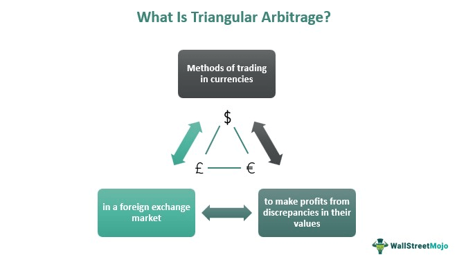

In the rapidly evolving world of finance, investment strategies have continuously adapted to harness emerging opportunities, with time arbitrage, market efficiency, and algorithmic trading standing out as crucial components. Time arbitrage involves exploiting short-term discrepancies in stock pricing that do not align with long-term fundamentals. This approach capitalizes on temporary mispricings, offering astute investors the chance to purchase undervalued assets during periods of volatility. By integrating a deep understanding of a company’s intrinsic value, investors can distinguish between transient price reductions and genuine declines in value.

Market efficiency, a key tenet in economic theory, refers to the extent to which asset prices reflect all available information. In an ideally efficient market, all investors would have equal access to information, leading to a state where no arbitrage opportunities exist. However, actual markets often deviate from this model due to information asymmetries and behavioral biases, creating openings for investors who can anticipate or quickly respond to these inefficiencies.



Algorithmic trading has revolutionized financial markets by executing trades at speeds and volumes beyond human capabilities. By leveraging complex algorithms, traders can process a vast array of market data to identify and execute profitable trades. The breadth of algorithmic strategies, from trend-following to statistical arbitrage, equips traders with versatile tools to exploit fleeting market inefficiencies.

By understanding the intricacies of time arbitrage, market efficiency, and algorithmic trading, investors can refine their strategies to optimize returns while mitigating associated risks. This holistic approach allows investors to navigate complex financial markets effectively, capturing opportunities that may otherwise be overlooked by less informed participants.

## Table of Contents

## Understanding Time Arbitrage

Time arbitrage is a strategy that takes advantage of short-term price fluctuations in the stock market that do not accurately reflect a company's long-term fundamental value. This approach allows investors to purchase stocks they believe are temporarily undervalued, expecting that the market will eventually correct the price to align with the inherent worth of the company. 

Legendary investor Warren Buffett has exemplified the use of time arbitrage. During times of market volatility, he has acquired shares of fundamentally strong companies whose stock prices dipped due to external market pressures rather than intrinsic business problems. This method relies heavily on a thorough analysis of a company's financial health, competitive position, and growth prospects.

To successfully employ time [arbitrage](/wiki/arbitrage), investors need to develop a comprehensive understanding of a company's fundamentals. This involves analyzing various financial metrics and indicators, such as the price-to-earnings ratio (P/E ratio), earnings growth, return on equity (ROE), and debt-to-equity ratio. By assessing these factors, investors can differentiate between stocks experiencing temporary price drops and those undergoing genuine devaluation. 

Mathematically, consider a stock's intrinsic value $V_0$ and its market price $P_0$. The objective of time arbitrage is to identify situations where:

$$
P_0 < V_0
$$

This inequality suggests that the current market price is less than the stock's intrinsic value, presenting a potential opportunity for time arbitrage. 

Moreover, the strategy often requires patience and the ability to withstand market pressures, as it may take time for the market price to adjust and reflect the true value of the stock. Thus, time arbitrage is not merely a test of analytical skills but also of investors’ temperament to endure short-term [volatility](/wiki/volatility-trading-strategies) while waiting for the anticipated market correction.

## Market Efficiency and Its Implications for Investors

Market efficiency refers to the concept where stock prices fully reflect all available information, rendering it impossible for investors to consistently achieve returns surpassing the average market returns on a risk-adjusted basis. The Efficient Market Hypothesis (EMH), formulated by Eugene Fama in the 1960s, categorizes market efficiency into three forms: weak, semi-strong, and strong.

1. **Weak Form Efficiency**: This form posits that all past trading information is already reflected in stock prices. Hence, technical analysis, which relies on historical price data and trading volumes, cannot be used to achieve superior gains.

2. **Semi-strong Form Efficiency**: According to this form, stock prices adjust instantly to all publicly available information, such as earnings reports and news releases. As a result, neither technical analysis nor fundamental analysis—which assesses a company's financial health—can lead to outperforming returns.

3. **Strong Form Efficiency**: This rigorous form asserts that stock prices reflect all information, both public and private. It implies that even insider information cannot be exploited for extraordinary gain, indicating an idealized state where markets are perfectly efficient.

However, in practice, markets exhibit inefficiencies due to factors like irrational investor behavior, market psychology, and limitations in the dissemination and processing of information. These inefficiencies provide opportunities for astute investors to realize exceptional returns. 

Anomalies, such as the Halloween effect, January effect, and small-cap effect, challenge the notion of perfectly efficient markets. These anomalies indicate recurring patterns or events in stock market behavior that contradict EMH, suggesting that there are periods or conditions under which certain strategies may yield abnormal returns.

To capitalize on such inefficiencies, investors can employ strategies that focus on identifying when market prices diverge from their intrinsic value—the true value based on underlying perceptions of the company's financial health and future prospects. Utilizing tools like discounted cash flow models or price-earnings ratios can aid in estimating intrinsic values and determining potential arbitrage opportunities.

For practical illustration, consider the python code to calculate a stock's intrinsic value using the Discounted Cash Flow (DCF) model:

```python
def calculate_intrinsic_value(free_cash_flow, growth_rate, discount_rate, terminal_value, years=5):
    """
    Calculate the intrinsic value of a stock using the DCF model.

    :param free_cash_flow: Initial free cash flow
    :param growth_rate: The expected growth rate of the free cash flow
    :param discount_rate: The discount rate to apply to future cash flows
    :param terminal_value: The terminal value of the stock
    :param years: The number of years to project

    :return: The intrinsic value of the stock
    """
    total_value = 0
    for year in range(1, years + 1):
        fc = free_cash_flow * ((1 + growth_rate) ** year)
        total_value += fc / ((1 + discount_rate) ** year)
    total_value += terminal_value / ((1 + discount_rate) ** years)

    return total_value

# Example usage
intrinsic_value = calculate_intrinsic_value(free_cash_flow=1000000, 
                                            growth_rate=0.05, 
                                            discount_rate=0.10, 
                                            terminal_value=5000000)
print(f"Intrinsic Value: ${intrinsic_value:.2f}")
```

In conclusion, while perfect market efficiency remains a theoretical construct, real-world markets often exhibit inefficiencies that knowledgeable investors can exploit. Understanding these nuances can enhance investment strategies, enabling investors to benefit from deviations between market prices and intrinsic values.

## Algorithmic Trading: Revolutionizing Financial Markets

Algorithmic trading utilizes complex algorithms to automate the trading process, executing orders at speeds and frequencies impossible for human traders. By leveraging the power of advanced computational systems, [algorithmic trading](/wiki/algorithmic-trading) can process vast amounts of data in real-time, identifying and acting upon potential trading opportunities with precision.

A critical aspect of algorithmic trading is the ability to analyze market data efficiently, including price, [volume](/wiki/volume-trading-strategy), and time, enabling traders to capitalize on small price movements. This involves implementing various strategies designed to optimize trading outcomes. Among the most prevalent strategies are trend-following algorithms, mean reversion, and [statistical arbitrage](/wiki/statistical-arbitrage).

Trend-following algorithms are designed to capitalize on the [momentum](/wiki/momentum) of existing market trends. These systems rely on technical indicators such as moving averages or the Relative Strength Index (RSI) to identify trends and initiate trades accordingly. The basic principle is to buy when prices show an upward trend and sell when they trend downward.

Mean reversion strategies operate on the premise that prices will revert to their historical averages over time. Traders using this strategy identify securities that have deviated significantly from their mean and trade on the expectation of a return to average levels. For instance, if a stock's price is below its historical average, the algorithm may signal a buy order, anticipating an upward correction.

Statistical arbitrage involves identifying and exploiting price discrepancies between related financial instruments. Algorithms scan vast datasets to detect patterns or inefficiencies, such as differences in the pricing of stocks with similar characteristics or cross-market discrepancies in asset pairs. This approach often employs statistical methods, for instance, cointegration testing, to ensure that the relationships identified are statistically sound before executing trades.

Algorithmic trading also requires rigorous [backtesting](/wiki/backtesting), where strategies are tested against historical data to assess their viability and potential profitability. This process helps traders refine their algorithms, minimizing the risk of errors and optimizing performance under various market conditions.

The technological capability of algorithms allows for sophisticated data analysis and quick execution of complex strategies. As financial markets continue to evolve, algorithmic trading remains an essential component of modern trading practices, offering traders improved accuracy, speed, and the ability to uncover subtle market inefficiencies undetectable by traditional methods.

## The Intersection of Time Arbitrage and Algorithmic Trading

Algorithmic trading enhances the implementation of time arbitrage by automating the response to temporary market mispricings. This synergy allows for quick adjustments to buy-and-hold strategies when stock prices experience short-term dips, enabling investors to capitalize on these price fluctuations efficiently. The precision and speed offered by algorithmic trading systems are unmatched by human traders, allowing them to execute trades in fractions of a second, which is crucial for taking advantage of transient arbitrage opportunities.

When algorithmic trading is employed, a typical approach is to use strategies like statistical arbitrage or trend-following algorithms to detect deviations from expected price patterns. These algorithms continuously monitor market conditions and employ complex mathematical models to signal optimal entry and [exit](/wiki/exit-strategy) points. For instance, the Python library `pandas` can process real-time financial data, while [machine learning](/wiki/machine-learning) tools from libraries like `scikit-learn` can predict short-term price movements or classify mispricing events.

Moreover, algorithmic trading facilitates the use of financial derivatives, such as options, to amplify returns from short-term inefficiencies. Options can be used for hedging, which reduces risk while seeking arbitrage profits. Algorithms can model various scenarios, instantaneous volatility changes, and option Greeks to adjust positions dynamically. This dynamic adjustment allows for better handling of risks associated with market fluctuations.

For example, an algorithm can be programmed to monitor the delta (Δ) of an options position, which measures the sensitivity of the option's price to changes in the price of the underlying asset. By continuously adjusting the hedge ratio based on delta, the strategy remains effective amidst the rapid changes typical in financial markets.

Ultimately, integrating algorithmic trading with time arbitrage strategies provides investors with a sophisticated framework to exploit market inefficiencies. By automating the complex and rapid decision-making processes required in today's markets, investors can maximize gains from short-term discrepancies while minimizing associated risks. This approach not only enhances returns but also provides a scalable method to manage multiple positions across diverse assets, further optimizing overall portfolio performance.

## Risks and Challenges in Time Arbitrage and Algo Trading

While opportunities in time arbitrage and algorithmic trading are abundant, they are accompanied by significant risks and challenges. Potential miscalculations in algorithmic strategies can occur due to flawed assumptions, faulty model development, or inadequate parameter settings. For instance, algorithms that rely on historical data may not accurately predict future market conditions, leading to suboptimal trading decisions. Furthermore, unexpected market movements can drastically impact trading outcomes. Events such as geopolitical tensions, economic policy changes, or natural disasters can create volatile market conditions that algorithms are not equipped to handle.

Heavy reliance on automated systems also presents challenges. Automated systems may fail to adapt to market changes if not continuously monitored and adjusted. For example, a sudden [liquidity](/wiki/liquidity-risk-premium) crisis might cause an algorithm to execute trades at disadvantageous prices, leading to substantial losses. Moreover, software bugs or hardware malfunctions can result in erroneous trades, potentially leading to financial loss.

Understanding and mitigating these risks is critical for success in time arbitrage and algorithmic trading. Thorough backtesting can help identify weaknesses in algorithmic strategies by simulating their performance against historical data. This process allows traders to refine their models and improve accuracy. Effective risk management strategies, such as stop-loss orders and diversification, can also mitigate potential downsides. These strategies help limit exposure to adverse market movements and spread risk across different assets.

Regular review and adaptation of trading algorithms ensure that they remain responsive to changing market conditions. Incorporating machine learning techniques can enhance algorithms' ability to learn from new data and improve predictive accuracy. Additionally, having robust monitoring and alert systems in place allows for quick identification and resolution of issues as they arise, reducing the likelihood of significant errors impacting trading outcomes.

In conclusion, while time arbitrage and algorithmic trading offer the potential for enhanced returns, recognizing and addressing the associated risks is essential for sustainable success. Through diligent analysis, monitoring, and adaptation, traders can navigate the complexities of these advanced trading strategies more effectively.

## Conclusion: Integrating Strategies for Optimal Performance

Investors who integrate the principles of time arbitrage with sophisticated algorithmic trading can potentially enhance their portfolio performance by leveraging the strengths of each approach. Time arbitrage, with its focus on exploiting short-term price inefficiencies while maintaining a long-term fundamental perspective, can be significantly bolstered by algorithmic trading's capability to rapidly analyze and respond to market data. This symbiotic relationship enables traders to execute strategies with precision and speed, maximizing their potential returns.

As financial markets become increasingly competitive and fast-paced, the ability to adapt quickly to market changes becomes crucial. Continual learning and adaptation enable investors to navigate complex market dynamics effectively. By incorporating modern technological tools like machine learning and [artificial intelligence](/wiki/ai-artificial-intelligence) into their algorithmic trading frameworks, traders can refine their approaches and maintain a competitive edge.

Moreover, balancing traditional investment strategies with these advancements offers a robust portfolio management approach. Traditional strategies provide a stable foundation, focusing on long-term value and risk management, whereas technological advancements offer the speed and precision needed to capitalize on fleeting opportunities. This integration not only reduces the likelihood of severe losses due to unforeseen market movements but also enhances the potential for optimized trading outcomes.

The fusion of time-tested investment principles and cutting-edge technology opens new avenues for investors seeking to optimize their trading strategies. By embracing this integration, traders can achieve a more dynamic and resilient investment strategy, better equipped to thrive in today's ever-evolving financial landscapes.

## References & Further Reading

[1]: Fama, E. F. (1970). "[Efficient Capital Markets: A Review of Theory and Empirical Work.](https://www.jstor.org/stable/2325486)" The Journal of Finance, 25(2), 383-417.

[2]: Lo, A. W., & MacKinlay, A. C. (1990). "[When Are Contrarian Profits Due to Stock Market Overreaction?](https://www.jstor.org/stable/2962020)" The Review of Financial Studies, 3(2), 175-205.

[3]: Cootner, P. H. (1964). "[The Random Character of Stock Market Prices.](https://archive.org/details/randomcharactero00coot)" MIT Press.

[4]: Chan, E. (2009). "[Quantitative Trading: How to Build Your Own Algorithmic Trading Business.](https://github.com/ftvision/quant_trading_echan_book)" John Wiley & Sons.

[5]: Lopez de Prado, M. (2018). "[Advances in Financial Machine Learning.](https://www.amazon.com/Advances-Financial-Machine-Learning-Marcos/dp/1119482089)" Wiley.

[6]: Kritzman, M. (1994). "[What Practitioners Need to Know...About Market Efficiency.](https://www.semanticscholar.org/paper/What-Practitioners-Need-to-Know-Kritzman/b36c55ee5e63ba33c8e4111d8104e5e15b135c32)" Financial Analysts Journal, 50(1), 14-18.

[7]: Jansen, S. (2020). "[Machine Learning for Algorithmic Trading.](https://github.com/stefan-jansen/machine-learning-for-trading)" Packt Publishing.

[8]: Aronson, D. R. (2007). "[Evidence-Based Technical Analysis: Applying the Scientific Method and Statistical Inference to Trading Signals.](https://onlinelibrary.wiley.com/doi/book/10.1002/9781118268315)" Wiley.

[9]: Bachelier, L. (1900). "[Theory of Speculation](https://www.investmenttheory.org/uploads/3/4/8/2/34825752/emhbachelier.pdf)." In The Random Character of Stock Market Prices, MIT Press.