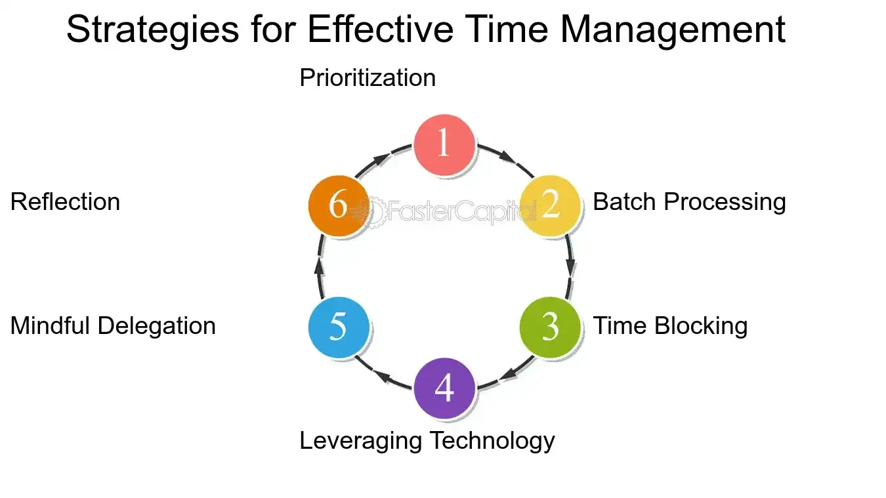

## Table of Contents

## What is time arbitrage?

Time arbitrage is a strategy where someone makes money by using their time in a different way than most people. It means doing things that take a lot of time but don't cost much money, while others might spend money to save time. For example, someone might spend hours researching and buying a cheap flight instead of paying more for a quicker, easier option.

This strategy can be useful in investing, too. Instead of following the fast-paced trends that many investors chase, a person using time arbitrage might spend a lot of time looking for undervalued stocks or other investments that others might overlook. By taking the time to find these opportunities, they can potentially earn more money in the long run, even if it means waiting longer for the payoff.

## How does time arbitrage differ from other types of arbitrage?

Time arbitrage is different from other types of arbitrage because it focuses on using time as the main resource, rather than money or information. In traditional arbitrage, like currency arbitrage or merger arbitrage, people look for price differences in different markets or situations and try to make money by buying low in one place and selling high in another. Time arbitrage, on the other hand, involves spending a lot of time to find opportunities that others might miss because they are too busy or impatient.

For example, in stock market arbitrage, someone might buy a stock on one exchange where it's cheaper and sell it on another where it's more expensive, making a quick profit from the price difference. In contrast, someone using time arbitrage might spend weeks or months researching a company that is currently undervalued, waiting for the market to recognize its true value and for the stock price to rise. This approach requires patience and a long-term perspective, which sets it apart from the immediate, often short-term gains sought in other arbitrage strategies.

## What are the basic principles behind time arbitrage?

Time arbitrage is all about using your time in a smart way to find money-making opportunities that others might miss. Instead of spending money to save time, like buying a more expensive flight to avoid long layovers, someone using time arbitrage would spend the time to find a cheaper flight. This strategy can be used in everyday life, like shopping for deals, or in investing, where someone might spend a lot of time researching undervalued stocks that others might not have the patience to look into.

The key idea is that by spending time where others spend money, you can find value that others overlook. This could mean doing things yourself instead of paying someone else to do them, or it could mean taking the time to learn a new skill that will save you money in the long run. Time arbitrage works because not everyone has the same amount of time or the willingness to use their time in this way, so those who do can gain an advantage.

## Can you provide examples of time arbitrage in financial markets?

In financial markets, time arbitrage can be seen when someone spends a lot of time researching a small company that most investors don't know about. This person might find that the company is undervalued, meaning its stock price is lower than it should be based on its true worth. By buying the stock and waiting patiently, the investor can make a profit when the market finally realizes the company's value and the stock price goes up. This is different from other investors who might focus on well-known stocks and quick trades, not wanting to wait for a long-term payoff.

Another example of time arbitrage in financial markets is when someone spends time analyzing old financial reports and data to find patterns that others might miss. For instance, an investor might discover that a certain type of stock tends to do well after a specific economic event. By waiting for that event and then buying the stock, the investor can make money while others might not have the patience to do this kind of detailed, long-term research. This approach requires a lot of time and effort upfront, but it can lead to big rewards if the investor is right.

## What are the key factors that enable time arbitrage?

The key factors that enable time arbitrage are having a lot of time and being patient. Time arbitrage works because not everyone has the same amount of time or the willingness to use their time in this way. Someone who can spend hours or days researching a cheap flight or a good investment can find deals that others might miss because they are too busy or want quick results.

Another important [factor](/wiki/factor-investing) is being able to wait for the right moment. Time arbitrage often means waiting a long time before seeing any profit. For example, an investor might spend months studying a company that nobody else is looking at, waiting for the stock price to go up. This requires not just time, but also the patience to stick with a plan even when it takes a long time to pay off.

## How can an individual or institution identify opportunities for time arbitrage?

To identify opportunities for time arbitrage, an individual or institution needs to look for things that take a lot of time but can save money or make money in the long run. This means spending time on research and analysis that others might not want to do because it's too slow or boring. For example, someone might spend hours comparing prices and looking for deals on flights or other big purchases. In the stock market, this could mean studying small companies that most investors don't know about, trying to find ones that are undervalued and could be worth a lot more in the future.

Another way to find time arbitrage opportunities is to look at patterns and trends that take a long time to show up. This could mean going through old financial reports and data to see if there are any patterns that repeat over time. For instance, an investor might notice that a certain type of stock does well after a specific economic event. By waiting for that event and then buying the stock, they can make money while others might not have the patience to do this kind of detailed, long-term research. The key is to be willing to spend a lot of time looking for these opportunities and to be patient enough to wait for them to pay off.

## What are the risks associated with time arbitrage?

Time arbitrage can be risky because it takes a long time to see if it works. When you spend a lot of time looking for deals or researching stocks, you might not make money right away. Sometimes, the deals you find might not be as good as you thought, or the stocks you buy might not go up in value. If you wait a long time and it doesn't work out, you could lose money and feel like you wasted your time.

Another risk is that things can change while you're waiting. In the stock market, news or events can make the value of a company go down, even if you thought it was going to go up. If you're trying to save money on a big purchase, the price might go up before you can buy it. Time arbitrage needs patience, but sometimes waiting too long can make you miss out on other opportunities that could have been better.

## How does technology impact the effectiveness of time arbitrage strategies?

Technology can make time arbitrage easier and more effective. With the internet and computers, people can research and find information much faster than before. For example, someone looking for a cheap flight can use websites to compare prices from many airlines in just a few minutes. In the stock market, technology lets investors look at lots of data and find undervalued stocks quickly. This means people can spend less time searching for opportunities and more time thinking about them.

But technology also makes time arbitrage harder in some ways. Because everyone can use the same tools, it's harder to find deals or investments that others don't know about. If everyone is using the same websites to find cheap flights, the best deals might get taken quickly. In the stock market, if everyone can see the same data, it's harder to find a company that's undervalued because other investors might see it too. So, while technology helps find opportunities faster, it also means more competition, making time arbitrage more challenging.

## What historical events or case studies best illustrate the use of time arbitrage?

One famous example of time arbitrage is how Warren Buffett made his money. Buffett is known for buying stocks in companies that other people didn't think were worth much. He spent a lot of time studying these companies, waiting for them to become more valuable. One big success was when he bought shares in American Express in the 1960s. The company had some problems, so its stock price was low. But Buffett believed in the company's future and waited patiently. Over time, American Express did well, and Buffett made a lot of money from his investment.

Another example is how some people made money from the housing market crash in 2008. While many people were buying houses at high prices, a few investors saw that the prices were too high and would go down. They spent time researching and waiting for the right moment. When the housing market crashed, these investors bought houses at very low prices. They waited for the market to recover, and then sold the houses for much more money. This shows how time arbitrage can work by being patient and waiting for the right time to make a move.

## How do regulatory environments affect time arbitrage practices?

Regulatory environments can make time arbitrage harder or easier. If there are a lot of rules about what you can invest in or how long you have to wait before selling, it can limit the ways you can use time arbitrage. For example, if the government says you have to hold onto a stock for a certain amount of time before selling it, that might help people who are using time arbitrage because they are already planning to wait a long time. But if the rules change a lot or are hard to understand, it can make it tough to know if your time arbitrage plan will work.

On the other hand, some regulations can help time arbitrage. If the rules make it so that fewer people are looking at certain investments, it might be easier to find undervalued opportunities. For example, if there are strict rules about what kinds of stocks banks can invest in, regular investors might be able to find good deals in areas that banks can't touch. So, while regulations can add complexity and risk, they can also create unique opportunities for those willing to spend the time to understand and navigate them.

## What advanced techniques are used to optimize time arbitrage?

One advanced technique to optimize time arbitrage is using data analysis and [machine learning](/wiki/machine-learning). These tools help people look at a lot of information quickly and find patterns that might be hard to see otherwise. For example, an investor might use a computer program to go through years of stock market data to find companies that are undervalued. This can save time on the research part, letting the investor spend more time thinking about the best way to use the information they find.

Another technique is to use different time zones to your advantage. If you're looking for deals on flights or stocks, you might find better prices if you check at times when fewer people are looking. For example, checking stock prices late at night or early in the morning might help you find better deals because fewer people are trading at those times. This can help you take advantage of time arbitrage by finding opportunities that others might miss because they're not looking at the right time.

## How might future trends influence the viability of time arbitrage?

Future trends like more automation and better technology could change how well time arbitrage works. With computers and [artificial intelligence](/wiki/ai-artificial-intelligence) getting better at looking at data, it might be harder to find deals or investments that others don't know about. If everyone can use these tools, the best opportunities might get taken quickly. But, if you can use technology in a smart way, like using it to find patterns that others miss, you might still be able to make time arbitrage work for you.

Another trend that could affect time arbitrage is how people's time and money change. If people have less time because they're working more, they might be less likely to spend a lot of time looking for deals or waiting for investments to pay off. But if people start valuing their time more, they might be more willing to spend money to save time, which could make time arbitrage even more valuable. So, the future of time arbitrage will depend a lot on how technology and people's lives change.

## What is Understanding Time Arbitrage?

Time arbitrage is a strategy that takes advantage of short-term price fluctuations in the stock market that do not accurately reflect a company's long-term fundamental value. This approach allows investors to purchase stocks they believe are temporarily undervalued, expecting that the market will eventually correct the price to align with the inherent worth of the company. 

Legendary investor Warren Buffett has exemplified the use of time arbitrage. During times of market volatility, he has acquired shares of fundamentally strong companies whose stock prices dipped due to external market pressures rather than intrinsic business problems. This method relies heavily on a thorough analysis of a company's financial health, competitive position, and growth prospects.

To successfully employ time [arbitrage](/wiki/arbitrage), investors need to develop a comprehensive understanding of a company's fundamentals. This involves analyzing various financial metrics and indicators, such as the price-to-earnings ratio (P/E ratio), earnings growth, return on equity (ROE), and debt-to-equity ratio. By assessing these factors, investors can differentiate between stocks experiencing temporary price drops and those undergoing genuine devaluation. 

Mathematically, consider a stock's intrinsic value $V_0$ and its market price $P_0$. The objective of time arbitrage is to identify situations where:

$$
P_0 < V_0
$$

This inequality suggests that the current market price is less than the stock's intrinsic value, presenting a potential opportunity for time arbitrage. 

Moreover, the strategy often requires patience and the ability to withstand market pressures, as it may take time for the market price to adjust and reflect the true value of the stock. Thus, time arbitrage is not merely a test of analytical skills but also of investors’ temperament to endure short-term [volatility](/wiki/volatility-trading-strategies) while waiting for the anticipated market correction.

## References & Further Reading

[1]: Fama, E. F. (1970). "[Efficient Capital Markets: A Review of Theory and Empirical Work.](https://www.jstor.org/stable/2325486)" The Journal of Finance, 25(2), 383-417.

[2]: Lo, A. W., & MacKinlay, A. C. (1990). "[When Are Contrarian Profits Due to Stock Market Overreaction?](https://www.jstor.org/stable/2962020)" The Review of Financial Studies, 3(2), 175-205.

[3]: Cootner, P. H. (1964). "[The Random Character of Stock Market Prices.](https://archive.org/details/randomcharactero00coot)" MIT Press.

[4]: Chan, E. (2009). "[Quantitative Trading: How to Build Your Own Algorithmic Trading Business.](https://github.com/ftvision/quant_trading_echan_book)" John Wiley & Sons.

[5]: Lopez de Prado, M. (2018). "[Advances in Financial Machine Learning.](https://www.amazon.com/Advances-Financial-Machine-Learning-Marcos/dp/1119482089)" Wiley.

[6]: Kritzman, M. (1994). "[What Practitioners Need to Know...About Market Efficiency.](https://www.semanticscholar.org/paper/What-Practitioners-Need-to-Know-Kritzman/b36c55ee5e63ba33c8e4111d8104e5e15b135c32)" Financial Analysts Journal, 50(1), 14-18.

[7]: Jansen, S. (2020). "[Machine Learning for Algorithmic Trading.](https://github.com/stefan-jansen/machine-learning-for-trading)" Packt Publishing.

[8]: Aronson, D. R. (2007). "[Evidence-Based Technical Analysis: Applying the Scientific Method and Statistical Inference to Trading Signals.](https://onlinelibrary.wiley.com/doi/book/10.1002/9781118268315)" Wiley.

[9]: Bachelier, L. (1900). "[Theory of Speculation](https://www.investmenttheory.org/uploads/3/4/8/2/34825752/emhbachelier.pdf)." In The Random Character of Stock Market Prices, MIT Press.