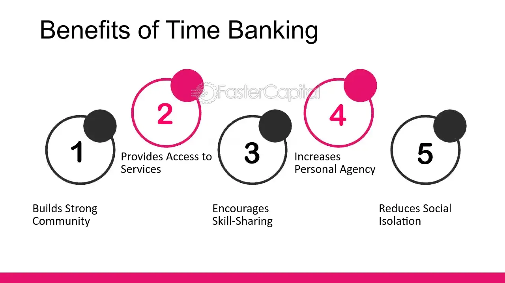

## Table of Contents

## What is time banking?

Time banking is a system where people exchange services without using money. Instead of paying with dollars or euros, people use time as a currency. For example, if you spend one hour helping someone with their garden, you earn one time credit. You can then use that credit to get help from someone else, like asking them to help you with your computer for one hour.

This system helps build community because it encourages people to help each other. It's based on the idea that everyone's time is equally valuable, no matter what they do. Time banking can be used for many different services, like cooking, tutoring, or fixing things around the house. It's a way for people to share their skills and time, making life easier for everyone in the community.

## How does time banking work?

Time banking works by people trading their time and skills instead of using money. If you help someone for an hour, you get one time credit. You can then use that credit to get help from someone else for the same amount of time. For example, if you spend an hour helping a neighbor with their garden, you earn one time credit. Later, you can use that credit to ask someone to help you with your computer for an hour.

This system is run by a group or organization that keeps track of everyone's time credits. They use a special computer system or a simple list to make sure everyone's time is counted fairly. People can join the time bank by signing up and offering the skills they have. The time bank helps match people who need help with those who can give help. This way, everyone in the community can benefit from each other's time and skills.

## What are the basic principles of time banking?

Time banking is based on the idea that everyone's time is equally valuable. No matter what job you do, whether you're a doctor or a gardener, an hour of your time is worth the same as anyone else's hour. This principle helps to build a sense of fairness and respect in the community. It encourages people to help each other, knowing that their time is valued just as much as anyone else's.

Another key principle is that everyone can both give and receive help. You don't just help others; you can also ask for help when you need it. This creates a cycle of giving and receiving that strengthens community bonds. Time banking is about building relationships and supporting each other, making life easier and more connected for everyone involved.

## What are the benefits of participating in a time bank?

Participating in a time bank can help you save money. Instead of paying for services like babysitting or home repairs, you can use time credits. This means you can get the help you need without spending money. It's like trading favors, but everyone's time is worth the same, so it's fair for everyone.

Time banking also helps you meet new people and make friends. When you join a time bank, you get to know others in your community who have different skills. You can learn new things from them and share your own skills too. This can make your community stronger and more connected, as everyone helps each other out.

Another benefit is that time banking can make you feel good about yourself. When you help others, it can boost your confidence and make you feel useful. Knowing that your time is valued just as much as anyone else's can also make you feel more equal and respected in your community.

## What are the potential drawbacks of time banking?

One potential drawback of time banking is that it might not work well for everyone. Some people might not have the time or the skills to offer in exchange for the help they need. For example, if you need a plumber and no one in the time bank has that skill, you might still have to pay for the service with money. Also, if you are very busy, you might find it hard to find the time to help others, which means you won't earn enough time credits to get the help you need.

Another issue is that time banking relies on trust and good communication. If people don't keep their promises or if there are misunderstandings, it can cause problems. For instance, if someone agrees to help you but then doesn't show up, you might feel let down. The system also needs someone to keep track of everyone's time credits, and if this isn't done well, it can lead to disagreements and confusion.

## How can someone get started with time banking?

To get started with time banking, you need to find a local time bank. You can search online or ask around in your community to see if there's one near you. Once you find a time bank, you can sign up to become a member. Usually, you'll need to fill out a form with your name, contact information, and the skills you can offer. Some time banks might ask you to attend a meeting or an orientation session to learn more about how they work.

After you've joined, you can start offering your time and skills to others. You can let the time bank know what you're willing to do, like helping with gardening, cooking, or tutoring. When someone needs your help, the time bank will connect you with them. You'll help them for a certain amount of time, and you'll earn time credits for that. You can then use those credits to get help from someone else in the time bank when you need it. It's all about sharing and helping each other out in the community.

## Can you provide examples of successful time banking programs?

One successful time banking program is the TimeBank in Madison, Wisconsin. It started in 1995 and has grown to include thousands of members. People in the community help each other with things like fixing bikes, giving rides, and teaching music. The program has helped bring people together and make the community stronger. It's easy to join and use, so many people like it.

Another example is the TimeBank in London, UK. It began in 2000 and now has hundreds of members. People trade time for things like cooking meals, helping with homework, and even walking dogs. The TimeBank has made it easier for people to get the help they need without spending money. It's a great way for neighbors to meet and support each other.

A third successful time banking program is the hOurworld TimeBank in Florida. Started in 2005, it connects people across different cities. Members help each other with services like home repairs, gardening, and language tutoring. The program has shown that time banking can work well even in a large area. It helps people feel more connected and valued in their community.

## How does time banking impact local communities?

Time banking helps make local communities stronger and more connected. When people join a time bank, they get to know their neighbors better. They share their skills and time, which makes everyone feel more helpful and valued. This can lead to new friendships and a sense of belonging. People feel good about helping each other, and it makes the community a nicer place to live.

Time banking also helps people save money. Instead of paying for services like babysitting or home repairs, people can use time credits. This means they can get the help they need without spending money. It's like trading favors, but everyone's time is worth the same, so it's fair. This can make life easier for everyone in the community, especially for those who might not have a lot of money.

## What role does technology play in modern time banking systems?

Technology helps make time banking easier and more organized. Special computer programs and apps keep track of everyone's time credits. This means people can see how many credits they have and what services they can get. They can also sign up for services and find people who need help, all from their phone or computer. It's like having a helper that makes sure everything is fair and easy to use.

Using technology also helps time banks reach more people. With the internet, time banks can connect people from different places, not just in one neighborhood. This means more people can join and share their skills. It makes the time bank bigger and more useful for everyone. Technology helps keep everything running smoothly and makes it easier for people to help each other.

## How do time banks handle issues of quality and accountability?

Time banks handle issues of quality and accountability by setting clear rules and expectations for members. When someone joins a time bank, they agree to do their best work and show up when they say they will. If there's a problem with the quality of a service, the time bank can help solve it. They might talk to both people involved and find a way to make things right. This could mean redoing the service or finding someone else to help. The time bank keeps track of everything to make sure everyone is treated fairly.

Another way time banks ensure accountability is through feedback and reviews. After someone gets help, they can share their thoughts on how it went. This helps the time bank know if members are doing a good job. If someone keeps getting bad reviews, the time bank might talk to them about improving. This system helps keep the quality high and makes sure everyone is happy with the help they get. It's all about making sure the community stays strong and everyone feels good about helping each other.

## What are the legal and tax implications of participating in time banking?

Time banking can have some legal and tax issues, but it depends on where you live. In many places, time banking is seen as a way for people to help each other without using money, so it might not be taxed. But if you get money or valuable things in exchange for your time, it could be seen as income and you might have to pay taxes on it. It's a good idea to check with your local government or a tax expert to know for sure.

Some countries have rules about what counts as work and what doesn't. If you're helping someone in a time bank, it might not be seen as a job, so you don't need to worry about things like work permits or minimum wage laws. But if the service you're giving is something you usually get paid for, like being a doctor or a lawyer, there might be more rules to follow. It's always best to ask someone who knows about local laws to make sure you're doing everything right.

## How can time banking be integrated with other economic systems?

Time banking can work together with other ways people earn and spend money. For example, some businesses might let you use time credits for small services or goods. This means you could use your time credits at a local shop to get something you need, like a haircut or a small item. This helps people save money and makes the time bank more useful. It also helps businesses get more customers and support the community.

Another way time banking can mix with other economic systems is by working with government programs. Some places might let you use time credits for things like public transport or community classes. This can make life easier for people who don't have a lot of money. It also helps make the community stronger because everyone is helping each other out. By mixing time banking with other ways of [earning](/wiki/earning-announcement) and spending, it can help more people and make the economy better for everyone.

## References & Further Reading

[1]: ["Algorithms for Hyper-Parameter Optimization"](https://papers.nips.cc/paper/4443-algorithms-for-hyper-parameter-optimization.pdf) by J. Bergstra, R. Bardenet, Y. Bengio, & B. Kégl, Advances in Neural Information Processing Systems 24, 2011.

[2]: ["Advances in Financial Machine Learning"](https://www.amazon.com/Advances-Financial-Machine-Learning-Marcos/dp/1119482089) by Marcos Lopez de Prado, Wiley, 2018.

[3]: ["Evidence-Based Technical Analysis: Applying the Scientific Method and Statistical Inference to Trading Signals"](https://www.amazon.com/Evidence-Based-Technical-Analysis-Scientific-Statistical/dp/0470008741) by David Aronson, John Wiley & Sons, 2006.

[4]: ["Machine Learning for Algorithmic Trading"](https://github.com/stefan-jansen/machine-learning-for-trading) by Stefan Jansen, Packt Publishing, 2020.

[5]: ["Quantitative Trading: How to Build Your Own Algorithmic Trading Business"](https://www.amazon.com/Quantitative-Trading-Build-Algorithmic-Business/dp/1119800064) by Ernest P. Chan, Wiley, 2008.