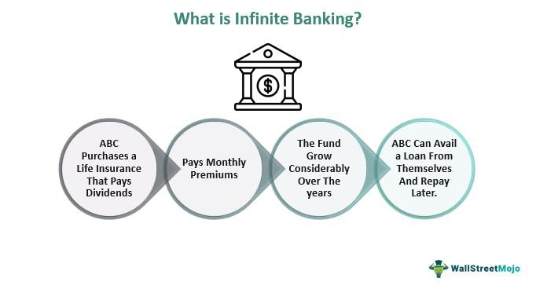

Trading systems have undergone a significant evolution, transitioning from ancient barter systems to complex contemporary methodologies. The barter system, as one of the earliest forms of trade, involved the direct exchange of goods and services without a standardized medium. This system, while foundational in human economic history, presented challenges such as the necessity of a "double coincidence of wants," where traders needed to have mutually beneficial goods for an exchange to proceed.

In recent times, barter communities and time banking have emerged as modern adaptations of these age-old practices, offering unique perspectives on community engagement and reciprocal trade. Barter communities continue to facilitate exchanges without money, relying on community trust and shared resources. Time banking, specifically, substitutes time for currency, allowing participants to trade hours of service—a concept that resonates deeply with the cooperative ethos of early barter but adapts it to modern societal needs. These systems exemplify how traditional practices can be reinterpreted in today's economic environment, providing alternatives to conventional monetary systems.



Simultaneously, the landscape of trading has been transformed by technological advancements, particularly through the rise of algorithmic trading. Algorithmic trading is defined by the use of computer algorithms to automate trade executions at high efficiency and speed. This shift from manual trading to automation incorporates artificial intelligence and big data analytics, enhancing decision-making processes and optimizing trading strategies. Such technologies have revolutionized trading practices, allowing traders to process vast amounts of data quickly and accurately, leading to more informed and strategic investment decisions.

The evolution of trading methodologies—from barter to digital algorithmic trading—mirrors broader economic transformations and technological progress. Modern trading strategies underscore the importance of leveraging technology to optimize efficiency and scalability. In this continuously changing landscape, embracing the interplay of traditional wisdom and cutting-edge technology is crucial for navigating future economic challenges and opportunities. This ongoing cycle of innovation reflects the dynamism of economic systems and highlights the potential for future trading success.

## Table of Contents

## The Barter System and Its Legacy

The barter system represents one of the earliest forms of trade prior to the development of monetary economies. Originating in prehistoric times, barter involved the direct exchange of goods and services without the use of money. This system enabled early humans to obtain goods and services they could not produce themselves, facilitating survival and cohabitation.

A significant challenge faced by barter systems is the necessity of what economists term a "double coincidence of wants." This means that for a successful trade to occur, each participant must possess a good or service the other desires. For instance, if a farmer with surplus grain wanted to trade for cloth but the cloth maker did not require grain, the barter would be unsuccessful. This limitation often hindered the scalability and efficiency of barter systems.

In its simplest form, barter is indicative of community exchange and reciprocal trade. As societies grew, so did the complexity of these exchanges. Communities developed systems that went beyond mere exchange; they established social norms and agreements that enforced reciprocity. These systems allowed for indirect barter, where intermediaries and broader community networks could facilitate trades without direct want pairs.

The legacy of barter systems persists today, with insights from these early practices informing modern exchanges and community frameworks. Contemporary trading communities, such as time banks, reflect the original spirit of barter. Time banking is a system where hours worked are exchanged instead of goods, allowing individuals to trade time and skills rather than physical items. This modern adaptation emphasizes reciprocity and mutual benefit, similar to ancient practices but facilitated by technology and social networking, overcoming some of the double coincidence limitations. 

Barter systems laid the groundwork for more sophisticated economic exchanges, and their principles continue to influence how societies consider value and reciprocity in trade. By understanding these foundations, we can better appreciate and apply them to contemporary models of exchange, enhancing community cohesion and economic resilience.

## Community Exchange and Time Banking

Time banking represents a modern evolution of community exchange systems, built upon the principle of reciprocal service exchange without the use of conventional money. This concept roots itself in the value of time rather than the monetary value of services rendered. In a time bank, one hour of labor is typically exchanged for another hour, regardless of the service type, emphasizing equality and community support. 

The principles governing time banking and community currencies focus on creating an equitable system where services rendered are valued by the time required to perform them, rather than the market rate or economic status of the service provider. This system encourages a form of social capital, fostering trust and cooperation within communities. Time banking aims to strengthen community ties by utilizing local networks to fulfill individual needs, promoting mutual aid, and sustainability.

Social networks play a critical role in facilitating barter-like exchanges within time banking systems by providing a platform for members to communicate, exchange services, and build trust. These networks help create and maintain a detailed database of skills and needs, matching service requests with available skills within the community efficiently. Technology, particularly online platforms, enhances accessibility and coordination by allowing real-time tracking of hours exchanged, service histories, and balancing of community resources.

Several case studies highlight the successful implementation of time banking around the world. One such example is the 'Time Dollar Networks' established in the United States, which enable communities to pool resources and services effectively. Another successful implementation is found in Japan, with the 'Fureai Kippu' (Caring Relationship Tickets) system, which caters to the elderly by exchanging caring services for credits. The 'Spice Time Credits' initiative in the United Kingdom offers participants time credits for volunteer work, which can be spent on various leisure activities, thereby encouraging civic engagement.

Through time banks, communities are able to address social and economic needs by building networks of mutual support. By focusing on time as the primary currency, these systems promote inclusivity and equal participation, reducing economic disparities and enhancing community resilience. As modern challenges evolve, time banking offers a flexible, community-based approach to addressing service exchange and resource allocation, fostering connection and collective well-being.

## Challenges and Innovations in Barter Systems

Barter economies, characterized by the direct exchange of goods and services without a common medium of exchange like money, have historically presented several challenges, primarily stemming from the need for a "double coincidence of wants." This requirement often limited the efficiency of barter transactions, as both parties involved had to possess precisely what the other wanted at the same time. Consequently, managing finite resources and diverse value perceptions became intrinsic impediments within these systems.

The introduction of technology into traditional barter practices has resulted in innovative solutions aimed at mitigating these challenges. Online barter platforms, for instance, have broadened the scope of potential exchanges by connecting users globally, thus increasing the likelihood of finding a match in wants and offers. These platforms often employ sophisticated matching algorithms that enhance the efficacy of barter by quickly linking compatible parties. 

Moreover, advances in technology have facilitated the emergence of community-driven barter systems such as time banking. Time banking leverages the concept of trading hours rather than goods or services, where one hour of work is deemed equivalent in value across all types of work. Such systems have gained traction by focusing on equitable exchanges and fostering stronger community ties. Many modern communities have successfully adapted this model to suit local needs, thus reinforcing reciprocation and collective support.

Despite these innovations, barter systems inherently face economic limitations and scalability issues. The lack of a standardized measure of value can complicate the perceived fairness of exchanges and limit the adoption of barter on a larger scale. Moreover, the absence of a central governing structure in barter systems can lead to inconsistencies in trade practices and hinder scalability. Addressing these challenges often involves integrating technology to track and manage exchanges, thereby enhancing trust and reliability within the system.

In conclusion, while traditional barter economies have their constraints, innovations such as technology integration and time banking have revitalized this ancient practice, enabling it to address some of its longstanding challenges effectively. The continued evolution and adaptation of barter systems demonstrate their potential to complement contemporary economic models, especially in fostering community-centric trade practices.

## The Rise of Algorithmic Trading

Algorithmic trading, a method of executing orders using automated pre-programmed trading instructions, has fundamentally transformed financial markets. By leveraging complex algorithms, traders can execute large volumes at speeds and frequencies that are impossible for human traders. This innovation began gaining traction in the late 20th century and has since evolved into a dominant force in contemporary trading.

The advent of [algorithmic trading](/wiki/algorithmic-trading) marked a significant shift from traditional manual trades, which required traders to directly input buy or sell orders. Early algorithms, typically rule-based systems, automated simple tasks such as [market making](/wiki/market-making) and statistical [arbitrage](/wiki/arbitrage). As computational power increased, more sophisticated strategies employing [machine learning](/wiki/machine-learning) and [artificial intelligence](/wiki/ai-artificial-intelligence) emerged. These advancements allowed algorithms to analyze vast datasets, anticipate market trends, and make real-time trading decisions autonomously.

Three critical metrics define the efficiency of algorithmic trading: speed, efficiency, and market impact. Speed refers to the execution time of trades, which can be as short as milliseconds. Low latency is essential in rapidly moving markets where even small delays can result in significant price differences. Efficiency assesses how well the algorithm achieves intended objectives, minimizing costs like slippage and transaction fees. Market impact measures how trading affects stock prices; an ideal algorithm minimizes this, preserving the natural market dynamics.

Algorithmic trading presents numerous benefits, such as increased [liquidity](/wiki/liquidity-risk-premium) and reduced human error, thereby improving overall market efficiency. Automated systems operate incessantly, reacting swiftly to market changes, thus offering superior liquidity. Moreover, automation minimizes emotional decision-making and fatigue-related errors, commonly associated with human traders.

However, complexities arise with algorithm-driven systems. They can amplify systemic risks, as seen in the "Flash Crash" of 2010, where rapid price fluctuations within minutes caused market panic. The use of high-frequency trading ([HFT](/wiki/high-frequency-trading-strategies)) exacerbates this, creating potential for cascading failures. Regulators and market participants constantly seek balance between fostering innovation and ensuring market stability.

In conclusion, algorithmic trading has revolutionized financial markets by integrating robust automated strategies. The continuous evolution from manual trades to sophisticated AI-driven systems shapes modern trading landscapes, presenting both challenges and significant opportunities. Understanding these dynamics is crucial for those operating within contemporary financial markets.

## Technological Advancements Transforming Trading

Technological advancements have dramatically reshaped trading strategies, emphasizing the importance of computational power and data analysis. Modern trading techniques increasingly rely on vast amounts of data processed at high speeds, allowing for informed decision-making and the development of sophisticated trading models. These innovations are driven by artificial intelligence (AI) and big data analytics, which enable traders to identify patterns and predict market trends with unprecedented accuracy.

AI and big data analytics have become instrumental in transforming trading techniques. AI algorithms can process large datasets much faster than human analysts, extracting valuable insights and identifying opportunities in volatile markets. Machine learning models, a subset of AI, learn from historical data to make predictions. These predictions adapt over time, improving their accuracy as more data becomes available. For example, algorithms can analyze historical price movements, trading volumes, and news sentiment to forecast future price changes.

The impact of technology on trading efficiency can be demonstrated through several case studies. High-frequency trading (HFT) firms employ algorithmic strategies that execute trades within milliseconds, exploiting minute price discrepancies across markets. These firms rely on powerful computing infrastructure and advanced algorithms to maintain a competitive edge. In 2010, the introduction of the "Flash Crash" incident highlighted the systemic implications of HFT, leading to improved regulatory oversight and risk management practices.

Another case study involves the use of sentiment analysis in trading strategies. Financial markets are heavily influenced by investor sentiment, and AI algorithms can analyze social media posts, news articles, and other online content to gauge market mood. Hedge funds and trading firms utilize sentiment analysis to make informed decisions, aligning their trades with the collective psychology of the market. This approach demonstrates how technology can enhance trading efficiency by integrating qualitative data analysis into quantitative strategies.

Future prospects in trading involve merging algorithmic systems with traditional trading wisdom. While AI and automation have proven highly effective, integrating human intuition and experience remains paramount. Human traders possess the ability to comprehend complex narratives and contextualize information, complementing algorithmic models. A hybrid approach that combines machine precision with human insight can optimize trading strategies. This involves developing tools that leverage AI to identify potential trade opportunities, while seasoned traders assess the broader market landscape before executing trades.

Additionally, advancements in quantum computing hold promise for revolutionizing trading. Quantum computers, though still in the early stages of development, offer significant computational power that could solve complex optimization problems currently out of reach for classical computers. If realized, quantum computing could enhance the speed and accuracy of algorithmic trading systems, further transforming the industry.

Python continues to gain popularity in developing trading algorithms due to its simplicity and versatility. Libraries such as Pandas for data manipulation, NumPy for numerical computations, and SciKit-learn for machine learning provide robust tools for crafting sophisticated trading models. Here is a simple example of a Python script that uses historical stock data to create a basic moving average crossover strategy:

```python
import pandas as pd

# Load historical data
data = pd.read_csv('historical_stock_data.csv')
data['Date'] = pd.to_datetime(data['Date'])
data.set_index('Date', inplace=True)

# Calculate moving averages
data['Short_MA'] = data['Close'].rolling(window=40, min_periods=1).mean()
data['Long_MA'] = data['Close'].rolling(window=100, min_periods=1).mean()

# Define buy and sell signals
data['Signal'] = 0
data['Signal'][40:] = [1 if data['Short_MA'][i] > data['Long_MA'][i] else -1 for i in range(40, len(data))]

# Visualization (using matplotlib)
import matplotlib.pyplot as plt

plt.figure(figsize=(14, 7))
plt.plot(data['Close'], label='Stock Price')
plt.plot(data['Short_MA'], label='40-Day MA')
plt.plot(data['Long_MA'], label='100-Day MA')
plt.plot(data[data['Signal'] == 1].index, data['Short_MA'][data['Signal'] == 1], '^', color='g', lw=2, label='Buy Signal')
plt.plot(data[data['Signal'] == -1].index, data['Short_MA'][data['Signal'] == -1], 'v', color='r', lw=2, label='Sell Signal')
plt.title('Moving Average Crossover Strategy')
plt.xlabel('Date')
plt.ylabel('Price')
plt.legend()
plt.show()
```

By combining the power of computation with strategic insights, the landscape of trading continues to evolve, driven by technological innovations that expand the possibilities for traders worldwide.

## Visual Representation in Algorithmic Trading

Visual tools play a critical role in interpreting complex trading data within algorithmic trading systems. These tools help traders and analysts comprehend vast datasets and intricate models by providing intuitive and accessible representations of otherwise abstract numerical information.

Imagery simplifies the understanding of algorithmic models by transforming raw data and multifaceted outputs into digestible formats. Visualization techniques are crucial in identifying patterns, trends, and anomalies, which might be obscured in numerical data. For instance, candlestick charts illustrate price movements over time, revealing opening and closing prices, highs, and lows, which are pivotal in decision-making processes. Heat maps offer another powerful visualization tool, enabling traders to quickly recognize areas of high [volume](/wiki/volume-trading-strategy) or [volatility](/wiki/volatility-trading-strategies) within a trading period, facilitating swift strategical adjustments.

Modern algorithmic trading platforms often integrate multiple visual tools, such as scatter plots, line charts, and correlation matrices. These tools help traders to infer relationships between different financial instruments and market variables. For instance, a multi-asset correlation matrix can provide insights into how assets move in relation to each other, aiding in risk management and diversification strategies.

The integration of visual tools extends beyond static charts to interactive dashboards that allow real-time data manipulation and analysis. These dashboards enhance traders' ability to back-test strategies and simulate market conditions, providing a dynamic environment for strategy optimization.

Despite the undeniable benefits, there are challenges associated with the use of visual data in algorithmic trading. The sheer volume and complexity of data can lead to information overload, making it difficult for traders to focus on relevant aspects. Moreover, inaccurate or misleading visualizations can result in erroneous interpretations, potentially leading to detrimental trading decisions. Ensuring that visual tools offer clarity without oversimplifying complexities is essential for effective trading strategy formulation.

The benefits of using visual data are considerable. Such tools foster agile trading strategies by enabling quick adjustments in response to market shifts. For instance, during market turbulence, heat maps can rapidly pinpoint sectors showing unusual activity, allowing traders to reposition assets promptly. The ability to swiftly interpret and respond to market changes offers a competitive advantage and enhances overall trading performance.

In conclusion, visual representation is an indispensable aspect of algorithmic trading, offering a bridge between data complexity and human comprehension. The effective use of visual tools can significantly enhance trading strategy development but requires careful design and implementation to overcome potential pitfalls. As algorithmic trading continues to evolve, the role of visualization will likely expand, offering ever more sophisticated tools for navigating the complexities of financial markets.

## Conclusion

The progression from traditional barter systems to advanced contemporary trading methodologies underscores the dynamic nature of economic transactions and highlights the intertwined relationship between age-old practices and modern innovations. Traditional barter systems, despite their simplicity, laid the groundwork for understanding the importance of exchange and value, while modern trading methodologies exemplify how technology and community can redefine these concepts.

Trading systems have continuously evolved through a cycle of innovation, each iteration building on past practices while integrating technological advancements. This evolution is driven by the necessity to address the limitations faced by previous systems and to enhance efficiency, scalability, and engagement in trading practices. For instance, algorithmic trading represents a fusion of traditional market knowledge with technological prowess, offering enhanced speed and precision that manual trading could not achieve. It uses advanced algorithms to analyze vast datasets, allowing for real-time decision-making and automated trades that adapt to market fluctuations instantaneously.

The role of community and technology in transforming trading landscapes is becoming increasingly significant. Communities foster social exchange systems like time banking, which demonstrate how collaborative efforts can create equitable value exchanges without relying on conventional currency systems. Simultaneously, technology enables the scalability and adaptability of these systems, making them accessible and efficient on a global scale. These two elements – community and technology – function symbiotically, reinforcing each other's strengths and mitigating weaknesses inherent in isolated systems.

Embracing continuous change is an essential strategy for future trading success. By acknowledging the lessons learned from historical trading practices and integrating them with cutting-edge technologies, stakeholders can craft resilient and adaptive trading strategies. Incorporating visual tools and user-friendly interfaces can further simplify the interpretation of complex trading data, empowering even novice traders to engage in sophisticated market activities. Such an approach ensures that trading practices remain relevant and effective in response to the ever-changing economic landscape.

In conclusion, the bridge between traditional and modern trading practices is not merely a transition but a strategic evolution. By recognizing the value of legacy systems and exploiting the potential of technological advancements, the future of trading is poised to navigate new challenges and harness emerging opportunities effectively.

## References & Further Reading

[1]: ["Algorithms for Hyper-Parameter Optimization"](https://papers.nips.cc/paper/4443-algorithms-for-hyper-parameter-optimization.pdf) by J. Bergstra, R. Bardenet, Y. Bengio, & B. Kégl, Advances in Neural Information Processing Systems 24, 2011.

[2]: ["Advances in Financial Machine Learning"](https://www.amazon.com/Advances-Financial-Machine-Learning-Marcos/dp/1119482089) by Marcos Lopez de Prado, Wiley, 2018.

[3]: ["Evidence-Based Technical Analysis: Applying the Scientific Method and Statistical Inference to Trading Signals"](https://www.amazon.com/Evidence-Based-Technical-Analysis-Scientific-Statistical/dp/0470008741) by David Aronson, John Wiley & Sons, 2006.

[4]: ["Machine Learning for Algorithmic Trading"](https://github.com/stefan-jansen/machine-learning-for-trading) by Stefan Jansen, Packt Publishing, 2020.

[5]: ["Quantitative Trading: How to Build Your Own Algorithmic Trading Business"](https://www.amazon.com/Quantitative-Trading-Build-Algorithmic-Business/dp/1119800064) by Ernest P. Chan, Wiley, 2008.