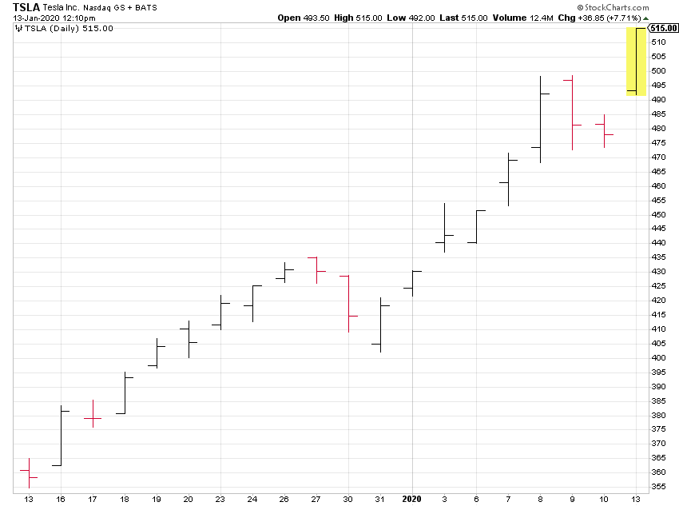

## Table of Contents

## What are time bars?

Time bars are a way to show how long something takes on a chart. They are often used in project management to help people see when tasks start and finish. Each bar on the chart represents a task, and the length of the bar shows how much time the task will take. This makes it easy to see the whole project timeline at a glance.

In trading, time bars are used to show price movements over set periods of time, like one hour or one day. Each bar on the chart represents the price changes during that time. Traders use these charts to spot patterns and make decisions about buying or selling. Time bars help make complex data easier to understand and use.

## How do time bars differ from regular bars?

Time bars and regular bars are different in how they show information. Time bars are used to show how long something takes. They are often used in project management to show when tasks start and end. Each bar on a time bar chart represents a task, and the length of the bar shows how much time that task will take. This helps people see the whole project timeline easily.

Regular bars, on the other hand, are used to show amounts or counts of things. They are often used in graphs to compare different groups or categories. For example, a regular bar chart might show how many apples and oranges were sold in a week. Each bar represents a different fruit, and the height of the bar shows how many were sold. This makes it easy to compare the amounts of different things.

In trading, time bars show price changes over set times, like an hour or a day. Each bar represents the price movement during that time. Traders use these charts to find patterns and decide when to buy or sell. Regular bars in trading might show the total [volume](/wiki/volume-trading-strategy) of trades for different stocks, helping traders see which stocks are more popular. So, time bars focus on time, while regular bars focus on amounts or counts.

## What is the purpose of using time bars in data analysis?

Time bars are used in data analysis to show how long things take. They help people see when tasks start and end in projects. By looking at a time bar chart, you can easily understand the whole timeline of a project. This makes it easier to plan and manage the project because you can see if tasks are taking too long or if they overlap.

In trading, time bars help show price changes over set times, like an hour or a day. Traders use these charts to find patterns in the prices. By looking at these patterns, traders can decide when to buy or sell stocks. Time bars make it easier to understand complex price data and make smart decisions based on that data.

## Can you explain how time bars are constructed?

Time bars are made by drawing a bar on a chart to show how long something takes. In project management, each bar represents a task. You start by deciding when the task begins and when it ends. Then, you draw a bar on the chart that starts at the beginning time and ends at the finish time. The length of the bar shows how much time the task will take. By putting all the task bars on the same chart, you can see the whole project timeline and how the tasks fit together.

In trading, time bars are used to show price changes over set times, like an hour or a day. To make a time bar, you look at the price data for that time period. The bar starts at the opening price and ends at the closing price. You can also add marks on the bar to show the highest and lowest prices during that time. By putting these bars next to each other on a chart, traders can see how prices change over time and spot patterns that help them decide when to buy or sell.

## What are the common time intervals used for time bars?

In project management, common time intervals for time bars are days, weeks, and months. These intervals help show how long tasks take in a project. For example, if a task takes 5 days, the bar on the chart will be 5 days long. This makes it easy to see the whole project timeline and plan when tasks should start and finish.

In trading, common time intervals for time bars are minutes, hours, and days. These intervals help traders see how prices change over time. For example, a 1-hour time bar shows the price changes in one hour. Traders use these bars to spot patterns and decide when to buy or sell stocks.

## How do time bars help in managing market data?

Time bars help in managing market data by showing how prices change over time. Traders use time bars to see patterns in the market. For example, a time bar might show the price changes in one hour. By looking at these bars, traders can see if prices are going up or down and decide when to buy or sell stocks. This makes it easier to understand complex price data and make smart decisions.

Time bars also help traders see trends over different time periods. They can use time bars for minutes, hours, or days to get a clear picture of the market. This helps them plan their trades better. For example, if a trader sees that prices go up every day at a certain time, they can use that information to make trades at the right time. Time bars make it easier to manage and analyze market data, helping traders make better choices.

## What are the advantages of using time bars over tick bars?

Time bars are good because they show price changes over set times, like an hour or a day. This makes it easy to see patterns in the market. Traders can look at time bars and see if prices go up or down at certain times. This helps them decide when to buy or sell stocks. Time bars are also easy to understand because they always show the same amount of time, so traders can compare different days or hours easily.

Tick bars, on the other hand, show price changes after a certain number of trades happen. This can make it hard to see patterns because the time between tick bars can be different. Time bars are better for seeing how prices change over time because they are always the same length. This makes it easier for traders to plan their trades and understand the market.

## In what scenarios would time bars be more beneficial than volume bars?

Time bars are more helpful when you want to see how prices change over set times, like every hour or every day. Traders use time bars to spot patterns in the market. For example, if prices go up every day at a certain time, traders can use this information to decide when to buy or sell stocks. Time bars are easy to understand because they always show the same amount of time, so it's easy to compare different days or hours. This makes time bars great for planning trades and understanding market trends over time.

Volume bars, on the other hand, show price changes after a certain amount of trading happens. This can make it hard to see patterns because the time between volume bars can be different. Time bars are better when you want to see how prices change over time because they are always the same length. This makes it easier for traders to plan their trades and understand the market. So, if you want to see how prices change over set times and spot patterns, time bars are more beneficial than volume bars.

## How can time bars be used to improve trading strategies?

Time bars can help traders see how prices change over time, like every hour or every day. By looking at these bars, traders can spot patterns in the market. For example, if prices go up every day at the same time, traders can use this information to decide when to buy or sell stocks. This helps traders make better choices because they can see if prices are going up or down at certain times. Time bars make it easy to compare different days or hours because they always show the same amount of time.

Using time bars also helps traders plan their trades better. They can look at time bars for different time periods, like minutes, hours, or days, to get a clear picture of the market. This can help them see trends and decide the best times to trade. For example, if a trader sees that prices often drop in the morning but go up in the afternoon, they can plan to buy in the morning and sell in the afternoon. Time bars make it easier to understand market data and use it to improve trading strategies.

## What are the limitations or challenges of using time bars?

Time bars can be tricky because they show price changes over set times, like an hour or a day. This means they might not show important price changes that happen quickly. For example, if a big news event makes prices jump in just a few minutes, a time bar might not show this clearly because it looks at the whole hour. This can make it hard for traders to see all the important price movements.

Another challenge is that time bars can make it hard to see how much trading is happening. They focus on time, not on how many trades are made. This means traders might miss out on understanding if a price change is because a lot of people are trading or just a few. Knowing the volume of trades can be important for making good trading decisions, so this can be a big limitation of using time bars.

## How do different time zones affect the use of time bars in global markets?

Different time zones can make using time bars tricky in global markets. Time bars show price changes over set times, like an hour or a day. But, when markets in different countries open and close at different times, it can be hard to compare time bars from one market to another. For example, if the New York market closes at 4 PM and the Tokyo market opens at 9 AM the next day, the time bars for these markets won't line up easily. This can make it harder for traders to see patterns that happen across different markets.

To deal with this, traders might use a common time zone, like UTC, to make time bars from different markets easier to compare. This way, they can see how prices change in New York and Tokyo at the same time, even though the markets are in different time zones. But even with a common time zone, traders still need to be careful because trading might be slower or faster at different times of the day in different places. This can affect how they use time bars to make trading decisions.

## What advanced techniques can be applied to optimize the use of time bars in high-frequency trading?

In high-frequency trading, time bars can be optimized by using smaller time intervals, like seconds or even milliseconds. Traders can look at these short time bars to see quick price changes and make fast trades. They can also use algorithms to automatically spot patterns in the time bars and decide when to buy or sell. This helps traders react quickly to the market and make more trades in a short time.

Another technique is to use multiple time frames at the same time. Traders can look at time bars for different lengths of time, like seconds, minutes, and hours, to get a full picture of the market. This helps them see both short-term and long-term trends. By combining these different views, traders can make better decisions and improve their high-frequency trading strategies.

## References & Further Reading

[1]: ["Advances in Financial Machine Learning"](https://www.amazon.com/Advances-Financial-Machine-Learning-Marcos/dp/1119482089) by Marcos Lopez de Prado

[2]: ["Evidence-Based Technical Analysis: Applying the Scientific Method and Statistical Inference to Trading Signals"](https://www.amazon.com/Evidence-Based-Technical-Analysis-Scientific-Statistical/dp/0470008741) by David Aronson

[3]: ["Machine Learning for Algorithmic Trading"](https://github.com/PacktPublishing/Machine-Learning-for-Algorithmic-Trading-Second-Edition) by Stefan Jansen

[4]: ["Quantitative Trading: How to Build Your Own Algorithmic Trading Business"](https://books.google.com/books/about/Quantitative_Trading.html?id=j70yEAAAQBAJ) by Ernest P. Chan

[5]: Aït-Sahalia, Yacine, and Jean Jacod. (2009). ["High Frequency Financial Econometrics."](https://collaborate.princeton.edu/en/publications/high-frequency-financial-econometrics) Journal of Political Economy, 119(1), 1-43.