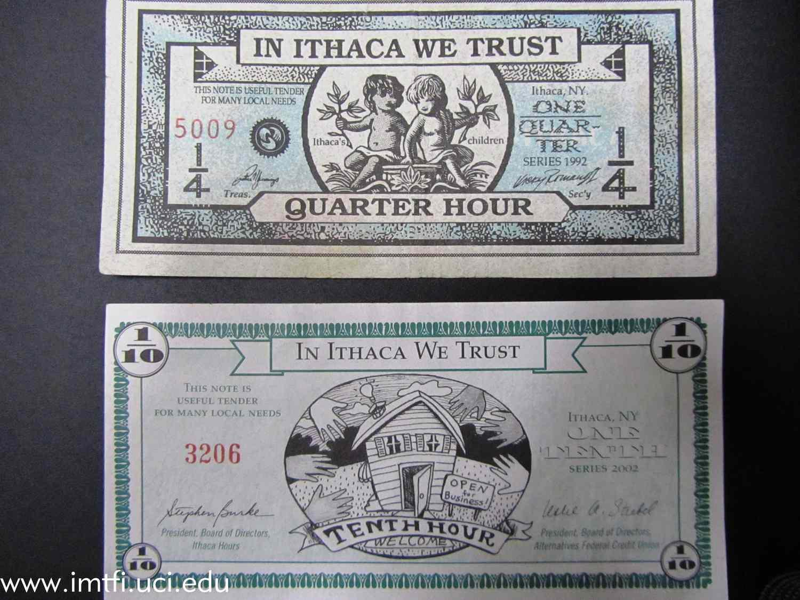

The ever-evolving global financial landscape presents numerous challenges that necessitate innovative solutions to bolster economic stability and resilience. Traditional financial systems, often reliant on fiat currencies and centralized institutions, face criticisms for their inability to adapt swiftly to local and global economic pressures. This has prompted communities around the world to seek alternative models of exchange that can offer more localized and flexible solutions.

Community exchange systems and alternative currencies have emerged as promising tools in this context. These systems provide mechanisms for trading goods and services that do not rely on conventional money, thus offering a buffer against economic volatility and fostering economic well-being at the community level. One key advantage of these systems is their ability to operate independently of national currencies, which can be vulnerable to inflation, political instability, and other macroeconomic factors.



Among the various forms of alternative currencies, time-based currencies are gaining attention for their unique approach to valuing exchanges. These currencies are rooted in the concept of equating time with economic value, allowing individuals to trade services based on the hours worked rather than monetary worth. This model not only encourages equitable trade but also helps build social capital by promoting reciprocity and mutual aid among participants.

An intriguing development in the sphere of alternative currencies is the intersection with algorithmic trading. Traditionally associated with financial markets, where algorithms execute trades to maximize profit and efficiency, these advanced computational techniques are now being explored for their potential to optimize transactions within community currency systems. By leveraging algorithmic trading, community exchanges can benefit from enhanced efficiency and data-driven insights, paving the way for innovative financial solutions that are tailored to the needs of specific communities.

This article aims to explore the synergies between community exchange systems, alternative currencies, and algorithmic trading. It will discuss how these elements interact to address contemporary economic challenges and examine case studies that illustrate the potential benefits and obstacles encountered in the practical implementation of these systems.

## Table of Contents

## Understanding Community Exchange Systems

Community exchange systems are localized platforms designed to enable trade and interaction within specific geographical or social networks. These systems operate as an alternative to mainstream financial systems, offering community members mechanisms to exchange goods and services without relying solely on traditional fiat currencies. By doing so, community exchange systems foster economic resilience, especially in times of financial instability or currency devaluation.

One of the core functions of community exchange systems is to act as a supplementary economic structure, supporting and enhancing the flow of goods and services within the community. This is achieved by providing a medium of exchange that is both accessible and relevant to local needs. Such systems often utilize alternative currencies that reflect the values and resources of the community, fostering a sense of ownership and empowerment among participants.

The implementation of community exchange systems can have significant implications for economic stability in challenging times. During periods of economic turmoil, when traditional financial systems may falter, community-based currencies can sustain economic activities and facilitate continued exchange. This capability supports community cohesion and ensures that local needs are met, reducing dependency on external financial sources.

Furthermore, community exchange systems can empower individuals by democratizing access to economic resources. By lowering barriers to participation, these systems enable individuals to engage in economic activities on their own terms, promoting inclusivity and participation. This empowerment is particularly pertinent in communities that face economic marginalization or limited access to conventional financial services.

In sum, community exchange systems play a crucial role in enhancing economic resilience and stability. By offering viable alternatives to traditional fiat currencies, they allow communities to retain greater control over their economic futures, particularly in times of financial uncertainty.

## Exploring Alternative Currencies

Alternative currencies are emerging as vital components within local economic systems, addressing unique community needs and reinforcing economic resilience beyond the capabilities of traditional fiat currencies. They possess the versatility to cater to diverse socio-economic environments by prioritizing community-specific values and principles.

Among the various forms of alternative currencies, time-based currencies express value through labor time instead of monetary value. Implemented via time banks, these currency systems emphasize equitable trade by allowing individuals to earn time credits for community service or personal exchanges. For instance, one hour of work is exchanged for one time credit, regardless of the nature of the service provided. This approach promotes inclusivity and egalitarianism within communities, often leading to strengthened social cohesion and mutual assistance networks.

Mutual credit systems present another influential model, where trade participants create interest-free credits among themselves. Unlike traditional debt structures, which incur interest over time, mutual credit systems establish a balance of credits and debits within a closed network. This mechanism supports a sustainable economic environment by enabling continual trade even when [liquidity](/wiki/liquidity-risk-premium) is low. Members can effectively manage resources while encouraging reciprocal trade relationships—a core tenet that bolsters financial stability and community perseverance.

Local Exchange Trading Systems (LETS) further represent innovative frameworks for promoting community trade. LETS operate within defined localities and involve networks of individuals who collectively manage the exchange of goods and services. Rather than utilizing cash, participants earn credits for services rendered and subsequently use those credits to acquire services from others in the network. This approach facilitates a circular economy, wherein resources are retained within the community, thus enhancing local economic resilience. LETS underscore the importance of trust and cooperation, emphasizing the interconnected nature of community well-being.

By applying principles of reciprocity and mutual support, alternative currencies inherently challenge conventional economic systems. These currencies emphasize relational and communal values over profit-centric models. Consequently, they empower communities to navigate economic uncertainties with a focus on collaboration and shared growth. Through their distinct characteristics and innovative frameworks, alternative currencies play a crucial role in reshaping local economies, fostering environment where local relationships are prioritized, and ensuring economic activities align with communal values and objectives.

## Time-Based Currencies: Concept and Implementation

Time-based currencies represent an innovative approach to fostering local economic resilience by assigning value to the hours of labor and skills exchanged between community members. Unlike traditional monetary systems, which typically rely on the backing of physical commodities or governmental guarantee, time-based currencies derive their worth from the equitable and reciprocal trade of time and services among individuals.

These currencies operate primarily through time banks, which serve as both repositories and facilitators of transactions. A time bank functions by allowing members to earn credits through providing services, which can then be exchanged for equivalent hours of services from other members. This system encourages mutual support and cooperation within communities, nurturing a sense of shared responsibility and social solidarity.

A pertinent example of time-based currency is the Ithaca HOURS, one of the longest-running alternative currency systems in the United States. Established in Ithaca, New York, this system assigns a one-hour unit to both goods and services, ensuring that every participant's time is valued equally. Ithaca HOURS not only facilitate transactions among individuals but also encourage local businesses to accept this currency, thus strengthening the community’s economic fabric.

Success stories like Ithaca HOURS demonstrate that time-based currencies can effectively foster community engagement and promote sustainable development. The model provides a platform for individuals who may be marginalized in traditional economies to contribute meaningfully to their communities, while simultaneously benefiting from reciprocated services.

Through these systems, participants have the opportunity to enhance their skillsets, expand their social networks, and develop a greater sense of belonging. Consequently, time-based currencies can act as catalysts for community-driven progress and empowerment.

## The Role of Algorithmic Trading in Alternative Currency Systems

Algorithmic trading uses sophisticated computer algorithms to execute trades automatically and efficiently, optimizing timing to take advantage of market conditions. This technology, traditionally associated with large-scale financial markets, is increasingly finding applications in alternative currency systems—such as community currencies—due to its ability to enhance the efficiency and effectiveness of trades within these localized exchange systems.

Algorithmic trading can support community currencies by leveraging data-driven insights to streamline operations. By analyzing transaction data, these algorithms can predict trading patterns and recommend optimal trading strategies, thus improving liquidity and value stability within the system. For instance, they can help identify ideal transaction counterparties, manage currency circulation, and suggest pricing adjustments based on real-time data. These functionalities can be especially critical in alternative currency markets, which may suffer from limited trading volumes and a lack of sophisticated market-making mechanisms.

Moreover, the integration of [algorithmic trading](/wiki/algorithmic-trading) into community currencies can lead to innovative financial solutions by enabling real-time responsiveness to market changes, thereby fostering economic resilience. Algorithms tailored to specific community needs can enhance trust in the alternative currency system by ensuring transparency and reducing the potential for human error or bias in decision-making processes. A simple Python-based model could continually analyze transaction data to suggest optimal pricing for community services offered in exchange for such currencies:

```python
import numpy as np
from sklearn.linear_model import LinearRegression

# Sample transaction data: features include hours spent and skills exchanged.
transaction_data = np.array([[2, 1], [3, 2], [1.5, 0.5], [4, 1.5]])
price_data = np.array([20, 35, 15, 45])  # Corresponding current prices

# Train a linear regression model to predict optimal prices
model = LinearRegression()
model.fit(transaction_data, price_data)

# Predict the optimal price for a new transaction
new_transaction = np.array([[2.5, 1.75]])  # Example: 2.5 hours, 1.75 skill units
optimal_price = model.predict(new_transaction)
print(f"Optimal price for the new transaction: {optimal_price[0]}")
```

This simple model can be expanded with more complex algorithms, including time series analysis or [machine learning](/wiki/machine-learning) techniques, to forecast demand and adapt trading strategies in real-time.

The potential synergies between algorithmic trading and alternative currencies are significant and likely to yield unique financial solutions, as the precision and power of algorithms provide systems with data-driven efficiencies not otherwise attainable in small-scale currency systems. By facilitating more sophisticated trading mechanisms and analytical tools within alternative currency exchanges, these integrations could significantly bolster the sustainability and appeal of community currencies. This convergence of technology and local economic systems represents a promising avenue for increasing the robustness and accessibility of alternative financial models.

## Case Studies and Examples

The Ithaca HOURS and the Bristol Pound are prominent examples of community currency systems, each demonstrating how local currencies can strengthen economic resilience and reflect local values.

**Ithaca HOURS**

Originating in Ithaca, New York, Ithaca HOURS is one of the longest-running local currency systems in the United States. Introduced in 1991 by Paul Glover, this currency was designed to keep wealth circulating within the local community and strengthen economic bonds. One Ithaca HOUR is traditionally valued as equivalent to one hour of basic labor, roughly pegged at a rate of $10, as of the 1990s.

Ithaca HOURS operates on a simple principle: fostering reciprocal exchange of goods and services within the community. By enabling residents to transact without relying on the US dollar, the system reduces dependence on external economic influences. It also encourages community engagement as transactions typically involve local goods and services.

Using a physical currency that circulates among local businesses and individuals, Ithaca HOURS facilitate transactions ranging from childcare services to groceries. Businesses benefit as they attract a loyal customer base that prefers using Ithaca HOURS, while consumers gain access to affordable local goods and services.

A key success [factor](/wiki/factor-investing) has been the community's embrace of local identity and unity. Despite challenges such as scalability and the pervasiveness of digital payment systems, Ithaca HOURS continues to illuminate the benefits of local currency systems through economic diversification and stability.

**Bristol Pound**

Launched in 2012, the Bristol Pound operated as a community currency in Bristol, UK, and became renowned for its integration with digital infrastructure, an advancement over traditional local currencies like Ithaca HOURS. The Bristol Pound was backed by the Bristol Credit Union, with a unique characteristic—each pound in circulation has an equivalent in UK pounds within the credit union, ensuring security and trust.

The Bristol Pound was available both in paper form and as an electronic currency, allowing users to pay by text message or app, a feature that significantly increased its accessibility and acceptance. This digital integration enabled convenient transactions while maintaining the currency's local focus.

By incentivizing spending within Bristol, the currency supported local businesses, reduced economic leakage, and enhanced local investment. Participating businesses could use the currency to pay local taxes and services, further integrating the community currency into the municipal framework.

The Bristol Pound reflects a deeper understanding of sustainable development and local governance, despite ceasing operations as of 2020. Its legacy continues as a model for future digital community currencies, showcasing the importance of technological adaptation in community-based economic initiatives.

Both Ithaca HOURS and the Bristol Pound illuminate the practical application of community currencies—demonstrating their potential to empower local economies, foster community bonding, and promote sustainable financial practices. While each has faced challenges, their existence underscores the viability of alternative economic systems grounded in local values and collective empowerment.

## Challenges and Future Directions

Community currencies, while offering promising frameworks for localized economic empowerment, face several challenges that hinder their widespread adoption and effectiveness. One of the primary issues is navigating regulatory landscapes. Governments and financial institutions often have stringent regulations concerning currency creation and exchange to prevent fraud, maintain economic stability, and ensure compliance with international financial laws. Consequently, community currencies must carefully negotiate these regulations to establish legitimacy and trust within their user base.

Scalability also presents a significant concern. While community currencies are effective in small, close-knit communities, expanding these systems to larger geographic areas or integrating them into broader economic systems poses logistical challenges. Issues related to currency valuation, conversion rates, and integration with existing financial systems become increasingly complex as these currencies scale. Additionally, without a comprehensive governance framework, these currencies may face sustainability issues as they expand beyond their initial communities.

Technological advancements offer exciting opportunities to overcome some of these challenges. The incorporation of blockchain technology can enhance transparency, security, and operational efficiency in community exchange systems. Blockchain provides a decentralized ledger that records all transactions in a secure and transparent manner, potentially increasing trust and minimizing fraud. Additionally, the use of smart contracts can automate and streamline currency transactions, reducing the administrative burden and potential errors associated with manual processing.

Artificial Intelligence (AI) can also play a transformative role in the development of community currencies. AI algorithms can analyze transaction data to offer insights into user behavior, optimize currency circulation, and predict economic trends within the community. This predictive capability can assist in designing responsive currency systems that adapt to the changing needs of the community.

Collaboration between technological innovators and community currency systems could unlock numerous possibilities. By integrating AI and blockchain into community currencies, these systems can achieve greater efficiency, transparency, and adaptability. Such collaborations can also foster cross-community networks, allowing for the exchange of goods and services across different currency systems, thereby enhancing the overall economic resilience of participating communities.

In conclusion, while community currencies face challenges related to regulation and scalability, technological advancements offer promising solutions. By embracing new technologies and fostering collaborative ecosystems, community currencies can strengthen their role in supporting localized economic resilience and empowerment.

## Conclusion

Community exchange systems and alternative currencies present a viable pathway to address challenges faced by today's financial landscape. By fostering local economic resilience, these systems allow communities to navigate economic uncertainties with greater assurance and stability. They provide an empowering framework where control over economic activities can be regained, particularly by marginalized or underserved groups, promoting a sense of inclusivity and cooperation.

These systems, by design, decentralize economic control and reduce reliance on traditional fiat currencies, which can be susceptible to inflation and other macroeconomic factors. For instance, community currencies such as time-based currencies derive their value from the equitable exchange of labor and skills, reflecting a sustainable and balanced economic model. They encourage community participation, enhance social capital, and provide a buffer during economic downturns.

The potential of these alternative economic models can be further amplified through the strategic integration of emerging technologies. Advances in technology, particularly in AI and blockchain, offer robust mechanisms to streamline operations, ensure transparency, and build trust among participants. Blockchain, for example, provides an immutable ledger that could enhance the credibility and traceability of transactions within community exchange systems, offering increased security and reducing fraud risk.

Moreover, algorithmic trading, when effectively tailored for alternative currencies, can optimize trade execution and offer valuable insights through data analysis. Such integration may uncover innovative financial strategies by utilizing predictive analytics and machine learning to assess and respond to market conditions swiftly.

The continued exploration and adaptation of these technologies could bridge the gap between traditional and alternative financial systems, fostering a hybrid model that leverages the strengths of both worlds. By investing in research and development in this area, stakeholders can unlock potential enhancements in system efficiency, scalability, and participatory economics.

In conclusion, as societies move toward more inclusive and sustainable economic frameworks, the role of community exchange systems and alternative currencies will likely expand. By providing local communities with greater control over their economic destinies, these systems offer a compelling solution for contemporary financial challenges. As technology evolves, these community-oriented economic models will potentially become more accessible and impactful, supporting the growth and resilience of global communities.

## References & Further Reading

[1]: Greco, J., & Sweeney, J. (2008). ["Time Dollars: A Currency for All Ages."](https://libres.uncg.edu/ir/uncg/f/J_Myers_Wellness_2008.pdf) The Brookings Institution.

[2]: Ruddick, W. O. (2011). ["Simple Community Currencies for Kenya: Grassroots Development and Social Welfare through Innovative Economic Circuits."](https://www.sciopen.com/article/10.26599/BDMA.2024.9020050?issn=2096-0654) International Journal of Community Currency Research.

[3]: North, P. (2014). ["Ten Square Miles Surrounded by Reality: A Case Study of Ithaca HOURS Local Currency."](https://onlinelibrary.wiley.com/doi/full/10.1111/anti.12039) International Journal of Community Currency Research.

[4]: Boyle, D., & Burns, S. (2012). ["The Bristol Pound: A Blueprint for Sustainable Local Money."](https://psycnet.apa.org/record/2012-29453-005) New Economics Foundation.

[5]: Blanc, J., & Fare, M. (2013). ["Understanding the role of local currencies in the money hierarchy."](https://www.semanticscholar.org/paper/Understanding-the-Role-of-Governments-and-in-the-of-Blanc-Fare/8c29bcead6b1eaa95119e609296f05aafc5b4227) Local Economy: The Journal of the Local Economy Policy Unit, 28(7-8), 734-743.