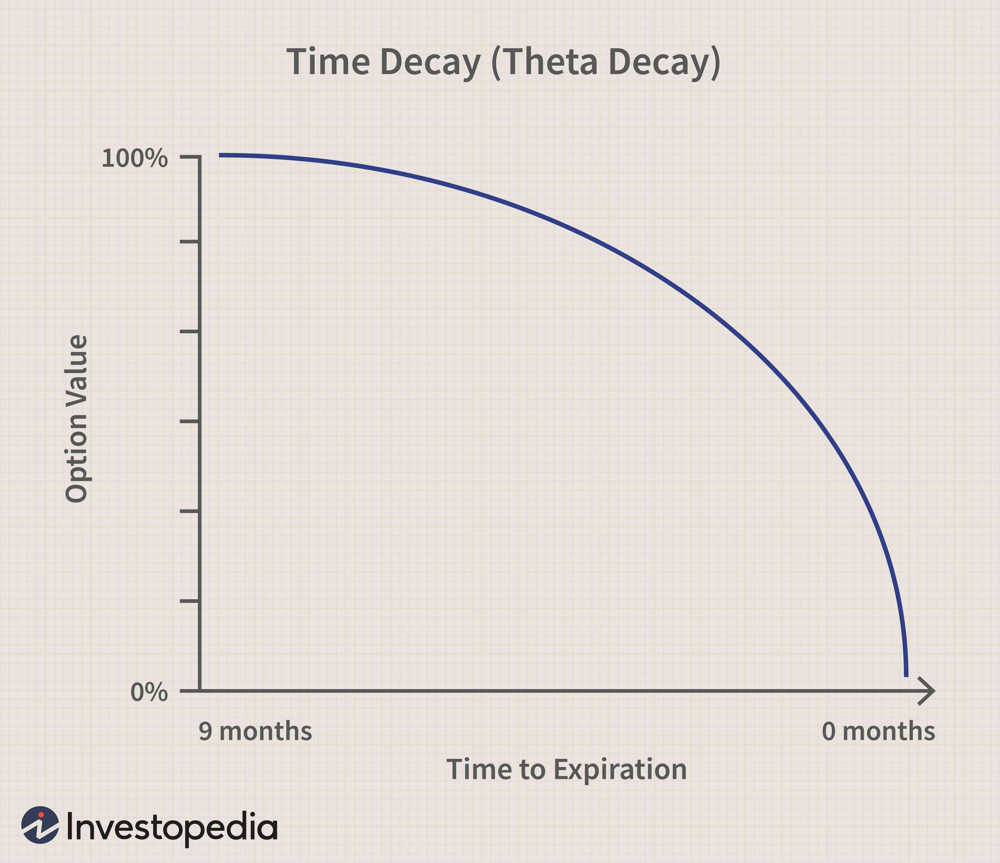

Algorithmic trading, widely recognized as algo trading, has significantly revolutionized trading practices in financial markets by increasing efficiency and precision. At the heart of these advanced trading strategies is the consideration of time-decay factors, especially when dealing with options and other derivatives that are sensitive to the passage of time. Time-decay, commonly referred to as theta, plays a pivotal role in crafting options trading strategies within the algorithmic trading framework. Theta represents the rate at which the price of an option decreases as it approaches expiration, making it a critical concept for traders aiming to maximize returns and minimize risks.

This article investigates the implications of time-decay factors in algorithmic trading and their role in refining trading strategies for enhanced performance and profitability. By examining the mechanics of time-decay and its influence on algorithmic systems, traders can unlock the potential to manage and utilize these elements effectively. Time-decay influences option premium valuations and hence directly affects trading decisions regarding entry, exit, and the holding period of positions.



A firm grasp of time-decay is vital for algorithmic traders aiming to optimize their trading strategies and improve portfolio performance. With the integration of time-decay considerations, traders can better predict option price movements and adjust their positions accordingly. Understanding how theta affects option pricing and strategy development equips algorithmic traders with the tools to anticipate market changes, optimize trade timing, and enhance risk management practices. Through sophisticated algorithms and computational tools, traders are empowered to navigate the complexities of time-sensitive derivatives and achieve superior outcomes in the ever-evolving financial markets.

## Table of Contents

## Understanding Time-Decay in Algorithmic Trading

Time-decay, commonly denoted as theta, is a fundamental concept in the pricing of options and derivatives. It represents the gradual reduction in the value of an option as it nears its expiration date. This decay primarily affects options and derivatives with a finite lifespan, as the time component of their value diminishes over time. In the context of [algorithmic trading](/wiki/algorithmic-trading), time decay constitutes a vital parameter that significantly influences option pricing and the development of trading strategies.

In algorithmic trading, precise decision-making regarding option pricing and trading strategies depends heavily on accurately modeling and anticipating time-decay effects. As an option approaches its expiration, the rate of time decay accelerates. This acceleration impacts both intrinsic value (the difference between the option's strike price and the underlying asset's market price) and extrinsic value (the additional premium beyond intrinsic value, reflecting time, [volatility](/wiki/volatility-trading-strategies), and other factors). Time-decay has differing effects on call and put options, requiring traders to tailor their strategies accordingly.

A deeper understanding of time-decay allows traders to dynamically adjust their strategies in response to fluctuating market conditions and specific trading objectives. The strategic adjustment is crucial—traders might choose to either capitalize on the decay through certain options positions or mitigate its effects through hedging strategies. For instance, short options positions might benefit from time-decay, as these positions profit from the loss of time value.

Algorithmic models must incorporate time-decay to maintain accuracy in trade valuations and to optimize timing. Implementing algorithms that account for theta enables traders to make informed decisions about when to enter or [exit](/wiki/exit-strategy) positions, enhancing profitability and risk management. Additionally, traders often employ algorithms to project future time-decay, allowing them to anticipate and respond to rapid changes in the decay rate as expiration dates approach.

For practical applications, traders can use Python and other programming languages to model time-decay. Here's a simple Python function using the Black-Scholes model for estimating the effect of theta on an option's price:

```python
import math
from scipy.stats import norm

def black_scholes_theta(S, K, T, r, sigma, option_type='call'):
    """Calculate the Black-Scholes Theta for a European option."""
    d1 = (math.log(S / K) + (r + 0.5 * sigma**2) * T) / (sigma * math.sqrt(T))
    d2 = d1 - sigma * math.sqrt(T)

    if option_type == 'call':
        theta = (- (S * norm.pdf(d1) * sigma) / (2 * math.sqrt(T))
                 - r * K * math.exp(-r * T) * norm.cdf(d2))
    elif option_type == 'put':
        theta = (- (S * norm.pdf(d1) * sigma) / (2 * math.sqrt(T))
                 + r * K * math.exp(-r * T) * norm.cdf(-d2))

    # Theta per day
    return theta / 365

# Example usage
S = 100  # Current stock price
K = 100  # Strike price
T = 1    # Time to expiration in years
r = 0.05 # Risk-free interest rate
sigma = 0.2 # Volatility

theta_call = black_scholes_theta(S, K, T, r, sigma, option_type='call')
theta_put = black_scholes_theta(S, K, T, r, sigma, option_type='put')
```

In conclusion, successfully managing time-decay within algorithmic trading requires continuous adjustment of strategies based on an evolving understanding of theta and its effects on different options positions. By leveraging computational tools and advanced algorithms, traders can refine their approaches to better manage the challenges posed by time-decay, ultimately enhancing portfolio performance.

## The Role of Time-Decay in Algo Trading Strategies

Traders utilize algorithmic strategies to combat the challenges posed by time-decay, dynamically adjusting their positions to leverage options trading techniques effectively. Time-decay, represented by the Greek letter theta (Θ), is a fundamental aspect impacting strategies like calendar spreads, iron condors, and other intricate options strategies. These strategies rely heavily on the anticipated decrease in value of options over time, exploiting this depreciation while simultaneously managing associated risks.

Time-sensitive algorithms are crafted to optimize profits by capitalizing on the natural decay in value of short options positions. These algorithms continuously evaluate the market landscape to adjust positions accordingly, aiming to maximize the decay benefits on written options while keeping risk exposure within acceptable parameters. The decay, being more pronounced as options near expiration, necessitates algorithms that are both responsive and adaptive to short-term fluctuations in the options market.

Effective management of time-decay involves hedging and dynamic rebalancing. Hedging allows traders to counter potential losses from options positions by holding offsetting positions. Dynamic rebalancing refers to the continuous adjustment of asset allocations in response to market movements and changes in option values. These strategies are crucial in maintaining the profitability of algorithmic trades, ensuring that portfolios remain aligned with desired risk levels and market predictions.

Advanced algorithms enhance these strategies by utilizing real-time data feeds to adjust their parameters, thereby minimizing the adverse effects of time-decay. These algorithms typically integrate [machine learning](/wiki/machine-learning) techniques and computational models that simulate various scenarios to prevent potential negatives from time-decay. Traders employ predictive analytics to forecast market trends and use these insights to adjust their models in real-time, demonstrating agility and foresight in strategy execution.

Incorporating time-decay considerations into algorithmic trading systems thus requires a combination of strategic planning, technological integration, and continuous market monitoring. This blend ensures that the opportunities presented by time-decay are fully exploited while the risks are meticulously managed.

## Integrating Time-Decay Calculations in Algorithmic Models

Integrating time-decay calculations in algorithmic models involves combining sophisticated mathematical modeling with accurate market data to enhance trading strategies. Accurate predictions of time-decay, also known as theta, are pivotal for predicting the value erosion of options as they approach expiry. This integration is accomplished through the utilization of both historical and real-time data, which allow traders to back-test algorithmic strategies and ensure that they are effectively accounting for time-decay.

To simulate various market conditions, traders employ robust computational tools that provide insights into how different scenarios might impact their portfolios. These simulations often involve complex mathematical models that incorporate time-decay effects to predict potential future performance. For instance, using Monte Carlo simulations can help in assessing how the passage of time interacts with price changes to affect options pricing.

APIs and algorithmic platforms play a critical role in this integration process by offering interfaces for market data, enabling traders to analyze and update their models continuously. This is crucial for mitigating risks as market conditions shift. APIs allow for real-time data streaming, ensuring that the models reflect current market conditions, which is essential for handling the time-sensitive nature of options trading.

To ensure that theoretical models are aligned with actual market behavior, it is essential to test these algorithms in paper trading environments. A paper trading environment provides a risk-free platform to evaluate the algorithms' performance using historical market data without capital exposure. This helps in adjusting the models to better capture the intrinsic and extrinsic value changes due to time-decay.

Overall, the integration of time-decay calculations within algorithmic models not only assists in developing robust trading strategies but also helps in managing the complexities associated with the decay of options' value over time. By continuously refining these models based on real-time data and simulated scenarios, traders can enhance their decision-making processes and optimize their trading outcomes.

## Overcoming Challenges with Time-Decay Factors

Algorithmic trading, particularly in handling options and derivatives, faces significant hurdles due to the volatile and dynamic nature of financial markets. These challenges complicate the accurate modeling of time-decay effects, necessitating continuous optimization of trading strategies. Key factors driving this complexity include fluctuating market volatility and shifting interest rates, which directly impact time-decay. Traders must adapt quickly, employing various techniques to stay ahead of the curve.

One effective approach to manage these challenges is through scenario analysis and extensive [backtesting](/wiki/backtesting). Scenario analysis enables traders to evaluate the potential outcomes of different market conditions by simulating various paths that a market might take in the future. This process involves altering assumptions like volatility rates, interest rates, and time-to-expiration to understand how these factors influence an option's value. Extensive backtesting involves applying trading strategies to historical data to identify potential weaknesses or strengths in the strategy, ensuring that it holds up well under different market scenarios.

Innovative methods, such as machine learning, are proving invaluable in adapting to time-decay complexities. Machine learning algorithms can process large datasets to identify patterns and relationships that might not be evident through traditional analysis. These algorithms can dynamically adjust trading models to account for the non-linear and stochastic nature of time-decay. For instance, [reinforcement learning](/wiki/reinforcement-learning), a subset of machine learning, can be employed where the algorithm learns and optimizes trading strategies by interacting with the trading environment.

Diversifying strategies across various asset classes is another vital method for managing time-decay risks. By spreading exposure across multiple markets or securities, traders can reduce the negative impact that time-decay might have on a particular asset or position. This diversification minimizes reliance on a single source of volatility or [interest rate](/wiki/interest-rate-trading-strategies) changes that could adversely affect a portfolio.

Utilizing advanced trading technologies further aids traders in overcoming time-decay challenges. Deploying real-time data analysis tools and algorithmic platforms enhances decision-making speed and accuracy. Additionally, traders can leverage APIs and cloud-based simulation tools to continuously update and refine their models in response to real-time market dynamics.

Ultimately, addressing the challenges posed by time-decay factors in algorithmic trading involves a multifaceted approach. Continuous optimization, extensive testing, leveraging machine learning, strategic diversification, and advanced technology adoption are all imperative for successful trading. As the field evolves, these strategies will likely become more sophisticated, offering even greater potential for managing time-decay in increasingly volatile markets.

## Conclusion

Time-decay is a critical component in algorithmic trading, specifically influencing options trading where the value of options diminishes as they approach expiration. Understanding and managing time-decay are key to enhancing trading strategies and achieving superior risk-adjusted returns. Successful traders use this knowledge to optimize their portfolios, balancing the erosion of time value against other market dynamics to maintain profitability.

The rapid development of algorithmic trading technologies has provided traders with sophisticated tools to handle the intricate nature of time-decay. Advanced analytical platforms and computational techniques enable traders to continuously adapt their strategies, ensuring that they remain agile in the face of market changes. These technologies often incorporate real-time data feeds and machine learning to adjust parameters dynamically, providing a precise response to the evolving market landscape.

As algorithmic frameworks advance, they will likely offer even greater potential for optimizing strategies impacted by time-decay. Enhanced computational power, along with improvements in machine learning algorithms, will allow for more accurate modeling and prediction of time-decay effects. These developments promise not only more efficient trading models but also more refined insights into market behavior, empowering traders to implement strategies that are both innovative and robust.

Ultimately, as traders become more adept at harnessing time-decay factors through algorithmic trading, they can expect to incrementally refine their techniques. This continual refinement is pivotal for improving overall trading outcomes, enabling traders to secure a competitive edge in the fast-paced financial markets. By integrating time-decay considerations into their algorithmic strategies, traders are better positioned to navigate the complexities of options trading, maximize returns, and successfully manage risk.

## References & Further Reading

[1]: Whaley, R. E. (2006). ["Derivatives on Market Volatility: Hedging Tools Long Overdue."](https://onlinelibrary.wiley.com/doi/full/10.1002/9780470404324.hof001020) Journal of Derivatives, 13(3), 71-84.

[2]: "Options, Futures, and Other Derivatives" by John C. Hull

[3]: Black, F., & Scholes, M. (1973). ["The Pricing of Options and Corporate Liabilities."](https://www.cs.princeton.edu/courses/archive/fall09/cos323/papers/black_scholes73.pdf) Journal of Political Economy, 81(3), 637-654.

[4]: "Algorithmic Trading: Winning Strategies and Their Rationale" by Ernie Chan

[5]: Gatheral, J. (2006). ["The Volatility Surface: A Practitioner's Guide."](https://www.wiley.com/en-us/The+Volatility+Surface%3A+A+Practitioner%27s+Guide-p-9780471792512)