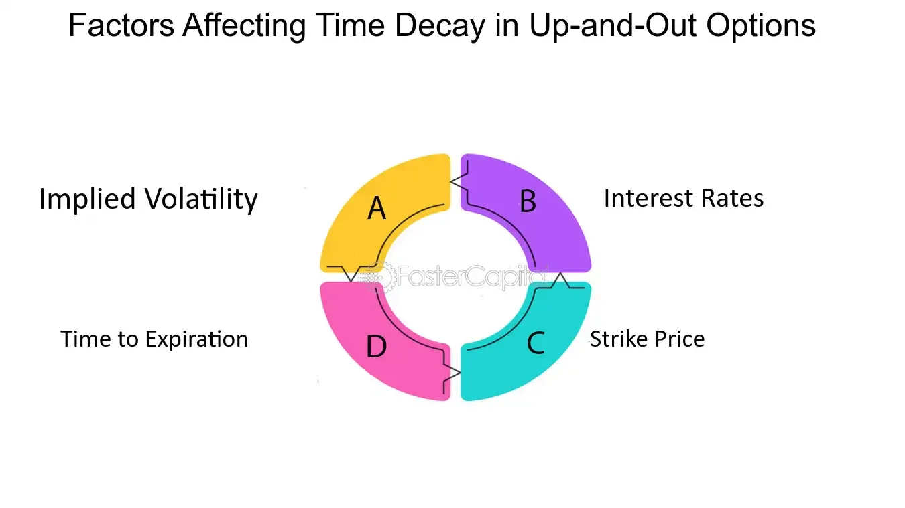

## Table of Contents

## What is a time-decay factor?

A time-decay factor is a way to give more importance to recent things and less importance to older things. Imagine you are looking at how well a student is doing in school. If you want to know how they are doing right now, you would care more about their recent test scores than their scores from last year. The time-decay factor helps by making the recent scores count more when figuring out their current performance.

This idea is used a lot in different areas, like in finance when people look at stock prices or in search engines when they rank websites. In finance, recent stock prices are more important for deciding if a stock is a good buy right now. In search engines, newer information is often more useful, so it gets a higher ranking. By using a time-decay factor, these systems can make better decisions based on the most current information.

## How does time-decay affect different types of data?

Time-decay affects different types of data by changing how important or relevant that data is over time. For example, in social media, a post from today might get more attention than a post from a month ago. This is because people usually want to see the newest information first. So, time-decay makes older posts less visible and gives more importance to recent posts. This helps keep the content fresh and relevant to what people are interested in right now.

In another example, time-decay can affect how businesses predict future sales. If a company looks at sales data, recent sales are usually a better indicator of what might happen next than sales from a year ago. By using time-decay, the company can weigh recent sales more heavily in their predictions. This helps them make better decisions about how much to produce or what products to focus on, based on the most current trends.

Overall, time-decay is a useful tool for managing data in many fields. It helps focus on what's happening now, which can be more important than what happened in the past. Whether it's deciding which news articles to show first on a website or figuring out how much stock to keep in a store, time-decay helps make sure the most relevant information is used to make those decisions.

## Can you explain the basic formula for calculating time-decay?

The basic formula for calculating time-decay is pretty simple. It usually involves a number that gets smaller over time. This number is called the decay [factor](/wiki/factor-investing), and it's often written as a part of an equation like this: New Value = Old Value * (Decay Factor)^(Time Passed). The decay factor is always between 0 and 1. If it's close to 1, the value doesn't change much over time. If it's closer to 0, the value drops quickly.

For example, if you have a score of 100 and you want it to lose half its value every day, you would use a decay factor of 0.5. After one day, the score would be 100 * (0.5)^1 = 50. After two days, it would be 100 * (0.5)^2 = 25. This way, you can see how the score gets smaller each day, showing that recent scores are more important than older ones. This formula helps in many areas, like figuring out how much to trust old data or how to rank things based on when they happened.

## What are common applications of time-decay factors in finance?

In finance, time-decay factors are often used to make better predictions about stock prices. When people look at how a stock has been doing, they care more about what happened recently than what happened a long time ago. By using a time-decay factor, they can give more importance to the latest stock prices. This helps them see the current trend more clearly and make smarter decisions about whether to buy or sell a stock. For example, if a stock has been going up lately but was down a year ago, the time-decay factor would make the recent upward trend more important in their decision.

Another common use of time-decay factors in finance is in risk management. Banks and other financial institutions need to keep an eye on how risky their investments are. They use time-decay to weigh recent data more heavily when calculating risk. This means that if a certain investment has become riskier in the last few months, the time-decay factor will make that recent change more important in their risk assessment. This helps them adjust their strategies quickly to manage risk better and protect their money.

## How do time-decay factors influence option pricing?

Time-decay factors play a big role in how options are priced. An option is like a bet on whether a stock will go up or down by a certain date. The closer you get to that date, the less time you have for the stock to move in the direction you want. This is where time-decay comes in. It makes the option less valuable as time goes by because there's less chance for the stock to hit the target price. So, if you have an option that expires in a month, it will be worth less as that month goes by, even if the stock price stays the same.

This effect is called "theta" in the world of options. Theta shows how much the option's price drops each day as it gets closer to expiring. If you're selling options, time-decay can be good for you because the option you sold will be worth less over time, which means you can buy it back cheaper if you need to. But if you're buying options, you need to be careful because time-decay works against you. You want the stock to move quickly in your favor before the option loses too much value.

## What is the difference between linear and exponential time-decay?

Linear time-decay means the value of something goes down by the same amount every time period. Imagine you have a score that loses 10 points every day. On day one, it goes from 100 to 90. On day two, it goes from 90 to 80. It keeps dropping by 10 points each day, making a straight line if you draw it on a graph. This kind of decay is easy to understand and predict because the drop is always the same.

Exponential time-decay is different because the value drops by a certain percentage each time period, not a fixed amount. Let's say your score loses 10% of its value every day. On day one, it goes from 100 to 90. On day two, it goes from 90 to 81, which is 10% of 90. Each day, it loses 10% of whatever it's worth at that moment, so the drop gets smaller and smaller. This makes a curved line on a graph, and it can be harder to predict because the change depends on the current value.

## How can time-decay be modeled in statistical analysis?

In statistical analysis, time-decay can be modeled using different methods depending on what you want to achieve. One common way is to use a formula where the value of data decreases over time. For example, you might use a formula like New Value = Old Value * (Decay Factor)^(Time Passed). The decay factor is a number between 0 and 1, and it decides how quickly the value drops. If you want the value to drop slowly, you use a decay factor close to 1. If you want it to drop quickly, you use a number closer to 0. This helps in giving more importance to recent data and less to older data, which is useful in many fields like finance or social media.

Another way to model time-decay in [statistics](/wiki/bayesian-statistics) is by using more complex models like regression analysis. In regression, you can add a time-decay term to your model to see how the effect of time changes the importance of your data. For example, in a time series analysis, you might use an autoregressive integrated moving average (ARIMA) model with a time-decay component. This model can help predict future values based on past data, but it gives more weight to recent observations. By doing this, you can make better predictions and understand trends more accurately, especially when recent data is more relevant to your analysis.

## What are the challenges in accurately predicting time-decay effects?

Predicting time-decay effects can be tricky because it's hard to know exactly how fast things should lose their value over time. Different situations need different decay rates, and choosing the right one can be tough. For example, in finance, how quickly stock prices change can depend on many things like news, market trends, and even world events. If you pick a decay rate that's too slow, you might give too much importance to old data. If it's too fast, you might ignore useful information from the past.

Another challenge is that time-decay doesn't always follow a simple pattern. Sometimes, the decay might be linear, where the value drops by the same amount each time. Other times, it might be exponential, where the value drops by a percentage each time, making it harder to predict. Also, real-world data can be messy and unpredictable, so even the best models might not capture all the changes accurately. This means that analysts need to keep adjusting their models and stay flexible to make the best predictions possible.

## How do machine learning algorithms incorporate time-decay factors?

Machine learning algorithms can use time-decay factors to make better predictions by giving more importance to recent data. Imagine you're teaching a computer to guess tomorrow's weather. You would want it to pay more attention to today's weather than to the weather from last month. So, you can set up the algorithm to use a time-decay factor, which makes the computer care more about the most recent information. This helps the computer learn and predict more accurately because it focuses on what's happening now.

In practice, [machine learning](/wiki/machine-learning) models like neural networks or regression models can include time-decay in their calculations. For example, in a model that predicts stock prices, the algorithm might use a formula where recent stock prices have a bigger say in the prediction than older prices. This is done by multiplying older data by a number less than one, which gets smaller the older the data is. By doing this, the model can adapt quickly to new trends and changes, making its predictions more reliable and up-to-date.

## Can you discuss advanced time-decay models used in econometrics?

In econometrics, advanced time-decay models help us understand how things change over time in a more detailed way. One popular model is the autoregressive integrated moving average (ARIMA) model with a time-decay component. This model looks at past data to predict what might happen next, but it gives more importance to recent data. By using a time-decay factor, the model can see current trends more clearly and make better predictions. This is really helpful in areas like predicting stock prices or economic indicators because it helps us focus on what's happening right now.

Another advanced model used in econometrics is the exponential smoothing method, which also includes time-decay. This method is good for smoothing out data that might have a lot of ups and downs. It uses a decay factor to give more weight to recent observations, making the predictions more accurate. For example, if you're trying to predict sales for a store, this model can help by focusing on the most recent sales data. This way, it can quickly adapt to new trends and changes in customer behavior, making it a powerful tool for businesses and economists.

## What role do time-decay factors play in risk management?

Time-decay factors help in risk management by making sure that recent information is more important than old information. When banks or companies look at how risky their investments are, they want to know what's happening right now. By using time-decay, they can give more weight to the latest data. This means if an investment has become riskier in the last few months, the time-decay factor will make that recent change more important in their risk assessment. This helps them adjust their strategies quickly to manage risk better and protect their money.

In practice, time-decay factors can be used in models that predict how risky something might be in the future. For example, if a company is looking at how likely it is that a customer won't pay back a loan, they would want to focus on the customer's recent financial behavior. By using a time-decay factor, the company can make sure that the most current information about the customer's finances is the most important in their risk calculations. This helps them make better decisions about who to lend money to and how much risk to take on.

## How have time-decay factors been adapted in modern portfolio theory?

In modern portfolio theory, time-decay factors help investors make better decisions by focusing on recent information. When people build their investment portfolios, they want to know how stocks and other investments are doing right now. By using time-decay, they can give more importance to the latest stock prices and less to older ones. This helps them see current trends more clearly and adjust their investments to take advantage of these trends. For example, if a stock has been going up lately, the time-decay factor will make that recent upward trend more important in deciding whether to buy or sell the stock.

Time-decay factors also help in managing risk within a portfolio. Investors need to keep an eye on how risky their investments are, and recent data is often more useful for this. By using time-decay, they can weigh recent changes in risk more heavily. This means if an investment has become riskier in the last few months, the time-decay factor will make that recent change more important in their risk assessment. This helps them adjust their strategies quickly to manage risk better and protect their money.

## References & Further Reading

[1]: Whaley, R. E. (2006). ["Derivatives on Market Volatility: Hedging Tools Long Overdue."](https://onlinelibrary.wiley.com/doi/full/10.1002/9780470404324.hof001020) Journal of Derivatives, 13(3), 71-84.

[2]: "Options, Futures, and Other Derivatives" by John C. Hull

[3]: Black, F., & Scholes, M. (1973). ["The Pricing of Options and Corporate Liabilities."](https://www.cs.princeton.edu/courses/archive/fall09/cos323/papers/black_scholes73.pdf) Journal of Political Economy, 81(3), 637-654.

[4]: "Algorithmic Trading: Winning Strategies and Their Rationale" by Ernie Chan

[5]: Gatheral, J. (2006). ["The Volatility Surface: A Practitioner's Guide."](https://www.wiley.com/en-us/The+Volatility+Surface%3A+A+Practitioner%27s+Guide-p-9780471792512)