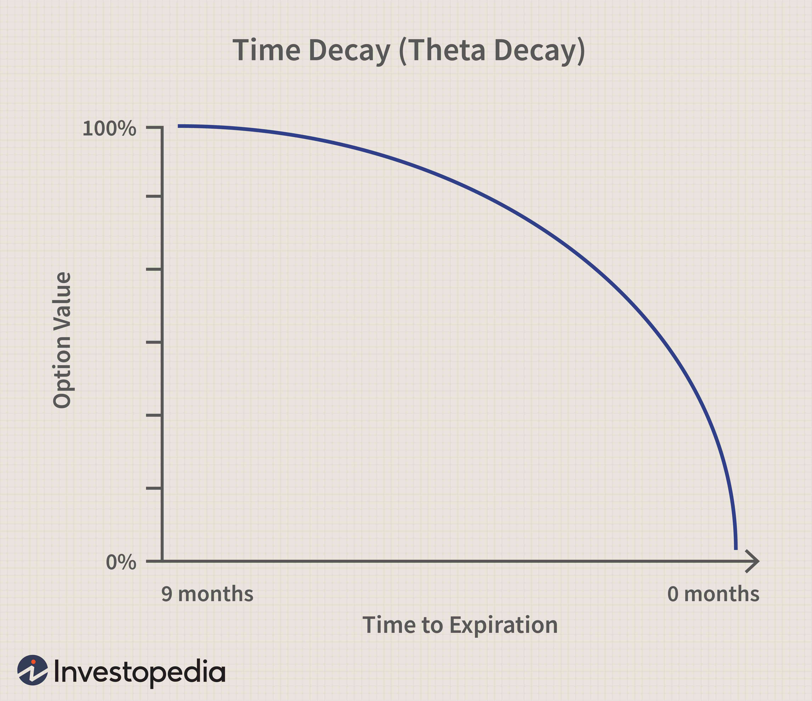

Options trading represents a dynamic segment of finance wherein the unique element of time decay plays an influential role in the valuation of trades. Time decay, commonly referred to as theta, is a critical factor for options traders as it directly impacts the profitability and risk assessment of their strategies. The significance of time decay arises from its effect on the diminishing value of options as they approach their expiration date. This intrinsic feature of options necessitates sophisticated strategies and decision-making processes to manage potential losses and optimize returns.

As financial markets have become more complex, the nuanced understanding of time decay has proven advantageous for traders. The incorporation of time decay considerations into the design and execution of algorithmic trading strategies has been notable, resulting in enhanced trading performance. Algorithms capable of integrating time decay metrics help in predicting price movements with greater accuracy, allowing traders to make informed decisions.



This article aims to explore the fundamental financial concepts surrounding time decay and highlight its growing role in algorithmic trading frameworks. By analyzing the effects of time decay on options pricing and its application in algorithm-driven tactics, the article presents insights that are crucial for maintaining a competitive edge in the sophisticated landscape of financial markets. Understanding these elements empowers traders to better manage the complexities of time-sensitive derivatives, thereby maximizing gains and minimizing risks.

## Table of Contents

## Understanding Time Decay in Options Trading

Time decay, often referred to by the Greek letter theta (θ), signifies the erosion of an option's value as the expiration date draws closer. This phenomenon is a crucial consideration for options traders, as it has a significant impact on the profitability of their trades. As time progresses towards the expiration date, the rate of time decay typically accelerates, meaning that the diminution in value happens more rapidly. This acceleration in the rate of decay is primarily due to the diminishing time value, or extrinsic value, of the option.

An option's value comprises two main components: intrinsic value and extrinsic value. The intrinsic value represents the immediate profit that could be realized if the option were exercised at the current moment. This is calculated based on the difference between the underlying asset's current market price and the option's strike price. Typically, intrinsic value is less impacted by time decay, as it is based on the intrinsic financial advantage of holding the option.

On the other hand, the extrinsic value, also known as time value, is susceptible to time decay. It reflects the additional amount that traders are willing to pay over the intrinsic value, based on the potential for price movements before expiration. As the expiration date approaches, the likelihood of significant price movements diminishes, leading to a rapid decrease in extrinsic value, driven by theta. Mathematically, theta represents the rate of decline in an option's value per day as it approaches expiration. Traders can calculate theta using various models to anticipate this aspect of options pricing.

Investors and traders must understand and account for time decay, as it is a pivotal element in developing effective trading strategies. Ignoring theta can lead to mispricing and potential losses. To integrate time decay into their trading strategies, traders often employ techniques such as spreading, where they simultaneously buy and sell options with different expiration dates to manage the time decay effect. By strategically considering time decay, traders are better equipped to develop sound risk management practices and optimize their trading approaches in options markets.

## Core Financial Concepts Related to Time Decay

An option's premium is composed of two critical components: intrinsic and extrinsic values. Time decay significantly influences both, although its effects are more pronounced on the extrinsic value.

The intrinsic value of an option represents the difference between the underlying asset's current price and the option's strike price, but only if this difference is favorable to the option holder. For a call option, the intrinsic value is calculated using the formula:

$$
\text{Intrinsic Value (Call)} = \max(0, S - K)
$$

where $S$ is the current price of the underlying asset and $K$ is the strike price of the option. Similarly, for a put option, the intrinsic value is:

$$
\text{Intrinsic Value (Put)} = \max(0, K - S)
$$

Because the intrinsic value solely depends on the underlying asset's price relative to the strike price, it remains unaffected by time decay. The intrinsic value tends to remain stable as the option approaches expiration.

The extrinsic value, often referred to as the time value, is more susceptible to the impacts of time decay, quantified by theta ($\Theta$). The extrinsic value can be expressed as:

$$
\text{Extrinsic Value} = \text{Option Premium} - \text{Intrinsic Value}
$$

Time decay causes this extrinsic value to erode as the expiration date nears, reflecting the diminishing probability of the option realizing a profit beyond its intrinsic value. For options traders, understanding how quickly an option's extrinsic value erodes is crucial since it affects the overall profitability of the trade. The concept of theta is central here, as it provides a measure of the sensitivity of the option's price concerning the passage of time:

$$
\Theta = \frac{\partial V}{\partial t}
$$

where $V$ is the option's value, and $t$ is time. A higher magnitude of theta indicates a more rapid erosion of the option's premium over time.

An accurate assessment of intrinsic and extrinsic values, and their sensitivity to time decay, is essential for making informed trading decisions. Traders and investors must consider how time decay impacts the entirety of their portfolio. This involves analyzing the balance between intrinsic and extrinsic values to predict price movements and determine the most strategic moments to enter or [exit](/wiki/exit-strategy) trades. Understanding these core concepts enhances trading strategies and potentially maximizes profit in options trading.

## Algorithmic Trading and Time Decay

Algorithmic trading, commonly referred to as algo trading, employs computational techniques and advanced algorithms to optimize trade execution. A key element in this process is the integration of time decay, which is pivotal in shaping trading strategies. Time decay, often represented by the Greek letter theta, measures the rate at which an option’s value decreases as it approaches its expiration date. This is crucial for algo traders who aim to enhance their decision-making and maximize the efficiency of their trading operations.

Algo traders incorporate time-decay calculations into their algorithms to forecast future price movements and refine their strategies. By systematically accounting for the effects of time decay, algorithmic systems can identify and exploit market inefficiencies. This involves regular updates and recalibration of trading models to reflect the decaying value of options, which become particularly pronounced as expiration nears. The ability to anticipate how time decay might influence an option’s pricing allows traders to make more informed trading decisions.

Advanced algorithms in [algorithmic trading](/wiki/algorithmic-trading) frameworks utilize real-time data to ensure precise adjustments, thus taking full advantage of time decay. Real-time data feeds provide instantaneous market information that enables algorithms to respond swiftly to changes in market conditions and option values. This real-time aspect is critical in maintaining the relevance and competitive edge of algorithmic strategies. The dynamic context of financial markets requires these algorithms to adapt continuously, incorporating time decay as a core parameter.

Mathematically, the impact of time decay on an option's premium can be expressed via the theta value, which is calculated as:

$$
\Theta = \frac{\partial V}{\partial t}
$$

where $V$ represents the option’s value and $t$ the time to expiration. In practical applications, implementing this component involves coding these derivatives into algorithmic models. For instance, in Python, an options trader may set up a function to calculate theta and continuously monitor its effects:

```python
def calculate_theta(option_value, time_to_expiration, delta_time=1):
    # Assuming a linear approximation for simplicity
    theta = (option_value / time_to_expiration) * delta_time
    return theta

current_option_value = 10.0  # Hypothetical option value
time_to_expiry = 30  # Time in days
theta = calculate_theta(current_option_value, time_to_expiry)
print(f"The theta value is: {theta}")
```

Such computational strategies are fundamental for traders seeking to leverage time decay within their algo-trading frameworks effectively. By employing these techniques, traders can optimize trading systems that dynamically adjust and account for the continual erosion of time value, thereby capitalizing on opportunities presented within the option markets.

## Implementing Time-Decay Strategies in Algo Trading

Algorithmic trading models can significantly enhance trade execution by effectively incorporating time-decay parameters. These models employ sophisticated algorithms and data feeds to quantify and respond to time decay, also known as theta, in real-time. By integrating these parameters into their computational frameworks, traders can improve the precision and profitability of their trading strategies. 

One of the primary methods used to manage time decay involves hedging, which protects portfolios from adverse price movements due to theta decay. Hedging strategies may include options spreads such as calendar spreads, where traders capitalize on the different rates of time decay between short- and long-term options. Dynamic rebalancing is another tactic where portfolios are continuously adjusted to maintain a desired balance between risk and return. This involves altering the composition of options in light of changing time decay and market conditions.

Incorporating simulation tools and [machine learning](/wiki/machine-learning) into these models can further refine the management of time decay. Simulations allow traders to test how various scenarios affected by time decay might play out, thus providing insights into potential risks and rewards. Machine learning algorithms can process historical data to predict future decay patterns and assess the impact under different market variables, making them crucial for adapting strategies in real time.

For instance, consider a Python-based algorithm that forecasts time decay's impact on an options portfolio. Utilizing libraries like Pandas for data processing and TensorFlow for machine learning, traders can build models that dynamically adjust their strategies. A simple example could be:

```python
import pandas as pd
import tensorflow as tf
from sklearn.model_selection import train_test_split

# Load historical options data
data = pd.read_csv('options_data.csv')

# Preprocess data
features = data[['market_volatility', 'interest_rates', 'time_to_expiry']]
labels = data['time_decay']

# Split data
X_train, X_test, y_train, y_test = train_test_split(features, labels, test_size=0.2)

# Build a neural network model
model = tf.keras.Sequential([
    tf.keras.layers.Dense(64, activation='relu', input_shape=(X_train.shape[1],)),
    tf.keras.layers.Dense(32, activation='relu'),
    tf.keras.layers.Dense(1)
])

# Compile the model
model.compile(optimizer='adam', loss='mse')

# Train the model
model.fit(X_train, y_train, epochs=10, validation_data=(X_test, y_test))

# Predict future time decay
predictions = model.predict(X_test)
```

This code outlines a method for predicting time decay impacts using machine learning, enhancing the ability to adapt trading strategies with better forecasting accuracy. By harnessing the power of computational tools and data analytics, algorithmic trading can more effectively account for and capitalize on time-decay influences in the market.

## Challenges and Solutions in Managing Time Decay

Modeling time decay in options trading involves addressing the complexities introduced by market [volatility](/wiki/volatility-trading-strategies) and fluctuating interest rates. Accurately predicting these variables is fundamental since time decay, represented by the Greek letter theta ($\theta$), affects the extrinsic value of options. This decay can be mathematically expressed as:

$$
\theta = \frac{\partial V}{\partial t}
$$

where $V$ is the option's price and $t$ is time. Accurate predictions necessitate sophisticated techniques such as scenario analysis, backtesting, and machine learning.

**Scenario Analysis and Backtesting**

Scenario analysis allows traders to evaluate the effects of time decay under various hypothetical market conditions. This involves simulating different market scenarios to understand potential impacts on option pricing. Backtesting, on the other hand, is used to validate trading strategies by testing them against historical data. For instance, traders can simulate past market conditions to assess how well a strategy addressing time decay would have performed, thus refining it for real-world application.

**Utilizing Machine Learning Techniques**

Advancements in machine learning provide robust solutions for modeling and predicting time decay. Machine learning algorithms can process large datasets to uncover patterns that might indicate future market behavior related to theta. Tools such as regression analysis, neural networks, and support vector machines are integral to this process, enhancing the ability to predict how quickly an option’s premium will decay over time.

For example, a basic implementation using Python's scikit-learn library might involve:

```python
from sklearn.linear_model import LinearRegression
import numpy as np

# Example data for option prices and time-to-expiration
option_prices = np.array([...])
time_to_expiration = np.array([...])

# Reshape data and fit the model
time_to_expiration = time_to_expiration.reshape(-1, 1)
model = LinearRegression().fit(time_to_expiration, option_prices)

# Predicting the effect of time decay
predicted_prices = model.predict(time_to_expiration)
```

**Diversification and Real-Time Data Integration**

To effectively manage the unpredictability of time decay due to market volatility and [interest rate](/wiki/interest-rate-trading-strategies) changes, diversification acts as a hedge against losses. By diversifying trading instruments and strategies, traders can mitigate the risks associated with sudden market shifts. Furthermore, integrating real-time data ensures that traders make informed decisions based on the most current market information, allowing them to adjust strategies swiftly in response to evolving conditions.

**Technological Adoption**

Embracing advanced technologies like machine learning models and real-time data analytics tools is essential for traders aiming to stay competitive. These technologies equip traders with the ability to adapt to market changes, optimize trading strategies, and ultimately enhance performance and results in managing the challenges posed by time decay. As a result, traders who effectively utilize these tools can maximize returns while prudently managing risks associated with time-sensitive derivatives.

## Conclusion

Time decay, often represented by the Greek letter theta (θ), is an essential concept in options trading as it directly influences profitability and risk management. As options approach their expiration date, their extrinsic value diminishes, imparting a temporal risk element that traders must skillfully manage.

Effectively understanding and managing time decay can significantly enhance trading frameworks. Recognizing how theta impacts an option’s price helps traders anticipate shifts in value, allowing for more informed decision-making. By strategically managing options positions to account for theta decay, traders can better optimize the timing of their trades and potential returns.

Advanced algorithms and computational tools provide robust solutions to navigate the complexities of time-sensitive derivatives. These technologies enable the analysis of vast datasets and real-time market conditions, subsequently integrating time decay into sophisticated trading models. For instance, algorithmic models can simulate scenarios and adjust their strategies based on anticipated time-decay effects. Such precision aids traders in predicting price movements more accurately and mitigating the associated risks.

Traders who effectively incorporate time-decay strategies into their setups are better equipped to maximize returns and manage risk. By leveraging computational power and understanding theta’s role within options pricing, they can create dynamic, responsive trading systems. This proactive approach not only aids in exploiting market inefficiencies but also in constructing resilient portfolios capable of enduring market fluctuations.

Overall, the mastery of time decay is a crucial skill for options traders, enabling them to enhance profitability while maintaining robust risk management protocols. As the financial markets continue to evolve with the integration of advanced technologies, a comprehensive approach to time decay in trading strategies will remain a vital component for success.

## References & Further Reading

Whaley, R. E. (2006). 'Derivatives on Market Volatility: Hedging Tools Long Overdue.' Journal of Derivatives explores how derivatives associated with market volatility can serve as effective hedging tools. The paper discusses various derivative instruments and their long-awaited utility in managing volatility risk in financial markets.

Hull, J. C. 'Options, Futures, and Other Derivatives' is a comprehensive textbook covering a wide range of derivative instruments, including options. It provides a detailed understanding of the mechanics of derivative markets, risk management strategies, and the impact of time decay on options pricing and trading strategies.

Black, F., & Scholes, M. (1973). 'The Pricing of Options and Corporate Liabilities.' Journal of Political Economy introduces the groundbreaking Black-Scholes model for options pricing. This seminal paper laid the foundation for modern options theory, offering a mathematical framework to evaluate options by factoring in time decay, volatility, and other critical elements.

Chan, E. 'Algorithmic Trading: Winning Strategies and Their Rationale' examines strategies deployed in algorithmic trading, emphasizing the role of quantitative methods and mathematical models. The book underscores the importance of incorporating time-decay factors into algorithms to refine trading strategies and enhance execution efficiency.

Gatheral, J. 'The Volatility Surface: A Practitioner's Guide' provides insights into modeling the volatility surface, crucial for pricing and managing derivative portfolios. This guide explains how traders can effectively deal with implied volatility and time decay, improving their ability to predict option prices and manage risk.

These references are pivotal for those interested in deepening their understanding of time decay and its strategic implications in options trading and algorithmic frameworks.

