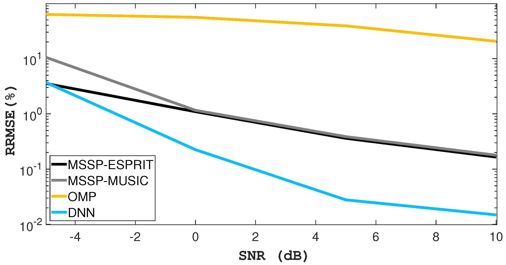

## Table of Contents

## What is Time Delay Estimation (TDE) in the context of machine learning?

Time Delay Estimation (TDE) in machine learning is a technique used to measure the time difference between the arrivals of the same signal at different sensors or microphones. This is important in fields like audio processing and telecommunications, where understanding the delay helps in locating the source of a sound or synchronizing signals. For example, if you have two microphones recording the same sound, TDE helps figure out which microphone picked up the sound first and by how much time the other one was delayed.

The basic idea behind TDE is to compare the signals received by different sensors to find the lag that best aligns them. One common method used for this is the cross-correlation technique. In this method, you slide one signal over the other and look for the position where the two signals match the best. Mathematically, if you have two signals $x(t)$ and $y(t)$, the cross-correlation function $R_{xy}(\tau)$ can be defined as $$ R_{xy}(\tau) = \int_{-\infty}^{\infty} x(t) y(t + \tau) dt. $$ The time delay is then estimated as the value of $\tau$ that maximizes $R_{xy}(\tau)$. This simple yet powerful approach helps in many applications, from improving speech recognition systems to enhancing the performance of wireless communication networks.

## Why is Time Delay Estimation important in signal processing and machine learning applications?

Time Delay Estimation (TDE) is really important in signal processing and machine learning because it helps us understand how signals travel from a source to different sensors. Imagine you have two microphones recording the same sound. TDE tells us which microphone heard the sound first and how much time passed before the other microphone picked it up. This is super useful for figuring out where the sound came from, which is called sound source localization. For example, if you're trying to locate a speaker in a room, knowing the time difference between when the sound reaches different microphones can help you pinpoint their exact location.

In [machine learning](/wiki/machine-learning), TDE is used to improve the performance of systems that deal with audio or other time-series data. For instance, in speech recognition, knowing the time delay between different microphones can help the system better understand and process the speech, leading to more accurate transcriptions. TDE also plays a key role in telecommunications, where it helps synchronize signals to ensure clear and efficient communication. By using techniques like cross-correlation, where we slide one signal over another to find the best match, TDE helps us align signals accurately. The cross-correlation function $$ R_{xy}(\tau) = \int_{-\infty}^{\infty} x(t) y(t + \tau) dt $$ is a common way to do this, and it's a big part of why TDE is so valuable in these fields.

## What are the basic principles behind Time Delay Estimation techniques?

Time Delay Estimation (TDE) is all about figuring out how much time it takes for a signal to travel from one place to another. Imagine you have two microphones and they both record the same sound. TDE helps you find out which microphone heard the sound first and by how much time the other microphone was delayed. The basic idea is to compare the signals from both microphones and find the time shift that makes them match up the best. This is often done using a technique called cross-correlation, which slides one signal over the other to see where they line up the best.

The cross-correlation method works by calculating how similar two signals are when one is shifted in time relative to the other. Mathematically, if you have two signals $x(t)$ and $y(t)$, the cross-correlation function is given by $$ R_{xy}(\tau) = \int_{-\infty}^{\infty} x(t) y(t + \tau) dt. $$ The time delay is then estimated as the value of $\tau$ that maximizes $R_{xy}(\tau)$. This means you find the shift that makes the signals most similar. TDE is super important in many areas like audio processing, where it helps locate where sounds are coming from, and in telecommunications, where it helps synchronize signals for better communication.

## Can you explain the difference between time delay and time difference of arrival (TDOA)?

Time delay and time difference of arrival (TDOA) are related concepts but they're not exactly the same thing. Time delay is the amount of time it takes for a signal to travel from its source to a sensor. For example, if you clap your hands and the sound reaches a microphone after a certain time, that time is the time delay. It's a measure of the absolute time it takes for the signal to travel from the source to a specific point.

Time difference of arrival (TDOA), on the other hand, is the difference in time between when the same signal reaches two different sensors. Imagine you have two microphones and you clap your hands. The sound might reach one microphone a bit earlier than the other. The TDOA is the time difference between when the sound arrives at the first microphone and when it arrives at the second one. TDOA is used a lot in figuring out where a sound is coming from, a process called sound source localization. If you know the TDOA and the positions of the microphones, you can use that information to calculate the location of the sound source.

To sum it up, time delay is about the time it takes for a signal to get from a source to a single sensor, while TDOA is about the difference in time it takes for that same signal to reach two different sensors. Both are important in fields like audio processing and telecommunications, but they give us different kinds of information that can be used in different ways.

## What are some common algorithms used for Time Delay Estimation in machine learning?

Time Delay Estimation (TDE) in machine learning often uses algorithms like the Cross-Correlation method. This technique slides one signal over another to find the time shift that makes them match up the best. Mathematically, if you have two signals $x(t)$ and $y(t)$, the cross-correlation function is given by $$ R_{xy}(\tau) = \int_{-\infty}^{\infty} x(t) y(t + \tau) dt. $$ The time delay is then the value of $\tau$ that maximizes $R_{xy}(\tau)$. This method is simple but effective and widely used in fields like audio processing and telecommunications.

Another common algorithm is the Generalized Cross-Correlation (GCC) method. This is an improvement over the basic cross-correlation because it can handle noisy signals better. The GCC method applies a weighting function to the cross-correlation, which helps to focus on the parts of the signal that are most useful for estimating the delay. This makes it more accurate in real-world situations where signals might be mixed with noise or other interfering sounds. Both these methods are key tools in TDE and help in tasks like locating sound sources or synchronizing signals in communication systems.

## How does the Generalized Cross-Correlation (GCC) method work for TDE?

The Generalized Cross-Correlation (GCC) method is a way to find out the time delay between two signals more accurately, especially when there's noise. It's like the regular cross-correlation method, but it adds a special twist. In the regular cross-correlation, you slide one signal over another to see where they match up the best. The GCC method does this too, but it also uses a weighting function. This function helps to focus on the parts of the signals that are most useful for figuring out the delay. By doing this, the GCC method can handle noisy signals better than the regular cross-correlation.

The math behind the GCC method involves using the cross-correlation of two signals, $x(t)$ and $y(t)$, and then applying a weighting function. The cross-correlation part is the same as before, given by $$ R_{xy}(\tau) = \int_{-\infty}^{\infty} x(t) y(t + \tau) dt. $$ But in the GCC method, we multiply this cross-correlation by a weighting function, $\Psi(\omega)$, which is chosen based on what we know about the signals and the noise. This weighted cross-correlation is then transformed back into the time domain to find the time delay. The time delay is the value of $\tau$ that maximizes this weighted cross-correlation. This makes the GCC method really helpful in real-world situations where signals might be mixed with noise or other interfering sounds.

## What role do neural networks play in improving Time Delay Estimation?

Neural networks help make Time Delay Estimation (TDE) better by learning from lots of examples. They can figure out patterns in signals that are hard for other methods to see, especially when there's a lot of noise. Imagine you have two microphones and you want to find out the time difference between when they pick up the same sound. A [neural network](/wiki/neural-network) can look at many examples of these signals and learn how to tell the time difference more accurately. It does this by adjusting its internal settings to minimize mistakes, kind of like how you might adjust a radio to get a clear signal.

One way neural networks do this is by using special layers that are good at finding time differences. These layers can look at signals in small chunks and compare them, much like the cross-correlation method, but in a smarter way. For example, if you have two signals $x(t)$ and $y(t)$, the neural network can learn to find the time shift $\tau$ that makes them match up the best. This can be shown with the formula $$ R_{xy}(\tau) = \int_{-\infty}^{\infty} x(t) y(t + \tau) dt, $$ where the neural network learns to find the best $\tau$. By doing this, neural networks can improve TDE in real-world situations where signals are messy and hard to work with.

## How can Time Delay Estimation be applied in real-world scenarios such as audio source localization?

Time Delay Estimation (TDE) plays a crucial role in audio source localization, which is figuring out where a sound is coming from. Imagine you're at a concert and you want to know where the singer is standing. You have two microphones set up in different places. TDE helps you find out which microphone heard the singer first and by how much time the other microphone was delayed. By knowing these time differences, you can use math to calculate the exact spot where the singer is. This is super helpful in things like video conferencing, where knowing where someone is talking from can make the audio sound clearer and more natural.

In real-world situations, TDE can be a bit tricky because sounds don't always travel in straight lines and there can be a lot of noise. But with methods like cross-correlation, where you slide one signal over another to see where they match up the best, TDE can still work well. The cross-correlation formula is $$ R_{xy}(\tau) = \int_{-\infty}^{\infty} x(t) y(t + \tau) dt. $$ The time delay is the value of $\tau$ that makes this function the biggest. By using this, along with smart algorithms and sometimes even neural networks, TDE can be used to locate sounds accurately, even in noisy places. This makes it really useful in all sorts of applications, from helping robots figure out where sounds are coming from to improving the sound quality in movies and video games.

## What are the challenges faced when implementing Time Delay Estimation in noisy environments?

Implementing Time Delay Estimation (TDE) in noisy environments can be really tough. When there's a lot of background noise, like in a busy street or a crowded room, it's hard to tell the difference between the actual sound you want to measure and all the other sounds around it. This makes it difficult to accurately figure out the time delay between when a sound reaches different microphones. The noise can mess up the signals and make the methods we use, like cross-correlation, less reliable. Cross-correlation works by sliding one signal over another to find where they match up the best, but noise can make the signals look similar in lots of places, so it's hard to pick the right one.

To deal with this, we use special techniques like the Generalized Cross-Correlation (GCC) method. This method is better at handling noisy signals because it uses a weighting function to focus on the parts of the signals that are most useful for finding the time delay. The GCC method calculates the cross-correlation of the signals and then applies this weighting function. The formula for the cross-correlation is $$ R_{xy}(\tau) = \int_{-\infty}^{\infty} x(t) y(t + \tau) dt, $$ and the GCC method adjusts this to make it more accurate in noisy environments. Even with these improvements, TDE in noisy places is still a challenge and often needs smart algorithms and sometimes even neural networks to work well.

## How do advanced techniques like deep learning enhance the accuracy of Time Delay Estimation?

Deep learning helps make Time Delay Estimation (TDE) more accurate by learning from lots of examples. Imagine you have two microphones and you want to find out the time difference between when they pick up the same sound. A [deep learning](/wiki/deep-learning) model can look at many examples of these signals and learn to tell the time difference better, even when there's a lot of noise. It does this by adjusting its internal settings to get better at finding the right time delay. For example, if you have two signals $x(t)$ and $y(t)$, the deep learning model can learn to find the time shift $\tau$ that makes them match up the best. This can be shown with the formula $$ R_{xy}(\tau) = \int_{-\infty}^{\infty} x(t) y(t + \tau) dt, $$ where the model learns to find the best $\tau$. By doing this, deep learning can improve TDE in real-world situations where signals are messy and hard to work with.

Deep learning models, like neural networks, use special layers that are good at finding time differences. These layers can look at signals in small chunks and compare them, much like the cross-correlation method, but in a smarter way. This helps the model figure out the time delay even when there's a lot of background noise. By training on a lot of data, the model gets better at [picking](/wiki/asset-class-picking) out the right time delay from all the noise. This makes deep learning really helpful in applications like audio source localization, where you need to know where a sound is coming from. By using deep learning, TDE can be more accurate and reliable, making it useful in all sorts of noisy environments.

## Can you discuss the impact of sampling rate and signal bandwidth on TDE performance?

The sampling rate and signal bandwidth have a big impact on how well Time Delay Estimation (TDE) works. The sampling rate is how often you take measurements of a signal, and it's important because it affects how accurately you can find the time delay. If the sampling rate is too low, you might miss important details in the signal, which makes it hard to tell the difference between when the sound reaches different microphones. On the other hand, a higher sampling rate gives you more data points, which can help you find the time delay more accurately. But, using a higher sampling rate also means you need more processing power and storage, so it's a balance between accuracy and resources.

The signal bandwidth is also important for TDE. Bandwidth is how much of the frequency range the signal covers, and it affects how well you can find the time delay. If the signal has a wide bandwidth, it means it has a lot of different frequencies, which can help you find the time delay more accurately. This is because different frequencies can give you more information about the signal. But if the signal has a narrow bandwidth, it might be harder to find the time delay because you have less information to work with. So, both the sampling rate and the signal bandwidth are key factors in making sure TDE works well, and you need to consider both when you're trying to estimate time delays accurately.

## What are the latest research developments and future directions in Time Delay Estimation using machine learning?

Recent research in Time Delay Estimation (TDE) using machine learning has focused on improving accuracy in noisy environments and real-time applications. One key development is the use of deep learning models, like neural networks, to better handle noisy signals. These models can learn from a lot of examples to find time delays more accurately than traditional methods. For instance, researchers are using Convolutional Neural Networks (CNNs) and Recurrent Neural Networks (RNNs) to process audio signals in chunks and compare them, much like the cross-correlation method but in a smarter way. The formula for cross-correlation is $$ R_{xy}(\tau) = \int_{-\infty}^{\infty} x(t) y(t + \tau) dt, $$ and deep learning models can learn to find the best $\tau$ even when there's a lot of background noise. This makes TDE more reliable in real-world situations, like figuring out where a sound is coming from in a busy room.

Future directions in TDE research are looking at making these methods even faster and more efficient. One area of interest is developing models that can work in real-time, which is important for applications like video conferencing and robotics. Researchers are also exploring ways to use less data and still get good results, which is helpful when you don't have a lot of examples to train on. Another exciting direction is combining TDE with other technologies, like beamforming, to not only find time delays but also improve the overall quality of the signal. By using machine learning to make TDE better, we can make all sorts of devices and systems work more smoothly and accurately, from smart speakers to self-driving cars.

## References & Further Reading

[1]: Carter, G. C., Knapp, C. H., & Nuttall, A. H. (1981). ["Estimation of the Magnitude-Squared Coherence Function via Fourier Transform and Its Application to Speech Enhancement."](https://ieeexplore.ieee.org/document/1162496) IEEE Transactions on Audio.

[2]: Brandstein, M. S., & Ward, D. B. (2001). ["Microphone Arrays: Signal Processing Techniques and Applications."](https://link.springer.com/book/10.1007/978-3-662-04619-7) Springer.

[3]: Balanis, C. A., & Ioannides, P. (2007). ["Introduction to Smart Antennas."](https://link.springer.com/book/10.1007/978-3-031-01533-5) Synthesis Lectures on Antennas #10. Morgan & Claypool Publishers.

[4]: Benesty, J., Chen, J., & Huang, Y. (2008). ["Microphone Array Signal Processing."](https://link.springer.com/book/10.1007/978-3-540-78612-2) Springer.

[5]: Huang, Y., Benesty, J., & Chen, J. (2006). ["Acoustic MIMO Signal Processing."](https://archive.org/details/acousticmimosign0000huan) Springer.