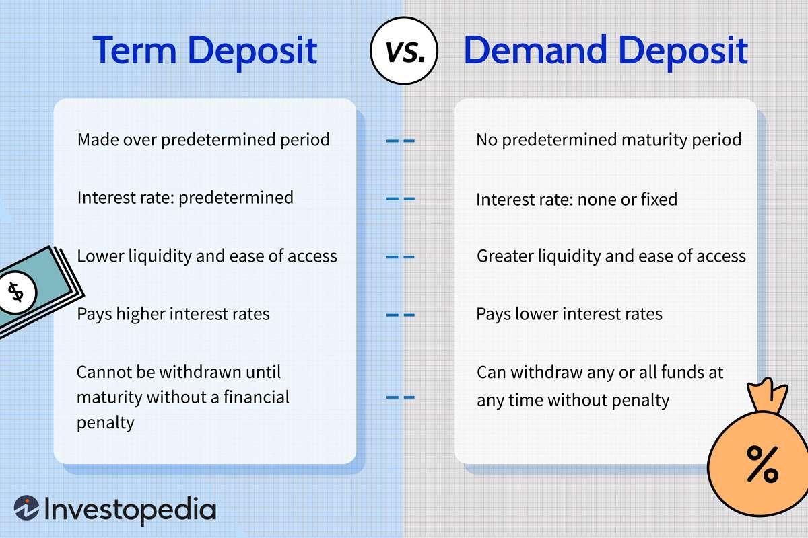

## Table of Contents

## What is a time deposit?

A time deposit is a type of savings account where you put your money in a bank for a certain period of time. You cannot take out the money until the time is up. This period can be a few months or several years. In return, the bank gives you a higher interest rate than a regular savings account. This means you earn more money on your savings.

People choose time deposits because they want to save money for a specific goal, like buying a car or going on a vacation. Since you can't take the money out early, it helps you save without spending. But if you really need the money before the time is up, you might have to pay a fee or lose some of the interest you earned. So, it's important to be sure you won't need the money before choosing a time deposit.

## What is a term deposit?

A term deposit is another name for a time deposit. It's a kind of savings account where you put your money in a bank for a fixed period of time. This time can be a few months or several years. You can't take the money out until the time is over. In return, the bank gives you a higher interest rate than a regular savings account. This means you earn more money on your savings.

People choose term deposits because they want to save money for a specific goal, like buying a house or paying for a big trip. Since you can't take the money out early, it helps you save without spending. But if you really need the money before the time is up, you might have to pay a fee or lose some of the interest you earned. So, it's important to be sure you won't need the money before choosing a term deposit.

## How do time deposits and term deposits differ?

Time deposits and term deposits are actually the same thing. They are both types of savings accounts where you put your money in a bank for a certain amount of time. This time can be a few months or several years. You can't take the money out until the time is up. In return, the bank gives you a higher interest rate than a regular savings account. This means you earn more money on your savings.

People choose these deposits because they want to save money for a specific goal, like buying a car or going on a vacation. Since you can't take the money out early, it helps you save without spending. But if you really need the money before the time is up, you might have to pay a fee or lose some of the interest you earned. So, it's important to be sure you won't need the money before choosing a time deposit or a term deposit.

## What are the typical terms for time and term deposits?

The typical terms for time and term deposits can be anywhere from a few months to several years. Common terms include 3 months, 6 months, 1 year, 2 years, 3 years, and 5 years. The exact terms can vary depending on the bank or financial institution offering the deposit.

Choosing a longer term usually means you get a higher interest rate. This is because you are agreeing to leave your money in the bank for a longer time. But, if you need to take your money out before the term is over, you might have to pay a penalty or lose some of the interest you earned. So, it's important to pick a term that matches when you will need the money.

## What are the interest rates like for time and term deposits?

Interest rates for time and term deposits can vary a lot. They depend on things like how long you leave your money in the bank, the bank you choose, and what's happening in the economy. Usually, the longer you agree to keep your money in the bank, the higher the interest rate will be. So, if you pick a 5-year term, you might get a better rate than if you choose a 3-month term.

Right now, interest rates for time and term deposits might be around 0.5% to 2% per year for shorter terms, and they can go up to 3% or more for longer terms. But these numbers can change. It's a good idea to check with different banks to see what rates they are offering. Remember, the interest you earn can add up over time, so even a small difference in the rate can make a big difference in the end.

## How can one open a time or term deposit account?

To open a time or term deposit account, you need to go to a bank or use their website. You will need to fill out an application form. This form will ask for your personal information like your name, address, and maybe your social security number. You also need to decide how much money you want to put in the account and for how long. The bank will tell you what interest rate you will get based on the term you choose.

Once you have filled out the form and given the bank the money, they will open the account for you. You will get a confirmation, either on paper or by email, that shows all the details of your deposit. It's important to keep this safe. After the term is over, the bank will give you your money back, plus the interest you earned. If you need to take the money out early, you should talk to the bank first because there might be a penalty.

## What are the risks associated with time and term deposits?

Time and term deposits are usually very safe because they are backed by banks, but there are still some risks. One big risk is that you might need your money before the term is over. If you take your money out early, you might have to pay a penalty or lose some of the interest you earned. This can be a problem if something unexpected happens and you need the money right away.

Another risk is that interest rates might go up while your money is locked in the deposit. If this happens, you might miss out on better rates that you could get with a new deposit. Also, the interest you earn might not keep up with inflation. This means that the value of your money could go down over time, even though you are earning interest. So, it's important to think about these risks before you decide to put your money in a time or term deposit.

## Can funds be withdrawn from time and term deposits before maturity?

Yes, you can take your money out of a time or term deposit before the time is up, but it might cost you. Banks usually charge a fee if you want to get your money early. This fee can be a lot of money, or you might lose some of the interest you earned. It's important to know about this fee before you put your money in a time or term deposit.

The reason banks do this is because they want you to keep your money with them for the whole time you agreed on. If you take your money out early, they might have to find other ways to use that money, which can be hard for them. So, if you think you might need your money before the term is over, a time or term deposit might not be the best choice for you.

## How are taxes handled on the earnings from time and term deposits?

The money you earn from time and term deposits is called interest. You have to pay taxes on this interest. The bank will send you a form at the end of the year that shows how much interest you earned. This form is called a 1099-INT. You need to report this interest on your tax return. The interest is added to your other income, and you pay taxes on the total amount.

The tax rate you pay on the interest depends on your total income and your tax bracket. If you have a lot of other income, you might pay more taxes on the interest. But if your total income is low, you might pay less. It's a good idea to talk to a tax professional to make sure you are doing everything right. They can help you understand how much tax you need to pay on your earnings from time and term deposits.

## What strategies can be used to maximize returns from time and term deposits?

To get the most out of your time and term deposits, you should shop around and compare different banks. Each bank might offer different interest rates, so it's smart to pick the one that gives you the highest rate. Also, think about choosing a longer term because usually, the longer you leave your money in the bank, the higher the interest rate will be. Just make sure you won't need the money before the term is up, or you might have to pay a fee to take it out early.

Another strategy is to use a strategy called "laddering." This means you split your money into several time or term deposits with different lengths. For example, you might put some money in a 1-year deposit, some in a 2-year deposit, and some in a 3-year deposit. When each deposit matures, you can take the money out or put it into a new deposit. This way, you can take advantage of higher interest rates for longer terms, but you also have some of your money becoming available more often. Laddering helps you get a good return while still having access to your money at different times.

## How do time and term deposits fit into a broader investment portfolio?

Time and term deposits can be a good part of your overall investment plan. They are safe because they are usually backed by banks, which means you are less likely to lose your money. This makes them a good choice if you want to keep some of your money safe while still earning a little bit of interest. They can balance out riskier investments like stocks, which can go up and down a lot. By having some money in time and term deposits, you can feel more secure knowing that part of your money is safe and growing slowly.

Another way time and term deposits can help is by giving you a steady income. The interest you earn can be a reliable source of money, especially if you are retired or need regular income. You can use this money for everyday expenses or to reinvest in other parts of your portfolio. Just remember that the interest rates might not keep up with inflation, so it's important to have other investments too. By mixing time and term deposits with other types of investments, you can create a balanced portfolio that helps you reach your financial goals.

## What are the current trends and future outlook for time and term deposits?

Right now, time and term deposits are still popular because they are safe and give you a steady interest rate. But, the interest rates for these deposits are pretty low compared to the past. This is because of things like low inflation and the actions of central banks. People are still using time and term deposits to save money for the future, but some are looking for other places to put their money because they want higher returns. Banks are trying to make these deposits more attractive by offering special deals or better rates for longer terms.

In the future, time and term deposits might become more interesting if interest rates go up. If the economy gets better and inflation goes up, banks might start offering higher rates to get more people to put their money in these deposits. But, they will always be seen as a safe choice for saving money. As people keep looking for ways to save and grow their money, time and term deposits will still be a good option, especially for those who want to keep their money safe and earn a little bit of interest without taking big risks.

## What are the factors affecting term deposit interest rates?

Interest rates for term deposits are influenced by a variety of factors, reflecting broader economic conditions and specific financial strategies employed by banks. One of the primary determinants is central bank policies, which set the benchmark interest rates in an economy. When central banks, such as the Federal Reserve in the United States, adjust their rates, there is a cascading effect on the rates that banks offer for term deposits. For instance, an increase in the federal funds rate often leads banks to raise their term deposit rates to attract depositors, seeking to maintain their capital base while managing their lending and asset portfolios effectively.

Economic indicators also play a crucial role. Factors such as GDP growth, employment rates, and consumer confidence influence overall market conditions. During periods of robust economic growth, with rising inflation expectations, banks may offer higher interest rates on term deposits to attract more savings. This helps them fund increased lending activities while compensating depositors for the anticipated decrease in the value of money over time.

Inflation is another key consideration. Investors must be vigilant about the real [interest rate](/wiki/interest-rate-trading-strategies), which is the nominal rate adjusted for inflation. The formula for calculating real interest rate is:

$$
\text{Real Interest Rate} = \text{Nominal Interest Rate} - \text{Inflation Rate}
$$

A positive real interest rate ensures that the purchasing power of the depositors' money is preserved over the term of the deposit. When inflation rates are high, banks might offer increased nominal rates to ensure that the real returns remain attractive to investors.

Furthermore, banks impose penalties for early withdrawal from term deposits. These penalties are in place to discourage premature liquidations, which can disrupt the bank's [liquidity](/wiki/liquidity-risk-premium) management and financial planning. The penalties impact the effective returns on term deposits and should be thoroughly considered by investors weighing the benefits of a fixed interest plan against the potential need for liquidity before the maturity date.

In summary, term deposit interest rates are shaped by central bank policy directions, prevailing economic indicators, and inflationary trends. Understanding these factors enables investors to make informed decisions, ensuring their deposits not only yield favorable returns but also align with their broader financial strategy.

## References & Further Reading

- Bergstra, J., et al. (2011). 'Algorithms for Hyper-Parameter Optimization.' Advances in Neural Information Processing Systems. This paper discusses innovative algorithms designed to optimize hyperparameters, essential for refining the accuracy and efficiency of machine learning models. The work is an essential resource for understanding the underlying mechanisms that drive algorithmic efficiency, aiding investors who utilize machine learning in algorithmic trading.

- Lopez de Prado, M. (2018). 'Advances in Financial Machine Learning.' This book is a comprehensive guide on how machine learning techniques can be applied to the financial markets. Lopez de Prado presents methods to improve risk management and to develop more robust trading strategies through machine learning, making it a valuable resource for those involved in algorithmic trading.

- Aronson, D. (2006). 'Evidence-Based Technical Analysis: Applying the Scientific Method and Statistical Inference to Trading Signals.' This book focuses on the application of scientific methods to the evaluation of trading systems and signals, emphasizing the importance of evidence-based decision-making. It is an invaluable resource for traders and analysts seeking to enhance their trading strategies through rigorous statistical methods.

- Jansen, S. (2018). 'Machine Learning for Algorithmic Trading.' Jansen's work serves as a practical guide for implementing machine learning tools in algorithmic trading. It provides both theoretical insights and practical coding examples, primarily in Python, making it an excellent supplement for traders looking to integrate machine learning into their trading algorithms.

- Chan, E.P. (2009). 'Quantitative Trading: How to Build Your Own Algorithmic Trading Business.' Chan's book offers a detailed overview of creating and managing a quantitative trading business. It covers strategy development, risk management, and trading system design, providing readers with a roadmap for establishing their own algorithmic trading ventures.

