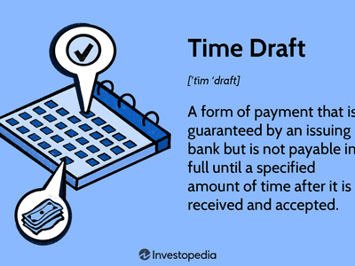

Algorithmic trading, often referred to as algo trading, is a sophisticated technique for executing trades through automated, pre-programmed trading instructions. These instructions are based on variables such as price, timing, and volume. The rapid, rule-based execution reduces the risk of human error and often leads to better market efficiency. A critical component of algorithmic trading is process scheduling, which is fundamental in optimizing trading strategies by determining the order and timing of operations. Efficient scheduling ensures that algorithms are executed promptly and can react swiftly to market fluctuations, thus improving trading performance and minimizing risks.

Time management is equally crucial in algorithmic trading. It comprises strategies and techniques used to support the timing of trade executions, ensuring they align with market conditions. Effective time management can enhance the accuracy and profitability of trades by ensuring that algorithms are responsive and adaptable in real-time trading environments. Techniques such as backtesting and historical analysis are used to revise and improve these strategies continuously.



Moreover, the integration of financial instruments such as time drafts adds another layer of complexity and opportunity within trading. Time drafts, instrumental in international finance, provide a mechanism for deferred payment, facilitating smoother transactions. They offer traders flexibility and the ability to utilize credit, thus managing liquidity and cash flow better. In the context of algorithmic trading, understanding and employing these instruments can lead to more strategic financial logistics, further optimizing trading outcomes.

This convergence of process scheduling, time management, and financial instruments like time drafts fosters a more robust trading infrastructure. It allows traders to manage risk effectively while maximizing profit potential. As financial markets continue to evolve, the strategic use of these elements will become increasingly important for maintaining competitiveness and achieving sustainable performance.

## Table of Contents

## The Role of Process Scheduling in Algo Trading

Process scheduling is a fundamental concept in computer science, primarily dealing with the allocation of system resources to execute various processes efficiently. In the context of algorithmic trading, process scheduling plays a crucial role in optimizing trading algorithms to ensure timely and effective market engagement. The performance of trading algorithms is significantly influenced by how well they utilize system resources and respond to market signals, which depend on efficient scheduling.

**1. Contribution to Efficient Algorithm Execution**

Process scheduling ensures that trading algorithms execute trading instructions at the optimal time. In fast-paced markets, the ability to react promptly to market signals is vital. Efficient scheduling maximizes CPU and memory usage, allowing algorithms to process large volumes of data quickly and execute trades without delay. This aspect is particularly important in high-frequency trading ([HFT](/wiki/high-frequency-trading-strategies)), where delays of even a few milliseconds can impact profitability.

**2. Importance of Timing in Market Responses**

The timing of trades can significantly influence their success. Markets are volatile, with prices fluctuating rapidly in response to various factors. Algorithms must be scheduled to execute trades within precise time frames to capture favorable price movements. An effective scheduling system uses algorithms that predict market changes and adjust execution timings accordingly, thus enhancing responsiveness to market dynamics.

**3. Examples of Scheduling Algorithms**

Common scheduling algorithms in computing, such as Round Robin, Priority Scheduling, and Dynamic Scheduling, have parallels in trading. For instance, Dynamic Scheduling, which adjusts resource allocation based on current workloads, can be mirrored in adaptive trading algorithms that change their execution strategy based on real-time market conditions. These algorithms improve market responsiveness by prioritizing trades that maximize immediate returns.

**4. Challenges of Market Volatility**

Market [volatility](/wiki/volatility-trading-strategies) presents significant challenges for process scheduling in trading. Traditional scheduling algorithms may not cope well with unpredictable market conditions. Therefore, there is a need for adaptive scheduling solutions that can quickly recalibrate trading strategies in response to sudden market shifts. This adaptability ensures that trading algorithms remain effective even when facing extreme market conditions.

**5. Integration of AI and Machine Learning**

Artificial intelligence (AI) and [machine learning](/wiki/machine-learning) (ML) have revolutionized process scheduling in [algorithmic trading](/wiki/algorithmic-trading). By analyzing historical data and identifying patterns, AI-driven algorithms can predict optimal scheduling times for trades. Machine learning models can dynamically adjust scheduling strategies based on real-time data, enhancing the algorithm's ability to respond swiftly to market changes. For example, [reinforcement learning](/wiki/reinforcement-learning) can be employed to fine-tune scheduling decisions, continuously improving trading performance through feedback loops.

In conclusion, process scheduling is a vital component of algorithmic trading, directly affecting the efficiency and effectiveness of trading strategies. By leveraging advanced scheduling techniques and integrating AI and ML capabilities, traders can significantly improve their market responsiveness, reduce latency, and ultimately achieve better trading outcomes.

## Time Management Strategies in Algorithmic Trading

Time management plays a crucial role in the successful implementation and execution of algorithmic trading strategies. In the fast-paced world of trading, timely decision-making and precise execution are key to gaining a competitive advantage. Proper time management ensures that trading algorithms are executed at the right moment, reflecting the most current market conditions and maximizing trade profitability.

Effective time management techniques can significantly enhance trading accuracy and profitability. One fundamental strategy is the synchronization of algorithm execution with market events. Traders often use data from economic calendars to align their trading strategies with major announcements, such as [interest rate](/wiki/interest-rate-trading-strategies) decisions or employment reports, which can cause significant market volatility. By optimizing the timing of trades around these events, traders can capitalize on short-term price movements.

Backtesting and historical analysis are integral to informing time management decisions within trading algorithms. These processes involve running trading strategies on historical data to evaluate their performance over time. By analyzing past patterns, traders can identify optimal times for executing trades, thus refining their timing strategies. For example, statistical analysis of past price movements and trading volumes can guide decisions on the best times of the day to trade specific assets.

Case studies of successful time management practices in high-frequency trading (HFT) scenarios illustrate the impact of precise timing. High-frequency traders often employ low-latency systems to execute trades milliseconds before others, exploiting minimal price discrepancies for profit. For instance, if analysis shows a consistent daily pattern, such as increased volatility at the market open, HFT algorithms can be specifically timed to trade during these windows, enhancing profitability.

Several technical tools and software solutions assist traders in managing their trading schedules and timelines more effectively. Platforms like MetaTrader and NinjaTrader offer advanced features such as automated trade execution and real-time data analysis, enabling traders to manage their strategies efficiently. Moreover, using programming languages like Python, traders can develop custom scripts to automate processes and optimize trade timing. Here's an example of using Python to check the time and execute a trading strategy based on the current hour:

```python
from datetime import datetime
import pytz

# Define the trading strategy
def execute_trade():
    # Example logic for executing a trade
    print("Executing trade based on the current strategy.")

# Get the current time in UTC
current_time = datetime.now(pytz.utc)

# Define the desired trading hour (24-hour format)
trading_hour = 14  # e.g., 14 for 2 PM UTC

# Check if the current time matches the trading hour
if current_time.hour == trading_hour:
    execute_trade()
```

This script ensures that the trading strategy is executed at 2 PM UTC, demonstrating how time management can be streamlined through automation. By leveraging these tools and techniques, traders can ensure that their algorithmic strategies are not only well-timed but also adaptable to changes in market conditions, enhancing both the accuracy and profitability of their trades.

## Essential Steps for Developing a Robust Algo Trading Strategy

Developing a robust algorithmic trading strategy involves several critical steps to ensure effectiveness and mitigate risks. The foundation of such a strategy lies in defining clear objectives and understanding the trader's risk tolerance. A well-structured trading strategy aligns with the trader's financial goals, whether they seek steady income, capital appreciation, or risk mitigation. Establishing a risk tolerance level helps determine the acceptable level of volatility and potential losses an investor is willing to withstand, ensuring that the strategy remains sustainable during market fluctuations.

Conducting thorough market research and analysis is the next essential step. This involves studying market trends, economic indicators, and historical data to identify patterns that could influence trading decisions. Technical analysis, [fundamental analysis](/wiki/fundamental-analysis), and sentiment analysis are common methods employed to gain insights into market dynamics. For instance, technical analysis might include examining support and resistance levels, moving averages, or price-[volume](/wiki/volume-trading-strategy) trends to predict future price movements.

Upon gathering and analyzing market data, formulating a comprehensive trading strategy is crucial. This strategy should have well-defined entry and [exit](/wiki/exit-strategy) parameters, along with solid risk management rules. Entry strategies might rely on signals generated by indicators such as Moving Average Convergence Divergence (MACD) or Relative Strength Index (RSI), while exit strategies could include stop-loss orders or profit targets to lock in winnings. Risk management parameters are essential to protect the trading account from significant losses. These may include setting a maximum percentage of capital to risk per trade and employing position sizing techniques.

Backtesting is a vital component of trading strategy development. It involves using historical data to assess how the strategy would have performed in past market conditions. This helps in identifying potential weaknesses and areas for improvement. Optimization during [backtesting](/wiki/backtesting) can be achieved by adjusting strategy parameters for better performance without overfitting to historical data. Modern trading platforms often provide tools for conducting backtesting through simulated trading environments.

Implementing real-time testing, or forward testing, is the final step to validate strategy effectiveness under live market conditions. Unlike backtesting, real-time testing deals with live data and includes factors like order slippage and real-world execution delays. This phase ensures that the strategy operates as expected in a dynamic trading environment. Real-time testing also provides a reality check to the strategy's robustness before deploying significant capital.

By carefully defining objectives, conducting detailed analysis, and rigorously testing the strategy, traders can build a robust algorithmic trading system capable of withstanding market volatility and achieving desired financial outcomes.

## Understanding Time Drafts in Financial Transactions

Time drafts are pivotal instruments in international trade transactions, serving as written orders by one party (a drawer) that obligate another party (a drawee, often a bank) to pay a specified sum at a future date. Distinct from sight drafts, which demand immediate payment upon presentation, time drafts allow for deferred payment, thus providing the drawee, typically the importer, with credit terms to settle the payment at a later date. 

The choice between time drafts and sight drafts depends significantly on the financial standing and trust between trading parties. Time drafts are suitable when there is mutual trust and a need for [liquidity](/wiki/liquidity-risk-premium) management, whereas sight drafts are preferred when immediate payment is required, reducing the risk associated with delayed payments.

The utilization of time drafts in international trade enhances financial operations by granting importers the flexibility to manage cash flows and liquidity. For example, a business might receive goods on credit terms of 30, 60, or 90 days, allowing them to sell the goods before settling the draft, thus aligning cash inflows with payment obligations. This deferment can be critical for businesses that require time to convert inventory into revenue.

Despite their advantages, time drafts also come with inherent risks and benefits. Their primary benefit lies in the flexibility they offer for managing short-term financing needs, which can be especially beneficial in smoothing out cash flow fluctuations and alleviating immediate financial pressures. However, they pose risks, primarily associated with the drawee's creditworthiness. If the drawee fails to honor the draft upon maturation, the drawer may face significant financial setbacks, potentially impacting their liquidity and leading to disputes or legal complications.

In trade finance, mitigating these risks involves the use of trade credit insurance or securing guarantees from reputable financial institutions. Additionally, businesses must weigh the cost of potential interest or fees associated with using time drafts, which can vary based on market conditions and the credit terms negotiated with financial institutions.

By carefully leveraging time drafts, businesses can effectively manage capital requirements and sustain operations through enhanced control over financial logistics. Nevertheless, informed assessment and prudent management are indispensable to navigating the complexities and optimizing the benefits of time drafts in international trade.

## Integrating Time Drafts with Algo Trading Strategies

Time drafts, often used in international trade, can significantly enhance algorithmic trading strategies by optimizing financial logistics. These financial instruments allow traders to manage liquidity and cash flow effectively, thus complementing the operational dynamics of algorithmic trading. Time drafts are agreements that specify future payments, providing the parties involved with credit terms and improving transaction efficiency. In the context of algo trading, the ability to use time drafts can streamline financial operations by temporally extending resources, thus minimizing immediate cash outflows and offering greater flexibility in managing capital.

Financial instruments like time drafts play a pivotal role in liquidity management. By setting specific payment terms, these instruments allow traders to align their financial obligations more closely with expected cash inflows from their trading activities. This synchronization helps maintain a stable liquidity position, essential for algorithmic trading operations where rapid market movements require quick access to funds. Furthermore, effective liquidity management facilitated by time drafts can help reduce the cost of capital, thereby enhancing overall trading profitability.

Integrating fixed-income instruments and drafts into trading strategies provides a hedge against market volatility. These instruments offer predictable returns and can be used to offset potential losses in more volatile equity or derivative markets. By incorporating time drafts and similar instruments into an algorithmic trading platform, traders can create a more balanced portfolio that mitigates risk exposure. This integration requires sophisticated algorithms capable of dynamically adjusting trading positions based on current and projected market conditions.

Current trends in algorithmic trading indicate a growing incorporation of financial guarantees, like time drafts, to enhance security and reduce counterparty risk. Such guarantees provide a level of assurance against default by the counterparties, which is crucial in high-frequency trading environments where transaction volumes are large, and execution times are short. The implementation of these guarantees necessitates advanced risk management algorithms to continuously assess and adjust exposure levels based on market data and trading positions.

Understanding compliance and regulatory frameworks is vital when utilizing time drafts in automated trading environments. Different jurisdictions may have specific rules governing the use of such instruments, and adherence to these regulations is essential to avoid legal penalties and ensure transparent operations. Traders must stay informed about changes in financial regulations and incorporate compliance checks into their trading algorithms. This often involves developing algorithms that can process large sets of regulatory data and automatically adjust trading practices to align with legal requirements.

In summary, the integration of time drafts and related financial instruments in algorithmic trading strategies offers substantial benefits in terms of liquidity management, risk mitigation, and operational efficiency. However, it requires an intricate understanding of financial logistics and regulatory landscapes to be executed effectively.

## Balancing Manual and Automated Trading Approaches

Algorithmic trading and manual trading represent two distinct paradigms in financial markets, each offering unique advantages and presenting specific challenges. By evaluating the two approaches, traders can better understand how to optimize their use of time and resources for improved market performance.

Algorithmic trading, often referred to as algo trading, leverages computational algorithms to execute trades based on predefined criteria. Its primary advantage lies in its ability to process vast datasets and perform trades at speeds unachievable by human traders. This method optimizes scheduling by facilitating round-the-clock market engagement without fatigue, leading to improved execution precision and reduced latency. However, the rigidity of pre-programmed instructions may limit responsiveness to sudden market changes, posing a potential risk in volatile conditions.

In contrast, manual trading relies on the expertise and intuition of traders, who manage trades directly. This approach benefits from the human capacity for nuanced judgment and adaptability to real-time market movements, which can be advantageous in unpredictable environments. However, manual trading is inherently limited by human processing speed and is prone to emotional biases that can impact decision-making efficiency.

Hybrid trading strategies attempt to harness the strengths of both algorithms and human oversight. These strategies incorporate algorithm-driven executions while retaining manual intervention capabilities for critical decision points. This integrated approach can enhance trade accuracy and adaptability by providing automated data processing with human analytic intuition. For example, a hybrid strategy might employ algorithmic models to identify trading opportunities while a trader makes final judgments on execution based on broader market factors.

Traders seeking to decide between these methodologies should consider market conditions, personal trading style, and the specific objectives they wish to achieve. For instance, highly volatile markets might benefit from the adaptability of manual oversight, while stable markets with predictable patterns could see improved efficiency through algorithmic methods. Personal preference in terms of control and risk tolerance also plays a critical role in choosing the appropriate strategy.

The future of trading strategies is likely to be shaped by advances in technology and evolving market dynamics. Developments in [artificial intelligence](/wiki/ai-artificial-intelligence) and machine learning are expected to drive further efficiencies in algorithmic trading, making it more adaptive and capable of predictive analytics. Meanwhile, tools that enhance human decision-making processes—such as enhanced visualization technologies—may improve manual and hybrid strategies.

Emerging trends indicate that the boundaries between manual and automated trading will become increasingly blurred, with innovative solutions enabling traders to leverage the best of both worlds. As technology progresses, traders are encouraged to remain agile, integrating new methodologies to stay competitive while managing associated risks effectively.

## Conclusion

Algorithmic trading, characterized by the use of automated scripts to execute trades, heavily relies on process scheduling and time management to ensure the efficiency and profitability of trading operations. These elements serve as the backbone for developing robust trading strategies that can execute transactions swiftly in volatile markets. Process scheduling in algorithmic trading is crucial as it allows for the optimal execution of algorithms by correctly prioritizing tasks and allocating computational resources effectively. This efficient allocation results in timely market responses, minimizing delays that could impact trade outcomes.

Time management further complements these efforts by emphasizing the importance of precise timing in trade execution. Strategies can be tailored to exploit market conditions and historical trends, informed by backtesting and analyses, resulting in a more refined approach to trading. As the landscape of financial trading continuously evolves, incorporating innovative scheduling techniques is essential for maintaining competitive advantage. The interplay between new scheduling methods and the existing frameworks signifies a transformative potential in improving trade execution and risk management.

Balancing automated processes with manual oversight remains a pivotal aspect of contemporary trading strategies. While algorithms provide speed and accuracy, manual interventions offer the necessary flexibility in the face of unpredictable market dynamics. Traders are encouraged to leverage advancements in algorithmic technologies while also refining their time management skills to adapt to this fast-paced environment. This adaptability is crucial for staying ahead, as technological evolution in trading is rapid and unrelenting.

In conclusion, the integration of sophisticated scheduling and time management techniques has a profound impact on trader performance and risk management. By embracing innovative strategies and remaining agile in their execution processes, traders can significantly enhance their profitability and mitigate risks in increasingly dynamic markets. The convergence of these methodologies not only represents an advancement in trading technologies but also a critical advantage for ensuring long-term success in the financial markets.

## References & Further Reading

[1]: Bergstra, J., Bardenet, R., Bengio, Y., & Kégl, B. (2011). ["Algorithms for Hyper-Parameter Optimization."](https://papers.nips.cc/paper/4443-algorithms-for-hyper-parameter-optimization) Advances in Neural Information Processing Systems 24.

[2]: ["Advances in Financial Machine Learning"](https://www.amazon.com/Advances-Financial-Machine-Learning-Marcos/dp/1119482089) by Marcos Lopez de Prado

[3]: ["Evidence-Based Technical Analysis: Applying the Scientific Method and Statistical Inference to Trading Signals"](https://www.amazon.com/Evidence-Based-Technical-Analysis-Scientific-Statistical/dp/0470008741) by David Aronson

[4]: ["Machine Learning for Algorithmic Trading"](https://github.com/stefan-jansen/machine-learning-for-trading) by Stefan Jansen

[5]: ["Quantitative Trading: How to Build Your Own Algorithmic Trading Business"](https://www.amazon.com/Quantitative-Trading-Build-Algorithmic-Business/dp/1119800064) by Ernest P. Chan