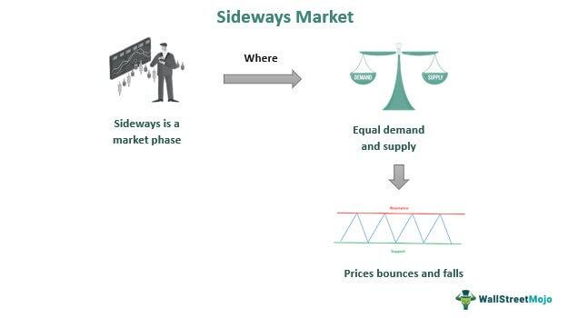

In the fast-paced financial markets, understanding the nuances of order execution is crucial for successful trading. A significant component in this domain is "Time in Force" (TIF), a parameter that determines the duration for which a trader's order stays active in the market before it is either executed or expires. Effectively utilizing TIF allows traders to tailor their approach to suit varying market conditions, optimize their trading strategies, and seek the best possible market execution outcomes.

Time in Force is especially pertinent in algorithmic trading, where orders are automatically executed based on predefined conditions. By incorporating different TIF options, traders can design algorithms that not only aim for optimal execution but also mitigate risks associated with market volatility and price fluctuations. An understanding of TIF can therefore help traders and investors leverage these orders to ensure their trades align more closely with strategic objectives and are executed at favorable price levels.



This article will explore various TIF order types and their significance in enhancing the efficacy of algorithmic trading. Through examples and practical applications, we aim to provide nuanced insights into how TIF can be employed to improve market execution. By mastering TIF, traders can gain a competitive edge, enabling a more balanced approach between immediate execution demands and the calculated patience derived from strategic planning.

## Table of Contents

## Understanding Time In Force

Time in Force (TIF) refers to an instruction that accompanies a trade order, defining the duration for which the order remains active in the market. These instructions are essential for traders to effectively manage their strategies while minimizing inadvertent executions. By controlling the lifespan of trade orders, TIF helps traders mitigate the risks associated with market volatility and ensures that the trades are executed in alignment with their planning.

Commonly used TIF options include:

1. **Day Order**: This type of order remains valid only for the trading day on which it is placed. If the order is not executed by the end of the trading day, it is automatically canceled. Day Orders are particularly useful for traders who want to avoid the risks associated with holding positions overnight, such as price gaps caused by after-market news or events.

2. **Good ‘Til Canceled (GTC)**: Unlike Day Orders, GTC orders remain active until the trader cancels them manually or the order is filled. GTC orders are useful for traders seeking specific entry or exit points, as these orders do not expire at the end of the trading day.

3. **Immediate or Cancel (IOC)**: This type of order mandates that any portion of the order that can be filled immediately will be executed, while the remaining unfilled portion is canceled. IOC orders are helpful in fast-moving markets where immediate execution is prioritized to take advantage of favorable pricing, yet the trader does not wish to keep the order open beyond the available opportunity.

4. **Fill or Kill (FOK)**: FOK orders must be executed in full immediately or not at all. This order type is especially beneficial in markets with high volatility where the trader requires certainty in securing an entire position without risking partial execution, which might lead to suboptimal trading results.

In volatile markets, the ability to set precise time limits is critical. It allows traders to avoid trades that would execute at undesired price levels, thus enhancing their control over market interactions. Moreover, TIF is crucial in implementing trading plans where temporal constraints are as important as pricing conditions, ensuring that trades are carried out in accordance with the strategic objectives set by the trader.

## Types of Time In Force Orders

Time in Force (TIF) orders are essential for managing the execution life cycle of a trade, determining how long an order remains active in the market. Each type of TIF order tailors the transaction to match specific trading strategies and market conditions.

**Day Orders** are active for a single trading session, expiring if not executed by market close. These orders are suitable for traders who wish to avoid overnight market exposure and the risks associated with price changes occurring outside standard trading hours. Day Orders are useful in intraday trading strategies where quick execution is desirable.

**Good 'Til Canceled (GTC)** orders stay active until they are either executed or manually canceled by the trader. This feature is beneficial for those aiming for specific price points that may not be reached in a single session. GTC orders are advantageous when traders have longer-term market views or are waiting for significant market events to trigger their price targets.

**Immediate or Cancel (IOC)** orders necessitate immediate execution. If the entire order cannot be executed immediately, any unfilled portion is canceled. This TIF option is particularly useful in fast-moving or volatile markets, where traders aim to capitalize on immediate opportunities without leaving parts of their orders exposed to market shifts. IOC orders are optimal when quick decision-making and execution are critical, such as during news events that drive rapid price movements.

**Fill or Kill (FOK)** orders demand complete fulfillment or zero execution. These orders are exclusively used when traders require the entire order to be filled at once, ensuring no partial fills occur. FOK orders are especially helpful in highly volatile markets where full position entry or exit is necessary. They are frequently employed during index adjustments or specific market maneuvers where partial execution could pose significant risks.

Each TIF order type offers distinct advantages and is best utilized under scenarios where their characteristics align with the trader's objectives and market expectations. By integrating these formats, traders can precisely tailor their execution strategy to their risk tolerance and market outlook, ensuring more consistent alignment with their trading goals.

## Algorithmic Trading and Time In Force

Algorithmic trading, often referred to as algo-trading, automates the process of buying and selling financial instruments in the market through the use of pre-determined conditions and rules. This method leverages mathematical models and computer programming to execute trades at speeds and frequencies that would be impossible for human traders. A critical component of [algorithmic trading](/wiki/algorithmic-trading) is the consideration of Time in Force (TIF) instructions, which play a vital role in defining the execution parameters of trades.

TIF orders provide a structured approach to manage the duration a trade order remains active in the market, thereby enhancing the precision with which orders are executed. These instructions include options such as Day Order, Good 'Til Canceled (GTC), Immediate or Cancel (IOC), and Fill or Kill (FOK). By employing these TIF settings, algorithms can optimize trades for specific market conditions while mitigating the risk of slippage—where the executed price differs from the expected price due to rapid market movements.

For instance, in [market making](/wiki/market-making)—a strategy involving the simultaneous buying and selling of financial instruments to provide [liquidity](/wiki/liquidity-risk-premium) and profit from bid-ask spreads—TIF orders are indispensable. A trader might use IOC orders to ensure that only orders that can be executed immediately are processed, thus maintaining a balanced position without unintended exposure.

Arbitrage, another common algorithmic trading strategy, exploits price differences of the same asset across different markets. TIF orders like FOK may be utilized to guarantee that the entirety of an order is executed, or none at all, preventing partial fills that could disrupt the delicate balance required for successful [arbitrage](/wiki/arbitrage).

Moreover, advanced financial technology platforms integrate TIF instructions within their automated trading solutions to offer granular control over trade executions. Python, a popular language in finance for its simplicity and extensive library support, can be used to script such trading algorithms:

```python
import ccxt

exchange = ccxt.binance()
symbol = 'BTC/USDT'
order_type = 'limit'
price = 50000
amount = 1

# Example of placing an IOC order using ccxt library
exchange.create_order(symbol, order_type, 'buy', amount, price, {'timeInForce': 'IOC'})
```

This Python snippet exemplifies how an Immediate or Cancel (IOC) order can be programmed to execute a buy order of Bitcoin priced at $50,000 on the Binance exchange, with the condition that if the order cannot be filled immediately, it is canceled.

By tailoring TIF settings within algorithmic trading systems, traders can align their strategies to the intricacies of market dynamics, thereby enhancing both precision and execution speed. This capability is especially crucial in high-frequency trading environments where every millisecond counts toward gaining a competitive edge. Overall, TIF considerations are essential for algorithmic trading, providing not only accuracy in execution but also a significant advantage in maintaining robust trading strategies.

## Risk Management with Time In Force

Employing Time in Force (TIF) is a fundamental strategy for risk management in the trading arena. By utilizing specific TIF settings, traders manage the duration their orders remain active in the market, thus controlling their exposure to [volatility](/wiki/volatility-trading-strategies) and minimizing the impact of unfavorable price movements.

One pivotal aspect of using TIF for risk management is its ability to set definitive time limits on trades. This approach reduces exposure to unpredictable market conditions. For instance, Day Orders ensure trades are executed or expired within a single trading day, thereby preventing the risks associated with holding positions overnight. This is particularly beneficial in volatile markets where significant price changes can occur outside regular trading hours.

Moreover, Good 'Til Canceled (GTC) orders provide traders with the flexibility to maintain positions in the market until the desired price levels are reached or the order is manually canceled. This can be particularly useful for those targeting specific long-term price points, as it allows them to effectively manage their entries and exits without the need for constant monitoring.

The cost-efficiency of TIF is another critical dimension in risk management. By using specific TIF types, traders avoid filling trades at unintended price points due to market fluctuations. For example, Immediate or Cancel (IOC) orders help prevent partial fills, which might result in higher transaction costs if only a portion of a position is executed. Similarly, Fill or Kill (FOK) orders necessitate that the entire trade is executed immediately, or not at all, which is especially useful when liquidity constraints could cause partial fills at disadvantageous prices.

Strategic application of TIF enhances the overall risk profile of a trading strategy by aligning trade execution with market conditions and the trader's objectives. By carefully selecting appropriate TIF instructions, traders can optimize their market exposure, control potential slippage, and ensure that trades are executed under optimal circumstances. This ultimately contributes to a more robust and resilient trading strategy, balancing the need for readiness and opportunism with core risk management principles.

## Practical Examples and Scenarios

A trader employing a Good ‘Til Date (GTD) order can effectively time the market according to a company's quarterly earnings report. This order type allows the trader to set an expiration date, enabling them to maintain an active presence in the market until the expected report release. Suppose a trader anticipates a favorable earnings announcement that might drive the stock price upward. By placing a GTD order prior to the report, they can secure a position at a desirable price point, ensuring that the order is executed if the target condition is met before the specified date. Conversely, if the anticipated market movement does not occur, the order can be revised or canceled, minimizing potential losses.

Immediate or Cancel (IOC) orders play a critical role during sudden market events, striving to achieve immediacy in execution without the risk of partial fills. These orders are instrumental in volatile market conditions where prices can fluctuate rapidly within seconds. For example, during an unforeseen geopolitical event leading to a market sell-off, a trader might use an IOC order to capitalize on brief opportunities when price discrepancies arise. The order will attempt to execute the available quantity instantly and cancel any unmatched portion, allowing the trader to avoid unfavorable partial trade executions.

In circumstances like an impending index adjustment, a Fill or Kill (FOK) order can be invaluable for ensuring complete transaction fulfillment. An investor aiming to re-balance their portfolio to match the new index composition could use an FOK order to purchase or sell the specified quantity. This order guarantees that the entire lot is executed at once or not at all, preventing partial adjustments that might not align with the strategic intent. For instance, if a certain stock is being added to an index, an investor might set a FOK order to acquire enough shares to match the index's proportional representation.

These TIF order types significantly influence liquidity and market efficiency. When traders utilize TIF orders strategically, it helps refine the supply-demand equilibrium in the market, facilitating smoother trade executions. For example, GTD orders ensure sustained liquidity by maintaining active buy/sell interest over a set period. IOC orders contribute to the immediate reflection of supply and demand dynamics, enhancing price discovery. Meanwhile, FOK orders ensure that significant trades are executed entirely, supporting robust liquidity and reducing the risk of price manipulation. Each order type, through its unique mechanisms, aids in achieving greater stability and efficiency in financial markets.

## Conclusion

Mastering Time in Force (TIF) is crucial for traders aiming to achieve an advantage in the competitive landscape of financial markets. Understanding the various TIF order types empowers traders to effectively align their strategies with specific market conditions and objectives. Each TIF type offers distinct advantages, allowing traders to tailor their order execution in accordance with their strategic goals. For instance, a Good 'Til Canceled (GTC) order may suit investors with long-term price targets, while a Fill or Kill (FOK) order caters to those requiring immediate and complete execution to capitalize on specific market conditions.

Incorporating TIF parameters into trading algorithms enhances execution precision and mitigates risks. Algorithms benefit from clear execution guidelines, allowing automated systems to respond optimally to fluctuating market scenarios. For example, utilizing a Day Order within an algorithmic framework can help manage overnight risk, improving overall stability and reducing exposure to unanticipated market volatility.

Successful trading requires a balance between the readiness for quick execution and the patience for strategic planning. TIF offers traders the tools to navigate this balance, providing the flexibility to react promptly to market changes while maintaining disciplined adherence to pre-defined objectives. This harmonization between immediate execution capability and strategic foresight underpins the effectiveness of modern trading practices.

Ultimately, both novice and seasoned traders can significantly influence their market performance by optimizing the use of TIF in their trading strategies. Through thoughtful and strategic application of TIF orders, traders can improve their market interactions, reduce exposure to undesirable outcomes, and enhance their overall trading success.

## References & Further Reading

[1]: ["Time in Force"](https://seekingalpha.com/article/4459397-time-in-force) - Investopedia

[2]: Harris, L. (2003). ["Trading and Exchanges: Market Microstructure for Practitioners"](https://www.amazon.com/Trading-Exchanges-Market-Microstructure-Practitioners/dp/0195144708). Oxford University Press.

[3]: Aldridge, I. (2013). ["High-Frequency Trading: A Practical Guide to Algorithmic Strategies and Trading Systems"](https://www.amazon.com/High-Frequency-Trading-Practical-Algorithmic-Strategies/dp/1118343506). Wiley.

[4]: Hasbrouck, J. (2007). ["Empirical Market Microstructure: The Institutions, Economics, and Econometrics of Securities Trading"](https://academic.oup.com/book/52241). Oxford University Press.

[5]: Narang, R. K. (2013). ["Inside the Black Box: A Simple Guide to Quantitative and High-Frequency Trading"](https://onlinelibrary.wiley.com/doi/book/10.1002/9781118662717). Wiley.