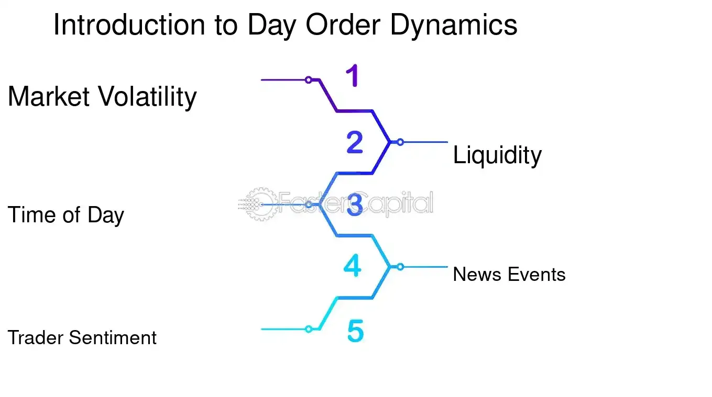

## Table of Contents

## What is a time-of-day order?

A time-of-day order is a type of order that you can place with a stockbroker to buy or sell a stock at a specific time during the trading day. This means you tell your broker that you want to make a trade at a certain time, like 10:00 AM, and the broker will try to execute the order as close to that time as possible.

These orders are useful if you think the price of a stock will change at a specific time due to news or events. For example, if a company is going to release its earnings report at 2:00 PM, you might want to buy or sell the stock right before or after that time. Time-of-day orders help you take advantage of these moments without having to watch the market constantly.

## How does a time-of-day order differ from other types of orders?

A time-of-day order is different from other types of orders because it focuses on when the trade happens, not just the price. With a time-of-day order, you tell your broker to buy or sell a stock at a specific time, like 10:00 AM. This is helpful if you think the stock price will change at that time because of news or events. Other types of orders, like market orders or limit orders, don't care about the exact time. A market order tells the broker to buy or sell the stock right away at the current price, while a limit order sets a specific price you want to buy or sell at, but it can happen at any time.

Time-of-day orders are useful when you want to act on information that comes out at a certain time, like a company's earnings report. You can set the order to go through just before or after the news comes out, hoping to get a good price. On the other hand, other orders like stop orders are used to limit losses or protect gains. A stop order becomes a market order once the stock reaches a certain price, but it doesn't consider the time. So, time-of-day orders are all about timing, while other orders focus more on price or risk management.

## What are the primary uses of a time-of-day order in trading?

The main use of a time-of-day order is to take advantage of news or events that happen at a specific time. For example, if a company is going to release its earnings report at 2:00 PM, you might want to buy or sell the stock right before or after that time. By setting a time-of-day order, you can tell your broker to make the trade at that exact moment, without having to watch the market all day. This can help you get a good price if you think the stock will go up or down because of the news.

Another use of a time-of-day order is to manage your trading schedule better. If you have a busy day and can't watch the market, you can set a time-of-day order to buy or sell a stock at a time that works for you. This way, you don't have to worry about missing out on a trade because you were busy. Time-of-day orders give you more control over when your trades happen, which can be really helpful if you have other things to do during the trading day.

## Can you explain the mechanism of how a time-of-day order is executed?

When you place a time-of-day order, you tell your broker the exact time you want to buy or sell a stock. For example, you might say, "I want to buy 100 shares of XYZ stock at 10:00 AM." Your broker will then set up the order in their system, and when the clock hits 10:00 AM, they will try to execute the trade as close to that time as possible. This means they will look at the current market price at 10:00 AM and try to buy or sell the stock at that price.

The broker's system is designed to automatically send the order to the market at the exact time you specified. If the market is open and there are enough buyers or sellers at that time, the trade should go through quickly. However, if there's a big delay or if the market is closed at the time you set, the order might not be executed right away. In those cases, the broker might have to wait until the market opens again or until the delay is fixed before they can complete your trade.

## What are the advantages of using a time-of-day order?

Time-of-day orders help you trade at a specific time, which is great if you know when important news or events will happen. For example, if a company is going to release its earnings report at 2:00 PM, you can set a time-of-day order to buy or sell the stock right before or after that time. This way, you can try to get a good price if you think the stock will go up or down because of the news. You don't have to watch the market all day; you can just set the order and let it happen at the right time.

Another advantage is that time-of-day orders help you manage your time better. If you're busy and can't watch the market, you can set a time-of-day order to trade at a time that works for you. This means you don't have to worry about missing a trade because you were doing something else. Time-of-day orders give you more control over when your trades happen, making it easier to fit trading into your schedule.

## Are there any specific markets or assets where time-of-day orders are more commonly used?

Time-of-day orders are often used in stock markets, especially when companies release important news like earnings reports. Traders might use these orders to buy or sell stocks right before or after the news comes out, hoping to get a good price. For example, if a company is going to release its earnings at 2:00 PM, a trader might set a time-of-day order to buy the stock at 1:59 PM, thinking the price will go up after the news.

These orders can also be useful in the forex market, where currency prices can change quickly due to economic reports or announcements. Traders might set time-of-day orders to trade currencies at the exact time when these reports are released, like a country's employment data or interest rate decision. This way, they can try to take advantage of the price movements that often happen right after such news.

## What are the potential risks or limitations associated with time-of-day orders?

Time-of-day orders can be risky because the market might not be open or there might be delays when you want your order to go through. If you set an order for a time when the market is closed, like after hours, your order won't happen until the market opens again. This can mean you miss the price you wanted or the news you were trying to act on. Also, if there's a big delay in the market, your order might not happen right away, which can change the price you get.

Another limitation is that the price might not be what you expect when your time-of-day order goes through. The market can move quickly, and the price at the exact time you set might be different from what you thought it would be. If you're trying to buy or sell based on news, other traders might be doing the same thing, which can push the price up or down right at that time. This means you might end up with a worse price than you hoped for, even if your order goes through on time.

## How can a trader set up a time-of-day order on a typical trading platform?

To set up a time-of-day order on a typical trading platform, you first need to log into your trading account. Once you're in, find the section where you can place new orders. This is usually labeled something like "Trade" or "Order Entry." Look for an option to choose the type of order, and select "time-of-day order" or a similar term. Then, you'll need to enter the details of your order, like the stock symbol, the number of shares you want to buy or sell, and the specific time you want the order to go through. For example, if you want to buy 100 shares of XYZ stock at 10:00 AM, you would enter "XYZ," "100 shares," and "10:00 AM" into the order form.

After you've entered all the details, double-check everything to make sure it's correct. Once you're happy with the order, submit it through the platform. The platform will then set up your time-of-day order to go through at the exact time you specified. Keep in mind that you might need to confirm the order one last time before it's sent to the market. Once it's submitted, your broker will try to execute the trade as close to the specified time as possible. If you want to change or cancel the order later, you can usually do that through the same section of the trading platform where you placed the order.

## What impact does market volatility have on the effectiveness of time-of-day orders?

Market volatility can make time-of-day orders less effective. When the market is volatile, prices can change a lot in a short time. If you set a time-of-day order to buy or sell at a specific time, the price at that exact moment might be very different from what you expected. This can happen if there's big news or lots of traders are buying and selling quickly. So, even if your order goes through at the right time, you might end up with a price that's not what you wanted.

Volatility can also make it harder for your broker to execute your time-of-day order exactly when you want. If the market is moving a lot, there might be delays or it might be hard to find someone to buy from or sell to at that exact time. This means your order might not go through right away, or it might happen a little later than you planned. So, when the market is volatile, time-of-day orders can be riskier and less reliable.

## Can time-of-day orders be combined with other order types for more complex trading strategies?

Yes, time-of-day orders can be combined with other order types to create more complex trading strategies. For example, you might use a time-of-day order along with a limit order. This means you tell your broker to buy or sell a stock at a specific time, but only if the price is at or better than a certain amount. So, if you want to buy a stock at 10:00 AM, but only if it's $50 or less, you can set a time-of-day order with a limit of $50. This way, you get the timing you want, but you also control the price.

Another way to combine orders is to use a time-of-day order with a stop order. A stop order becomes a market order when the stock reaches a certain price, which can help you limit losses or protect gains. If you think a stock will drop after a news release at 2:00 PM, you could set a time-of-day order to sell the stock at that time, but also set a stop order to sell it if the price drops to a certain level before then. This gives you a backup plan if the stock moves against you before the news comes out. Combining time-of-day orders with other types can help you manage both timing and risk in your trading strategy.

## How do regulatory frameworks affect the use of time-of-day orders in different regions?

Regulatory frameworks can affect how time-of-day orders are used in different regions. In some places, there might be rules about when and how you can use these orders. For example, some markets might have trading hours that limit when you can set a time-of-day order. If the market is closed at the time you want your order to go through, you might have to wait until it opens again. Also, different countries might have rules about what kinds of orders you can use, so you need to check the rules in your area before setting up a time-of-day order.

Regulations can also affect how brokers handle time-of-day orders. Some regions might have strict rules about how quickly brokers need to execute orders, which can impact whether a time-of-day order goes through at the exact time you want. For example, if there's a delay in the market, the broker might have to follow certain rules about how they handle the order. So, it's important to understand the regulatory environment in your region to know how it might affect your trading strategy with time-of-day orders.

## What advanced techniques can traders use to optimize the timing and execution of time-of-day orders?

Traders can use a few smart tricks to make their time-of-day orders work better. One way is to use historical data to find out when a stock usually moves a lot. If you know a stock often goes up or down at a certain time, you can set your time-of-day order to go through just before or after that time. Another trick is to use tools like economic calendars to know when big news or events are happening. If you set your order right before news comes out, you might get a better price before everyone else reacts to the news.

Another advanced technique is to combine time-of-day orders with other types of orders, like limit orders or stop orders. For example, you can set a time-of-day order to buy a stock at 10:00 AM, but only if the price is $50 or less. This way, you control both the time and the price. You can also use stop orders as a backup plan. If you think a stock might drop after a news release at 2:00 PM, you could set a time-of-day order to sell at that time, but also a stop order to sell if the price drops to a certain level before then. This helps you manage risk and make sure you get the best possible outcome from your trades.

## References & Further Reading

[1]: Aldridge, I. (2013). ["High-Frequency Trading: A Practical Guide to Algorithmic Strategies and Trading Systems."](https://www.amazon.com/High-Frequency-Trading-Practical-Algorithmic-Strategies/dp/1118343506) Wiley.

[2]: Kissell, R.L. (2013). ["The Science of Algorithmic Trading and Portfolio Management."](https://www.sciencedirect.com/book/9780124016897/the-science-of-algorithmic-trading-and-portfolio-management) Academic Press.

[3]: Narang, R. (2013). ["Inside the Black Box: A Simple Guide to Quantitative and High-Frequency Trading."](https://onlinelibrary.wiley.com/doi/book/10.1002/9781118662717) Wiley.

[4]: Voulgaris, G. (2018). ["Market Microstructure in Practice."](https://worldscientific.com/worldscibooks/10.1142/10739) World Scientific.

[5]: Hasbrouck, J. (2007). ["Empirical Market Microstructure: The Institutions, Economics, and Econometrics of Securities Trading."](https://academic.oup.com/book/52241) Oxford University Press.