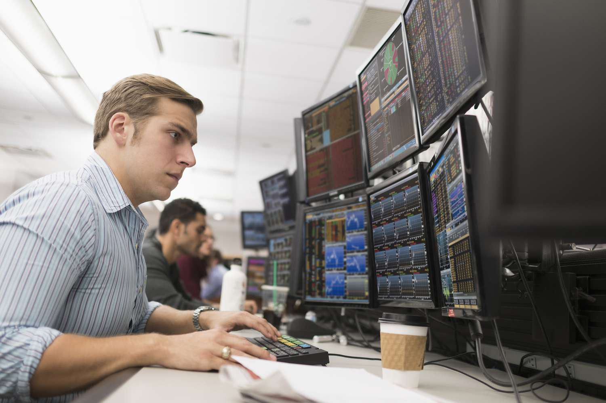

Stock exchange trading strategies involve a variety of sophisticated techniques and tools that cater to different market conditions and investor goals. One key aspect of trading is timing, as the time of day can significantly impact order execution and asset prices. Market behavior often varies during different hours due to factors such as market opening and closing, economic news releases, and trading volumes. These fluctuations offer opportunities to strategically place trades, capitalizing on predictable patterns or anomalies that occur at specific times.

Algorithmic trading, or 'algo trading', utilizes complex computer algorithms to automate these strategies, aiming to capitalize on market inefficiencies. These algorithms can execute trades at speeds and frequencies impossible for human traders, often operating on predefined criteria such as price movements, technical indicators, or historical data patterns. By reducing the influence of human emotions and enhancing decision-making precision, algo trading can potentially increase trading efficiency and profitability.



This article explores how time-of-day orders, which enable traders to specify the precise timing of their trades, can be structured effectively alongside algorithmic trading strategies. By integrating these approaches, traders aim to optimize trade execution and take advantage of favorable market conditions more systematically. Through an examination of these concepts, we seek to reveal how modern trading strategies can be aligned to enhance outcomes in ever-evolving financial markets.

## Table of Contents

## Understanding Time-of-Day Orders

A time-of-day order is an advanced trading mechanism allowing traders to specify the exact time at which they wish their orders to be executed. This precision in timing can be crucial for traders seeking to capitalize on predictable market movements that tend to occur at certain times. Market conditions can vary significantly throughout the trading day due to factors such as market participants' behavior, news releases, and economic data publication schedules. For instance, the market often experiences higher volatility and liquidity around the opening and closing times.

Pairing time-of-day orders with other order types, such as immediate-or-cancel (IOC) orders, can further enhance execution efficiency. An IOC order is designed to execute immediately, either in full or partially, with any unfilled portions being canceled. This combination allows traders to achieve time-sensitive execution without dragging unnecessary market exposure.

However, the availability of time-of-day orders is not universal across all markets. Different exchanges operate under varying regulatory frameworks and technological capabilities, which can influence the types of orders they support. Some exchanges may lack the infrastructure necessary to process these precise time-based orders, while others may not allow them due to specific market regulations.

The strategic use of time-of-day orders requires a deep understanding of market dynamics and timing factors. Traders need to analyze the historical price patterns and [liquidity](/wiki/liquidity-risk-premium) trends to identify optimal timings for order placement. Though this option offers increased control over trade execution, traders must also navigate the complexities of market regulations and technical limitations to implement these orders effectively across various trading platforms.

## Algorithmic Trading: An Overview

Algorithmic trading leverages computer algorithms to automate trading decisions, allowing for trades to be executed based on predefined criteria without human intervention. This automation aims to optimize the timing of trades, minimize emotional biases, and increase execution speed. As financial markets continue to evolve, [algorithmic trading](/wiki/algorithmic-trading) has become an integral part of modern trading strategies, offering numerous advantages over traditional trading methods.

One of the primary benefits of algorithmic trading is its ability to execute orders at optimal times. Algorithms can be programmed to monitor real-time market data and execute trades instantaneously based on specific conditions or signals. This capability reduces the lag time associated with manual order entry and minimizes the risk of human-induced errors. Moreover, the reduced emotional influence that comes with algorithmic trading helps mitigate decisions driven by fear, greed, or other psychological factors.

Common strategies in algorithmic trading include [trend following](/wiki/trend-following), [arbitrage](/wiki/arbitrage), and [market making](/wiki/market-making). Trend following strategies, as the name suggests, involve algorithms designed to identify and capitalize on ongoing trends within the market. By analyzing price movements and trends using technical indicators, these algorithms can identify entry and [exit](/wiki/exit-strategy) points that align with the prevailing market conditions.

Arbitrage strategies involve exploiting price inefficiencies between different markets or instruments. Algorithms can be developed to swiftly identify and act on arbitrage opportunities, often in fractions of a second, to generate profits. The speed and precision of algorithmic trading make it particularly well-suited for arbitrage, as opportunities can arise and vanish very quickly.

Market-making strategies aim to provide liquidity to the market by simultaneously placing both buy and sell orders for a security. These algorithms profit from the spread between the bid and ask prices and must be fast and efficient to succeed in competitive and often volatile market environments.

Successful algorithmic trading relies heavily on the quality of data used to inform trading decisions. Accurate and timely market data ensure the reliability of the algorithms' outputs. Additionally, the process of strategy testing, like [backtesting](/wiki/backtesting), is critical in validating the effectiveness and robustness of an algorithmic strategy. Backtesting involves simulating an algorithm's performance over historical data to evaluate how it would have performed in the past. This step is crucial for identifying potential issues and refining algorithms before they are deployed in live trading environments.

Proper implementation of algorithmic trading requires not only robust programming skills but also a deep understanding of market mechanics and the specific financial instruments being traded. As technology advances and data availability improves, algorithmic trading strategies will continue to evolve, offering even more sophisticated and efficient tools for traders looking to capitalize on market opportunities.

## Strategies for Combining Time-of-Day Orders with Algo Trading

Integrating time-of-day strategies with algorithmic trading offers a structured approach to optimize trade execution by leveraging temporal price patterns. Traders often utilize historical data to spot consistent trends and anomalies during specific times. For instance, certain stocks may exhibit higher [volatility](/wiki/volatility-trading-strategies) or predictable movements during market open and close times, reflecting institutional activity or trader psychology.

Algorithmic trading systems capitalize on these insights by automating time-of-day order execution. A well-programmed algorithm can automatically place orders at precise moments, enhancing efficiency and minimizing human error or hesitation. This automation is particularly useful to exploit brief market inefficiencies or liquidity peaks.

A crucial step in developing such strategies is robust backtesting, a method of assessing the effectiveness of a trading strategy using historical data. This procedure helps validate whether the identified time-of-day patterns are statistically significant and likely to yield profitable outcomes in live trading. Traders can conduct backtests by simulating the strategy on past price data and analyzing the results to fine-tune their algorithms for optimal performance.

Here's a basic example of a simple backtesting framework in Python:

```python
import pandas as pd

def backtest_strategy(data, strategy_function):
    cash = 100000  # Starting cash
    position = 0
    for index, row in data.iterrows():
        # Run the strategy function: if it returns 'buy', purchase asset
        action = strategy_function(row)
        if action == 'buy' and cash > row['Open']:
            position += cash / row['Open']
            cash = 0
        elif action == 'sell' and position > 0:
            cash += position * row['Open']
            position = 0
    return cash + position * data.iloc[-1]['Open']

data = pd.read_csv('historical_data.csv')
final_cash = backtest_strategy(data, your_strategy_function)
print("Final portfolio value: $", final_cash)
```

In this simplified framework, `strategy_function` determines whether to buy or sell based on time-of-day data and other parameters applied to each row of the dataset `data`. While actual implementation will be more complex, often using libraries like `[backtrader](/wiki/backtrader)` or `zipline`, this illustrates the core concept.

In conclusion, efficiently combining time-of-day strategies with algorithmic trading can lead traders to better exploit intraday market opportunities. By automating the process through rigorous data analysis and backtesting, traders enhance their ability to execute at optimal times while remaining adaptable to changing market conditions.

## Challenges and Considerations

High-frequency trading ([HFT](/wiki/high-frequency-trading-strategies)) presents potential challenges to time-of-[day trading](/wiki/day-trading-spy) strategies by contributing to increased market volatility. HFT involves executing a large number of orders in fractions of a second, which can disrupt market equilibrium during specific times, undermining the anticipated benefits of time-specific strategies. Traders must account for these dynamics to avoid unfavorable pricing impacts.

Regulatory compliance is another critical consideration when integrating time-of-day orders into algorithmic trading strategies. Different jurisdictions have specific rules governing algorithmic trading and time-of-day orders, which vary significantly across global markets. Regulatory bodies such as the U.S. Securities and Exchange Commission (SEC) and the European Securities and Markets Authority (ESMA) have provisions intended to prevent market abuse and ensure market integrity. Traders must remain informed about these regulations to avoid legal repercussions and penalties that could affect trading operations.

Transaction costs and slippage are also essential factors in automated trading strategies. Transaction costs encompass both explicit costs, such as brokerage fees and taxes, and implicit costs like market impact. Slippage, the difference between the expected price of a trade and the price at which it is executed, can eat into profitability, especially in illiquid markets or during periods of high volatility. Formulating strategies that minimize these costs is paramount. Using Python, traders can simulate trade execution costs incorporating slippage:

```python
def calculate_slippage(order_size, market_depth):
    impact = market_depth / (order_size + 1e-6)  # Prevent division by zero
    slippage = impact * order_size
    return slippage

order_size = 1000  # Example order size
market_depth = 5000  # Market depth at time of trading
slippage_cost = calculate_slippage(order_size, market_depth)
print(f"Estimated Slippage Cost: {slippage_cost}")
```

Finally, continuous monitoring and adjustment of trading strategies are necessary to adapt to evolving market conditions. Financial markets are influenced by a myriad of factors including geopolitical events, economic indicators, and technological advancements. Traders must employ robust data analytics and adaptive algorithms to ensure their strategies remain effective. Implementing [machine learning](/wiki/machine-learning) techniques can further enhance strategy adjustment capabilities, allowing for dynamic adaptation to market changes.

## Conclusion

Stock exchange trading strategies, particularly those involving time-of-day orders, are markedly enhanced through the application of algorithmic trading. By blending technical and fundamental analyses, traders are equipped to make well-informed decisions that capitalize on prevailing market trends. Technical analysis focuses on statistical trends from trading activity, such as price movements and [volume](/wiki/volume-trading-strategy), while [fundamental analysis](/wiki/fundamental-analysis) assesses the intrinsic value of a security. The synergy of these methodologies allows for a comprehensive approach in predicting market behavior.

Integrating time-specific order types within an algorithmic framework can yield improved trading outcomes by leveraging precise timing to exploit market volatility and liquidity imbalances. For instance, implementing algorithms that trigger trades based on time-specific patterns observed in historical data can optimize trade execution, minimizing the impact of unfavorable price changes and maximizing potential gains. Moreover, algorithmic systems can dynamically adjust strategies in response to real-time data, allowing traders to stay ahead of market shifts.

Future advancements in trading technology are poised to expand these capabilities further. The progression of [artificial intelligence](/wiki/ai-artificial-intelligence) and machine learning presents new opportunities for enhancing the predictability and efficiency of trading algorithms. As computational power and data analytics continue to evolve, these technologies offer the promise of more sophisticated strategies that can process vast amounts of market data to identify emerging trends and patterns. Such developments hold the potential to offer even more robust solutions for investors seeking to navigate the complexities of contemporary financial markets.

## References & Further Reading

[1]: Aldridge, I. (2013). ["High-Frequency Trading: A Practical Guide to Algorithmic Strategies and Trading Systems."](https://www.amazon.com/High-Frequency-Trading-Practical-Algorithmic-Strategies/dp/1118343506) Wiley.

[2]: Kissell, R.L. (2013). ["The Science of Algorithmic Trading and Portfolio Management."](https://www.sciencedirect.com/book/9780124016897/the-science-of-algorithmic-trading-and-portfolio-management) Academic Press.

[3]: Narang, R. (2013). ["Inside the Black Box: A Simple Guide to Quantitative and High-Frequency Trading."](https://onlinelibrary.wiley.com/doi/book/10.1002/9781118662717) Wiley.

[4]: Voulgaris, G. (2018). ["Market Microstructure in Practice."](https://worldscientific.com/worldscibooks/10.1142/10739) World Scientific.

[5]: Hasbrouck, J. (2007). ["Empirical Market Microstructure: The Institutions, Economics, and Econometrics of Securities Trading."](https://academic.oup.com/book/52241) Oxford University Press.