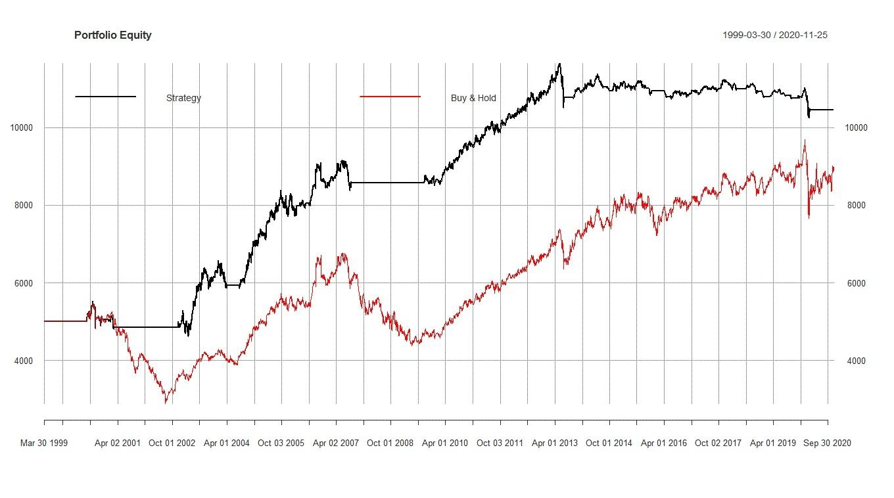

## Table of Contents

## What is backtesting and why is it important in trading?

Backtesting is when traders use old market data to see how well a trading strategy would have worked in the past. They pretend to trade with this old data to see if their strategy makes money or loses money. It's like practicing trading without using real money. By doing this, traders can find out if their strategy is good or if they need to change it before they start trading with real money.

Backtesting is important because it helps traders make better decisions. If a strategy works well in backtesting, it might also work well in real trading. This can give traders more confidence. But, backtesting isn't perfect. Sometimes, what works in the past doesn't work in the future because markets change. So, traders should use backtesting as a guide, but also be ready to adapt their strategies as the market changes.

## How does the concept of a time period apply to backtesting?

When you do backtesting, the time period you choose is really important. It's like picking the right part of a story to read. You need to decide how far back to go and for how long. If you pick a time that was really good or really bad for the market, your results might not be what you see in the future. So, it's a good idea to pick a time period that's long enough to see different market conditions, like good times and bad times.

Using a longer time period for backtesting can help you see how your strategy works in different situations. For example, if you only test your strategy during a time when the market was going up, you might think it's better than it really is. But if you test it over many years, you'll see how it does when the market goes up, down, and stays the same. This gives you a better idea of how your strategy might work in the future.

## What are the common time periods used in backtesting?

When people do backtesting, they often use different time periods depending on what they want to learn. A common time period is one to three years. This length is good because it can show how a trading strategy works in different market conditions, like when the market is going up or down. It's not too short, so you don't miss important changes, and not too long, so you don't get overwhelmed with too much data.

Another time period that's often used is five to ten years. This longer period can give a more complete picture of how a strategy works over time. It includes more market cycles, so you can see how your strategy does in good times, bad times, and everything in between. Using a longer time period can help you feel more confident that your strategy will work in the future.

Sometimes, people even use time periods longer than ten years for backtesting. This can be useful for strategies that are meant to work over very long periods of time, like retirement investing. But, the longer the time period, the more you have to be careful about changes in the market that might make old data less useful for predicting the future.

## How does the choice of time period affect backtesting results?

The time period you choose for backtesting can really change your results. If you pick a short time, like just a few months, you might only see how your strategy works in one kind of market condition. For example, if the market was going up during that time, your strategy might look really good. But if you only test it during a good time, you won't know how it does when the market goes down or stays the same. So, a short time period might make your strategy look better or worse than it really is.

Using a longer time period, like several years, can give you a better idea of how your strategy works in different situations. Over a few years, you'll see times when the market goes up, down, and stays the same. This helps you understand if your strategy can handle all these different conditions. But, if you go too far back, like more than ten years, the market might have changed so much that the old data isn't very useful anymore. So, you need to find a good balance to make sure your backtesting results are helpful for the future.

## What are the advantages of using shorter time periods in backtesting?

Using shorter time periods in backtesting can help you see how your trading strategy works quickly. If you only have a few months of data, you can test your strategy and get results fast. This is good if you want to start trading soon and don't want to wait a long time to see if your strategy works. Also, shorter time periods can be easier to understand because there's less data to look at. You can focus on how your strategy does in one kind of market, like when it's going up.

But, shorter time periods have their limits. They might only show you how your strategy works in one situation, like a good market or a bad market. If you only test your strategy during a good time, you might think it's better than it really is. So, while shorter time periods can give you quick results, they might not tell you the whole story about how your strategy will work in the future.

## What are the disadvantages of using shorter time periods in backtesting?

Using shorter time periods in backtesting can make it hard to see the full picture of how your strategy works. If you only test your strategy over a few months, you might only see how it does in one kind of market, like when it's going up. This means you might think your strategy is really good because it worked well during that time, but you won't know how it does when the market goes down or stays the same. So, shorter time periods can give you a false sense of how well your strategy will work in the future.

Also, shorter time periods might miss important changes in the market. Markets can change a lot over time, and if you only look at a short period, you might miss seeing how your strategy handles different situations. This can lead to surprises when you start trading for real, because the market might behave differently than what you saw in your short backtest. So, while shorter time periods can give you quick results, they might not be as reliable for understanding how your strategy will work over the long term.

## How can longer time periods impact the reliability of backtesting?

Using longer time periods in backtesting can make your results more reliable because you get to see how your strategy works in many different market conditions. Over several years, you'll see times when the market goes up, down, and stays the same. This helps you understand if your strategy can handle all these different situations. By looking at a longer time period, you can feel more confident that your strategy will work well in the future because it has been tested in various market cycles.

However, longer time periods can also have some problems. If you go too far back, like more than ten years, the market might have changed a lot since then. Old data might not be very useful for predicting what will happen now or in the future. So, while longer time periods can give you a better idea of how your strategy works, you need to be careful about how old the data is. You want to find a good balance to make sure your backtesting results are helpful for the future.

## What role does data frequency play in selecting a time period for backtesting?

Data frequency is how often you get new data, like every minute, hour, day, or week. When you choose a time period for backtesting, you need to think about the data frequency you're using. If you use data that comes in every minute, you can look at shorter time periods because you have a lot of data points. This can help you see how your strategy works in very short time frames, like during a single trading day. But if you use data that comes in every day or week, you might need to use longer time periods to have enough data to test your strategy properly.

Using different data frequencies can change how you pick your time period. If you use high-frequency data, like every minute or hour, you can test your strategy over shorter time periods and still get a lot of information. This is good if you want to see how your strategy works in quick market changes. But if you use low-frequency data, like every day or week, you need to use longer time periods to make sure you have enough data to see how your strategy performs in different market conditions. So, the frequency of your data helps you decide how long your backtesting time period should be.

## How do you determine the optimal time period for backtesting a specific trading strategy?

To find the best time period for backtesting a trading strategy, you need to think about what the strategy is trying to do and how often you get new data. If your strategy is about making quick trades, you might want to use a shorter time period, like a few months, and use data that comes in every minute or hour. This way, you can see how your strategy works in fast-changing markets. But if your strategy is about holding onto investments for a long time, like years, you should use a longer time period, like several years, and use data that comes in every day or week. This helps you see how your strategy does in different market conditions over time.

It's also important to make sure the time period you choose includes different kinds of market situations. You want to see how your strategy works when the market is going up, down, and staying the same. A good rule is to use at least one to three years of data, so you can see these different conditions. But if you go too far back, like more than ten years, the market might have changed a lot, and the old data might not be very useful for predicting the future. So, finding the right balance between a time period that's long enough to be helpful but not so long that it's outdated is key to getting reliable backtesting results.

## What are the advanced techniques for adjusting time periods in backtesting to improve accuracy?

One advanced technique for adjusting time periods in backtesting is called rolling window backtesting. Instead of using one long time period, you break it into smaller, overlapping pieces. For example, you might use a one-year window and move it forward by one month at a time. This way, you can see how your strategy works in different one-year periods, which can give you a better idea of how it performs over time. It helps you understand if your strategy is good in different market conditions and can show you if it's getting better or worse as time goes on.

Another technique is called walk-forward optimization. This method starts with a shorter time period for initial testing and then uses the results to adjust the strategy. After that, you test the adjusted strategy on a new, later time period. You keep doing this, moving forward in time, to see how well your strategy works as the market changes. This can help you make your strategy better over time because you're always testing and updating it with new data. It's like learning from the past to do better in the future.

Both of these techniques can help make your backtesting more accurate by showing how your strategy works in different time periods and market conditions. They can give you a more complete picture of how your strategy might perform in the future, which is really important for making smart trading decisions.

## How can one validate the results of backtesting across different time periods?

To make sure your backtesting results are good, you can test your strategy on different time periods. One way to do this is by using a technique called cross-validation. This means you split your data into different parts and test your strategy on each part. If your strategy works well in all these different time periods, you can feel more confident that it will work in the future too. It's like checking your answers with different tests to see if they're right every time.

Another way to check your backtesting results is by using out-of-sample testing. This means you test your strategy on a time period that you didn't use when you were making the strategy. If it still works well in this new time period, it's a good sign that your strategy is strong. It's like taking a practice test and then doing well on the real test too. By using these methods, you can get a better idea of how reliable your backtesting results are and make smarter trading decisions.

## What are the latest research findings on the impact of time periods in backtesting on predictive performance?

Recent research shows that the time period you choose for backtesting can really affect how well your trading strategy predicts the future. If you use a short time period, like a few months, your strategy might look good because it worked well in that time. But, short time periods might not show how your strategy does in different market situations, like when the market goes down. So, your strategy might not work as well in the future as you thought. Longer time periods, like several years, can give you a better idea of how your strategy works in good times, bad times, and everything in between. This can make your predictions more reliable because you've seen how your strategy handles different market conditions.

However, using very long time periods, like more than ten years, can also have problems. The market can change a lot over time, so old data might not be very useful for predicting what will happen now or in the future. Researchers have found that using a mix of short and long time periods, like rolling window backtesting, can help. This method breaks the data into smaller, overlapping pieces, so you can see how your strategy works in different time periods. It helps you understand if your strategy is good in different market conditions and can show you if it's getting better or worse as time goes on. By using these methods, you can get a more complete picture of how your strategy might perform in the future.

## References & Further Reading

[1]: Bergstra, J., Bardenet, R., Bengio, Y., & Kégl, B. (2011). ["Algorithms for Hyper-Parameter Optimization."](https://papers.nips.cc/paper/4443-algorithms-for-hyper-parameter-optimization) Advances in Neural Information Processing Systems 24.

[2]: ["Advances in Financial Machine Learning"](https://www.amazon.com/Advances-Financial-Machine-Learning-Marcos/dp/1119482089) by Marcos Lopez de Prado

[3]: ["Evidence-Based Technical Analysis: Applying the Scientific Method and Statistical Inference to Trading Signals"](https://www.amazon.com/Evidence-Based-Technical-Analysis-Scientific-Statistical/dp/0470008741) by David Aronson

[4]: ["Machine Learning for Algorithmic Trading"](https://github.com/stefan-jansen/machine-learning-for-trading) by Stefan Jansen

[5]: ["Quantitative Trading: How to Build Your Own Algorithmic Trading Business"](https://books.google.com/books/about/Quantitative_Trading.html?id=j70yEAAAQBAJ) by Ernest P. Chan