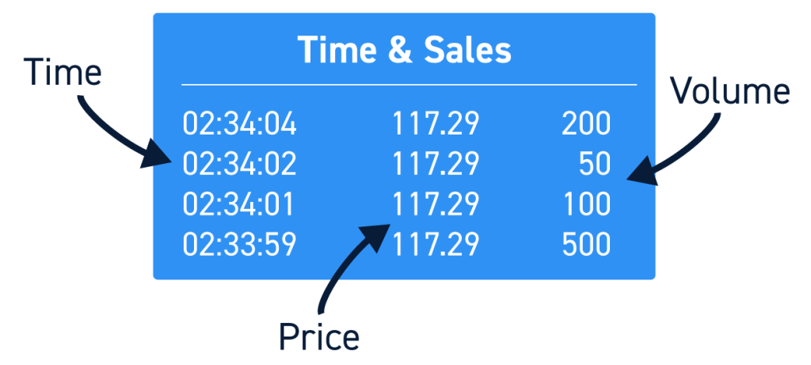

## Table of Contents

## What is Time and Sales in stock trading?

Time and Sales is a tool used in stock trading that shows real-time data about trades happening in the market. It lists each trade with details like the time it happened, the price at which the stock was bought or sold, the number of shares traded, and whether the trade was a buy or a sell. This information helps traders see the exact moment-to-moment activity of a stock, which can be useful for making quick trading decisions.

Traders use Time and Sales to get a better understanding of the market's current state. For example, if they see a lot of trades happening at higher prices, it might mean the stock's price is going up. On the other hand, if they see many trades at lower prices, it could mean the price is going down. By watching this data, traders can spot trends and patterns that help them decide when to buy or sell a stock.

## How does Time and Sales data help traders make decisions?

Time and Sales data helps traders by showing them exactly what is happening in the market at any moment. They can see the time of each trade, the price, how many shares were traded, and if it was a buy or a sell. This real-time information lets traders see if a stock's price is going up or down quickly. If they see a lot of trades happening at higher prices, it might mean the stock is getting more popular and its price could keep going up. If they see many trades at lower prices, it might mean the stock is losing value and its price could keep going down.

By watching the Time and Sales data, traders can spot patterns and trends. For example, if they see a lot of big trades happening at the same price, it might mean that price is important to other traders. This can help them decide if they should buy or sell at that price. Also, if they see a sudden change in the number of trades or the prices, it can tell them that something important is happening in the market. This helps them make quick decisions to buy or sell their stocks before the price changes too much.

## What information is typically included in Time and Sales data?

Time and Sales data shows traders what is happening in the stock market right now. It includes the time when each trade happens, which is important because it helps traders see how fast things are changing. The data also shows the price at which the stock was traded. This tells traders if the price is going up or down. Another piece of information is the number of shares that were traded. This can show if a trade is big or small, which can affect the stock's price.

The data also tells if the trade was a buy or a sell. This helps traders understand if more people are buying or selling the stock. Sometimes, the data might show the exchange where the trade happened, like the New York Stock Exchange or NASDAQ. All this information together helps traders see patterns and make quick decisions about buying or selling stocks.

## How can beginners use Time and Sales to understand market trends?

Beginners can use Time and Sales data to understand market trends by watching how often trades happen and at what prices. If they see a lot of trades happening quickly at higher prices, it might mean the stock is becoming more popular and its price could keep going up. On the other hand, if they see many trades at lower prices, it might mean the stock is losing value and its price could keep going down. By looking at this data, beginners can start to see patterns and understand if the market is moving up or down.

It's also helpful for beginners to pay attention to the number of shares traded. If they see big trades happening, it means that big investors are making moves, which can have a bigger impact on the stock's price. By watching these big trades, beginners can get a sense of where the market might be heading. Over time, as they get more comfortable with Time and Sales data, they'll be better at spotting trends and making smart trading decisions.

## What are the key differences between Time and Sales and Level 2 data?

Time and Sales data shows traders what is happening in the market right now. It tells you the time of each trade, the price, how many shares were traded, and if it was a buy or a sell. This helps traders see if the stock's price is going up or down quickly. It's like watching a live feed of all the trades happening, which can help you spot trends and make quick decisions.

Level 2 data, on the other hand, gives you more details about the market. It shows you not just the trades that have happened, but also the orders that are waiting to be filled. You can see the best bid and ask prices, which are the highest price someone is willing to pay and the lowest price someone is willing to sell at. This helps you understand the supply and demand for a stock better. While Time and Sales is about what has already happened, Level 2 data is about what might happen next.

Both types of data are useful, but they serve different purposes. Time and Sales is great for seeing the immediate action and understanding the current trend. Level 2 data is better for getting a sense of the market's direction and the potential for price changes. Beginners might start with Time and Sales to get comfortable with the market's pace, then move to Level 2 data to deepen their understanding of market dynamics.

## How can Time and Sales be used to identify potential price manipulation?

Time and Sales data can help traders spot potential price manipulation by showing them if there are unusual patterns in trading activity. For example, if a trader sees a lot of trades happening at the same price over a short time, it might mean someone is trying to keep the price at that level on purpose. This is called "painting the tape," where traders make trades to make it look like there is more activity or interest in the stock than there really is.

Another way Time and Sales can show manipulation is by looking at the size of the trades. If there are a lot of big trades happening at strange times or prices, it might mean that someone is trying to move the price up or down quickly. This is called "spoofing," where traders place big orders they don't plan to fill, just to trick other traders into thinking the price is going to change. By watching the Time and Sales data closely, traders can spot these unusual patterns and be more careful with their trades.

## What are the best practices for analyzing Time and Sales data?

To analyze Time and Sales data effectively, it's important to pay close attention to the patterns in the trades. Look for trends in the price and the number of shares traded. If you see a lot of trades happening at higher prices, it might mean the stock's price is going up. If you see many trades at lower prices, it could mean the price is going down. Also, watch for big trades, because they can have a bigger impact on the stock's price. By keeping an eye on these patterns, you can get a good idea of where the market might be heading.

Another good practice is to use Time and Sales data along with other tools, like Level 2 data or charts. Time and Sales shows you what has already happened, but other tools can give you more information about what might happen next. For example, if you see a lot of trades at a certain price on Time and Sales, you can check Level 2 data to see if there are a lot of orders waiting at that price. This can help you understand if the price is likely to stay the same or change soon. By combining different types of data, you can make smarter trading decisions.

## How does Time and Sales data integrate with other trading tools and indicators?

Time and Sales data works well with other trading tools and indicators to help traders make better decisions. For example, you can use Time and Sales along with Level 2 data. Time and Sales shows you what trades have already happened, while Level 2 data shows you the orders that are waiting to be filled. By looking at both, you can see not just what's happening now, but also what might happen next. If you see a lot of trades at a certain price on Time and Sales, and Level 2 data shows a lot of orders waiting at that price, it can tell you that the price might stay the same for a while.

Charts are another tool that works well with Time and Sales data. Charts show you the price of a stock over time, which can help you spot trends and patterns. If you see a sudden change in the price on a chart, you can check Time and Sales to see what trades caused that change. This can help you understand if the price change was because of a lot of small trades or a few big ones. By using Time and Sales data with charts, you can get a fuller picture of what's happening in the market and make smarter trading choices.

## Can Time and Sales data predict short-term price movements, and if so, how?

Time and Sales data can help predict short-term price movements by showing traders the exact moment-to-moment activity of a stock. If you see a lot of trades happening quickly at higher prices, it might mean the stock's price is going to keep going up in the short term. On the other hand, if you see many trades at lower prices, it could mean the price is going to go down soon. By watching this data, you can spot trends and patterns that give you a hint about where the price might go next.

For example, if you see a lot of big trades happening at the same price, it might mean that price is important to other traders. This can help you decide if you should buy or sell at that price. Also, if you see a sudden change in the number of trades or the prices, it can tell you that something important is happening in the market. This helps you make quick decisions to buy or sell your stocks before the price changes too much.

## What are the limitations of relying solely on Time and Sales data for trading?

Time and Sales data can help you see what is happening in the market right now, but it has some limits. It only shows you trades that have already happened, not the orders waiting to be filled. This means you might miss important information about where the price might go next. Also, Time and Sales data can be hard to understand if you are new to trading. It moves fast and can be confusing if you don't know what to look for.

Another problem with relying only on Time and Sales data is that it doesn't give you the full picture of the market. It doesn't show you things like the overall trend of the stock or what other traders are thinking. If you only use Time and Sales, you might make decisions based on just a small part of the information you need. It's better to use it with other tools, like charts and Level 2 data, to get a better understanding of the market and make smarter trading choices.

## How do professional traders use advanced Time and Sales strategies?

Professional traders use advanced Time and Sales strategies to get a deeper understanding of market movements. They look for patterns in the data, like when a lot of trades happen at the same price over a short time. This can tell them if someone is trying to keep the price at that level on purpose, which is called "painting the tape." They also watch for big trades, because these can have a bigger impact on the stock's price. By seeing these big trades, they can guess if the price is going to go up or down soon. They use this information to make quick decisions about buying or selling stocks.

Another way professional traders use Time and Sales data is by combining it with other tools. They might look at Level 2 data to see the orders waiting to be filled, which helps them understand the supply and demand for a stock better. They also use charts to see the price of a stock over time, which can help them spot trends and patterns. By putting all this information together, they can make smarter trading choices. They know that Time and Sales data alone isn't enough, so they use it along with other data to get a full picture of what's happening in the market.

## What technological tools are available to enhance the analysis of Time and Sales data?

Traders can use special software and tools to make it easier to understand Time and Sales data. These tools can show the data in different ways, like with colors or graphs, which helps traders see patterns and trends more clearly. Some tools also let traders set up alerts, so they get a message when certain things happen, like when a lot of trades happen at a certain price. This can help traders make quick decisions without having to watch the data all the time.

Another helpful tool is trading platforms that combine Time and Sales data with other types of data, like Level 2 data and charts. These platforms let traders see everything in one place, which makes it easier to understand what's happening in the market. For example, a platform might show the Time and Sales data next to a chart, so traders can see how the trades affect the price over time. By using these tools, traders can get a better understanding of the market and make smarter trading choices.

## References & Further Reading

[1]: Bergstra, J., Bardenet, R., Bengio, Y., & Kégl, B. (2011). ["Algorithms for Hyper-Parameter Optimization."](https://papers.nips.cc/paper/4443-algorithms-for-hyper-parameter-optimization) Advances in Neural Information Processing Systems 24.

[2]: ["Advances in Financial Machine Learning"](https://www.amazon.com/Advances-Financial-Machine-Learning-Marcos/dp/1119482089) by Marcos Lopez de Prado

[3]: Aronson, D. R. (2007). ["Evidence-Based Technical Analysis: Applying the Scientific Method and Statistical Inference to Trading Signals."](https://onlinelibrary.wiley.com/doi/book/10.1002/9781118268315) Wiley.

[4]: Jansen, S. (2020). ["Machine Learning for Algorithmic Trading: Predictive models to extract signals from market and alternative data for systematic trading strategies with Python."](https://github.com/stefan-jansen/machine-learning-for-trading) Packt Publishing.

[5]: Chan, E. P. (2009). ["Quantitative Trading: How to Build Your Own Algorithmic Trading Business."](https://github.com/ftvision/quant_trading_echan_book) Wiley.