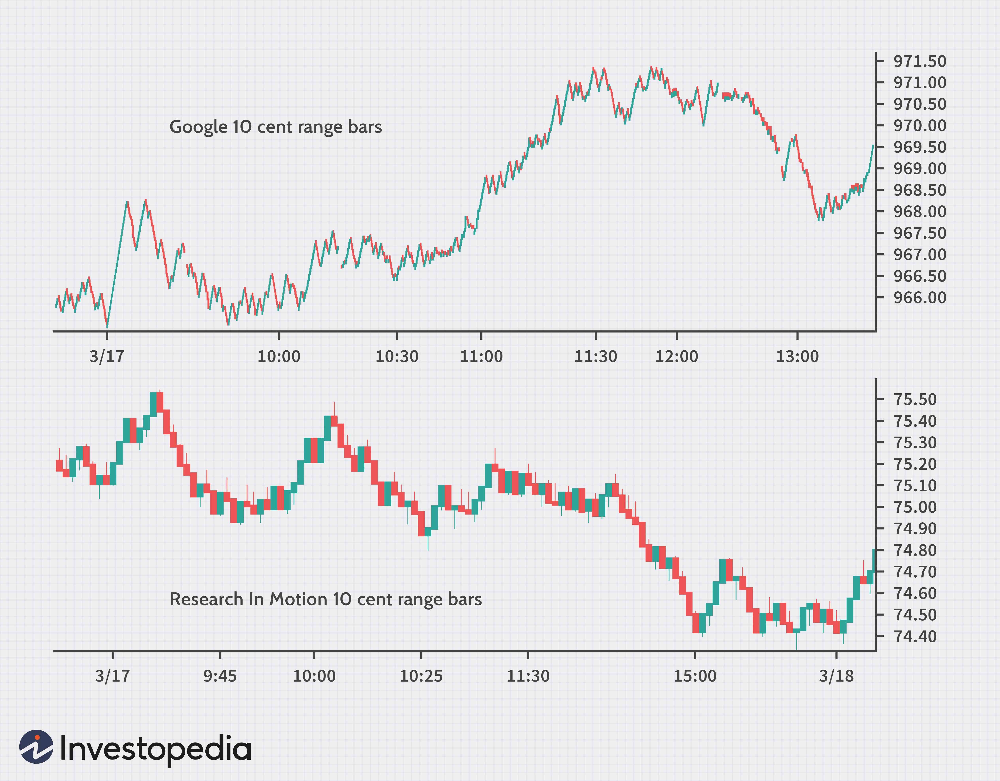

The stock market operates as a highly intricate and ever-evolving ecosystem where traders continuously seek methods to achieve a competitive advantage. A vital technique in their arsenal is "reading the tape," which entails analyzing detailed price and volume data. Tape reading has been a core practice in stock trading for decades, offering insights into market sentiment and helping traders make informed decisions.

In today's trading landscape, tape reading primarily focuses on time and sales data, a modern iteration that reflects the traditional practice but utilizes advanced digital technologies. Time and sales data provide traders with a comprehensive view of each transaction, including trade size, price, and execution time, allowing for granular analysis of market activities.

In recent years, algorithmic trading has transformed the trading environment, integrating computational models and automated systems to execute trades based on predefined strategies. This has opened avenues for combining traditional tape reading techniques with modern algorithmic strategies, enhancing both the efficiency and accuracy of trading decisions. By fusing human intuition gathered through tape reading with the speed and precision of algorithms, traders can potentially unlock significant trading advantages.

Mastering these techniques not only enhances trading strategies but also improves decision-making by providing a clearer picture of market conditions. Understanding how to interpret time and sales data, and leveraging it with algorithmic approaches, can significantly bolster a trader’s ability to identify trading opportunities and mitigate risks.

This article examines the concept of tape reading, delving into its historical context and evolution, and explores how its integration with algorithmic trading can empower traders to navigate the complexities of the stock market more effectively. Additionally, it highlights the benefits of combining traditional insights with cutting-edge algorithms, providing a holistic approach to modern trading strategies.

## Table of Contents

## Understanding Tape Reading and Its Historical Context

Tape reading is a method employed by traders to analyze the continuous flow of price and volume data, helping them gauge market sentiment. This practice dates back to the early days of stock trading when ticker tapes were the primary tool for tracking stock prices and trades. Ticker tapes, invented in 1867 by Edward A. Calahan, provided a continuous stream of stock price information on paper strips conveyed through telegraph machines. Traders relied on these tapes to observe market movements and make informed trading decisions.

The original method of tape reading involved scrutinizing the printed ticker symbols, prices, and trading volumes to assess market trends and investor behavior. It required a great deal of skill and experience to interpret the data accurately. The practitioner would try to discern patterns such as increased buying or selling pressure, which could indicate potential price movements.

With the advent of digital trading platforms, the traditional practice of tape reading evolved into what is now known as "time and sales" data. Unlike the mechanical ticker tape, time and sales provide a comprehensive digital record of every transaction for a particular stock or commodity. This data includes precise timestamps, trade sizes, and execution prices, allowing traders to perform a more intricate analysis of market activity.

Time and sales data serve as a digital continuation of the traditional tape reading process, offering real-time insights into market dynamics. Traders can access this information through modern trading platforms, which offer advanced charting tools and analytics to better understand complex market trends. The transition from physical ticker tapes to these sophisticated platforms exemplifies the technological evolution within the trading industry.

Despite the technological advancements, the essence of tape reading remains a vital skill for traders aiming to understand market sentiments and movements. The ability to interpret price and [volume](/wiki/volume-trading-strategy) data effectively is crucial for constructing a comprehensive view of the market. As such, mastering tape reading can give traders a significant edge in anticipating price movements and enhancing their trading strategies. 

The evolution of tape reading from physical ticker tapes to advanced digital platforms has broadened its applicability and precision, making it an indispensable tool in the modern trader's arsenal.

## Time and Sales: The Modern Tape

Time and sales, often referred to as the modern tape, provide traders with a detailed record of every executed transaction for a specific stock or commodity. This data set encompasses time-stamped details, including trade size, price, and execution time, allowing traders to gain a granular view of market activities. Unlike historical ticker tapes, which were limited to basic price movements, time and sales data in digital trading platforms present a dynamic and real-time analysis of the market.

To access time and sales data, traders typically utilize platforms provided by brokerage firms and financial software vendors, which offer comprehensive interfaces to monitor live trading activities. This accessibility allows traders to observe real-time market insights, helping them stay informed about the immediate buying and selling pressures within the market.

In terms of market analysis, the significance of time and sales data is paramount in identifying price patterns and volume trends. Traders analyze this data to detect patterns such as accumulation or distribution phases, where there is a discernible increase or decrease in trading volume without significant price changes. Such patterns can indicate impending price movements, assisting traders in making anticipatory decisions.

Furthermore, time and sales play a crucial role in identifying support and resistance levels—key price points where a stock typically reverses its direction. By plotting price movements and correlating them with trading volumes at specific times, traders can estimate these levels. For instance, increasing trade volume at a certain price point may suggest a strong support level, while successive declines in price at another level may indicate resistance.

In summary, time and sales data serve as a critical tool for traders in modern financial markets. By enabling the analysis of real-time transactions, they offer essential insights into price dynamics and volume trends, aiding in the precise identification of support and resistance levels. This data-driven approach to trading enhances decision-making and supports the development of robust trading strategies.

## The Intersection of Tape Reading and Algorithmic Trading

Algorithmic trading utilizes automated systems to execute trades based on predefined strategies, offering significant advantages in speed and efficiency. The integration of tape reading techniques with [algorithmic trading](/wiki/algorithmic-trading) systems can further enhance trading efficiency by combining traditional market analysis with modern computational capabilities.

Tape reading, which involves examining time and sales data, allows traders to assess market sentiment by observing patterns in price movements and trade volumes. Algorithmic systems have the capability to process vast amounts of this data in real-time, identifying trading opportunities with higher precision. For example, algorithms can be programmed to recognize specific patterns, such as spikes in volume or rapid changes in price, which may indicate a potential [breakout](/wiki/breakout-trading) or reversal.

The combination of human intuition and algorithmic precision creates a powerful synergy. While algorithms excel at processing and identifying patterns in large datasets, the nuanced understanding and contextual analysis provided by human traders can interpret these patterns more effectively, adjusting strategies based on broader market trends and news events. This hybrid approach can lead to more adaptive and responsive trading systems.

A practical case study illustrating the successful use of tape reading within algorithmic trading can be found in high-frequency trading ([HFT](/wiki/high-frequency-trading-strategies)) firms. These firms employ advanced algorithms to capitalize on minute price discrepancies by executing numerous trades in fractions of a second. By incorporating tape reading techniques into their systems, HFT firms enhance their ability to detect subtle market signals, allowing them to anticipate price movements and adjust trading strategies accordingly.

The integration of tape reading into algorithmic trading not only improves efficiency but also mitigates trading risks. Algorithms can be designed to trigger alerts or automatically adjust positions when certain tape reading indicators, such as sudden increases in selling pressure, are detected. This provides traders with a safety net, ensuring that trading decisions are made based on a comprehensive analysis of current market conditions.

In conclusion, the intersection of tape reading and algorithmic trading offers a robust framework for developing sophisticated trading strategies. By leveraging the computational power of algorithms alongside the interpretive skills of human traders, market participants can enhance their ability to navigate complex financial landscapes and achieve better trading outcomes.

## Practical Application: Trading Strategies Using Tape Reading

Tape reading involves identifying key patterns and signals within time and sales data to develop robust trading strategies that can enhance decision-making and mitigate risks. Here, we discuss some popular strategies, real-world applications, and psychological aspects that traders should be aware of.

### Key Patterns and Signals

1. **Price Action**: This strategy involves analyzing historical price movements to forecast future behavior. Traders observe patterns such as candlestick formations, trend lines, and support and resistance levels. Key indicators include:
   - **Doji Candlestick**: Indicates market indecision and potential reversal.
   - **Engulfing Pattern**: Signals a possible trend continuation or reversal.

2. **Momentum Trading**: This focuses on the strength of price movements. Traders use time and sales data to detect strong trends:
   - **Relative Strength Index (RSI)**: Measures price changes to identify overbought or oversold conditions.
   - **Moving Averages (MA)**: Calculate average prices over specific periods to identify trend direction.

3. **Breakout Identification**: Traders look for price movements beyond established support or resistance levels:
   - **Volume Spike**: A significant increase in volume often precedes breakouts, suggesting strong market interest and potential for significant price movements.

### Real-World Examples

Successful traders have effectively applied tape reading strategies:

- **Jesse Livermore**, a famous stock trader, used tape reading to time his entries and exits in the market, focusing on price action and market sentiment.
- **Paul Tudor Jones**, a renowned hedge fund manager, combined pattern recognition with market psychology to anticipate major market movements.

### Tips for Using Time and Sales Data

- **Monitor Order Flow**: Assess the accumulation of buy and sell orders to predict short-term price movements. A sudden shift in order flow might indicate an impending price change.
- **Analyze Trade Sizes**: Large trades might signify institutional activity, potentially influencing price trends.
- **Evaluate Execution Speed**: Fast executions might suggest algorithmic trading activity, which can offer clues to market sentiment.

### Psychological Aspects

Effective tape reading requires a keen sense of market movements, which involves understanding trader psychology. Key psychological principles include:

- **Market Sentiment**: Gauge whether traders are optimistic or pessimistic. This often manifests through rapid changes in trade volume or price.
- **Emotion Management**: Avoid cognitive biases such as fear of missing out (FOMO) or loss aversion. Staying objective and disciplined can enhance trading performance.
- **Pattern Recognition**: Developing an intuitive understanding of recurring patterns helps traders anticipate market behavior.

Understanding these strategies and acknowledging the psychological components of tape reading can be crucial for traders seeking to elevate their trading practice.

## Future Trends: The Evolution of Tape Reading in Trading

The future of tape reading in trading is intricately linked to the advancements in technologies such as [artificial intelligence](/wiki/ai-artificial-intelligence) (AI) and [machine learning](/wiki/machine-learning). These technologies offer the potential to revolutionize how traders interpret market data, enhancing tape reading by automating pattern recognition and streamlining decision-making processes. AI and machine learning can process vast amounts of time and sales data far more efficiently than a human could, detecting subtle patterns and trends that might be indicative of future market movements. This capability enables traders to respond to market signals with unprecedented speed and accuracy, thus facilitating more informed trading decisions.

Potential advancements in trading platforms are set to further augment tape reading capabilities. Modern trading platforms are likely to integrate sophisticated AI algorithms capable of providing real-time analysis of time and sales data. Such platforms will offer enhanced visualizations and predictive analytics, allowing traders to gain deeper insights into price action and volume trends. By incorporating these advanced tools, traders can anticipate market movements and adjust their strategies accordingly.

Big data analytics also plays a crucial role in refining tape reading techniques and trading strategies. The ability to analyze large datasets with high variability opens new avenues for identifying complex patterns in the market. Big data analytics can lead to the development of more effective trading algorithms, augmenting traditional tape reading with insights derived from historical market data. This amalgamation of historical and real-time data helps in constructing robust statistical models that can predict future price movements with greater accuracy.

Evolving market conditions continuously influence the use and importance of tape reading. As markets become more complex due to globalization and technological advancements, the ability to quickly interpret time and sales data becomes increasingly vital. Volatility, which is a hallmark of modern financial markets, often necessitates rapid decision-making, further underscoring the importance of integrated tape reading and algorithmic trading strategies.

The ongoing need for traders to adapt and expand their skills is paramount to maintaining a competitive edge. As trading platforms and technologies evolve, traders must continuously enhance their understanding of these tools and adapt their methodologies to incorporate new techniques. This adaptability involves a commitment to lifelong learning and a willingness to embrace innovative approaches to trading. In a market environment where technological advancements are constant, the ability to effectively integrate traditional skills with modern technology becomes a key determinant of trading success.

## Conclusion

Tape reading remains an indispensable skill for traders even as trading platforms evolve with technological advancements. The ability to interpret and analyze the flow of price and volume data enables traders to grasp market sentiment and react quickly to subtle cues that might not be apparent through automated systems alone. This aspect of trading, steeped in tradition, bridges the gap between classical methods and modern innovations, offering a unique advantage when combined with algorithmic strategies.

The fusion of traditional tape reading techniques and algorithmic trading can significantly enhance trading outcomes. Algorithms excel in processing large datasets and executing trades at high speeds, but they often lack the nuanced decision-making that human intuition brings. By integrating tape reading skills with algorithms, traders can leverage both human insight and computational efficiency. For instance, the pattern recognition strengths of machine learning models can complement a trader's interpretive skills, providing a more holistic approach to market analysis.

A deep understanding of time and sales data is imperative for building robust trading strategies. This granular data provides insight into market conditions, helping traders identify trends and shifts in demand and supply dynamics. By analyzing time and sales, traders can discern critical levels of support and resistance, optimize entry and [exit](/wiki/exit-strategy) points, and mitigate risk effectively.

As the trading landscape continues to evolve, it is crucial for traders to adapt and update their methodologies to stay competitive. Advancements in artificial intelligence, machine learning, and big data analytics are reshaping trading environments, offering new tools that can enhance the tape reading process. Embracing these developments while retaining traditional practice ensures that traders can navigate changes smoothly and maintain their edge.

Therefore, traders should continually practice and refine their tape reading skills. This ongoing commitment to skill development not only improves individual performance but also prepares traders to tackle future market challenges. By mastering both established and emerging trading techniques, traders position themselves for sustained success in an ever-changing market landscape.

## References & Further Reading

[1]: Bergstra, J., Bardenet, R., Bengio, Y., & Kégl, B. (2011). ["Algorithms for Hyper-Parameter Optimization."](https://papers.nips.cc/paper/4443-algorithms-for-hyper-parameter-optimization) Advances in Neural Information Processing Systems 24.

[2]: ["Advances in Financial Machine Learning"](https://www.amazon.com/Advances-Financial-Machine-Learning-Marcos/dp/1119482089) by Marcos Lopez de Prado

[3]: Aronson, D. R. (2007). ["Evidence-Based Technical Analysis: Applying the Scientific Method and Statistical Inference to Trading Signals."](https://onlinelibrary.wiley.com/doi/book/10.1002/9781118268315) Wiley.

[4]: Jansen, S. (2020). ["Machine Learning for Algorithmic Trading: Predictive models to extract signals from market and alternative data for systematic trading strategies with Python."](https://github.com/stefan-jansen/machine-learning-for-trading) Packt Publishing.

[5]: Chan, E. P. (2009). ["Quantitative Trading: How to Build Your Own Algorithmic Trading Business."](https://github.com/ftvision/quant_trading_echan_book) Wiley.