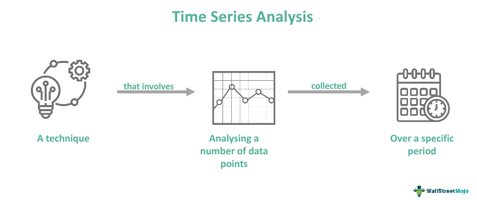

In the rapidly evolving financial markets, data analysis plays a critical role in informing investment decisions. As the volume of data available to traders continues to expand, the ability to effectively analyze this data becomes increasingly essential for maintaining a competitive edge. One of the most valuable tools within the data analysis spectrum is time series analysis. This technique offers insights into temporal data, making it indispensable for algorithmic trading (algo trading).

Time series analysis revolves around the study of data points collected or recorded at specific time intervals. By examining the data in a sequential manner, it allows traders to identify trends, seasonal patterns, and cyclical fluctuations that could potentially indicate profitable trade opportunities. Unlike traditional static data analysis, time series analysis evaluates how data points evolve over time, providing a dynamic view of the underlying financial assets and markets.



This article explores the significance of time series analysis within the context of algo trading. It examines how this analytical method underpins the development of automated trading strategies designed to harness historical data to predict future market movements. By employing various forecasting techniques, traders aim to anticipate price changes and optimize their trading decisions.

We will cover the basics of time series data, elucidating how its intricate patterns influence market behavior. Furthermore, the article will discuss the forecasting methods commonly employed in financial applications, such as ARIMA and machine learning-based models, that enhance the precision of predictions. Additionally, advanced strategies utilized in trading contexts will be explored, highlighting their relevance in developing and optimizing trading algorithms.

By gaining a comprehensive understanding of time series analysis, traders can significantly improve their decision-making processes. These insights not only enable the development of robust trading strategies but also enhance overall trading performance. Equipped with this knowledge, traders can leverage time series analysis to navigate the complexities of financial markets with greater efficacy and precision.

## Table of Contents

## Understanding Time Series Data

Time series data consists of a sequence of data points collected or recorded at consistent time intervals. Distinct from cross-sectional data, which captures a snapshot at a single point in time, time series data concentrates on the changes and evolution of data over time, thus providing a dynamic perspective. This aspect of time series data is crucial in numerous fields, particularly in finance, where it encompasses historical prices, trading volumes, and economic indicators. These elements are vital for comprehensive market analysis.

In time series data analysis, recognizing patterns is essential, as they can guide more informed investment strategies. Patterns such as trends, seasonality, and cyclic behaviors can offer insights into probable future movements in the data. For instance, a trend represents a long-term movement in the data, whether upward or downward, providing a foundational directional bias for decision-making. Seasonality highlights recurring patterns or fluctuations observed at regular intervals, such as daily, monthly, or annually, which are often driven by external factors like economic cycles or consumer behaviors.

Econometric models and statistical techniques are instrumental in identifying these patterns within time series data. Analysts use methods such as moving averages to smooth data and elucidate underlying trends. For example, a simple moving average, calculated as:

$$
\text{SMA}_t = \frac{1}{n} \sum_{i=0}^{n-1} X_{t-i}
$$

where $X$ represents the data points and $n$ is the number of periods considered, helps in attenuating short-term fluctuations, thereby highlighting longer-term trends.

In more sophisticated analyses, time series data might require transformations to ensure stationarity, meaning the statistical properties of the series do not change over time, which is a prerequisite for many predictive models. Techniques like differencing and logarithmic transformations are applied to stabilize the mean and variance across the series.

Ultimately, understanding time series data empowers traders and analysts with a superior capability to anticipate market trends and make data-driven investment decisions, enhancing strategic planning and timing in financial markets. By leveraging statistical techniques and computational methods, stakeholders gain a robust understanding of historical data and improve their ability to forecast future market dynamics.

## Time Series Analysis Techniques

Time series analysis employs various statistical techniques to examine and interpret time-ordered data, focusing on the underlying trends, seasonality, and cyclical nature of the dataset. The primary aim of these techniques is to make data-driven predictions and guide strategic decisions.

**Trend Analysis**: Trend analysis is the process of identifying the long-term direction or trajectory of a dataset over time. It filters out noise and seasonal effects to focus on the core movement. Methods for trend analysis involve visual inspection through plots, linear regression techniques, or decomposition methods where a series is divided into trend, seasonal, and residual components.

**Seasonality**: Seasonality refers to periodic fluctuations that occur at regular intervals due to systematic calendar-related influences, such as quarterly earnings or annual festivals. Identifying and understanding seasonality involves using techniques like moving averages and Fourier analysis, which decompose the series into seasonal components.

**ARIMA and GARCH Models**: Advanced statistical models such as ARIMA and GARCH are instrumental in modeling time-dependent phenomena characterized by autocorrelation and volatility clustering, respectively.

- **ARIMA (AutoRegressive Integrated Moving Average)** is used for forecasting by capturing various aspects of a time series. The model is denoted as ARIMA(p, d, q):
  - **p**: the number of lag observations included in the model (autoregressive part).
  - **d**: the number of times that the raw observations are differenced (integrated part).
  - **q**: the size of the moving average window.

  The ARIMA model is expressed as:
$$
  y_t = \phi_1 y_{t-1} + ... + \phi_p y_{t-p} + \theta_1 \epsilon_{t-1} + ... + \theta_q \epsilon_{t-q} + \epsilon_t

$$
  where $\epsilon_t$ is the error term.

- **GARCH (Generalized Autoregressive Conditional Heteroskedasticity)** models are used to analyze and forecast the volatility of returns, considering the dependency of current volatility on past volatility. The standard GARCH(1, 1) model is:
$$
  \sigma_t^2 = \alpha_0 + \alpha_1 \epsilon_{t-1}^2 + \beta_1 \sigma_{t-1}^2

$$
  where $\sigma_t^2$ is the variance of the series at time $t$, $\epsilon_{t-1}^2$ is the lagged squared error, and $\alpha_0, \alpha_1,$ and $\beta_1$ are parameters.

**Differencing and Transformation**: To stabilize variance and ensure stationarity, differencing and transformation techniques are applied. Stationarity is a critical assumption for many time series models, as it simplifies analysis and forecasting.

- **Differencing** involves subtracting the previous observation from the current observation, reducing non-stationarity by removing trends from the data.
- **Transformation** methods, such as Box-Cox transformation, help to stabilize variance and reduce skewness, enhancing the dataset's stationarity.

In Python, these analyses can be implemented using libraries such as `pandas`, `statsmodels`, and `arch`, which provide comprehensive functions to apply, test, and visualize these models efficiently within time series datasets. By thoroughly applying and interpreting these techniques, analysts and traders can achieve significant insights and predictive capabilities.

## The Role of Time Series Analysis in Algo Trading

Algorithmic trading, often referred to as algo trading, entails the use of sophisticated computer programs to place trades in financial markets at unprecedented speeds and frequencies. At the heart of these programs is time series analysis, a critical element that enables traders to predict future market movements based on historical data patterns. This approach directly informs algorithmic decision-making, allowing for refined predictions and actions that aim to capitalize on emergent market opportunities.

Time series analysis equips algorithms with the ability to identify trends and detect potential market reversals—moments when an asset's price moves contrary to its preceding trend. By delineating such trends, algo traders are able to automate their entry and [exit](/wiki/exit-strategy) points more efficiently. This automation significantly reduces human errors, minimizes risks associated with emotional decision-making, and optimizes returns through timely market interaction.

The modern landscape of algo trading is increasingly intertwined with [machine learning](/wiki/machine-learning), which, when coupled with time series analysis, enhances both pattern recognition and predictive accuracy. Machine learning algorithms can process massive amounts of time series data, learning from historical patterns to anticipate future trends. Techniques such as regression analysis, clustering, and classification, coupled with neural networks, exhibit a notable capacity to predict complex and non-linear market behaviors. 

Consider, for example, the Long Short-Term Memory networks (LSTM), a type of recurrent [neural network](/wiki/neural-network) particularly adept at handling time series data. LSTMs are designed to recognize the order of data points, which makes them powerful tools for predicting stock prices and other market variables over time:

```python
from keras.models import Sequential
from keras.layers import LSTM, Dense
import numpy as np

# Initializing the LSTM model
model = Sequential()

# Add an LSTM layer
model.add(LSTM(units=50, return_sequences=True, input_shape=(X_train.shape[1], 1)))

# Adding a Dense layer
model.add(Dense(units=1))

# Compiling the model
model.compile(optimizer='adam', loss='mean_squared_error')

# Fitting the model to the training set
model.fit(X_train, y_train, epochs=100, batch_size=32)
```

In this example, the `LSTM` layer is configured to process the input time series data (`X_train`) and predict future outcomes (`y_train`). Such models have transformed the potential of time series forecasting, offering increased accuracy and the ability to adapt to rapidly changing financial environments.

The fusion of time series analysis with machine learning in algo trading not only improves predictive capabilities but also facilitates adaptive learning. As new market data is continuously fed into these systems, they are able to re-calibrate forecasts in real-time, thereby maintaining alignment with market dynamics. This adaptability offers a critical advantage in markets characterized by [volatility](/wiki/volatility-trading-strategies) and rapid change.

In conclusion, time series analysis is indispensable in [algorithmic trading](/wiki/algorithmic-trading) due to its ability to model temporal dependencies and predict market behaviors. When integrated with machine learning technologies, it becomes a more powerful tool, enabling algo traders to extract actionable insights from complex datasets, thereby optimizing trading performance and maintaining a competitive edge in the financial markets.

## Common Algorithms and Strategies in Algo Trading

In algorithmic trading, leveraging time series data through specific strategies can significantly enhance trading performance. Three predominant strategies utilized are [trend following](/wiki/trend-following), mean reversion, and statistical [arbitrage](/wiki/arbitrage).

Trend following is predicated on the idea that asset prices tend to exhibit directional movements over extended periods. Traders employing this strategy identify and exploit these persistent trends to execute trades that align with the dominant market direction. This methodology often utilizes indicators such as moving averages and [momentum](/wiki/momentum) oscillators to determine entry and exit points. For example, a simple moving average crossover system might signal a buy when a shorter-term moving average crosses above a longer-term moving average, indicating an upward trend.

Mean reversion strategies operate under the assumption that asset prices revert to their historical mean or average level over time. This approach identifies price deviations from the mean and anticipates a correction. Traders can define the mean through statistical measures such as historical averages or moving averages. The mean reversion strategy typically involves taking a short position when the price is significantly above the mean and a long position when it is below. Bollinger Bands, a tool that consists of a moving average and two standard deviation lines, are commonly used to visually assess overbought or oversold conditions indicative of potential mean reversion.

Statistical arbitrage, or stat arb, involves exploiting price inefficiencies between related financial instruments. This strategy hinges on quantitative models that analyze vast sets of time series data to identify mispriced assets. Statistical techniques such as [pair trading](/wiki/pair-trading), where two historically correlated assets are traded based on their price divergence, are frequently employed. In pair trading, the trader would short an overperforming asset and go long on an underperforming one, expecting their price relationship to revert to historical norms.

Each of these strategies relies on rigorous data analysis and precise execution, often implemented through advanced algorithms capable of processing real-time data to optimize trade decisions. The automation inherent in algorithmic trading allows for the consistent application of these strategies at scales and speeds unattainable by human traders.

## Forecasting Models for Future Predictions

Time series forecasting uses historical data to predict future data points, playing a crucial role in anticipating market trends. A key strategy in this domain involves employing sophisticated models like SARIMA (Seasonal AutoRegressive Integrated Moving Average) and LSTM (Long Short-Term Memory networks), both of which excel in capturing complex patterns and volatilities often present in financial data.

SARIMA builds upon the ARIMA model by incorporating elements of seasonality. The seasonal component allows SARIMA to adjust for periodic fluctuations inherent in time series data, making it particularly suitable for datasets with evident seasonal patterns. The model is typically denoted as SARIMA(p, d, q)(P, D, Q)m, where:
- $p$, $d$, $q$ are the non-seasonal ARIMA parameters.
- $P$, $D$, $Q$ are the seasonal counterparts.
- $m$ is the periodicity of the seasonality.

This structure allows SARIMA to decompose a time series into trend, seasonal, and residual components, thereby providing a robust framework for prediction.

In contrast, Long Short-Term Memory (LSTM) networks are a type of recurrent neural network (RNN) designed to overcome the limitations of traditional RNNs, particularly the vanishing gradient problem. LSTMs maintain long-term memory through their architecture, which includes cell states and gating mechanisms (input, output, and forget gates). This ability to process and retain information over extended sequences makes LSTMs particularly adept at identifying temporal dependencies in time series data. A basic implementation in Python using Keras would look like this:

```python
from keras.models import Sequential
from keras.layers import LSTM, Dense

# Define the LSTM model
model = Sequential()
model.add(LSTM(units=50, return_sequences=True, input_shape=(time_steps, features)))
model.add(LSTM(units=50))
model.add(Dense(units=1))

# Compile the model
model.compile(optimizer='adam', loss='mean_squared_error')
```

The choice between SARIMA and LSTMs, or indeed any forecasting model, is heavily dependent on the characteristics of the data and specific trading objectives. SARIMA might be preferred for datasets with explicit seasonality, while LSTMs excel in scenarios where capturing long-term dependencies is paramount. Rigorous testing and validation are imperative to ensure that the selected model meets the desired performance criteria. This typically involves dividing the dataset into training and testing subsets, employing cross-validation techniques, and tuning hyperparameters to optimize the model's accuracy and robustness.

Overall, these forecasting models provide powerful tools for predicting future data points in financial markets, significantly aiding in strategic investment and reducing potential risks associated with market unpredictability.

## Advanced Considerations in Time Series Analysis

Successful time series analysis in trading requires the application of sophisticated models complemented by thorough data preprocessing and feature engineering. The complexity of financial markets often necessitates not only accurate modeling of historical data but also the effective management of high-frequency trading data, which is characterized by its massive [volume](/wiki/volume-trading-strategy) and rapid velocity.

Handling high-frequency data requires advanced computational techniques due to the need to process large datasets efficiently and in real-time. This involves the use of parallel computing and specialized data structures that can optimize the speed of data retrieval and manipulation. Techniques such as downsampling and data aggregation might be necessary to reduce data dimensionality while preserving critical information. Additionally, to ensure precision in data analysis, synchronization of data timestamps is crucial, often achieved through sophisticated time-stamping protocols.

Incorporating external variables, such as economic indicators and news sentiment scores, into time series models can significantly enhance predictive performance and strategy outcomes. These variables can provide additional context about underlying market conditions, helping to explain movements in asset prices beyond patterns identified in historical data alone. Multivariate time series models, such as Vector Autoregressions (VAR), can be adeptly employed to capture the interactions between multiple time-dependent variables, adding depth and insight to traditional univariate models.

Visualization plays a pivotal role in time series analysis by enhancing interpretations of complex datasets. Effective visualization techniques can clearly present trends, cycles, and anomalies in the data, guiding informed decision-making in trading strategies. Tools like matplotlib or seaborn in Python offer extensive functionalities to create insightful graphs. For instance, line plots for trend analysis, heatmaps for correlation detection, and candlestick charts for price movement analysis are invaluable in comprehensively understanding the temporal dynamics of financial data.

In conclusion, the fusion of advanced modeling with strategic data preprocessing, incorporation of external data, and effective visualization are critical for unlocking the full potential of time series analysis in algorithmic trading. These advanced considerations equip traders with robust analytical capabilities, facilitating the development of more accurate and sophisticated trading strategies.

## Conclusion

Time series analysis remains a foundational element in the toolkit of algorithmic traders, providing critical insights necessary for understanding and predicting financial market behaviors. Its ability to model temporal dependencies is a significant advantage that aids traders in forecasting market trends and optimizing their trading strategies. By capturing the sequential nature of data, time series models reveal intricate patterns of movement, whether they be long-term trends or short-term fluctuations. This capacity to interpret temporal sequences allows traders to anticipate future market dynamics with increased accuracy.

The continuous refinement of time series models is vital for maintaining a competitive edge in the fast-paced world of financial markets. As trading environments evolve, so too must the methodologies used to analyze them. Integrating time series analysis with advanced computing technologies, such as parallel processing and cloud-based systems, allows for the management and processing of vast datasets, enhancing the speed and precision of predictions.

Exploring new methodologies, especially through the incorporation of machine learning, presents opportunities to unlock further potential in time series analysis. Machine learning models, like Long Short-Term Memory (LSTM) networks, have demonstrated success in capturing complex temporal dependencies, offering a sophisticated approach to predict future market behaviors. By incorporating these advanced models, traders can improve the robustness of their strategies, effectively responding to the dynamic nature of financial markets.

Continuing advancements in both the theoretical and practical aspects of time series analysis underscore its critical role in the future of algorithmic trading. As traders embrace innovative technologies and methodologies, the potential for time series analysis in finance will expand, opening new avenues for strategic decision-making and automated trading success.

## References & Further Reading

[1]: Bergstra, J., Bardenet, R., Bengio, Y., & Kégl, B. (2011). ["Algorithms for Hyper-Parameter Optimization."](https://dl.acm.org/doi/10.5555/2986459.2986743) Advances in Neural Information Processing Systems 24.

[2]: ["Advances in Financial Machine Learning"](https://www.amazon.com/Advances-Financial-Machine-Learning-Marcos/dp/1119482089) by Marcos Lopez de Prado

[3]: ["Time Series Analysis: Forecasting and Control"](https://www.wiley.com/en-us/Time+Series+Analysis%3A+Forecasting+and+Control%2C+5th+Edition-p-9781118675021) by George E. P. Box, Gwilym M. Jenkins, Gregory C. Reinsel, and Greta M. Ljung

[4]: ["Machine Learning for Algorithmic Trading"](https://github.com/stefan-jansen/machine-learning-for-trading) by Stefan Jansen

[5]: Bollerslev, T. (1986). ["Generalized Autoregressive Conditional Heteroskedasticity."](https://www.sciencedirect.com/science/article/pii/0304407686900631) Journal of Econometrics, 31(3), 307-327.

[6]: Hyndman, R. J., & Athanasopoulos, G. (2018). ["Forecasting: Principles and Practice."](https://otexts.com/fpp2/) OTexts.

[7]: ["Quantitative Trading: How to Build Your Own Algorithmic Trading Business"](https://www.amazon.com/Quantitative-Trading-Build-Algorithmic-Business/dp/1119800064) by Ernest P. Chan