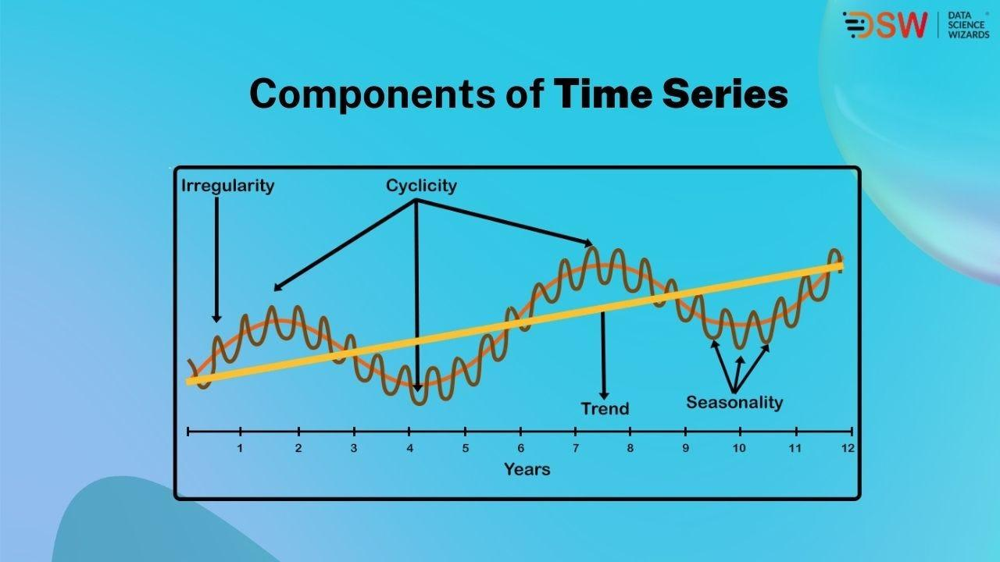

## Table of Contents

## What is time series data and why is it important?

Time series data is a set of information collected over time. It's like a diary of numbers or events that happen one after another. This data can show how things change from one moment to the next, like the temperature each day or the number of people visiting a website each hour. By looking at time series data, we can see patterns and trends over time.

This kind of data is important because it helps us make better decisions and predictions. For example, businesses can use time series data to understand how their sales change throughout the year, and then plan their stock and marketing accordingly. Scientists can use it to study climate changes over many years. By understanding past patterns, we can guess what might happen in the future and prepare for it.

## What are the basic components of a time series?

Time series data has four main parts that help us understand how things change over time. The first part is the trend, which shows the overall direction of the data over a long period. It can go up, down, or stay the same. For example, if you're looking at the number of ice cream sales over many years, the trend might show that sales are increasing because more people are enjoying ice cream.

The second part is seasonality, which shows patterns that repeat at regular times, like every year, month, or week. For instance, ice cream sales might go up every summer because it's hot, and then drop in the winter. The third part is called the cycle, which is like seasonality but doesn't happen at fixed times. It could be an economic boom and bust that happens every few years but not at the same time each year.

The last part is the irregular or random component, which is the unexpected changes in the data that don't fit into the trend, seasonality, or cycle. These could be sudden events like a big sale that boosts ice cream sales for a short time, or a storm that makes people stay inside and not buy ice cream. Understanding these four parts helps us see the full picture of how and why things change over time.

## How do you collect and prepare time series data?

Collecting time series data starts with deciding what you want to track and how often you need to collect the information. For example, if you're tracking daily temperatures, you would set up a thermometer to record the temperature at the same time every day. You can collect this data manually by writing down the numbers, or automatically using sensors and computers that store the data. It's important to keep collecting the data regularly, so you don't miss any days or times, and to make sure the data is accurate.

Once you have collected the data, you need to prepare it for analysis. This means organizing the data into a clear format, like a table or a list, where each entry has a date or time and the corresponding value. Sometimes, you might need to clean the data by fixing any mistakes or filling in missing values. For example, if you missed recording the temperature one day, you might estimate it based on the temperatures of the days before and after. After cleaning and organizing the data, it's ready to be used for finding patterns and making predictions.

## What are some common visualization techniques for time series data?

One common way to show time series data is with a line chart. A line chart is like drawing a line that connects the dots of your data points over time. It's great for showing how something changes, like the temperature going up and down over a year. You can see the overall trend easily, whether it's going up, down, or staying the same. Line charts also help you spot patterns that happen at the same time every year, like more ice cream sales in summer.

Another way to visualize time series data is with a bar chart. Bar charts are good for showing how much something happens at different times. Each bar can represent a day, a week, or a month, and the height of the bar shows the value for that time. For example, you can use a bar chart to see how many visitors come to a website each month. Bar charts make it easy to compare different times and see if there are any big changes or patterns.

A third technique is using a heatmap. A heatmap uses colors to show how values change over time. It's like a calendar where each day or time slot is colored based on how high or low the value is. This is useful for seeing patterns over a larger time frame, like how busy a store is throughout the day or week. Heatmaps can quickly show you when things are happening more or less, making it easy to spot trends and seasonality.

## What are the differences between univariate and multivariate time series analysis?

Univariate time series analysis focuses on just one thing over time. Imagine you're keeping track of the temperature every day. You only look at the temperature numbers and try to understand how they change from day to day, month to month, or year to year. With univariate analysis, you use methods like moving averages or simple forecasting models to see patterns and make predictions about the future based on this single set of data.

Multivariate time series analysis, on the other hand, looks at more than one thing at the same time. For example, you might track both the temperature and the number of ice cream sales each day. By analyzing these two sets of data together, you can see how they affect each other. Maybe when the temperature goes up, so do ice cream sales. Multivariate analysis uses more complex methods to understand the relationships between different variables and how they change over time together. This can help you make better predictions because you're considering more factors.

## How do you handle missing values and outliers in time series data?

Handling missing values in time series data is important to make sure your analysis is accurate. One way to deal with missing values is to fill them in with an estimate. You can use the average of the values before and after the missing one, or you might use a more advanced method like interpolation, which guesses the missing value based on the overall pattern of the data. Another way is to just leave the missing values out if they don't mess up your analysis too much. It's important to think about why the values are missing and choose the best way to handle them so your data stays as accurate as possible.

Outliers in time series data are values that are much higher or lower than the others and can mess up your analysis if you don't handle them right. One way to deal with outliers is to find them and then either remove them or change them to a more reasonable value. You can use simple methods like setting a threshold, where any value above or below it is considered an outlier, or more complex methods like statistical tests to find them. Once you find the outliers, you might decide to keep them if they are important, like a sudden spike in sales due to a big event, or you might adjust them or remove them if they are just mistakes. Handling outliers carefully helps make sure your time series analysis is more reliable.

## What are some basic statistical methods used in time series analysis?

One basic statistical method used in time series analysis is the moving average. This method helps smooth out short-term changes in the data so you can see the bigger picture more clearly. Imagine you're looking at daily temperatures. A moving average would take the average of, say, the last seven days' temperatures every day. This way, you can see the overall trend without being distracted by day-to-day changes. Moving averages are great for understanding the general direction of your data over time.

Another method is called autoregression. This looks at how past values in the time series can help predict future values. For example, if you know that today's temperature is often similar to yesterday's, you can use that information to guess what tomorrow's temperature might be. Autoregression uses a formula to figure out how much past values affect future ones. This method is useful for making short-term predictions based on the patterns you see in your data.

A third basic method is decomposition, which breaks down the time series into its main parts: trend, seasonality, cycle, and irregular components. By separating these parts, you can study each one more closely. For instance, you might look at the trend to see if temperatures are getting warmer over time, or check the seasonality to see if there's a pattern every year. Decomposition helps you understand what's driving the changes in your data and makes it easier to make more accurate predictions.

## How do you model seasonality and trends in time series data?

To model seasonality in time series data, you look for patterns that repeat at regular times, like every year or every month. For example, if you're tracking ice cream sales, you might notice that sales go up every summer and drop in the winter. To capture this, you can use a method called seasonal decomposition, which separates the data into different parts, including the seasonal part. Another way is to use seasonal adjustment, where you take out the seasonal pattern so you can see the other changes more clearly. By understanding and modeling seasonality, you can predict when these patterns will happen again and plan accordingly.

To model trends in time series data, you look at the overall direction of the data over a long time. For example, if you're looking at the temperature over many years, you might see that it's getting warmer overall. To capture this, you can use a method called trend analysis, which helps you see if the data is going up, down, or staying the same. One common way to do this is by using a moving average, which smooths out the short-term changes so you can see the bigger picture. By understanding and modeling trends, you can make better guesses about what might happen in the future and prepare for it.

## What are autoregressive models and how are they used in time series analysis?

Autoregressive models, often called AR models, are a type of statistical model used in time series analysis. They work by using past values of the data to predict future values. Think of it like this: if you know that today's temperature is often similar to yesterday's, an AR model can use that information to guess what tomorrow's temperature might be. The model looks at how much the past affects the future and uses a formula to figure this out. This is helpful for making short-term predictions based on the patterns you see in your data.

In time series analysis, AR models are useful because they help you understand how your data changes over time. For example, if you're tracking monthly sales, an AR model can show you how sales in one month affect sales in the next month. By using these models, you can make better guesses about future sales and plan your business accordingly. AR models are just one tool in the toolbox of time series analysis, but they're important because they help you see the connections between past and future values in your data.

## How can machine learning techniques be applied to time series forecasting?

Machine learning techniques can be really helpful for time series forecasting. They work by learning from past data to make guesses about the future. For example, if you're trying to predict how many people will visit a website next month, machine learning can look at how many visitors came in the past months and find patterns. It can then use those patterns to make a prediction. Some common machine learning methods for this are things like regression models, which can see how different factors affect the number of visitors, and neural networks, which can learn really complex patterns in the data.

One cool thing about machine learning is that it can handle a lot of data and find relationships that might be hard for people to see. For instance, it can look at not just the number of website visitors, but also things like the day of the week, holidays, or even the weather, and see how all these things together affect the number of visitors. By using all this information, machine learning can make more accurate predictions. This helps businesses and other organizations plan better and make smarter decisions based on what they think will happen in the future.

## What are the challenges in long-term time series forecasting and how can they be addressed?

Long-term time series forecasting can be tricky because it's hard to predict what will happen far into the future. Things like economic changes, new technology, or even big world events can make a big difference in the data. For example, if you're trying to predict the stock market for the next ten years, it's tough because so many things could change. Also, the patterns we see in the data might not stay the same over a long time, which makes it harder to use past data to guess the future.

To deal with these challenges, we can use a mix of different methods. One way is to use machine learning models that can learn from a lot of different data and find patterns that might not be obvious. These models can also keep learning and updating as new data comes in, which helps them stay accurate over time. Another way is to combine several forecasting models together, so if one model isn't working well, the others can help make up for it. By using these methods and always checking and updating our forecasts, we can make better guesses about what might happen in the long run.

## How do you evaluate and compare different time series models?

To evaluate and compare different time series models, you need to look at how well they predict the future. One common way to do this is by using a measure called the Mean Absolute Error (MAE). This is like figuring out, on average, how far off the model's guesses are from the real numbers. If one model has a smaller MAE than another, it means its predictions are usually closer to the actual values, so it's probably a better model. Another way is to use the Root Mean Square Error (RMSE), which also looks at how far off the predictions are but gives more weight to bigger mistakes. By comparing these numbers for different models, you can see which one does a better job at forecasting.

Another important thing to consider is how well the model captures the patterns in the data, like trends and seasonality. You can look at how the model fits the data by plotting the actual values and the model's predictions on a graph. If the model's line follows the ups and downs of the real data pretty well, it's a good sign. You can also use a measure called the R-squared value, which shows how much of the changes in the data the model can explain. A higher R-squared value means the model is doing a better job at understanding the patterns. By looking at all these things together, you can pick the best model for your time series data.

## What is Understanding Time Series Data?

Time series data consists of a sequence of data points collected or recorded at consistent time intervals. Distinct from cross-sectional data, which captures a snapshot at a single point in time, time series data concentrates on the changes and evolution of data over time, thus providing a dynamic perspective. This aspect of time series data is crucial in numerous fields, particularly in finance, where it encompasses historical prices, trading volumes, and economic indicators. These elements are vital for comprehensive market analysis.

In time series data analysis, recognizing patterns is essential, as they can guide more informed investment strategies. Patterns such as trends, seasonality, and cyclic behaviors can offer insights into probable future movements in the data. For instance, a trend represents a long-term movement in the data, whether upward or downward, providing a foundational directional bias for decision-making. Seasonality highlights recurring patterns or fluctuations observed at regular intervals, such as daily, monthly, or annually, which are often driven by external factors like economic cycles or consumer behaviors.

Econometric models and statistical techniques are instrumental in identifying these patterns within time series data. Analysts use methods such as moving averages to smooth data and elucidate underlying trends. For example, a simple moving average, calculated as:

$$
\text{SMA}_t = \frac{1}{n} \sum_{i=0}^{n-1} X_{t-i}
$$

where $X$ represents the data points and $n$ is the number of periods considered, helps in attenuating short-term fluctuations, thereby highlighting longer-term trends.

In more sophisticated analyses, time series data might require transformations to ensure stationarity, meaning the statistical properties of the series do not change over time, which is a prerequisite for many predictive models. Techniques like differencing and logarithmic transformations are applied to stabilize the mean and variance across the series.

Ultimately, understanding time series data empowers traders and analysts with a superior capability to anticipate market trends and make data-driven investment decisions, enhancing strategic planning and timing in financial markets. By leveraging statistical techniques and computational methods, stakeholders gain a robust understanding of historical data and improve their ability to forecast future market dynamics.

## What are Time Series Analysis Techniques?

Time series analysis employs various statistical techniques to examine and interpret time-ordered data, focusing on the underlying trends, seasonality, and cyclical nature of the dataset. The primary aim of these techniques is to make data-driven predictions and guide strategic decisions.

**Trend Analysis**: Trend analysis is the process of identifying the long-term direction or trajectory of a dataset over time. It filters out noise and seasonal effects to focus on the core movement. Methods for trend analysis involve visual inspection through plots, linear regression techniques, or decomposition methods where a series is divided into trend, seasonal, and residual components.

**Seasonality**: Seasonality refers to periodic fluctuations that occur at regular intervals due to systematic calendar-related influences, such as quarterly earnings or annual festivals. Identifying and understanding seasonality involves using techniques like moving averages and Fourier analysis, which decompose the series into seasonal components.

**ARIMA and GARCH Models**: Advanced statistical models such as ARIMA and GARCH are instrumental in modeling time-dependent phenomena characterized by autocorrelation and volatility clustering, respectively.

- **ARIMA (AutoRegressive Integrated Moving Average)** is used for forecasting by capturing various aspects of a time series. The model is denoted as ARIMA(p, d, q):
  - **p**: the number of lag observations included in the model (autoregressive part).
  - **d**: the number of times that the raw observations are differenced (integrated part).
  - **q**: the size of the moving average window.

  The ARIMA model is expressed as:
$$
  y_t = \phi_1 y_{t-1} + ... + \phi_p y_{t-p} + \theta_1 \epsilon_{t-1} + ... + \theta_q \epsilon_{t-q} + \epsilon_t

$$
  where $\epsilon_t$ is the error term.

- **GARCH (Generalized Autoregressive Conditional Heteroskedasticity)** models are used to analyze and forecast the volatility of returns, considering the dependency of current volatility on past volatility. The standard GARCH(1, 1) model is:
$$
  \sigma_t^2 = \alpha_0 + \alpha_1 \epsilon_{t-1}^2 + \beta_1 \sigma_{t-1}^2

$$
  where $\sigma_t^2$ is the variance of the series at time $t$, $\epsilon_{t-1}^2$ is the lagged squared error, and $\alpha_0, \alpha_1,$ and $\beta_1$ are parameters.

**Differencing and Transformation**: To stabilize variance and ensure stationarity, differencing and transformation techniques are applied. Stationarity is a critical assumption for many time series models, as it simplifies analysis and forecasting.

- **Differencing** involves subtracting the previous observation from the current observation, reducing non-stationarity by removing trends from the data.
- **Transformation** methods, such as Box-Cox transformation, help to stabilize variance and reduce skewness, enhancing the dataset's stationarity.

In Python, these analyses can be implemented using libraries such as `pandas`, `statsmodels`, and `arch`, which provide comprehensive functions to apply, test, and visualize these models efficiently within time series datasets. By thoroughly applying and interpreting these techniques, analysts and traders can achieve significant insights and predictive capabilities.

## References & Further Reading

[1]: Bergstra, J., Bardenet, R., Bengio, Y., & Kégl, B. (2011). ["Algorithms for Hyper-Parameter Optimization."](https://dl.acm.org/doi/10.5555/2986459.2986743) Advances in Neural Information Processing Systems 24.

[2]: ["Advances in Financial Machine Learning"](https://www.amazon.com/Advances-Financial-Machine-Learning-Marcos/dp/1119482089) by Marcos Lopez de Prado

[3]: ["Time Series Analysis: Forecasting and Control"](https://www.wiley.com/en-us/Time+Series+Analysis%3A+Forecasting+and+Control%2C+5th+Edition-p-9781118675021) by George E. P. Box, Gwilym M. Jenkins, Gregory C. Reinsel, and Greta M. Ljung

[4]: ["Machine Learning for Algorithmic Trading"](https://github.com/stefan-jansen/machine-learning-for-trading) by Stefan Jansen

[5]: Bollerslev, T. (1986). ["Generalized Autoregressive Conditional Heteroskedasticity."](https://www.sciencedirect.com/science/article/pii/0304407686900631) Journal of Econometrics, 31(3), 307-327.

[6]: Hyndman, R. J., & Athanasopoulos, G. (2018). ["Forecasting: Principles and Practice."](https://otexts.com/fpp2/) OTexts.

[7]: ["Quantitative Trading: How to Build Your Own Algorithmic Trading Business"](https://www.amazon.com/Quantitative-Trading-Build-Algorithmic-Business/dp/1119800064) by Ernest P. Chan