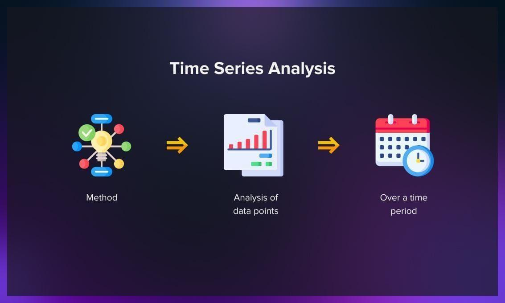

## Table of Contents

## What is Time Series Analysis and why is it important in machine learning?

Time Series Analysis is a way of looking at data that changes over time. Imagine you're checking the temperature every day for a year. That's a time series! You can use this data to find patterns, like if it's hotter in summer or colder in winter. In time series analysis, we use special math and computer tools to understand these patterns and make predictions about what might happen next.

This kind of analysis is very important in machine learning because it helps us make better guesses about the future. For example, businesses use time series analysis to predict how many products they will sell next month, or doctors might use it to predict how a patient's health will change. By understanding the past and present data, machine learning models can learn to make more accurate predictions, which can help in planning and decision-making.

## What are the basic components of a time series?

A time series has four basic parts: trend, seasonality, cycle, and residuals. The trend is like the overall direction of the data over a long time. Imagine if you're getting taller every year - that's a trend! Seasonality is when the data goes up and down in a regular pattern, like how it gets cold in winter and hot in summer every year. Cycles are like trends but they go up and down over a longer time and don't happen as regularly as seasonality. Lastly, residuals are the random ups and downs that don't fit into the other three parts. They're like the little surprises in the data that we can't predict.

To show these parts in a time series, we can use a simple formula. If we call our time series $$Y_t$$, we can break it down like this: $$Y_t = T_t + S_t + C_t + R_t$$. Here, $$T_t$$ is the trend, $$S_t$$ is the seasonality, $$C_t$$ is the cycle, and $$R_t$$ is the residuals. Each part helps us understand different things about the data. By figuring out these parts, we can make better guesses about what will happen next.

## How do you visualize time series data effectively?

To visualize time series data effectively, you can use line plots. A line plot is like a graph where you draw a line that connects all your data points over time. It's simple but very useful because it shows how your data changes. You can see the trend, the ups and downs, and maybe even some patterns. If you want to make it even clearer, you can add labels to your graph. The x-axis is for time, and the y-axis is for the values of your data. You can also use different colors or lines to show different time series on the same graph.

Another good way to visualize time series data is by using a seasonal plot. This helps you see the patterns that happen at the same time every year. Imagine you're looking at the temperature every day for a few years. A seasonal plot would show you how the temperature changes from January to December, year after year. You can see if it's always colder in winter or hotter in summer. To make a seasonal plot, you can use a code like this:

```python
import pandas as pd
import matplotlib.pyplot as plt

# Assume 'data' is your DataFrame with a 'date' column and a 'value' column
data['month'] = data['date'].dt.month
data['year'] = data['date'].dt.year

for year in data['year'].unique():
    yearly_data = data[data['year'] == year]
    plt.plot(yearly_data['month'], yearly_data['value'], label=str(year))

plt.xlabel('Month')
plt.ylabel('Value')
plt.legend()
plt.show()
```

This code will create a graph where each line shows the data for one year, making it easy to see the seasonal patterns.

## What are the common preprocessing steps for time series data?

Before you can use time series data for analysis or [machine learning](/wiki/machine-learning), you need to clean and prepare it. This is called preprocessing. One of the first things you do is handle missing data. If some values are missing, you can fill them in with the average of the values before and after, or you can use a more advanced method like interpolation. You might also need to smooth out the data to see the bigger picture. This can be done by using a moving average, where you take the average of a few points at a time to make the line smoother.

Another important step is to make the data stationary. Stationary data means the average and the spread of the data don't change over time. If your data isn't stationary, you can make it so by differencing. This means you subtract each value from the one before it. The formula for this is $$Y'_t = Y_t - Y_{t-1}$$. This helps remove trends and seasonality, making it easier to analyze. You might also need to normalize or scale your data so that all values are on the same level. This can be done by subtracting the mean and dividing by the standard deviation.

Lastly, you might want to decompose your time series into its basic parts: trend, seasonality, cycle, and residuals. This can help you understand the data better. You can use a simple code to do this:

```python
from statsmodels.tsa.seasonal import seasonal_decompose

# Assume 'data' is your time series data
result = seasonal_decompose(data, model='additive')
result.plot()
```

This code will break down your time series into its parts and show you a graph of each part. By doing these preprocessing steps, you make your time series data ready for analysis and machine learning.

## What are the differences between stationary and non-stationary time series?

A stationary time series is one where the statistical properties like the mean, variance, and autocorrelation stay the same over time. Imagine you're measuring the temperature in a room every hour. If the average temperature stays the same and the ups and downs are similar throughout the day, that's a stationary series. In a stationary time series, you can use the same model to predict future values no matter when you start, because the patterns don't change. If you want to check if a series is stationary, you can use tests like the Augmented Dickey-Fuller test, which helps you see if the series has a trend or not.

On the other hand, a non-stationary time series has statistical properties that change over time. For example, if you're looking at the stock market, the average price might go up over time, or the ups and downs might get bigger. This makes it harder to predict future values because the patterns are changing. To turn a non-stationary series into a stationary one, you can use differencing, where you subtract each value from the one before it. The formula for this is $$Y'_t = Y_t - Y_{t-1}$$. This helps remove trends and seasonality, making the series easier to work with.

## How can you test for stationarity in a time series?

To test if a time series is stationary, one common method is to use the Augmented Dickey-Fuller (ADF) test. This test helps you figure out if there's a trend in your data that makes it non-stationary. The ADF test works by checking if you can reject the null hypothesis, which says that the time series has a unit root and is therefore non-stationary. If the test statistic is less than the critical value, you reject the null hypothesis, meaning your series is likely stationary. You can run this test using a simple code in Python:

```python
from statsmodels.tsa.stattools import adfuller

# Assume 'data' is your time series data
result = adfuller(data)
print('ADF Statistic:', result[0])
print('p-value:', result[1])
print('Critical Values:', result[4])
```

Another way to check for stationarity is to look at the time series plot and see if you can spot any obvious trends or patterns that change over time. You can also use the Kwiatkowski-Phillips-Schmidt-Shin (KPSS) test, which is the opposite of the ADF test. The KPSS test assumes the series is stationary by default and checks if you can reject this assumption. If the test statistic is greater than the critical value, you reject the null hypothesis, meaning your series is likely non-stationary. Both the ADF and KPSS tests help you understand if your time series needs to be transformed to become stationary, which is important for making accurate predictions.

## What are some popular models for time series forecasting in machine learning?

One popular model for time series forecasting is the ARIMA model, which stands for AutoRegressive Integrated Moving Average. ARIMA is good at capturing trends and seasonality in data. It works by using past values to predict future ones. The model has three parts: AR (AutoRegressive) looks at how past values affect future ones, I (Integrated) makes the series stationary by differencing, and MA (Moving Average) looks at past forecast errors. You can set up an ARIMA model by choosing the right values for p, d, and q, which stand for the number of AR terms, the degree of differencing, and the number of MA terms. The general formula for an ARIMA model is $$Y_t' = c + \phi_1 Y_{t-1}' + \phi_2 Y_{t-2}' + ... + \phi_p Y_{t-p}' + \theta_1 \epsilon_{t-1} + \theta_2 \epsilon_{t-2} + ... + \theta_q \epsilon_{t-q} + \epsilon_t$$, where $$Y_t'$$ is the differenced series, $$c$$ is a constant, $$\phi$$ and $$\theta$$ are parameters, and $$\epsilon$$ is the error term.

Another popular model is the LSTM (Long Short-Term Memory) network, which is a type of recurrent [neural network](/wiki/neural-network) (RNN). LSTMs are good at remembering long-term dependencies in data, which makes them great for time series forecasting. They work by passing information through memory cells that can keep or forget information as needed. This allows them to learn from sequences of data over time. You can use an LSTM model by setting up the network architecture and training it on your time series data. Here is a simple example of how to create an LSTM model using Python and the Keras library:

```python
from keras.models import Sequential
from keras.layers import LSTM, Dense

# Assume 'X' is your input data and 'y' is your target data
model = Sequential()
model.add(LSTM(50, activation='relu', input_shape=(n_steps, n_features)))
model.add(Dense(1))
model.compile(optimizer='adam', loss='mse')
model.fit(X, y, epochs=100, verbose=0)
```

Both ARIMA and LSTM models have their strengths and are widely used in time series forecasting. ARIMA is simpler and works well for data with clear patterns, while LSTM can handle more complex data and learn from longer sequences.

## How does ARIMA model work and when should it be used?

The ARIMA model, which stands for AutoRegressive Integrated Moving Average, is a way to predict future values in a time series by looking at past data. It has three parts: AR (AutoRegressive), I (Integrated), and MA (Moving Average). The AR part looks at how past values affect future ones. The I part makes the series stationary by differencing, which means subtracting each value from the one before it. The MA part looks at past forecast errors to improve predictions. You can set up an ARIMA model by choosing the right values for p, d, and q, which stand for the number of AR terms, the degree of differencing, and the number of MA terms. The general formula for an ARIMA model is $$Y_t' = c + \phi_1 Y_{t-1}' + \phi_2 Y_{t-2}' + ... + \phi_p Y_{t-p}' + \theta_1 \epsilon_{t-1} + \theta_2 \epsilon_{t-2} + ... + \theta_q \epsilon_{t-q} + \epsilon_t$$, where $$Y_t'$$ is the differenced series, $$c$$ is a constant, $$\phi$$ and $$\theta$$ are parameters, and $$\epsilon$$ is the error term.

You should use an ARIMA model when your time series data has clear patterns like trends and seasonality. It's good for data that you can make stationary by differencing. ARIMA is simpler than some other models and works well for many types of data, like sales numbers or stock prices. If you want to use ARIMA, you can set it up with a code like this:

```python
from statsmodels.tsa.arima.model import ARIMA

# Assume 'data' is your time series data
model = ARIMA(data, order=(p, d, q))
results = model.fit()
```

This code will create an ARIMA model with the parameters you choose and fit it to your data.

## What are the advantages of using LSTM networks for time series prediction?

LSTM networks, which stand for Long Short-Term Memory, are really good at predicting time series data because they can remember things from a long time ago. Imagine you're trying to guess what the weather will be like next week. You might need to look at the weather from last month to make a good guess. LSTMs can do this easily because they have special parts inside them called memory cells. These cells can keep important information or forget it if it's not needed anymore. This makes LSTMs great for data where what happened a long time ago can affect what will happen next.

Another big advantage of using LSTMs is that they can handle really complicated data. For example, if you're looking at stock prices, there might be a lot of ups and downs that are hard to predict. LSTMs can learn from these patterns over time and make better guesses about the future. They're also flexible, so you can use them for all kinds of time series data, not just one type. If you want to use an LSTM for time series prediction, you can set it up with a simple code like this:

```python
from keras.models import Sequential
from keras.layers import LSTM, Dense

# Assume 'X' is your input data and 'y' is your target data
model = Sequential()
model.add(LSTM(50, activation='relu', input_shape=(n_steps, n_features)))
model.add(Dense(1))
model.compile(optimizer='adam', loss='mse')
model.fit(X, y, epochs=100, verbose=0)
```

This code will create an LSTM model and train it on your time series data, helping you make predictions based on past patterns.

## How can you evaluate the performance of a time series model?

To evaluate the performance of a time series model, you can use different ways to see how well your model predicts the future. One common way is to use something called Mean Absolute Error (MAE). MAE is the average of how far off your predictions are from the real values. You calculate it by taking the absolute difference between each predicted value and the actual value, then finding the average of all those differences. The formula for MAE is $$ \text{MAE} = \frac{1}{n} \sum_{i=1}^{n} |y_i - \hat{y}_i| $$, where $$ y_i $$ is the actual value, $$ \hat{y}_i $$ is the predicted value, and $$ n $$ is the number of observations. A lower MAE means your model is doing a better job at predicting.

Another way to check your model's performance is by using the Root Mean Square Error (RMSE). RMSE is like MAE, but it puts more weight on bigger mistakes. You find RMSE by taking the square root of the average of the squared differences between predicted and actual values. The formula for RMSE is $$ \text{RMSE} = \sqrt{\frac{1}{n} \sum_{i=1}^{n} (y_i - \hat{y}_i)^2} $$. Just like with MAE, a lower RMSE means your model is making better predictions. You can calculate both MAE and RMSE using a simple code like this:

```python
import numpy as np

# Assume 'y_true' is your actual values and 'y_pred' is your predicted values
mae = np.mean(np.abs(y_true - y_pred))
rmse = np.sqrt(np.mean((y_true - y_pred)**2))

print('MAE:', mae)
print('RMSE:', rmse)
```

These metrics help you understand how well your time series model is working and if you need to make any changes to improve your predictions.

## What are the challenges of dealing with seasonality in time series data?

Dealing with seasonality in time series data can be tricky because it means your data goes up and down in a regular pattern every year. Imagine you're looking at ice cream sales. They might go up in the summer and down in the winter, year after year. This pattern can make it hard to see the overall trend or other changes in the data. If you don't handle seasonality right, your predictions might be way off because they'll be influenced by these seasonal ups and downs.

To deal with seasonality, you can use special methods like seasonal decomposition. This breaks your time series into different parts: trend, seasonality, cycle, and residuals. The formula for this is $$Y_t = T_t + S_t + C_t + R_t$$, where $$T_t$$ is the trend, $$S_t$$ is the seasonality, $$C_t$$ is the cycle, and $$R_t$$ is the residuals. By understanding and removing the seasonal part, you can make better predictions. But figuring out the right way to do this can take a lot of time and effort, and if you do it wrong, your model might not work well.

## How can advanced techniques like Prophet or ensemble methods improve time series forecasting?

Prophet is a special tool made by Facebook that's really good at predicting time series data, especially when there are holidays or special events that affect the data. It's easy to use because it can handle things like trends, seasonality, and even those extra days like Christmas or Black Friday without you having to do a lot of extra work. Prophet works by breaking down your time series into parts like trend, seasonality, and holidays, then putting them back together to make predictions. If you want to use Prophet, you can set it up with a simple code like this:

```python
from fbprophet import Prophet

# Assume 'data' is your time series data with 'ds' as the date column and 'y' as the value column
model = Prophet()
model.fit(data)
future = model.make_future_dataframe(periods=365)
forecast = model.predict(future)
```

Ensemble methods are another way to make better time series forecasts. They work by combining the predictions from different models to get a better overall prediction. Imagine you have a few friends who are good at guessing the weather, but they sometimes make mistakes. If you take all their guesses and combine them, you might get a more accurate prediction than if you just listened to one friend. Ensemble methods do the same thing with models. They can use simple averages or more complicated ways to combine predictions. This can help reduce errors and make your forecasts more reliable.