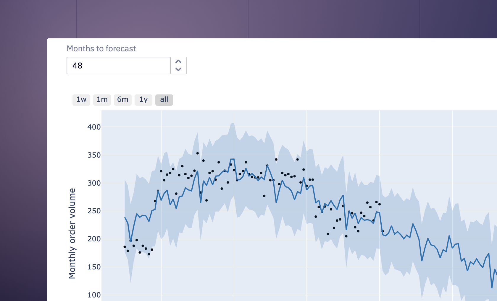

## Table of Contents

## What is time series forecasting?

Time series forecasting is a way to predict future values based on past data that is collected over time. Imagine you have a list of numbers showing how many ice creams were sold each day for the last year. By looking at this list, you can try to guess how many ice creams might be sold tomorrow or next month. This kind of forecasting is useful in many areas like weather prediction, stock market analysis, and sales planning.

The process involves analyzing patterns and trends in the data. For example, if you see that ice cream sales go up every summer, you can predict that they will likely go up next summer too. There are different methods to do this, from simple ones like looking at moving averages to more complex ones using computer algorithms. The goal is to make the best possible guess about the future, helping businesses and organizations plan better.

## Why is time series forecasting important in various industries?

Time series forecasting is really important in many industries because it helps people make smart guesses about what will happen in the future. For example, in the retail industry, stores use time series forecasting to figure out how much stuff they should order. If they can predict that more people will buy umbrellas next month because it's going to rain a lot, they can make sure they have enough umbrellas in stock. This helps them avoid running out of products or having too many left over, which can save them money and make customers happy.

In the finance industry, time series forecasting is used to predict stock prices or how the economy might do. Banks and investors look at past data to guess if stock prices will go up or down. This helps them decide when to buy or sell stocks, which can lead to making more money. It's also used to plan budgets and investments, making sure money is spent wisely based on what might happen in the future.

In healthcare, time series forecasting can help predict how many patients might need certain treatments or how a disease might spread. Hospitals use this information to plan how many staff they need and to make sure they have enough medicine and equipment. This can make a big difference in saving lives and providing good care. Overall, time series forecasting helps different industries plan better and make decisions that can lead to success.

## What are the basic components of a time series?

A time series is made up of four basic parts: trend, seasonality, cycle, and irregular fluctuations. The trend is the long-term direction that the data is moving. For example, if more and more people are buying smartphones each year, that's a trend. Seasonality refers to regular patterns that happen at the same time each year. Think about how ice cream sales go up in the summer and down in the winter. That's seasonality.

The cycle part of a time series is a bit like seasonality, but it doesn't happen at the same time every year. It's more about ups and downs that can last for several years. For example, the economy might go through periods of growth and then slowdowns, and these cycles can take years to complete. Finally, irregular fluctuations are the random, unpredictable changes that don't fit into any of the other categories. These could be caused by unexpected events like a sudden weather change or a big news story.

## What are some common methods for time series forecasting?

There are several common methods for time series forecasting, and one of them is the moving average method. This method looks at the average of past data points over a certain period to predict future values. For example, if you want to guess next month's sales, you might look at the average sales of the last three months. This method is simple but can be very effective for smoothing out short-term changes and seeing the bigger picture.

Another method is exponential smoothing, which gives more weight to recent data points. This means that if sales went up a lot last month, the forecast for next month will be influenced more by that recent increase than by older data. This method is good for data that changes over time and can adapt quickly to new trends. It's a bit more complex than moving averages but still easy to understand and use.

There are also more advanced methods like ARIMA (AutoRegressive Integrated Moving Average) models. ARIMA models look at both the past values of the time series and the differences between those values to make predictions. They can handle more complicated patterns in the data, like trends and seasonality. While ARIMA models are more difficult to set up, they can be very powerful for making accurate forecasts in many different situations.

## How do you prepare data for time series forecasting?

To prepare data for time series forecasting, you first need to gather all the historical data you have. This could be daily sales numbers, monthly temperatures, or any other data that changes over time. Make sure the data is complete and in the right order, from the oldest to the newest. If there are any missing values, you'll need to fill them in or decide how to handle them. You might also need to check for any mistakes or unusual data points that could mess up your forecasts.

Once your data is clean and complete, you might need to adjust it to make it easier to work with. This could mean taking out any trends or seasonal patterns so you can see the underlying changes more clearly. You might also need to change the time frame of your data, like turning daily data into weekly or monthly data if that's what you need for your forecasts. The goal is to get your data ready so that when you use it for forecasting, you can make the best possible guesses about the future.

## What is the difference between univariate and multivariate time series forecasting?

Univariate time series forecasting is when you predict future values using only one set of data over time. Imagine you're trying to guess how many ice creams you'll sell next week. You only look at past ice cream sales to make your prediction. This method is simpler because it focuses on just one thing, but it can miss out on other factors that might affect your sales, like the weather or holidays.

Multivariate time series forecasting, on the other hand, uses more than one set of data to make predictions. Going back to the ice cream example, you might look at past ice cream sales, but also at the weather forecast and upcoming holidays. By considering these extra pieces of information, you can make a more accurate guess about future sales. This method is more complex, but it can give you a better picture of what might happen because it takes into account different factors that could influence your data.

## How can you evaluate the accuracy of a time series forecast?

To evaluate the accuracy of a time series forecast, you can compare the predicted values to the actual values that happen later. One common way to do this is by using measures like the Mean Absolute Error (MAE) or the Root Mean Square Error (RMSE). The MAE is the average of the absolute differences between the predicted and actual values. It tells you how far off your predictions are on average. The RMSE is similar, but it squares the differences before averaging them and then takes the square root of the result. This gives more weight to larger errors, so it can be useful if you want to penalize big mistakes more.

Another way to check the accuracy is by looking at how well the forecast captures the patterns in the data, like trends and seasonality. You can do this by splitting your data into a training set and a test set. Use the training set to make your forecast model, and then see how well it predicts the values in the test set. If the forecast follows the same ups and downs as the actual data, it's a good sign that your model is working well. You can also use visual methods, like plotting the forecasted values against the actual values on a graph, to see how closely they match up.

## What are some advanced techniques used in time series forecasting?

One advanced technique for time series forecasting is using machine learning algorithms like Long Short-Term Memory (LSTM) networks. These are a type of [neural network](/wiki/neural-network) that's really good at understanding patterns in data over time. Imagine you're trying to predict the weather. An LSTM can look at past weather data and learn how things like temperature and humidity change from day to day. This helps it make better guesses about what the weather will be like in the future. LSTMs are great because they can handle a lot of data and find complex patterns that simpler methods might miss.

Another advanced technique is called ensemble methods. This is when you use several different forecasting models together to make one final prediction. It's like getting advice from a group of experts instead of just one. For example, you might use a moving average model, an ARIMA model, and an LSTM model all at the same time. By combining the predictions from these different models, you can often get a more accurate forecast than you would from any single model alone. Ensemble methods are powerful because they can balance out the strengths and weaknesses of each individual model, leading to better overall predictions.

## How does seasonality affect time series forecasting and how can it be modeled?

Seasonality is a big deal in time series forecasting because it's all about the patterns that happen at the same time every year. Think about how you might sell more ice cream in the summer than in the winter. If you don't take this into account, your forecasts might be way off. For example, if you just look at the average sales over the whole year, you might not realize that you need to order more ice cream for the summer months. So, understanding seasonality helps you make better guesses about what will happen in the future.

To model seasonality, you can use different methods depending on your data. One simple way is to use seasonal decomposition, which breaks your data into trend, seasonal, and random parts. This helps you see the seasonal patterns more clearly. Another method is to use seasonal ARIMA models, which are like regular ARIMA models but with extra parts that specifically handle the seasonal changes. These models can look at past data and figure out how much the seasonal patterns affect your numbers, so you can make more accurate forecasts. By using these techniques, you can make sure your predictions take into account the ups and downs that happen every year.

## What are the challenges faced in long-term time series forecasting?

Long-term time series forecasting can be really tricky because it's hard to predict what will happen far into the future. One big challenge is that the further out you try to forecast, the more things can change. For example, if you're trying to guess what the weather will be like next year, it's tough because so many things could happen between now and then. Trends can shift, new events can pop up, and the world can change in ways you didn't expect. This makes it hard to rely on past data alone, because the future might not follow the same patterns.

Another challenge is that long-term forecasts often need to take into account more factors. Short-term forecasts might just look at recent data, but for long-term predictions, you need to think about bigger changes like economic shifts, technological advancements, or even changes in consumer behavior. This means you have to use more complex models that can handle all these different pieces of information. But even with these advanced models, it's still hard to be sure about what will happen years down the line, because the world is always changing and full of surprises.

## How can machine learning and AI enhance time series forecasting?

Machine learning and AI can make time series forecasting a lot better by finding patterns in data that are too tricky for simpler methods to see. Imagine you're trying to predict how many people will visit a website next month. A machine learning model can look at not just the number of visitors but also things like what time of day people visit, what pages they look at, and even what's happening in the world at that time. By understanding all these different pieces of information, the model can make smarter guesses about the future. This is really helpful in areas like sales forecasting, where knowing what affects customer behavior can make a big difference in planning.

AI also helps by making it easier to update forecasts as new data comes in. For example, if you're predicting stock prices, the market can change quickly because of news or events. An AI model can keep learning from the latest data and adjust its predictions in real-time. This means your forecasts can stay accurate even when things change fast. Plus, AI can handle a lot of data quickly, so it's great for big businesses that need to make predictions about many different things at once. This can save time and help make better decisions.

## What are the latest trends and research directions in time series forecasting?

One of the latest trends in time series forecasting is the use of [deep learning](/wiki/deep-learning) models, like Long Short-Term Memory (LSTM) networks and Convolutional Neural Networks (CNNs). These models can handle a lot of data and find really complex patterns that simpler methods might miss. For example, researchers are working on ways to use these models to predict things like electricity demand or stock prices more accurately. They're also trying to make these models work better with less data, which is important for businesses that don't have a lot of historical information to work with.

Another big area of research is in making time series forecasting more explainable. This means trying to understand why a model makes the predictions it does, which can be hard with complex AI models. Researchers are working on ways to break down these models so that people can see what parts of the data are most important for the forecasts. This is really helpful for industries like healthcare, where understanding why a prediction is made can be as important as the prediction itself. By making forecasts more transparent, businesses can trust the models more and use them to make better decisions.

## What are the common time series models used in algo trading?

Time series models are indispensable tools in [algorithmic trading](/wiki/algorithmic-trading), assisting traders in making data-driven decisions by analyzing historical price data and predicting future movements. Among the most commonly used models are Moving Averages (MA), Autoregressive Integrated Moving Average (ARIMA), Exponential Smoothing methods, Generalized Autoregressive Conditional Heteroskedasticity (GARCH) models, and advanced neural networks like Recurrent Neural Networks (RNNs) and Long Short-Term Memory (LSTM).

Moving Averages (MA) are fundamental techniques utilized to smooth out fluctuations in price data by calculating a consistently updated average price over a specific number of periods. This helps in identifying and observing underlying trends in price movements. The simple moving average (SMA) is computed as:

$$
SMA = \frac{1}{n} \sum_{i=0}^{n-1} P_{t-i}
$$

where $P_{t-i}$ represents the price at time $t-i$ and $n$ is the number of periods considered.

ARIMA models are particularly useful for analyzing and forecasting time series data that is non-stationary. These models work by transforming the data through differencing to achieve stationarity, and then applying a combination of autoregressive and moving average components to capture temporal correlations. The ARIMA model is generally designated as ARIMA(p, d, q), where $p$ is the number of autoregressive terms, $d$ is the degree of differencing, and $q$ is the number of moving average terms.

Exponential Smoothing methods, such as Holt-Winters, are tailored to address data exhibiting seasonal or trend components. These methods assign exponentially decreasing weights to past observations, acknowledging the relevance of more recent data. The Holt-Winters method can be adapted to incorporate both trend and seasonal effects, enhancing its utility in expressing market behaviors that repeat over fixed intervals.

Generalized Autoregressive Conditional Heteroskedasticity (GARCH) models focus on predicting the [volatility](/wiki/volatility-trading-strategies) of returns. These models are predicated on the observation that financial time series frequently exhibit periods of varying volatility, known as volatility clustering. GARCH models aim to capture this clustering effect by estimating current volatility based on past volatility and return data. A standard GARCH(1,1) model is described by:

$$
\sigma_t^2 = \alpha_0 + \alpha_1 \epsilon_{t-1}^2 + \beta_1 \sigma_{t-1}^2
$$

where $\sigma_t^2$ is the conditional variance, $\epsilon_{t-1}^2$ is the squared return from the previous period, $\alpha_0$, $\alpha_1$, and $\beta_1$ are model parameters.

Incorporating [machine learning](/wiki/machine-learning), RNNs, and LSTM networks represent breakthroughs in handling time series exhibiting complex, non-linear dependencies. Traditional models may struggle with intricate temporal structures that these types of neural networks excel in capturing due to their unique architectures. RNNs are designed to process sequences of data by retaining information about past inputs, while LSTMs enhance this capability by addressing the vanishing gradient problem, thus effectively utilizing memory over long sequences.

These models collectively broaden the analytical framework available to traders, offering diverse approaches to enhance the precision and reliability of forecasts imperative for effective algorithmic trading.

## References & Further Reading

[1]: Chatfield, C. (2003). ["The Analysis of Time Series: An Introduction."](https://www.taylorfrancis.com/books/mono/10.4324/9780203491683/analysis-time-series-chris-chatfield) Chapman and Hall/CRC.

[2]: Hyndman, R. J., & Athanasopoulos, G. (2018). ["Forecasting: Principles and Practice."](https://otexts.com/fpp2/) OTexts. 

[3]: Box, G. E. P., Jenkins, G. M., Reinsel, G. C., & Ljung, G. M. (2015). ["Time Series Analysis: Forecasting and Control."](https://onlinelibrary.wiley.com/doi/book/10.1002/9781118619193) Wiley.

[4]: Tsay, R. S. (2010). ["Analysis of Financial Time Series."](https://onlinelibrary.wiley.com/doi/book/10.1002/9780470644560) Wiley.

[5]: Shumway, R. H., & Stoffer, D. S. (2017). ["Time Series Analysis and Its Applications: With R Examples."](https://link.springer.com/book/10.1007/978-3-031-70584-7) Springer.

[6]: Goodfellow, I., Bengio, Y., & Courville, A. (2016). ["Deep Learning."](https://www.deeplearningbook.org/) MIT Press.

[7]: Hamilton, J. D. (1994). ["Time Series Analysis."](https://www.amazon.com/Time-Analysis-James-Douglas-Hamilton/dp/0691042896) Princeton University Press.