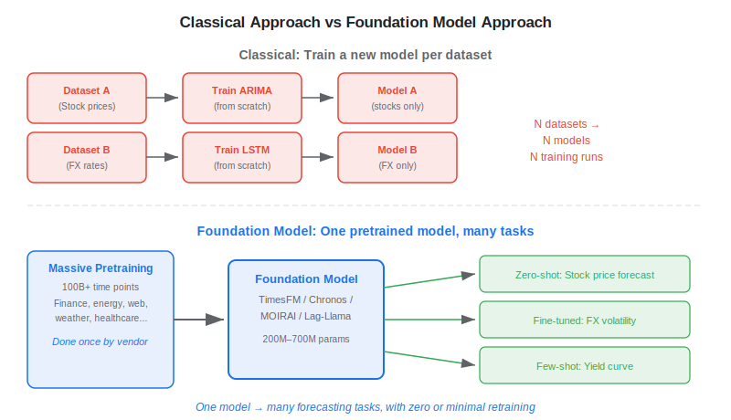
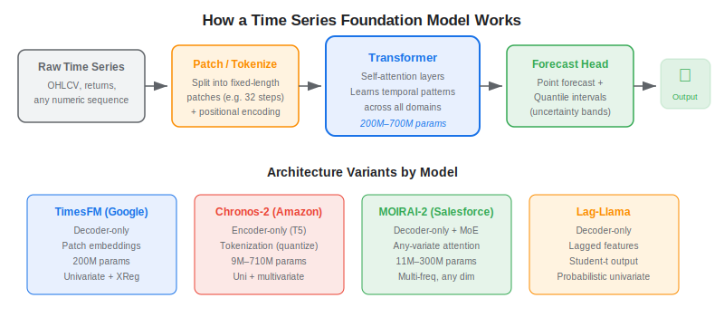
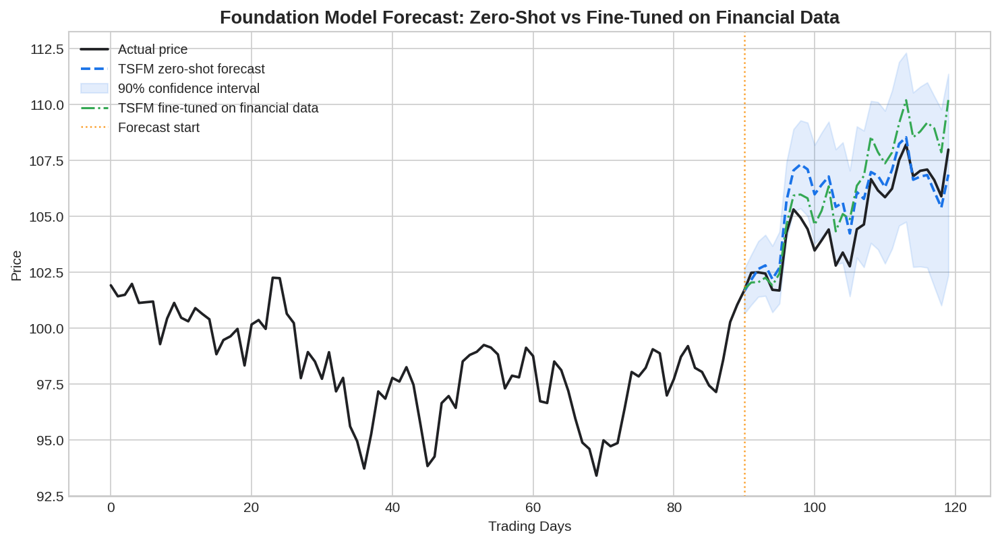

A **time series foundation model** (TSFM) is a large, pre-trained transformer that learns temporal patterns from billions of data points across many domains — energy, weather, web traffic, healthcare, finance — and can then forecast *any* new time series with zero or minimal retraining. For algo traders, this promises a paradigm shift: instead of fitting an ARIMA or LSTM from scratch for every asset, you load a pre-trained model, pass in raw price data, and get a probabilistic forecast in seconds. The leading open-source TSFMs — Google's **TimesFM**, Amazon's **Chronos-2**, Salesforce's **MOIRAI-2**, and ServiceNow's **Lag-Llama** — have all been released since 2024 and are evolving rapidly. But financial data presents unique challenges that make the promise more nuanced than the headlines suggest.

## How Foundation Models Differ from Classical Forecasting

In the classical approach, you train a separate model (ARIMA, GARCH, LSTM, XGBoost) for each specific dataset. A model trained on S&P 500 daily returns knows nothing about EUR/USD volatility — you start over each time. Foundation models flip this: one model is pre-trained once on a massive, diverse corpus of time series, then applied to many downstream tasks via zero-shot inference, few-shot fine-tuning, or full adaptation.



The key benefits are practical: faster deployment (no training loop), better performance on small datasets (the pre-training transfers general temporal knowledge), and a single model to maintain across asset classes. The key cost is that generic pre-training may not capture the specific statistical properties of financial data — a theme we return to below.

## Architecture: How a TSFM Works

Most TSFMs share a common pipeline: **patch** (or tokenize) the raw series → feed patches into a **transformer** backbone → output forecasts through a **prediction head** (point estimates and/or probabilistic quantiles).



**Patching** splits a long time series into fixed-length segments (e.g., 32 time steps each). This reduces the sequence length the [transformer](https://paperswithbacktest.com/wiki/transformer) must attend over, making self-attention computationally tractable for sequences of thousands of steps. TimesFM, MOIRAI, and Chronos all use patching, though with different embedding strategies.

**The transformer backbone** applies multi-head self-attention to learn which past time steps matter most for predicting the future. Models differ in architecture: TimesFM and MOIRAI-2 use a decoder-only design (like GPT), Chronos-2 uses an encoder-only design (derived from T5), and Lag-Llama uses a decoder-only architecture with explicit lagged feature inputs.

**The forecast head** maps the transformer's hidden states to output predictions. Chronos tokenizes values into a discrete vocabulary and predicts the next token (treating forecasting as language modelling). TimesFM 2.5 added a continuous quantile head for probabilistic output. MOIRAI-2 uses quantile regression with multi-token prediction.

## The Leading Models at a Glance

| Model | Developer | Architecture | Parameters | Multivariate? | Key Strength |
|---|---|---|---|---|---|
| TimesFM 2.5 | Google | Decoder-only, patching | 200M | Univariate + XReg covariates | Enterprise-ready (BigQuery), 100B+ training points |
| Chronos-2 | Amazon | Encoder-only (T5) | 9M–710M | Yes (Oct 2025 update) | Most downloaded on HuggingFace, 300+ forecasts/sec |
| MOIRAI-2 | Salesforce | Decoder-only + MoE | 11M–300M | Any-variate natively | Handles irregular frequencies and variable dimensions |
| Lag-Llama | ServiceNow | Decoder-only, lagged features | ~10M | Univariate | Probabilistic (Student-t), lightweight |
| FinCast | Zhu et al. | Encoder-decoder | — | Multi-domain financial | First TSFM pre-trained on financial data specifically |

All except FinCast were pre-trained primarily on non-financial data (web traffic, energy, IoT). This matters for finance — more on that below.

## Python Example: Zero-Shot Forecasting with TimesFM

The following code loads Google's TimesFM 2.5 and generates a 20-day ahead forecast on a stock price series with no training at all:

```python
import numpy as np
import yfinance as yf
import timesfm

# 1. Download historical data
df = yf.download("AAPL", period="2y", progress=False)
close = df["Close"].squeeze().values.astype(np.float32)

# 2. Load the pretrained foundation model
model = timesfm.TimesFM_2p5_200M_torch.from_pretrained(
    "google/timesfm-2.5-200m-pytorch"
)
model.compile(
    timesfm.ForecastConfig(
        max_context=512,
        max_horizon=20,
        normalize_inputs=True,
        use_continuous_quantile_head=True,
    )
)

# 3. Zero-shot forecast — no training loop
point_forecast, quantile_forecast = model.forecast(
    horizon=20,
    inputs=[close[-512:]],  # last 512 days as context
)

print(f"Next 20 days forecast: {point_forecast[0]}")
print(f"Quantile shape: {quantile_forecast.shape}")
# quantile_forecast contains 10th–90th percentile bands
```

That is the entire workflow — no feature engineering, no hyperparameter tuning, no train/test split. The model generalises from its pre-training on 100 billion time points across diverse domains. For a production system, you would add a few-shot fine-tuning step on your specific asset's history, which Marconi et al. (2025) showed can improve financial forecast accuracy by 15–30%.

## Why Financial Data Is Uniquely Challenging for TSFMs

Here is where the nuance matters. Most TSFMs are pre-trained on what Lehalle (2026) calls *"time series of repeated experiments"* — server logs, seasonal electricity demand, weekly sales cycles. These series have recurring patterns and stable distributions. Financial time series are fundamentally different:

**Non-stationarity** — The statistical properties of asset returns change over time. A model trained on 2015 volatility regimes may be useless during a 2020 pandemic crash or a 2022 rate-hiking cycle.

**Low signal-to-noise ratio** — Daily stock returns are dominated by noise. The predictable signal is tiny compared to energy demand or web traffic, where patterns are strong and reliable.

**Regime shifts** — Markets alternate between bull/bear phases, high/low volatility regimes, and correlated/decorrelated periods. Generic pre-training does not learn these financial-specific transitions.

**Limited effective sample size** — While decades of daily data exist, the number of *independent* regime episodes is small. A model may see only 3–5 full bear markets in 30 years of training data.

The empirical evidence supports this caution. A comprehensive evaluation by Marconi et al. (2025) found that off-the-shelf TSFMs outperformed naive baselines on financial data but that traditional specialist models matched or exceeded their performance in two of three tasks. The critical finding: models pre-trained *on financial data* required 3–10 fewer years of data to reach comparable accuracy, but generic pre-training alone was not enough.



A separate study across global equity markets confirmed this: off-the-shelf TSFMs performed poorly, while models pre-trained specifically on financial data delivered substantial forecasting and economic gains when combined with synthetic data augmentation and hyperparameter tuning.

## The Practical Path for Algo Traders

Given the evidence, the most effective workflow for using TSFMs in [systematic trading](https://paperswithbacktest.com/wiki/systematic-trading) is not zero-shot forecasting — it is **domain-adapted fine-tuning**:

1. **Start with a pre-trained TSFM** (Chronos-2 or TimesFM are the most mature)
2. **Fine-tune on financial data** — even a few years of daily returns from the target asset class significantly boosts performance
3. **Use the forecast as one signal** among many — combine it with momentum, mean-reversion, or sentiment signals from a strategy library rather than relying on the TSFM alone
4. **Validate rigorously** — expanding-window backtests, not single train/test splits; check for data leakage between the model's pre-training corpus and your test data
5. **Monitor drift** — retune periodically as market regimes evolve

This hybrid approach — [neural-network-powered signals](https://paperswithbacktest.com/wiki/how-are-neural-networks-used-in-quantitative-trading) integrated into a systematic framework — captures the best of both worlds: the general temporal knowledge from massive pre-training plus the domain specificity that financial data demands.

## Limitations and Open Questions

**Data leakage in benchmarks** — Several studies have found that TSFM evaluations inadvertently include test datasets that were part of the model's pre-training corpus, inflating reported accuracy by 47–184%. Always verify that your evaluation data was not in the training set.

**Computational cost** — While inference is cheap, fine-tuning large models (710M parameter Chronos-Large) still requires GPU resources. Lighter models like TTM (~1M parameters) or Lag-Llama (~10M) offer CPU-friendly alternatives.

**Non-determinism and calibration** — Probabilistic outputs (quantile forecasts) are useful for risk management, but calibration — whether the 90th percentile actually covers 90% of outcomes — remains an open problem across all TSFMs.

**Interpretability** — A transformer with 200M parameters is a black box. For regulated trading desks, explaining *why* a model predicted a drawdown is harder than pointing to an RSI crossover.

## Conclusion

Time series foundation models bring a genuine innovation to financial forecasting: pre-trained temporal knowledge that transfers across domains, reducing the data and compute required to build useful models. But for algo traders, the headline "zero-shot forecasting" requires a critical footnote — generic pre-training alone underperforms domain-specific approaches on financial data. The practical sweet spot is using a TSFM as a powerful starting point, then fine-tuning on financial data and integrating the output as one signal within a broader systematic trading framework. As finance-native models like FinCast mature and pre-training corpora expand to include more financial data, this gap will narrow — but rigorous validation against realistic market conditions remains non-negotiable.

---

**Explore further on PapersWithBacktest:**
- Browse [backtested trading strategies](https://paperswithbacktest.com/strategies) with Python code and performance metrics
- Access [clean historical market data](https://paperswithbacktest.com/datasets) for equities, crypto, and futures — ready to fine-tune any TSFM
- Take the [algo trading course](https://paperswithbacktest.com/course) — 60+ video lessons and notebooks
- Related wiki pages: [How Are Neural Networks Used in Quantitative Trading?](https://paperswithbacktest.com/wiki/how-are-neural-networks-used-in-quantitative-trading) · [Systematic Trading Strategies](https://paperswithbacktest.com/wiki/systematic-trading) · [Understanding Transformer Models](https://paperswithbacktest.com/wiki/transformer)
