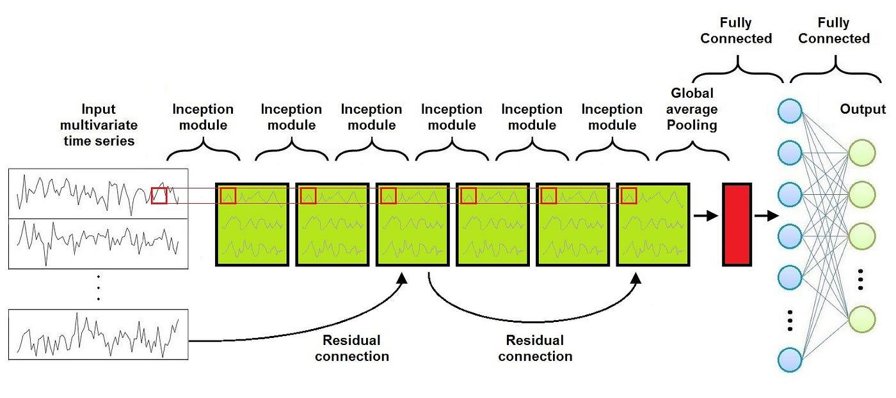

## Table of Contents

## What is a time series in the context of machine learning?

A time series in machine learning is a sequence of data points collected over time. These data points are usually taken at regular intervals, like every hour, day, or month. Time series data is common in many fields, such as finance, where stock prices are recorded daily, or in weather forecasting, where temperature is measured hourly. The key feature of time series data is that the order of the data points matters because it shows how things change over time.

In machine learning, time series data is used to make predictions about future events based on past patterns. For example, a model might use historical sales data to predict future sales. This is done by analyzing trends, seasonal patterns, and other time-related features in the data. Special techniques, like autoregressive models or moving averages, are often used to handle the unique challenges of time series data, such as autocorrelation, where data points are not independent of each other.

## Why are time series modules important in machine learning?

Time series modules are important in machine learning because they help us understand and predict how things change over time. Imagine you want to know how much it will rain tomorrow or how many people will visit your website next week. Time series modules use past data to make these predictions. They look at patterns and trends in the data, like how sales go up during holidays or how temperature changes with the seasons. By understanding these patterns, we can make better guesses about what will happen in the future.

These modules also handle special challenges that come with time series data. One big challenge is that data points in a time series are not independent; what happens today can affect what happens tomorrow. For example, if it's raining today, it's more likely to rain tomorrow. Time series modules use techniques like autoregressive models, which consider past values to predict future ones. They might use a formula like $$ y_t = \alpha + \beta y_{t-1} + \epsilon_t $$ to show how today's value depends on yesterday's. This helps make more accurate predictions by taking into account the way data points are connected over time.

## What is Temporal Distribution Characterization and how does it apply to time series data?

Temporal Distribution Characterization is a way to understand how data changes over time. It looks at things like how often data points come, how spread out they are, and if there are any patterns or trends. When we study time series data, we want to know if it follows a regular pattern, like going up and down every day or every year. This helps us make better predictions about what might happen next.

For example, if we are looking at daily temperatures, we might see that they go up in the summer and down in the winter. Temporal Distribution Characterization helps us describe this pattern so we can use it in our predictions. We might use a simple formula like $$ y_t = \mu + \epsilon_t $$ to show that the temperature today, $y_t$, is made up of an average temperature, $\mu$, plus some random change, $\epsilon_t$. By understanding these patterns and changes, we can better predict future temperatures or other time series data.

## How does Temporal Distribution Matching work in time series analysis?

Temporal Distribution Matching is a way to make sure that the pattern of how data comes over time in one set matches another set. Imagine you have two sets of data, like daily sales from two different stores. You want to see if the way sales change over time in one store is similar to the other. Temporal Distribution Matching helps you compare these patterns and make them look more alike if they are different.

To do this, you might look at things like the average sales, how much sales change from day to day, and if there are any regular patterns, like sales going up on weekends. If the patterns are different, you can adjust one set to match the other. For example, if one store has higher sales on average, you might use a formula like $$ y_t = \alpha \cdot x_t + \beta $$ to scale and shift the data from one store to match the other. By making the patterns more similar, you can better compare the two sets of data or use one set to predict the other.

## What are the common challenges faced when working with time series data?

Working with time series data can be tricky because the data points are not independent. What happens today can affect what happens tomorrow. This is called autocorrelation. For example, if it's raining today, it's more likely to rain tomorrow. This makes it hard to predict future values because you need to consider how past values influence the future. A common way to handle this is by using models like autoregressive models, which use a formula like $$ y_t = \alpha + \beta y_{t-1} + \epsilon_t $$ to show how today's value depends on yesterday's.

Another challenge is dealing with trends and seasonality. Trends are long-term changes in the data, like sales going up over the years. Seasonality means the data follows a repeating pattern, like sales going up every December. Both of these can make it hard to see the real pattern in the data. You might use techniques like differencing to remove trends or seasonal decomposition to separate the data into trend, seasonal, and random parts. This helps make the data easier to work with and predict.

Lastly, missing data and irregular time intervals can be a problem. If some data points are missing or if the data is not collected at regular times, it can mess up your predictions. You might need to fill in the missing data or adjust the data to make it regular. This can be done using methods like interpolation, where you estimate the missing values based on the values around them. Handling these challenges well is key to getting good results from time series analysis.

## Can you explain the difference between univariate and multivariate time series?

A univariate time series is when you have just one thing you're looking at over time. For example, if you're tracking the daily temperature in your city, that's a univariate time series because you're only looking at one variable, which is temperature. The goal is to understand how this single variable changes over time and maybe predict what it will do next. You might use a simple model like $$ y_t = \alpha + \beta y_{t-1} + \epsilon_t $$ to predict today's temperature based on yesterday's.

On the other hand, a multivariate time series is when you're looking at more than one thing at the same time. For instance, if you're tracking both the temperature and the humidity in your city, that's a multivariate time series because you're looking at two variables. The idea is to see how these variables interact with each other over time and how they might affect each other. You might use a more complex model that takes into account both temperature and humidity, like $$ y_{1,t} = \alpha_1 + \beta_1 y_{1,t-1} + \gamma_1 y_{2,t-1} + \epsilon_{1,t} $$ and $$ y_{2,t} = \alpha_2 + \beta_2 y_{2,t-1} + \gamma_2 y_{1,t-1} + \epsilon_{2,t} $$, where $y_{1,t}$ is today's temperature and $y_{2,t}$ is today's humidity.

## What are some popular algorithms used for time series forecasting?

One popular algorithm for time series forecasting is the Autoregressive Integrated Moving Average (ARIMA) model. ARIMA is great for data that has trends and seasonality. It works by looking at past values to predict future ones. For example, it might use a formula like $$ y_t = \alpha + \beta_1 y_{t-1} + \beta_2 y_{t-2} + \epsilon_t $$ to predict today's value based on the last two days. ARIMA can handle data that needs to be made stationary, which means removing trends and seasonality to make the data easier to predict. It's widely used in fields like finance and economics because it's good at dealing with the ups and downs in data over time.

Another common algorithm is the Exponential Smoothing (ES) method, which includes techniques like Simple Exponential Smoothing and Holt-Winters. These methods are good for data with a clear trend or seasonal pattern. Simple Exponential Smoothing might use a formula like $$ \hat{y}_{t+1} = \alpha y_t + (1 - \alpha) \hat{y}_t $$ to predict the next value by blending the last actual value with the last prediction. Holt-Winters adds in trend and seasonality, making it useful for data that has both. These methods are easy to understand and use, making them popular for quick forecasts in business and inventory management.

A more advanced approach is using [machine learning](/wiki/machine-learning) models like Long Short-Term Memory (LSTM) networks. LSTMs are a type of Recurrent Neural Network (RNN) that are good at remembering long-term patterns in data. They can handle complex relationships in time series data that simpler models might miss. For example, an LSTM might be used to predict stock prices by learning from historical price data and other factors like trading [volume](/wiki/volume-trading-strategy). While they can be more challenging to set up and train, LSTMs can provide very accurate forecasts when used correctly.

## How can one evaluate the performance of a time series model?

To evaluate how well a time series model is doing, you can use different ways to measure its accuracy. One common way is to look at the Mean Absolute Error (MAE). The MAE is the average of the absolute differences between what the model predicted and what actually happened. You can calculate it with the formula $$ \text{MAE} = \frac{1}{n} \sum_{i=1}^{n} |y_i - \hat{y}_i| $$, where $y_i$ is the actual value, $\hat{y}_i$ is the predicted value, and $n$ is the number of observations. A smaller MAE means the model is doing a better job at predicting. Another way is to use the Mean Squared Error (MSE), which squares the differences before averaging them. The MSE formula is $$ \text{MSE} = \frac{1}{n} \sum_{i=1}^{n} (y_i - \hat{y}_i)^2 $$. Squaring the errors makes bigger mistakes count more, so MSE can be useful if you want to penalize larger errors more heavily.

Another important measure is the Root Mean Squared Error (RMSE), which is just the square root of the MSE. The RMSE formula is $$ \text{RMSE} = \sqrt{\frac{1}{n} \sum_{i=1}^{n} (y_i - \hat{y}_i)^2} $$. RMSE is in the same units as the original data, which can make it easier to understand. You can also use the Mean Absolute Percentage Error (MAPE), which shows the average of the absolute percentage errors. The MAPE formula is $$ \text{MAPE} = \frac{1}{n} \sum_{i=1}^{n} \left| \frac{y_i - \hat{y}_i}{y_i} \right| \times 100\% $$. MAPE is good for comparing models across different datasets because it's a percentage. By using these measures, you can see how well your time series model is working and choose the best one for your needs.

## What role does feature engineering play in time series analysis?

Feature engineering is a big help in time series analysis. It's like making special clues from the data that help the model understand it better. For example, if you're looking at daily sales, you might create new clues like the day of the week or the month of the year. These clues can show patterns that the model can use to make better guesses about future sales. By adding these new clues, you're giving the model more information to work with, which can make its predictions more accurate.

One common way to create these clues is by using lag features. A lag feature is just a past value of the same thing you're looking at. For example, if you're predicting today's sales, you might use yesterday's sales as a clue. You can use a formula like $$ y_t = \alpha + \beta y_{t-1} + \epsilon_t $$ to show how today's sales depend on yesterday's. Another way is to use rolling [statistics](/wiki/bayesian-statistics), like the average sales over the last week or the highest sales in the last month. These can help the model see trends and patterns over time. By using feature engineering, you're making the data easier for the model to understand and use, which can lead to better predictions.

## How do you handle missing or irregularly spaced data in time series?

When working with time series data, you might run into missing values or data that isn't collected at regular times. Missing data can mess up your predictions because the model needs all the information to work well. One way to fix this is by using a method called interpolation. Interpolation is like guessing the missing values based on the values around them. For example, if you know the temperature was 20 degrees yesterday and 22 degrees tomorrow, you might guess it was 21 degrees today. You can use a simple formula like $$ y_t = \frac{y_{t-1} + y_{t+1}}{2} $$ to fill in the missing value with the average of the values before and after it.

Irregularly spaced data can also be a problem because many time series models expect the data to come at regular intervals. To handle this, you can use a technique called resampling. Resampling means changing the data so it fits a regular pattern. For example, if you have temperature readings taken at different times each day, you might decide to use only the readings taken at noon. You can do this in Python using the `resample` function from the pandas library:

```python
import pandas as pd

# Assume 'df' is your DataFrame with a datetime index and a 'temperature' column
df_resampled = df.resample('D').mean()  # Resample to daily frequency using the mean
```

By using these methods, you can make your time series data more complete and regular, which helps your models work better and give more accurate predictions.

## What advanced techniques can be used to improve the accuracy of time series predictions?

One advanced technique to improve the accuracy of time series predictions is using ensemble methods. Ensemble methods combine the predictions from multiple models to get a better overall prediction. For example, you might use both an ARIMA model and an LSTM model, then average their predictions. This can help because different models might be good at catching different patterns in the data. By combining them, you can get a more accurate prediction. You can do this in Python using the `VotingRegressor` from the scikit-learn library:

```python
from sklearn.ensemble import VotingRegressor
from statsmodels.tsa.arima.model import ARIMA
from tensorflow.keras.models import Sequential
from tensorflow.keras.layers import LSTM, Dense

# Assume 'train_data' is your training data
arima_model = ARIMA(train_data, order=(1, 1, 1)).fit()
lstm_model = Sequential([LSTM(50, input_shape=(train_data.shape[1], 1)), Dense(1)])
lstm_model.compile(optimizer='adam', loss='mse')
lstm_model.fit(train_data, epochs=100)

ensemble = VotingRegressor(estimators=[('arima', arima_model), ('lstm', lstm_model)])
ensemble.fit(train_data)
```

Another advanced technique is using machine learning models like Gradient Boosting Machines (GBMs) or Random Forests. These models can handle complex patterns in the data that simpler models might miss. For example, a GBM can learn how different features like the day of the week or the month of the year affect the prediction. You might use a formula like $$ y_t = f(x_t, x_{t-1}, \ldots, x_{t-n}) $$ to show that today's prediction depends on past values and other features. By using these advanced models, you can often get more accurate predictions, especially if your data has a lot of different patterns and trends.

## How can time series modules be integrated into larger machine learning systems for real-time applications?

Integrating time series modules into larger machine learning systems for real-time applications involves setting up a pipeline that can handle data as it comes in. Imagine you're tracking the number of visitors to a website every minute. You need a system that can take this new data, use it to update your time series model, and then make a prediction about the next minute's visitors. This can be done by using a streaming data platform like Apache Kafka to collect and process the data in real-time. Once the data is processed, you can feed it into your time series model, like an ARIMA or LSTM, to make predictions. For example, you might use a formula like $$ y_t = \alpha + \beta y_{t-1} + \epsilon_t $$ to predict the number of visitors based on the last minute's data.

To make this work smoothly, you need to ensure that your system can handle the data quickly and accurately. This might involve using a cloud service like AWS or Google Cloud to manage the computational load. You can set up a script that runs every minute to update your model and make predictions. Here's a simple example of how you might do this in Python using the `pandas` library for data handling and a hypothetical `ARIMA` model for prediction:

```python
import pandas as pd
from statsmodels.tsa.arima.model import ARIMA

# Assume 'new_data' is the new data point coming in every minute
new_data = pd.DataFrame({'visitors': [new_visitor_count]}, index=[current_time])

# Load the existing time series data
existing_data = pd.read_csv('existing_data.csv', index_col='time', parse_dates=True)

# Append the new data to the existing data
updated_data = existing_data.append(new_data)

# Fit the ARIMA model
model = ARIMA(updated_data, order=(1, 1, 1)).fit()

# Make a prediction for the next minute
next_minute_prediction = model.forecast(steps=1)

# Save the updated data and the prediction
updated_data.to_csv('existing_data.csv')
print(f"Prediction for next minute: {next_minute_prediction}")
```

By setting up such a system, you can keep your time series model updated and make real-time predictions that are useful for applications like website traffic management or stock price forecasting.

## References & Further Reading

[1]: Brockwell, P. J., & Davis, R. A. (2002). ["Introduction to Time Series and Forecasting"](https://link.springer.com/book/10.1007/978-3-319-29854-2). Springer.

[2]: Hyndman, R. J., & Athanasopoulos, G. (2018). ["Forecasting: Principles and Practice"](https://otexts.com/fpp2/). OTexts.

[3]: Hamilton, J. D. (1994). ["Time Series Analysis"](https://api.pageplace.de/preview/DT0400.9780691218632_A40156688/preview-9780691218632_A40156688.pdf). Princeton University Press.

[4]: Box, G. E. P., Jenkins, G. M., & Reinsel, G. C. (2015). ["Time Series Analysis: Forecasting and Control"](https://onlinelibrary.wiley.com/doi/book/10.1002/9781118619193). Wiley.

[5]: Zhang, G. P. (2003). ["Time series forecasting using a hybrid ARIMA and neural network model."](https://www.sciencedirect.com/science/article/pii/S0925231201007020) Neurocomputing, 50, 159-175.