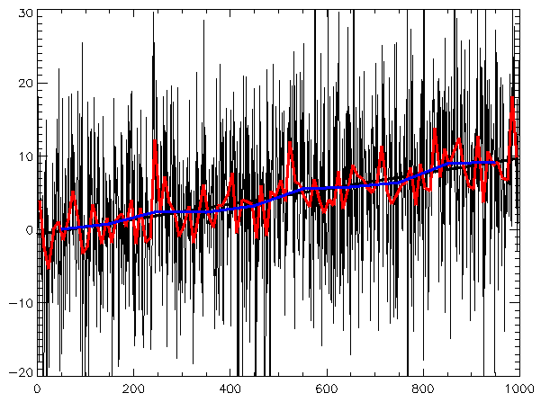

## Table of Contents

## What is a time series?

A time series is a set of data points collected over time. These data points are usually taken at regular time intervals, like every day, every month, or every year. Time series data is used in many fields, such as finance, weather forecasting, and economics. For example, the daily temperature in a city or the monthly sales of a store are both time series.

Time series data is important because it helps us see patterns and trends over time. By looking at the data, we can understand how things change and make predictions about the future. For instance, if we see that sales go up every December, we can predict that next December will likely be busy too. This kind of information is very useful for making plans and decisions.

## What are the common applications of time series analysis?

Time series analysis is used in many areas to understand how things change over time and to make predictions. In finance, people use it to look at stock prices, interest rates, and other money-related data. By studying these time series, they can try to predict future prices and make better investment choices. For example, if a stock's price goes up every time a certain event happens, investors might buy that stock when they see the event coming again.

In weather forecasting, time series analysis helps predict future weather by looking at past weather data. Meteorologists use it to see patterns in temperature, rainfall, and other weather factors. This helps them give accurate weather reports and warnings about storms or other dangerous weather. For instance, if they see that heavy rain often follows a certain temperature pattern, they can warn people to prepare for possible flooding.

Economists also use time series analysis to study things like unemployment rates, inflation, and economic growth. By looking at these data over time, they can understand how the economy is doing and make forecasts about the future. This information is important for governments and businesses to plan their actions. For example, if the data shows that unemployment is going up, the government might start programs to help people find jobs.

## How do you collect time series data?

Collecting time series data means gathering information at regular times. You can do this by using machines like sensors or computers. For example, a weather station might record the temperature every hour. In businesses, they might use cash registers to keep track of sales every day. People can also collect this data by hand, like writing down how many customers come into a store each day.

Once you start collecting, it's important to keep doing it the same way every time. This means using the same tools and methods so the data stays accurate. If you change how you collect the data, it might not be useful anymore. For example, if you switch from one type of thermometer to another, the temperature readings might be different, and that could mess up your time series. So, sticking to the same routine is key to getting good time series data.

## What is the difference between time series and cross-sectional data?

Time series data and cross-sectional data are two different ways to collect and look at information. Time series data is all about tracking the same thing over time. For example, if you want to know how the temperature changes in a city, you would record the temperature every day for a year. This helps you see patterns and trends over time, like how the temperature goes up in the summer and down in the winter.

Cross-sectional data, on the other hand, is about looking at different things at the same time. Imagine you want to know the average height of students in different schools on the same day. You would go to each school and measure the height of students at that moment. This type of data helps you compare different groups or places at one point in time, but it doesn't show you how things change over time. So, while time series data focuses on changes over time, cross-sectional data focuses on differences across different groups or places at a single moment.

## What are the main components of a time series?

A time series has four main parts: trend, seasonality, cycle, and irregularity. The trend is the long-term movement in the data, like how sales might go up over many years as a company grows. Seasonality is the regular pattern that happens at the same time each year, like more ice cream sales in summer. A cycle is a longer pattern that doesn't happen at the same time each year, like how the economy might go up and down over several years. Irregularity is the random changes that don't fit into the other parts, like a sudden drop in sales because of a storm.

These parts help us understand what's going on in the time series. By looking at the trend, we can see if things are getting better or worse over time. Seasonality helps us plan for the regular ups and downs, like stocking up on winter clothes before the cold months. Cycles can be trickier to predict, but knowing they exist can help us be ready for changes. And even though irregularities are hard to predict, knowing they can happen helps us be ready for surprises. Together, these parts give us a full picture of what's happening in the data.

## How do you visualize time series data?

To visualize time series data, you can use a line chart. This is a simple and effective way to show how data changes over time. You put time on the bottom of the chart, and the values of your data go up the side. Then, you draw a line that connects the data points. This line helps you see patterns and trends easily. For example, if you're looking at daily temperatures, you can see how the temperature goes up and down over the days and weeks.

Another way to visualize time series data is with a bar chart. In a bar chart, each bar represents a time period, like a day or a month, and the height of the bar shows the value of the data for that time. This can be helpful if you want to compare different time periods side by side. For instance, if you're looking at monthly sales, you can quickly see which months had the highest and lowest sales. Both line charts and bar charts are great tools for understanding time series data and spotting important changes and patterns.

## What are some basic methods for time series forecasting?

One basic method for time series forecasting is using moving averages. This means you take the average of the data over a certain time period, like the last three months, and use that average to predict what will happen next. For example, if you want to guess next month's sales, you could look at the average sales of the last three months. Moving averages help smooth out short-term ups and downs in the data, making it easier to see the bigger trends.

Another simple method is exponential smoothing. This method gives more weight to recent data points, so it reacts faster to changes than moving averages. For instance, if sales suddenly go up, exponential smoothing will notice this change quicker and use it to make a better prediction for the next period. This method is good when you want your forecasts to quickly adapt to new information.

A third basic method is trend projection. This involves looking at the long-term direction of the data and using that trend to make forecasts. For example, if sales have been going up by 5% every year, you might predict that next year's sales will also go up by 5%. Trend projection works well when the data has a clear and steady trend over time, helping you make long-term predictions based on that pattern.

## What is stationarity and why is it important in time series analysis?

Stationarity in time series means that the data's properties, like its mean and variance, stay the same over time. If a time series is stationary, it means that the patterns you see in the data don't change as time goes on. For example, if you're looking at daily temperatures, a stationary series would have the same average temperature and the same amount of ups and downs every day, no matter which part of the year you look at.

Stationarity is important in time series analysis because many forecasting methods work better when the data is stationary. If the data is not stationary, it can be hard to make good predictions because the patterns keep changing. By making the data stationary, you can use simpler and more reliable methods to forecast future values. For instance, if you're trying to predict sales, it's easier to do if the sales data has a steady pattern over time.

## How do you test for stationarity in a time series?

To test if a time series is stationary, you can use a few different methods. One common way is to use a statistical test called the Augmented Dickey-Fuller (ADF) test. This test checks if there's a unit root in the data, which means the data is not stationary. If the ADF test gives you a small p-value, it means you can reject the idea that there's a unit root, and the data is likely stationary. Another way to check for stationarity is by looking at the data yourself. You can plot the time series and see if the average and the ups and downs seem to stay the same over time.

Another method to test for stationarity is to use the KPSS test, which is the opposite of the ADF test. The KPSS test checks if the data is trend-stationary, meaning it has a trend but the changes around that trend are stationary. If the KPSS test gives a small p-value, it means the data is not stationary. You can also use visual tools like a correlogram, which shows how the data points are related to each other over time. If the correlations drop off quickly, it's a sign that the data might be stationary. By using these tests and visual checks, you can figure out if your time series is stationary and choose the right methods for your analysis.

## What are ARIMA models and how are they used in time series forecasting?

ARIMA models, which stand for AutoRegressive Integrated Moving Average, are a popular way to forecast time series data. They work by using past values of the data to predict what will happen next. An ARIMA model has three parts: the AR part looks at how past values affect the current value, the I part deals with making the data stationary by differencing, and the MA part looks at the errors in past predictions to improve future ones. You choose the right ARIMA model by [picking](/wiki/asset-class-picking) numbers for these three parts, like ARIMA(1,1,1), which means one autoregressive term, one differencing step, and one moving average term.

ARIMA models are useful because they can handle a lot of different patterns in time series data. For example, if you want to predict next month's sales, you can use an ARIMA model to look at past sales and make a good guess. First, you need to make sure your data is stationary, which might mean taking differences between values. Then, you fit the ARIMA model to your data and use it to make forecasts. ARIMA models are flexible and can be adjusted to fit different kinds of time series, making them a powerful tool for anyone trying to predict the future based on past data.

## How can machine learning improve time series forecasting?

Machine learning can make time series forecasting better by finding patterns in the data that are hard for people to see. It uses special math to learn from past data and then guess what will happen next. For example, machine learning can look at lots of different things at the same time, like the weather, holidays, and past sales, to predict how many ice creams a store might sell. This is better than just looking at past sales alone because it takes into account more information. By using machine learning, businesses can make more accurate guesses about the future and plan better.

Another way machine learning helps is by adapting to new information quickly. If something changes, like a new trend in what people are buying, machine learning can notice this change and start using it to make better predictions right away. This is different from older methods that might not change as fast. For instance, if a new type of phone becomes popular, machine learning can start predicting higher sales for that phone model without needing someone to change the model by hand. This makes time series forecasting more flexible and useful for making decisions in a world where things are always changing.

## What advanced techniques exist for modeling complex time series data?

One advanced technique for modeling complex time series data is using Long Short-Term Memory (LSTM) networks, a type of recurrent [neural network](/wiki/neural-network). LSTMs are good at remembering patterns over long periods of time, which is helpful for time series data that has long-term trends and seasonality. For example, if you want to predict the price of a stock, an LSTM can look at past prices over many months or years and find patterns that other methods might miss. By learning from this data, LSTMs can make better guesses about what will happen next, even if the patterns are hard to see.

Another technique is using Prophet, a tool made by Facebook that is good at handling time series with multiple seasonal patterns and holidays. Prophet can deal with data that has daily, weekly, and yearly patterns all at once, which is common in things like sales or website traffic. It also lets you add in special events, like big sales days or holidays, to make the predictions more accurate. By using Prophet, you can model complex time series data in a way that takes into account all the different things that might affect it, making your forecasts more reliable and useful for planning.

## What are the techniques and models used in time series analysis?

Time series analysis is fundamental in [algorithmic trading](/wiki/algorithmic-trading), offering a variety of techniques and models to capture and predict market dynamics. Among the most traditional methods are the Autoregressive Integrated Moving Average (ARIMA) and Generalized Autoregressive Conditional Heteroskedasticity (GARCH) models. ARIMA is particularly useful for modeling time series data by capturing linear trends and patterns through differencing to induce stationarity, then applying autoregressive and moving average components. In mathematical terms, an ARIMA model of order $(p, d, q)$ is given by the equation:

$$

Y_t = c + \phi_1 Y_{t-1} + \phi_2 Y_{t-2} + \ldots + \phi_p Y_{t-p} + \varepsilon_t + \theta_1 \varepsilon_{t-1} + \theta_2 \varepsilon_{t-2} + \ldots + \theta_q \varepsilon_{t-q} 
$$

where $Y_t$ is the value at time $t$, $c$ is a constant, $\phi$ and $\theta$ are the parameters of the autoregressive and moving average parts respectively, and $\varepsilon_t$ is the error term.

GARCH models, on the other hand, are indispensable in financial time series to model and forecast [volatility](/wiki/volatility-trading-strategies). By accounting for time-varying volatility clustering, GARCH can provide estimates for periods of high volatility, essential for risk management in trading. The GARCH($p, q$) model is generally expressed by:

$$

\sigma_t^2 = \alpha_0 + \alpha_1 \varepsilon_{t-1}^2 + \ldots + \alpha_p \varepsilon_{t-p}^2 + \beta_1 \sigma_{t-1}^2 + \ldots + \beta_q \sigma_{t-q}^2 
$$

where $\sigma_t^2$ is the conditional variance at time $t$.

The introduction of [machine learning](/wiki/machine-learning) has further evolved time series analysis with models like Long Short-Term Memory (LSTM) and Gated Recurrent Units (GRU), which are a subset of recurrent neural networks (RNNs). These models excel at capturing long-term dependencies in data sequences, thanks to their ability to maintain information over long sequences. LSTMs, for instance, achieve this by using memory cells and gates to regulate the flow of information, a crucial advantage for complex datasets permeated by non-linear patterns.

GRU, as an alternative to LSTM, offers a simpler architecture with fewer parameters, enabling faster computation while still maintaining performance. Both LSTM and GRU have demonstrated superior predictive performance over traditional models in numerous time series forecasting tasks.

When selecting a model for time series analysis, considering the data characteristics and trading strategy objectives is crucial. Models must align with the data’s statistical properties, such as stationarity and seasonality, and the specific requirements of the trader's strategy, be it short-term trading or long-term investment. The choice between traditional models and machine learning approaches often hinges on the simplicity of application versus the potential gains in predictive accuracy achieved through [deep learning](/wiki/deep-learning) techniques.

Pseudocode for implementing an LSTM model using Python and the TensorFlow library showcases how these models are realized in practice:

```python
import tensorflow as tf
from tensorflow.keras.models import Sequential
from tensorflow.keras.layers import LSTM, Dense, Dropout

# Define the LSTM model
model = Sequential()
model.add(LSTM(units=50, return_sequences=True, input_shape=(X_train.shape[1], 1)))
model.add(Dropout(0.2))
model.add(LSTM(units=50, return_sequences=False))
model.add(Dropout(0.2))
model.add(Dense(units=1))

model.compile(optimizer='adam', loss='mean_squared_error')
model.fit(X_train, y_train, epochs=100, batch_size=32)
```

In conclusion, the selection and application of time series models, whether ARIMA, GARCH, or advanced neural networks like LSTM and GRU, are instrumental for constructing efficient algorithmic trading strategies.

## References & Further Reading

[1]: Hyndman, R. J., & Athanasopoulos, G. (2018). ["Forecasting: Principles and Practice."](https://otexts.com/fpp2/) OTexts.

[2]: Box, G. E., Jenkins, G. M., Reinsel, G. C., & Ljung, G. M. (2015). ["Time Series Analysis: Forecasting and Control."](https://onlinelibrary.wiley.com/doi/book/10.1002/9781118619193) John Wiley & Sons.

[3]: Tsay, R. S. (2005). ["Analysis of Financial Time Series."](https://onlinelibrary.wiley.com/doi/book/10.1002/9780470644560) John Wiley & Sons.

[4]: Engle, R. F., & Bollerslev, T. (1986). ["Modelling the Persistence of Conditional Variances."](https://www.tandfonline.com/doi/abs/10.1080/07474938608800095)90094-8) Econometric Reviews.

[5]: Brockwell, P. J., & Davis, R. A. (2016). ["Introduction to Time Series and Forecasting."](https://link.springer.com/book/10.1007/978-3-319-29854-2) Springer.

[6]: Bauwens, L., Laurent, S., & Rombouts, J. V. K. (2006). ["Multivariate GARCH models: A survey."](https://onlinelibrary.wiley.com/doi/pdf/10.1002/jae.842) Journal of Applied Econometrics.

[7]: Patterson, D. W. (1996). ["Artificial Neural Networks: Theory and Applications."](https://www.semanticscholar.org/paper/Artificial-Neural-Networks%3A-Theory-and-Applications-Patterson/fc97b0cf3fe34e41d9073f2da1c44daa7bcb036c) Prentice Hall.