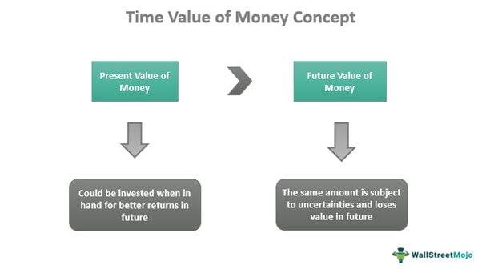

## Table of Contents

## What is the concept of time value in financial markets?

The concept of time value in financial markets is about how the value of money changes over time. It says that a dollar today is worth more than a dollar in the future. This is because you can invest that dollar today and earn interest on it. So, the sooner you get money, the more valuable it is because you can use it or invest it sooner.

In financial markets, this idea is used to compare investment options. For example, if you are deciding between getting $100 now or $100 a year from now, you would choose to get it now because you could invest that $100 and earn interest on it. The time value of money helps investors understand that the timing of cash flows is important when making financial decisions.

## How does time value affect the pricing of financial instruments?

Time value plays a big role in how financial instruments like stocks, bonds, and options are priced. For example, when you buy a bond, you are basically lending money to the issuer, and they promise to pay you back with interest over time. The price of the bond will depend on how much interest you will get and when you will get it. If interest rates go up, new bonds will offer higher interest, making older bonds with lower interest less valuable. This is because investors can get a better return on their money with the new bonds.

Options are another example where time value is important. An option gives you the right to buy or sell an asset at a certain price before a specific date. The longer you have until the option expires, the more valuable it is because there's more time for the price of the asset to move in your favor. As the expiration date gets closer, the time value of the option decreases. This is why options are often cheaper as they get closer to expiring, even if the price of the underlying asset hasn't changed.

## Can you explain the difference between time value and intrinsic value?

Time value and intrinsic value are two important concepts in finance, especially when it comes to options. Intrinsic value is the actual value of an option if you were to exercise it right now. For a call option, it's how much the current price of the stock is above the strike price. For a put option, it's how much the current price of the stock is below the strike price. If exercising the option wouldn't give you any profit, then the intrinsic value is zero.

Time value, on the other hand, is the extra value of an option that comes from the time left until it expires. Even if an option has no intrinsic value right now, it might still be worth something because there's still time for the stock price to move in a way that makes the option profitable. The more time left until the option expires, the higher the time value, because there's more chance for the stock price to change. As the expiration date gets closer, the time value goes down, and the option's price gets closer to its intrinsic value.

## What role does time value play in options trading?

In options trading, time value is really important because it affects how much an option costs. Think of time value as the price you pay for the chance that the stock price will move in your favor before the option expires. The more time left until the option expires, the more time value it has. This is because there's more time for the stock to go up or down, making your option worth more. So, if you buy an option with a lot of time left, you'll pay more for it because of this time value.

As the expiration date of the option gets closer, the time value starts to go down. This means the option becomes less expensive, even if the stock price hasn't changed. Traders need to think about this when they buy or sell options. If you think the stock price will move a lot soon, you might want to buy an option with less time left to save money on time value. But if you're not sure when the stock will move, you might choose an option with more time left, even though it costs more.

## How does the time to expiration impact the time value of an option?

The time to expiration has a big impact on the time value of an option. The more time left until the option expires, the more time value it has. This is because there's more time for the stock price to move in a way that makes the option worth more. Imagine you're betting on a horse race. If you have a long time before the race starts, you might be willing to pay more for your bet because there's more time for things to change in your favor. So, an option that expires in six months will have more time value than one that expires in one month.

As the expiration date of the option gets closer, the time value starts to go down. This is because there's less time left for the stock price to move in a way that makes the option more valuable. It's like the last few minutes of that horse race. The longer you wait, the less likely it is that something big will happen to change the outcome. So, the price of the option gets closer to its intrinsic value, which is what it would be worth if you exercised it right now. This is why options traders need to think carefully about how much time they want left on their options, because it can make a big difference in what they pay or get for them.

## What are the factors that influence the time value of money in financial markets?

The time value of money in financial markets is influenced by several key factors. One big factor is interest rates. When interest rates are high, the time value of money goes up because you can earn more by investing your money now. On the other hand, when interest rates are low, the time value of money goes down because you won't earn as much from investing. Another factor is inflation. If prices are going up fast, the value of money today is higher because it can buy more than it will in the future. So, people want to get their money sooner to spend it before it loses value.

Another important factor is risk. If there's a lot of uncertainty in the market, people might want their money sooner because they're not sure what will happen in the future. This can make the time value of money higher. Also, the length of time matters. The longer you have to wait to get your money, the less valuable it is because you can't use it or invest it right away. So, the time value of money is affected by how long you have to wait, the interest rates, inflation, and the level of risk in the market.

## How can investors use the concept of time value to make better investment decisions?

Investors can use the concept of time value to make better investment decisions by understanding that money today is worth more than the same amount of money in the future. This means they should look for investments that give them returns sooner rather than later. For example, if an investor has a choice between two investments that offer the same total return, but one gives the money back in one year and the other in five years, the investor should choose the one-year investment. This is because they can take the money they get back after one year and invest it again, earning even more money.

Another way investors can use the time value of money is by considering the impact of interest rates and inflation on their investments. If interest rates are high, it's a good idea to invest in things that give you money back quickly so you can take advantage of those high rates. On the other hand, if inflation is high, investors should try to get their money back as soon as possible because the value of money will go down over time. By thinking about these factors, investors can choose investments that will give them the best return for their money, taking into account when they will get it back.

## What mathematical models are used to calculate time value in financial markets?

In financial markets, one common way to calculate the time value of money is by using the present value formula. This formula helps figure out how much money you would need today to get a certain amount of money in the future. It takes into account the interest rate and the time until you get the money. For example, if you want to know how much $100 in one year is worth today at a 5% interest rate, you would use the present value formula to find out that it's worth about $95.24 today. This shows that getting $100 in one year is the same as getting about $95.24 now if you can invest it at 5%.

Another important model is the future value formula, which helps you figure out how much money you will have in the future if you invest a certain amount today. This formula also uses the interest rate and the time until you get the money. For example, if you invest $100 today at a 5% interest rate for one year, the future value formula will tell you that you will have about $105 in one year. These formulas help investors understand the time value of money and make better decisions about when to get their money and how to invest it.

## How does volatility affect the time value of options?

Volatility plays a big role in how much an option is worth, especially its time value. Time value is the extra money you pay for an option because there's still time for the stock price to move in a way that makes the option worth more. When the stock price is more likely to move a lot, that's called high volatility. If the stock is very volatile, the time value of the option goes up. This is because there's a bigger chance the stock price will move in your favor before the option expires. So, if you think the stock price will be all over the place, you might have to pay more for the option because of this higher time value.

On the other hand, if the stock price is not expected to move much, that's called low volatility. When the stock is less volatile, the time value of the option goes down. This is because there's less chance the stock price will change a lot before the option expires. So, options on stocks that don't move around as much will usually be cheaper, even if they have the same amount of time left until they expire. Understanding how volatility affects time value can help traders decide when to buy or sell options and how much they should pay for them.

## Can you discuss the impact of interest rates on the time value of financial instruments?

Interest rates have a big impact on the time value of financial instruments like bonds and options. When interest rates go up, the time value of money also goes up. This means that money today is worth more because you can invest it and earn more interest. For example, if you buy a bond when interest rates are high, the bond will be worth less in the future because new bonds will offer higher interest rates. So, people will pay less for your bond because they can get a better return on their money with the new bonds. This is why bond prices usually go down when interest rates go up.

The same idea applies to options. When interest rates are high, the time value of options goes up. This is because the cost of holding onto the option until it expires is higher. If you buy a call option, you're giving up the chance to invest your money at the high interest rate. So, the option needs to be worth more to make up for this lost opportunity. On the other hand, when interest rates are low, the time value of options goes down because the cost of holding onto them is lower. Understanding how interest rates affect the time value of financial instruments can help investors make better decisions about when to buy or sell them.

## What are some advanced strategies that utilize the time value in financial markets?

One advanced strategy that uses the time value in financial markets is called a covered call. In this strategy, you own a stock and sell a call option on that stock. The call option gives someone else the right to buy your stock at a certain price before a certain date. You get money from selling the option, which is the time value because it's based on how much time is left until the option expires. If the stock price doesn't go up much, you keep the money from selling the option and still have your stock. But if the stock price goes way up, the person who bought the option might want to buy your stock, and you'll have to sell it to them at the lower price. So, you need to think about the time value and how likely the stock price is to go up when you use this strategy.

Another strategy is called a calendar spread. This is when you buy and sell options on the same stock but with different expiration dates. For example, you might buy a call option that expires in three months and sell a call option that expires in one month. The difference in the time value of these options can make you money. If the stock price stays the same or doesn't move much, the option you sold will lose its time value faster than the option you bought. So, you can make money from the difference in time value. But if the stock price moves a lot, this strategy can lose money. So, you need to think about how the stock price might change and how that will affect the time value of the options.

## How do market expectations and economic forecasts influence the time value of financial assets?

Market expectations and economic forecasts can really change how much people think money today is worth compared to money in the future, which is what we call the time value of money. If people think the economy will do well, they might expect interest rates to go up. When interest rates are high, money today becomes more valuable because you can invest it and make more money. So, if everyone thinks the economy will grow, they might want to get their money back sooner to take advantage of those high interest rates. This can make the time value of financial assets like bonds go up because people are willing to pay more for them now, expecting to get a better return on their money.

On the other hand, if people think the economy might not do so well, they might expect interest rates to stay low or even go down. When interest rates are low, the time value of money goes down because you won't make as much from investing. So, if everyone thinks the economy will struggle, they might not be in a hurry to get their money back because they won't be able to earn much by investing it. This can make the time value of financial assets like bonds go down because people are less willing to pay a lot for them now, knowing they won't get a good return on their money in the future. Understanding these market expectations and economic forecasts can help investors decide when to buy or sell financial assets based on the time value of money.

## What is the process of decoding extrinsic value?

Extrinsic value plays a crucial role in the pricing of options and other financial derivatives. It is the portion of an option's premium that exceeds its intrinsic value. Mathematically, for a call option, the premium can be expressed as:

$$
\text{Option Premium} = \text{Intrinsic Value} + \text{Extrinsic Value}
$$

Intrinsic value is determined by the difference between the underlying asset's current price and the option's strike price. An option has intrinsic value when it is "in-the-money" (ITM)—for call options, this occurs when the asset price is above the strike price, and for put options, when it is below. For example, if a call option has a strike price of $50 and the underlying stock is trading at $55, the intrinsic value is $5.

In contrast, extrinsic value embodies the uncertainty and time potential up to the option's expiration. It reflects the possibility of the option becoming ITM before expiration, even if it currently is "out-of-the-money" (OTM) or "at-the-money" (ATM). Extrinsic value is comprised of two main components: time value and implied [volatility](/wiki/volatility-trading-strategies).

Market volatility, often measured by implied volatility, significantly influences extrinsic value. Options with higher implied volatility are perceived as riskier, warranting a higher extrinsic value due to the larger predicted movements in the underlying asset. Time decay, known as theta, also affects extrinsic value. As an option approaches expiration, its extrinsic value diminishes due to time decay, because there is less time for the underlying asset to move into a profitable price range for the option holder.

Extrinsic value's importance in options trading strategies centers around these components. Traders and investors often look to capitalize on the erosion of extrinsic value through strategies like writing covered calls or selling naked options, which benefit from time decay. Conversely, purchasing options with high extrinsic value can offer substantial leverage, but requires astute market predictions to offset the premium paid.

Investors assess extrinsic value when evaluating risk and potential returns as it provides insights into market sentiment and expectations for future volatility. A high extrinsic value may indicate that the market anticipates significant price movements in the underlying asset, offering potential trading opportunities. Traders might target options with favorable extrinsic value characteristics when constructing portfolios or hedging positions, balancing the cost of the premium against the probability of favorable price movements.

In summary, extrinsic value is a dynamic component of derivative pricing that affects trading decisions and risk management. Understanding its interplay with market conditions, intrinsic value, and time decay is essential for formulating effective options trading strategies and maximizing potential returns.

## References & Further Reading

[1]: Hull, J. C. (2017). ["Options, Futures, and Other Derivatives."](https://www.semanticscholar.org/paper/Options%2C-Futures%2C-and-Other-Derivatives-Hull/89bdee500c8623864fc9eb7a471546aa713acc44) Pearson.

[2]: Chan, E. P. (2013). ["Algorithmic Trading: Winning Strategies and Their Rationale."](https://github.com/ftvision/quant_trading_echan_book) John Wiley & Sons.

[3]: Lopez de Prado, M. (2018). ["Advances in Financial Machine Learning."](https://www.amazon.com/Advances-Financial-Machine-Learning-Marcos/dp/1119482089) Wiley.

[4]: Shiller, R. J. (2003). ["Coursera: Financial Markets."](https://www.aeaweb.org/articles?id=10.1257/089533003321164967) Yale University Online Course.

[5]: Jansen, S. (2020). ["Machine Learning for Algorithmic Trading."](https://github.com/stefan-jansen/machine-learning-for-trading) Packt Publishing.

[6]: Aronson, D. (2007). ["Evidence-Based Technical Analysis: Applying the Scientific Method and Statistical Inference to Trading Signals."](https://www.amazon.com/Evidence-Based-Technical-Analysis-Scientific-Statistical/dp/0470008741) John Wiley & Sons.