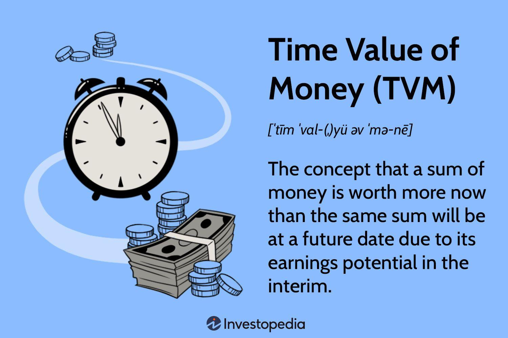

## Table of Contents

## What is the time value of money?

The time value of money is a basic idea in finance that says money today is worth more than the same amount of money in the future. This is because money can earn interest over time. For example, if you have $100 today and you put it in a bank that gives you 5% interest each year, after one year you will have $105. So, getting money now is better than getting it later because you can use it or invest it right away.

This concept is important for making decisions about investments, loans, and savings. When people or businesses look at different financial choices, they use the time value of money to see which option is best. For example, if you are thinking about taking a loan, you need to think about how much you will have to pay back in the future. The time value of money helps you understand if the loan is a good deal or not. It's a key part of planning for the future and making smart money choices.

## Why is the time value of money important in financial planning?

The time value of money is really important in financial planning because it helps you understand that money now is worth more than the same amount of money later. This is because you can use the money you have now to invest or save, and it can grow over time. For example, if you get $1,000 today, you can put it in a savings account or invest it in stocks, and it will be worth more in the future. This idea helps you make better choices about when to spend, save, or invest your money.

When you're making a financial plan, the time value of money helps you figure out how much you need to save for the future. Let's say you want to buy a house in 10 years. You need to know how much money you'll need then, and how much you need to save now to reach that goal. By understanding the time value of money, you can calculate how much to put aside each month so that, with interest, you'll have enough when you're ready to buy. It's like a tool that helps you plan ahead and make sure you're ready for big expenses down the road.

## How does inflation affect the time value of money?

Inflation is when the prices of things go up over time. This means that the money you have today will buy less stuff in the future. So, inflation makes the time value of money even more important. If you have $100 today and inflation is 2% a year, in a year, the same $100 will only buy things that cost $98 today. This shows that money loses value over time because of inflation.

Because of inflation, it's a good idea to invest or save your money instead of keeping it as cash. When you invest, you can earn more money than the rate of inflation, which means your money keeps its value or even grows. For example, if you invest your $100 and earn more than 2% a year, your money will be worth more in the future, even after accounting for inflation. So, understanding inflation helps you make smart choices about what to do with your money to keep its value over time.

## What is future worth and how is it calculated?

Future worth, or future value, is what your money will be worth at a certain time in the future if it grows at a certain rate. Imagine you put money in a bank account that gives you interest. Over time, your money will grow because of the interest you earn. Future worth helps you figure out how much your money will be worth after a certain number of years.

To calculate future worth, you need to know three things: the amount of money you start with, the interest rate, and how many years you're looking into the future. You can use a simple formula to find out the future worth. The formula is: Future Worth = Present Value x (1 + Interest Rate)^Number of Years. For example, if you have $1,000 now and the interest rate is 5% a year, after 10 years, your money will be worth $1,000 x (1 + 0.05)^10 = $1,628.89. This formula helps you plan for the future by showing you how much your money can grow over time.

## Can you explain the difference between present value and future value?

Present value and future value are two important ideas in finance that help you understand how money changes over time. Present value is what money is worth right now. It's like asking, "How much is a certain amount of money worth today?" For example, if someone promises to give you $100 in a year, the present value of that $100 is less than $100 today because you could invest the money now and it would grow over time.

Future value, on the other hand, is what money will be worth at some point in the future. It's like asking, "How much will my money be worth if I invest it for a certain number of years?" For example, if you put $100 in a bank account that gives you 5% interest each year, after one year, the future value of that $100 will be $105. So, future value helps you see how much your money can grow if you save or invest it over time.

## What role do interest rates play in the time value of money?

Interest rates are really important when it comes to the time value of money. They tell you how fast your money can grow over time. If you put money in a bank or invest it, the interest rate is like the reward you get for letting someone else use your money. A higher interest rate means your money will grow faster. For example, if you have $100 and the interest rate is 5%, after one year, you'll have $105. But if the interest rate is 10%, you'll have $110. So, interest rates help you understand how much more money you'll have in the future.

When you're planning for the future, knowing the interest rate is key. It helps you figure out if it's better to spend money now or save it for later. If interest rates are high, it might be a good idea to save or invest your money because it can grow a lot. But if interest rates are low, you might decide to spend your money now instead of waiting. Interest rates also affect loans. If you borrow money, a higher interest rate means you'll have to pay back more over time. So, whether you're saving, investing, or borrowing, interest rates play a big role in how you think about the time value of money.

## How can the concept of compounding enhance future worth?

Compounding is like a magic trick for growing your money over time. It means that you earn interest not just on the money you started with, but also on the interest you've already earned. Imagine you put $100 in a bank that gives you 5% interest each year. After the first year, you'll have $105. But in the second year, you'll earn interest on that $105, not just the original $100. So, you'll get 5% of $105, which is $5.25, making your total $110.25. This keeps happening year after year, and your money grows faster and faster because you're earning interest on a bigger and bigger amount.

This is why compounding can make a big difference in how much your money is worth in the future. If you leave your money to grow for a long time, like 20 or 30 years, the effect of compounding can be huge. For example, if you start with $1,000 and it grows at 5% a year, after 30 years, you won't just have $2,500 (which is what you'd get if you only earned interest on the original $1,000). Thanks to compounding, you'll have about $4,322. This shows how powerful compounding can be in helping your money grow over time.

## What are the common formulas used to calculate future worth?

To calculate future worth, you can use a simple formula that helps you figure out how much your money will grow over time. The formula is: Future Worth = Present Value x (1 + Interest Rate)^Number of Years. Here, "Present Value" is the amount of money you start with, "Interest Rate" is the rate at which your money grows each year, and "Number of Years" is how long you're looking into the future. For example, if you have $1,000 now and the interest rate is 5% a year, after 10 years, your money will be worth $1,000 x (1 + 0.05)^10 = $1,628.89. This formula shows you how compounding can make your money grow faster over time.

Another common formula for calculating future worth is used when you're making regular payments, like saving money each month. This is called the future value of an annuity formula. It looks like this: Future Worth = Payment x (((1 + Interest Rate)^Number of Periods - 1) / Interest Rate). Here, "Payment" is the amount you put in each period, "Interest Rate" is the rate at which your money grows each period, and "Number of Periods" is how many times you make the payment. For example, if you save $100 every month for 5 years at an interest rate of 5% per year (or about 0.417% per month), your future worth would be $100 x (((1 + 0.00417)^60 - 1) / 0.00417) = $6,591.37. This formula helps you see how regular savings can add up over time.

## How do different compounding periods affect future worth calculations?

Different compounding periods can change how much your money grows over time. Compounding periods are how often the interest is added to your money. It could be yearly, monthly, daily, or even more often. When the interest is added more often, your money grows faster because you start earning interest on the interest more quickly. For example, if you have $1,000 and the interest rate is 5%, with yearly compounding, after one year, you'll have $1,050. But if it's compounded monthly, you'll have a bit more than $1,050 because you're earning interest 12 times a year instead of just once.

To see how this works, let's look at the formula for future worth with different compounding periods. The formula is: Future Worth = Present Value x (1 + Interest Rate/Number of Compounding Periods)^(Number of Compounding Periods x Number of Years). If you're compounding yearly, the number of compounding periods is 1. If you're compounding monthly, it's 12. So, with $1,000 at 5% interest compounded yearly for 1 year, you get $1,000 x (1 + 0.05/1)^(1 x 1) = $1,050. But if it's compounded monthly, it's $1,000 x (1 + 0.05/12)^(12 x 1) = $1,051.16. This shows how more frequent compounding can make a difference, especially over longer periods of time.

## Can you discuss the impact of risk on the time value of money?

Risk is a big part of the time value of money. When you invest your money, there's always a chance you might lose some or all of it. This risk can change how much you think your money is worth now compared to the future. If an investment is risky, you might want a higher return to make up for the chance of losing money. For example, if you put money in a safe bank account, you might get a small interest rate. But if you invest in a risky stock, you might expect a bigger return because there's a chance you could lose money. So, risk makes you think about how much you're willing to risk now for a possible bigger reward later.

Understanding risk helps you make better choices about where to put your money. If you're scared of losing money, you might choose safer investments with lower returns. But if you're okay with taking more risk, you might go for investments that could grow your money a lot but also might not work out. This affects how you see the time value of money because you have to weigh the chance of losing money against the chance of gaining more. So, risk is always part of the equation when you're thinking about how much your money will be worth in the future.

## How do financial analysts use the time value of money in investment decisions?

Financial analysts use the time value of money to make smart choices about where to put their money. They look at different investments and figure out how much money they might make in the future. They use formulas like future value and present value to see if an investment is worth it. For example, if an investment promises to give them $100 in a year, they'll use the time value of money to see if that $100 is worth more or less than the money they'd have to spend now. This helps them decide if the investment is a good deal or not.

They also think about risk when using the time value of money. If an investment is risky, they might want a bigger reward to make up for the chance of losing money. They use the time value of money to compare different investments and see which ones give them the best return for the risk they're taking. By understanding how money changes over time and how risk affects it, financial analysts can make better choices about where to invest their money to grow it as much as possible.

## What advanced techniques are used to adjust for uncertainties in future worth calculations?

Financial analysts use advanced techniques like scenario analysis and Monte Carlo simulations to deal with uncertainties in future worth calculations. Scenario analysis means they look at different possible futures and see how their money might grow in each one. For example, they might think about what happens if the interest rate goes up, stays the same, or goes down. By looking at these different scenarios, they can get a better idea of how much their money might be worth in the future, even if they're not sure what will happen.

Another technique is Monte Carlo simulation, which is like playing out thousands of different futures on a computer. It uses random numbers to see how different things like interest rates, inflation, and investment returns might change over time. This helps analysts see a range of possible outcomes for their money, not just one guess. By understanding all these different possibilities, they can make smarter choices about where to put their money and how much risk to take.

## What is the Time Value of Money?

The time value of money (TVM) is a core concept in finance that underscores the potential earning capacity of money over time. It is based on the premise that a dollar today has greater value than the same dollar in the future due to its potential earning ability. Understanding TVM is crucial for making informed financial decisions, as it considers how money grows or decreases in value over time based on several factors.

One of the primary considerations in TVM is the present value (PV), which refers to the current worth of a sum of money or a stream of cash flows given a specific rate of return. The present value is calculated using the formula:

$$
PV = \frac{FV}{(1 + r)^n}
$$

where:
- $PV$ is the present value,
- $FV$ is the future value,
- $r$ is the interest rate,
- $n$ is the number of compounding periods.

The future value (FV) is another key [factor](/wiki/factor-investing) in TVM, representing the amount of money an investment is expected to grow to over a period of time at a specified rate of interest. The formula to compute future value is:

$$
FV = PV \times (1 + r)^n
$$

Interest rates are central to TVM as they define the rate at which money grows over time. They can be simple or compound. Simple interest is calculated only on the principal amount, while compound interest is calculated on the principal amount plus any previously earned interest. This compounding effect means that money can grow exponentially over time, which highlights the importance of starting investments early to take full advantage of this effect.

Compounding periods, the frequency with which interest is applied to the principal, also influence the TVM. More frequent compounding periods, such as monthly or quarterly, result in a higher effective [interest rate](/wiki/interest-rate-trading-strategies) compared to annual compounding, causing investments to grow faster.

Overall, the time value of money is an essential concept that explains why money in the present is usually more valuable than the same amount in the future. It forms the basis for decision-making in areas such as investment planning, loan assessments, and financial forecasting, ensuring individuals and organizations optimize their financial resources by considering the potential growth and [earning](/wiki/earning-announcement) capacity of their funds.

## What is the relationship between Financial Planning and Future Worth?

Financial planning is an essential component of personal and corporate finance, reliant on the principles of the Time Value of Money (TVM) to make informed decisions about future worth and investment strategies. By understanding TVM, individuals and organizations can effectively strategize their investments to optimize returns and achieve financial goals.

Central to financial planning are the concepts of Net Present Value (NPV) and Future Value (FV). These calculations allow individuals to determine the present and future worth of investments and cash flows, helping in the evaluation of potential financial scenarios.

**Net Present Value (NPV)** is a critical tool that evaluates the profitability of an investment or project. It is calculated by discounting future cash flows back to their present value using a specific discount rate, typically the cost of capital. The NPV formula is as follows:

$$
NPV = \sum_{t=1}^{n} \frac{C_t}{(1 + r)^t} - C_0
$$

Where:
- $C_t$ = Cash inflow at time $t$
- $r$ = Discount rate
- $t$ = Time period
- $C_0$ = Initial investment

A positive NPV indicates that the projected earnings (in present value terms) exceed the initial investment, thus suggesting that the project is financially viable.

**Future Value (FV)** calculations project the value of a current sum of money at a specified time in the future, considering a certain interest or growth rate. The formula is expressed as follows:

$$
FV = PV \times (1 + r)^n
$$

Where:
- $PV$ = Present value
- $r$ = Interest rate per period
- $n$ = Number of periods

Understanding these financial tools assists in planning by providing a clearer picture of future financial goals. A comprehensive grasp of one’s current financial position is crucial, enabling better preparation for future financial needs. This would typically involve detailed budgeting to allocate resources efficiently and savings strategies to ensure the availability of funds for future investments or expenses.

For instance, retirement planning often relies on these tools to determine the amount that needs to be invested today to achieve a desired retirement corpus. By employing NPV and FV calculations, individuals can develop a strategy to ensure they accumulate enough wealth over their working years to maintain their desired lifestyle post-retirement.

In conclusion, leveraging TVM principles through financial tools like NPV and FV is essential for strategic financial planning. These tools not only provide insights into future financial positions but also help in making informed investment decisions that are aligned with long-term financial goals. Proper financial planning, grounded in these concepts, empowers individuals and businesses to maximize their financial potential and secure their economic futures.

## What is Algorithmic Trading and How Does it Harness TVM?

Algorithmic trading employs computer programs to execute trades with remarkable speed and precision, often surpassing human capabilities. A crucial factor in refining these trading strategies is the integration of the Time Value of Money (TVM) principle. By incorporating TVM into algorithms, traders can optimize their investment strategies by assessing the value of money over time and making more informed decisions.

TVM emphasizes the importance of realizing gains promptly and reinvesting these gains to maximize returns. In [algorithmic trading](/wiki/algorithmic-trading), this translates into strategies that focus on capturing immediate market opportunities while considering the future potential of the investment. Algorithms can be coded to calculate present value, future value, and discount rates, thereby allowing traders to evaluate investment opportunities better.

For instance, coding an algorithm to compute present value involves a simple formula: 

$$
PV = \frac{FV}{(1 + r)^n}
$$

where $PV$ is the present value, $FV$ is the future value, $r$ is the rate of return, and $n$ is the number of periods. By employing such formulas, trading algorithms can assess whether an investment is undervalued or overvalued and act accordingly.

Python, widely used in algorithmic trading for its extensive libraries and ease of use, enables the systematic calculation of TVM-related assessments. Consider a simplified example:

```python
def present_value(future_value, rate, periods):
    return future_value / ((1 + rate) ** periods)

# Example usage:
fv = 1000
r = 0.05
n = 3
pv = present_value(fv, r, n)
print(f"The present value of ${fv} after {n} years at a rate of {r*100}% is ${pv:.2f}")
```

By utilizing TVM calculations within their strategies, traders can not only forecast potential returns but also account for the cost of delay in earnings. This integration ensures that algorithms aren't just fast, but also deeply analytical and future-oriented, aligning with market dynamics while minimizing human error and maximizing efficiency. Such an approach enhances the precision of trades and contributes to achieving strategic financial objectives.

## How can the concept of Time Value of Money be practically implemented?

The practical implementation of the time value of money (TVM) is essential for effective financial management in various aspects, such as retirement planning, investment evaluation, and budgeting. In these scenarios, incorporating TVM principles allows for a clearer understanding of opportunity costs and the efficient allocation of resources.

### Retirement Planning

Effective retirement planning requires an understanding of how the value of money changes over time. By calculating the future value (FV) of current savings, individuals can determine how much their funds will grow based on expected interest rates and compounding periods. The formula for future value is:

$$
FV = PV \times (1 + r)^n
$$

Where:
- $FV$ is the future value of the investment.
- $PV$ is the present value or initial investment amount.
- $r$ is the annual interest rate.
- $n$ is the number of compounding periods.

This calculation helps individuals plan how much they need to save and invest today to achieve desired financial goals at retirement.

### Investment Evaluation

Investment decisions often require an assessment of potential returns and the time required to achieve them. Net Present Value (NPV) is a key tool used in this context, providing a measure of the profitability of an investment. The NPV is calculated as follows:

$$
NPV = \sum \left( \frac{C_t}{(1 + r)^t} \right) - C_0
$$

Where:
- $C_t$ is the cash inflow during the period $t$.
- $r$ is the discount rate.
- $t$ is the time period.
- $C_0$ is the initial investment cost.

By evaluating investments using the NPV, investors can compare different opportunities and select those that promise the highest returns relative to their cost, ensuring that the time value of money is adequately considered.

### Budgeting

Incorporating TVM into personal or corporate budgeting involves understanding how future expenditures and revenues will evolve over time. By calculating both the present value (PV) of future cash flows and the future value of current savings, decision-makers can optimize their budgeting strategies. This approach ensures that decision-makers consider the trade-offs between immediate expenses and future benefits, leading to more strategic financial planning.

In conclusion, understanding and applying the time value of money in practical financial scenarios such as retirement planning, investment evaluation, and budgeting equips individuals and organizations with the tools necessary to make informed financial decisions. This approach ultimately maximizes financial gains and supports the achievement of long-term financial objectives.

## What is the conclusion?

Mastering the time value of money (TVM) is crucial for effective financial management. TVM is the cornerstone of making informed financial decisions and planning for various investment opportunities. This principle enables individuals and organizations to evaluate the present and future worth of assets, optimizing resource allocation across financial strategies.

Integrating TVM into algorithmic trading systems heightens the efficacy of these automated strategies. Algorithmic trading employs computer algorithms to analyze market conditions and execute trades. By incorporating TVM, algorithms can more accurately assess the potential future values of investments, thus optimizing timing and execution. For instance, algorithms can account for expected interest rates and compounding periods to evaluate whether holding a financial instrument today is more advantageous than future actions. This reduces the reliance on human interpretation, which can lead to errors and inefficiencies, enabling investors to capitalize on real-time market changes swiftly and accurately.

Comprehension of TVM principles is pivotal for achieving long-term financial objectives. It helps investors and individuals evaluate the opportunity cost associated with investing funds at different points in time. For instance, calculating the future value $FV$ of an investment, which is determined by the formula:

$$
FV = PV \times (1 + i)^n
$$

where:
- $PV$ is the present value,
- $i$ is the interest rate,
- $n$ is the number of compounding periods,

provides a clear quantitative basis for evaluating investment prospects. This empowers strategic decision-making.

Ultimately, understanding and applying TVM principles enable the maximization of financial gains while minimizing risks. By recognizing the value of money over time and integrating that understanding into various financial practices, individuals and organizations can align their strategies with desired outcomes, thereby securing and enhancing their financial future.

## References & Further Reading

[1]: ["Principles of Corporate Finance"](https://info.mheducation.com/rs/128-SJW-347/images/bre80948_fm_i-xxx.pdf) by Richard A. Brealey, Stewart C. Myers, and Franklin Allen

[2]: "The Time Value of Money" - Chapter 4 in ["Financial Management: Theory & Practice"](https://faculty.kfupm.edu.sa/FINEC/mfaraj/fin301/notes/Ch4.pdf) by Eugene F. Brigham and Michael C. Ehrhardt

[3]: ["The Intelligent Investor: The Definitive Book on Value Investing"](https://www.amazon.com/Intelligent-Investor-Definitive-Investing-Essentials/dp/0060555661) by Benjamin Graham

[4]: ["Algorithmic Trading: Winning Strategies and Their Rationale"](https://play.google.com/store/books/details/Algorithmic_Trading_Winning_Strategies_and_Their_R?id=CIwCTVqEj4oC&hl=en-US) by Ernie Chan

[5]: ["Valuation: Measuring and Managing the Value of Companies"](https://www.amazon.com/Valuation-Measuring-Managing-Companies-Finance/dp/1119610885) by McKinsey & Company Inc.