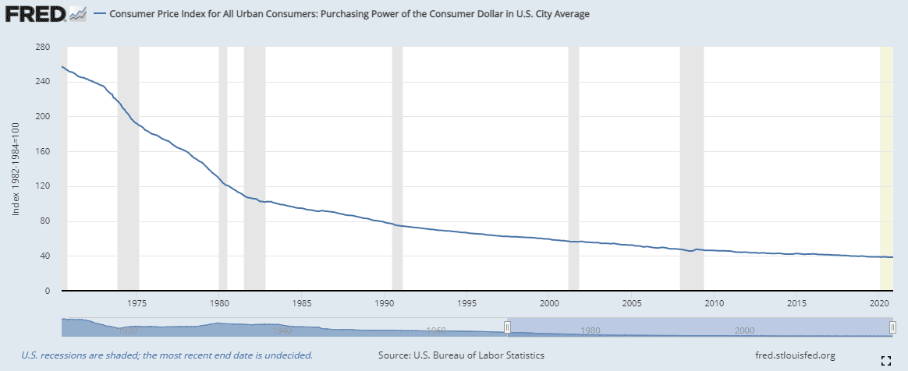

The financial landscape is rapidly evolving, offering new opportunities for investors through concepts like the Time Value of Money (TVM) and the advent of algorithmic trading. TVM is a fundamental financial concept emphasizing the potential worth of money today versus its value in the future. It operates on the principle that, given the potential for earning interest, a sum of money is worth more now than the same sum in the future. This concept is crucial in financial calculations and investment strategies, playing a pivotal role in areas such as present and future value assessments, investment appraisals, and capital budgeting. 

On the other hand, algorithmic trading leverages technology to execute trading strategies with speed and precision, maximizing investment efficiency. It uses complex algorithms to make decisions about the timing, price, and quantity of trades, which can be executed in fractions of a second. This method not only reduces transaction costs but also eliminates emotional biases, allowing traders to analyze vast amounts of data in real time and execute trades based on predefined criteria. In particular, algorithms can identify trends and patterns unseen by human traders, execute trades at optimal conditions, and reallocate portfolios with minimized human intervention.



This article explores the intersection of TVM and algorithmic trading, focusing on how these two principles can optimize financial strategies. By integrating TVM into algorithmic trading, investors can achieve more efficient portfolio management and strategic decision-making, paving the way for enhanced return prospects and risk management in a continuously evolving financial market.

## Table of Contents

## Understanding the Time Value of Money (TVM)

The Time Value of Money (TVM) is a fundamental financial concept that underscores the principle that money available now is more valuable than the same amount in the future. This concept is pivotal because of the earning potential of money, where funds available presently can be invested to generate returns. The foundational belief in TVM is that money can earn interest or investment returns over time, thus making a dollar today worth more than a dollar tomorrow.

TVM is crucial for making informed financial decisions, as it emphasizes the role of compounding and interest rates in wealth accumulation. Compounding refers to the process where the value of an investment increases because the earnings on an asset, both capital gains and interest, earn interest as time passes. The formula for future value, which illustrates compounding, is:

$$
FV = PV \times (1 + r)^n
$$

where:
- $FV$ is the future value of the investment,
- $PV$ is the present value or initial amount of money,
- $r$ is the annual interest rate (expressed as a decimal),
- $n$ is the number of years the money is invested or borrowed.

A complementary component of TVM is the present value (PV), which calculates the worth of future cash flows in today's monetary terms. The present value formula is expressed as:

$$
PV = \frac{FV}{(1 + r)^n}
$$

Here, PV helps investors and financial analysts determine the amount of money needed today to achieve a specific future sum, giving due consideration to the opportunity cost of investing funds today.

TVM principles guide various financial activities, including loan amortization, bond pricing, annuities, and retirement planning. By applying TVM concepts, individuals and businesses can assess investment projects, compare financial products, and make decisions that optimize wealth accumulation.

Moreover, understanding interest rates' influence is vital to effectively using TVM. Different types of interest rates, such as simple and compound interest, directly impact the future value of investments. A sophisticated comprehension of these rates enhances the ability to evaluate different investment scenarios accurately.

In summary, TVM is a cornerstone of finance that aids investors in comprehending the potential growth of their current financial resources while providing insights into the valuation of future cash flows. These calculations ensure that investments are strategic and that financial resources are allocated optimally to maximize returns over time.

## The Role of Algorithmic Trading

Algorithmic trading, a transformative practice in the financial markets, leverages sophisticated algorithms to automate trading activities. By adhering to predetermined criteria, these algorithms execute trades at speeds unattainable by human traders, ensuring efficiency and precision in transaction execution. 

One of the primary benefits of [algorithmic trading](/wiki/algorithmic-trading) lies in its capacity to significantly reduce transaction costs. Traditional trading involves human decision-making, which can be slow and costly due to human error and biases. Algorithmic trading, however, executes trades based on pure logic and pre-set parameters, minimizing these inefficiencies. By eliminating manual intervention, the system not only reduces the costs associated with human traders but also cuts down on the slippage costs often incurred in manual execution.

In addition to cost efficiency, algorithmic trading is advantageous for its ability to overcome emotional biases. Human traders can be influenced by emotions such as fear and greed, leading to irrational decision-making. By contrast, algorithms remain unaffected by psychological factors, enabling them to make objective decisions based on data and analytical models.

Another significant advantage of algorithmic trading is its capacity to process and analyze vast amounts of market data in real-time. This ability allows traders to capitalize on transient market opportunities that would otherwise be impossible to exploit with manual trading techniques. The algorithms can parse through data, identify patterns, and execute trades with millisecond precision, thereby optimizing trading opportunities.

Various strategies are employed in algorithmic trading, each designed to exploit different market conditions and objectives. Trend-following strategies are among the most common, focusing on identifying and capitalizing on market trends. These algorithms instruct the system to buy or sell based on the direction of market movements, adhering to predefined rules that specify entry and [exit](/wiki/exit-strategy) points.

Arbitrage strategies are another form of algorithmic trading, where the aim is to take advantage of price discrepancies between multiple markets or instruments. By simultaneously purchasing and selling an asset in different markets, algorithms can lock in profits with minimal risk.

Execution-based strategies such as Volume Weighted Average Price (VWAP) and Time Weighted Average Price (TWAP) are also widely used. VWAP divides large orders into smaller parts and executes them incrementally over time, aiming to achieve an average entry price that is better or equal to the market VWAP. TWAP, on the other hand, spreads the order evenly across a specified period, minimizing market impact and price [volatility](/wiki/volatility-trading-strategies).

Algorithmic trading continues to revolutionize the financial sector, providing traders with the tools needed to implement complex strategies with high efficiency and reduced risks.

## Synergy Between TVM and Algo Trading

Integrating the Time Value of Money (TVM) into algorithmic trading enhances portfolio management and strategic financial decision-making. Fundamental to this synergy is the understanding that money today is inherently more valuable than the same amount of money in the future due to its [earning](/wiki/earning-announcement) potential. When applied to algorithmic trading, this principle aids in optimizing rebalancing strategies and seizing [arbitrage](/wiki/arbitrage) opportunities.

Algorithmic trading operates on pre-defined, automated rules, allowing swift execution of trades and efficient management of investment portfolios. By embedding TVM principles into these algorithms, traders can better evaluate long-term investment strategies, ensuring that decisions account for the discounted value of future cash flows. This integration is crucial for formulating algorithms that can accurately assess the present value (PV) and future value (FV) of various financial instruments, thereby enabling traders to make more informed and profitable trades.

A practical application involves using TVM to optimize portfolio rebalancing. Algorithmic strategies can automatically adjust the weightings of assets in a portfolio based on the updated projections of PV and FV, considering factors such as [interest rate](/wiki/interest-rate-trading-strategies) fluctuations and expected growth rates. This dynamic approach ensures that portfolios remain aligned with investors' financial goals and risk appetite.

Moreover, TVM principles can significantly enhance arbitrage strategies in algorithmic trading. Arbitrage involves capitalizing on price differences of the same asset across different markets. By factoring in TVM, algorithms can more precisely evaluate whether the potential profit from an arbitrage opportunity justifies the time value loss of holding funds across varied settlement periods.

Robust [backtesting](/wiki/backtesting) is integral to the successful integration of TVM in algorithmic trading. Backtesting involves simulating trading algorithms using historical data to assess their effectiveness and resilience in various market conditions. By incorporating TVM, including adjustments for fluctuating interest rates and compounding periods, traders can enhance the robustness of their algorithms. This process allows for fine-tuning strategies to mitigate risk and optimize returns amidst market volatility.

Python, commonly used in algorithmic trading for its extensive libraries and ease of use, can assist in implementing these strategies. For instance, employing libraries like NumPy and pandas allows traders to model TVM scenarios and perform complex calculations efficiently. A basic example to calculate present value in Python could be:

```python
def calculate_present_value(future_value, rate, periods):
    present_value = future_value / ((1 + rate) ** periods)
    return present_value

# Example usage
future_value = 1000
rate = 0.05
periods = 5
pv = calculate_present_value(future_value, rate, periods)
print(f"The present value is: {pv}")
```

This synergy of TVM and algorithmic trading facilitates a refined approach to investment strategy formulation, enabling traders to harness both time-tested financial principles and cutting-edge technology to optimize portfolio performance and capitalize on market opportunities.

## Opportunities and Challenges

The combination of Time Value of Money (TVM) and algorithmic trading presents significant opportunities for developing investment strategies that are both precise and dynamic. By effectively integrating these concepts, investors can capitalize on the ability to swiftly execute trades while considering the financial implications of time on money's value. This synergy enhances decision-making processes, providing potential for increased returns through strategic investment moves that optimize the timing and value of financial transactions.

However, several challenges emerge when merging these components. Sophisticated programming is essential to develop complex algorithms capable of executing trades with split-second precision. These programs must account for various financial principles, including interest rates and present value calculations, ensuring that trading strategies remain aligned with TVM fundamentals.

Access to real-time data is crucial, as it allows algorithms to quickly respond to market changes and exploit arbitrage opportunities effectively. This necessitates a highly reliable and responsive data infrastructure capable of processing vast streams of information without delay.

Regulatory compliance adds another layer of complexity; algorithms must adhere to financial regulations that vary across different jurisdictions. Ensuring compliance requires constant updates to software systems in response to evolving regulatory frameworks, highlighting the need for a thorough understanding of legal norms in financial markets.

Managing market volatility poses a further challenge. Algorithmic strategies relying on TVM need robust adaptability to handle unexpected shifts in market conditions. This necessitates the development of flexible algorithms that can adjust trading behaviors in response to sudden changes in interest rates or market environments.

To mitigate these challenges, robust risk management frameworks are of paramount importance. These frameworks minimize the impact of algorithmic flaws and market anomalies. Implementing features such as fail-safes and stress testing can enhance the resilience of algorithmic systems against unforeseen events or miscalculations. Additionally, continuously backtesting algorithms against historical data supports the identification and rectification of vulnerabilities, solidifying their sturdy application in live trading scenarios.

In conclusion, while the integration of TVM and algorithmic trading offers exciting avenues for improved investment strategies, it necessitates overcoming several technical, regulatory, and market-related obstacles. Addressing these challenges will be pivotal in harnessing the full potential of these combined financial principles.

## Conclusion

The integration of the Time Value of Money (TVM) with algorithmic trading represents a significant advancement in investment strategy development. By leveraging TVM principles, investors can better understand the impact of time on cash flow value, directly influencing the execution and effectiveness of algorithmic strategies. This synergy enhances decision-making processes, resulting in optimized returns and effective risk management.

TVM underscores the importance of recognizing the earning potential inherent in money over time. This concept becomes particularly salient when integrated into algorithmic trading, which thrives on precision and data-driven strategies. The ability to [factor](/wiki/factor-investing) in present value and future value calculations allows for more informed trading decisions that take into account fluctuating interest rates and the compounding effects over time. This is especially valuable for strategies involving rebalancing and arbitrage, where the timing of cash flows and market conditions can significantly influence outcomes.

In today’s continuously evolving financial landscape, embracing the combined power of TVM and algorithmic trading is essential for achieving sustainable financial growth and resilience. This integration enables investors to dynamically adjust their portfolios to changing market conditions and capitalize on emerging opportunities while maintaining a robust risk management framework to safeguard against market anomalies and system inefficiencies. The result is a more adaptive, resilient investment approach that equips investors to navigate complexity and uncertainty with greater confidence and agility.

## References & Further Reading

For individuals aiming to expand their understanding of the Time Value of Money (TVM) and algorithmic trading, several seminal resources and publications provide valuable insights:

1. **Books on Financial Concepts**:
   - "Principles of Corporate Finance" by Richard Brealey, Stewart Myers, and Franklin Allen offers a comprehensive examination of TVM, compounding, and present/future value calculations. These core concepts are essential for understanding discounted cash flow analysis and financial modeling.
   - "Algorithmic Trading and DMA: An introduction to direct access trading strategies" by Barry Johnson provides a detailed overview of algorithmic trading principles, including strategy development and execution.

2. **Scholarly Articles and Journals**:
   - Articles in journals such as the *Journal of Finance* and the *Review of Financial Studies* often publish empirical studies and theoretical research on TVM and quantitative trading models. These publications can help understand how theory is applied in real markets.

3. **Online Courses and Lectures**:
   - MOOCs on platforms like Coursera and edX offer courses in algorithmic trading, financial mathematics, and investment strategies. Renowned courses, such as "Financial Engineering and Risk Management" by Columbia University, enable learners to engage with complex financial models and programming challenges in Python.

4. **Industry Whitepapers and Technical Documents**:
   - Many financial institutions and tech companies publish whitepapers outlining contemporary advances in algorithmic trading technologies and the incorporation of TVM in investment strategies. These documents often incorporate quantitative algorithms and applications of machine learning in financial contexts.

5. **Online Forums and Communities**:
   - Engagement with communities such as QuantConnect, Stack Exchange’s Quantitative Finance section, and GitHub repositories can be useful for practical learning. These platforms often share algorithmic trading systems, snippets of code, and insight into latest trends and tools used by professionals.

6. **Python Libraries and Tools**:
   - Python libraries such as `numpy` and `pandas` are pivotal for financial computing, allowing the implementation of TVM calculations and backtesting of trading algorithms. Utilization of these tools complements theoretical knowledge with practical, executable code. For example:
     ```python
     import numpy as np
     # Calculate future value
     present_value = 1000  # Principal amount
     rate = 0.05  # 5% interest rate
     time_period = 10  # 10 years
     future_value = present_value * (1 + rate)**time_period
     print(f"Future Value: {future_value}")
     ```

7. **Regulatory Frameworks and Guidelines**:
   - Familiarizing with regulatory guidelines such as the Markets in Financial Instruments Directive (MiFID II) is crucial for understanding the constraints and requirements of trading algorithms in European markets.

By consulting these diverse resources, investors and learners can deepen their mastery over TVM principles and algorithmic trading methods, enabling strategic financial planning and robust investment decisions.

