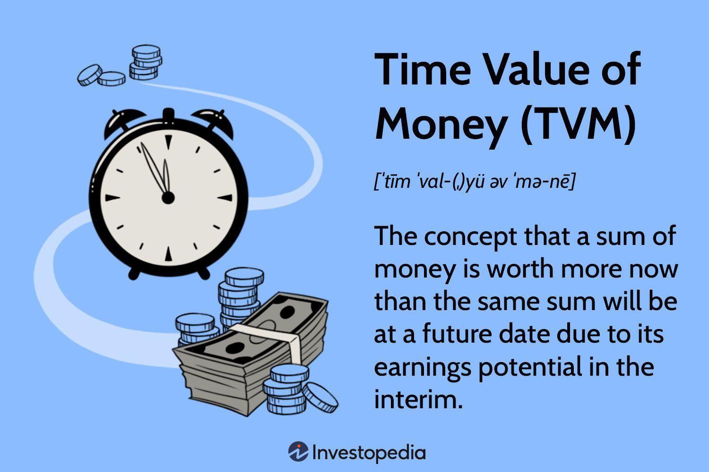

The financial landscape is continually evolving, offering myriad opportunities for aspiring and experienced investors alike. Central to many investment strategies is the concept of the Time Value of Money (TVM), an essential principle that underscores the potential earning power of money over time. The core idea of TVM is that a specific amount of money today can be worth more than the same amount in the future due to its potential earning capacity and the effects of compounding interest over time. This foundational concept is pivotal for evaluating investment opportunities and making informed financial decisions.

Simultaneously, advancements in technology have led to the rise of algorithmic trading, which leverages computer programs to execute trading strategies at speeds and efficiencies beyond human capabilities. These algorithms are designed to automatically make trading decisions based on a set of predefined criteria such as price, timing, and market conditions. This technological evolution offers investors several advantages, including reduced transaction costs, the elimination of emotional biases, and the ability to process vast amounts of market data in real time.



This article aims to explore the intersection of the Time Value of Money and algorithmic trading, highlighting how these concepts can be integrated to enhance investment strategies. Incorporating the principles of TVM in algorithmic trading can lead to more efficient portfolio management and strategic decision-making. By understanding how TVM can be applied within algorithmic trading, investors can potentially optimize their returns and manage risks more effectively, ensuring that the inherent earning potential of their capital is fully utilized in dynamic markets.

## Table of Contents

## Understanding the Time Value of Money

The Time Value of Money (TVM) is a foundational financial principle asserting that a specific amount of money is worth more today than the same amount in the future. This is due to the potential earning capacity of money, given the opportunity to earn interest or be invested over time. Essentially, money available now can be invested to generate more money in the future, highlighting the importance of considering time when evaluating financial decisions.

A critical component of the Time Value of Money is compounding. Compounding involves the process where the interest earned on an invested sum itself earns further interest over subsequent periods. This effect results in exponential growth of the initial amount, significantly increasing wealth over time. The power of compounding can be illustrated through the compound interest formula:

$$
A = P \left(1 + \frac{r}{n}\right)^{nt}
$$

where:
- $A$ is the amount of money accumulated after n years, including interest.
- $P$ is the principal amount (the initial sum of money).
- $r$ is the annual interest rate (decimal).
- $n$ is the number of times that interest is compounded per year.
- $t$ is the time the money is invested for in years.

Central to TVM calculations are key formulas that help evaluate financial scenarios, including present value (PV) and future value (FV). Present value determines the current worth of a future sum of money given a specific [interest rate](/wiki/interest-rate-trading-strategies), enabling investors to compare investment alternatives. The formula for computing present value is:

$$
PV = \frac{FV}{(1 + r)^t}
$$

where:
- $PV$ is the present value.
- $FV$ is the future value.
- $r$ is the annual discount rate.
- $t$ is the time period until the future value is realized.

The importance of the Time Value of Money extends to making informed investing decisions. It allows investors to assess the value of a financial asset in current terms, offering insights into cash flows, investment returns, and opportunity costs. Understanding these dynamics empowers investors to consider how delaying consumption in favor of investment today can enhance wealth creation in the future. By evaluating different financial strategies and scenarios through the lens of TVM, investors can optimize their portfolios for maximum returns.

 to Algorithmic Trading

Algorithmic trading, often referred to as algo trading, involves the use of computer algorithms to automate and optimize trading processes. These algorithms execute trades based on predefined criteria such as timing, price, and [volume](/wiki/volume-trading-strategy). The primary intention is to capitalize on speed and efficiency, attributes which manual trading would struggle to match. By automating the trading process, algo trading reduces transaction costs and significantly diminishes the impact of human emotions on trading decisions, which can often lead to erratic and unprofitable actions.

One of the significant advantages of [algorithmic trading](/wiki/algorithmic-trading) is the speed at which trades can be executed. With algorithms, trades are executed in fractions of a second, ensuring that traders can take advantage of fleeting market opportunities that might be missed with slower, human-driven processes. Moreover, algorithms can analyze and act upon vast datasets much faster than any human, providing an edge in markets where timing is critical.

Algo trading also offers considerable cost reductions in transactions. Since algorithms can aggregate trades, they often lead to lower spreads and trading fees. This advantage is particularly significant for strategies requiring high-frequency or large-volume trades, where transaction costs can erode profit margins.

A core benefit of algorithmic trading is the elimination of emotional biases. Market decisions made under the influence of emotions such as fear or greed can often hinder rational decision-making. Algorithms, by their nature, follow a logical sequence of operations and are not influenced by emotional factors, thus ensuring that trading decisions remain consistent with the predetermined strategy.

Typical strategies employed in algorithmic trading encompass trend-following, [arbitrage](/wiki/arbitrage), and sophisticated execution-based approaches like Volume Weighted Average Price (VWAP) and Time Weighted Average Price (TWAP). Trend-following strategies analyze market data to identify potential upward or downward trends and execute trades accordingly. Arbitrage strategies exploit price differences of the same asset in different markets. On the other hand, execution-based strategies such as VWAP and TWAP aim to minimize market impact and provide better average price execution by dispersing large orders over time.

Despite these advantages, algorithmic trading faces several challenges. Robust technology infrastructure is essential, as system failures, no matter how transient, can lead to significant financial losses. Moreover, markets can exhibit anomalies or sudden changes — such as flash crashes — which may not be anticipated by the algorithm's logic, potentially leading to adverse outcomes.

In conclusion, while algorithmic trading presents numerous benefits, ensuring the reliability and adaptability of the trading system is crucial amidst dynamic market conditions. Successful implementation necessitates a combination of technology, strategy development, and continuous monitoring to handle unexpected events and maintain a competitive edge.

## The Synergy Between TVM and Algorithmic Trading

Integrating the principles of the Time Value of Money (TVM) into algorithmic trading strategies offers substantial potential to enhance investment decision-making. This integration primarily revolves around understanding how the growth of funds can be optimized over time—a process central to maximizing returns and managing opportunity costs effectively.

Algorithmic trading can be programmed to optimize investment returns by incorporating TVM principles. Through strategies like rebalancing and arbitrage, algorithms assess how money could grow over time and [factor](/wiki/factor-investing) in compounding effects. For instance, in a rebalancing strategy, an algorithm might regularly adjust the proportion of different assets in a portfolio based on predicted future values that include potential interest accruals, thereby aligning with TVM principles. Similarly, algorithms employed in arbitrage activities can exploit discrepancies in asset pricing by considering both immediate transactions and potential future valuation changes, calculating the present value and future value of potential trades using fundamental financial formulas:

$$
\text{Future Value} (FV) = PV \times (1 + r)^n
$$
$$
\text{Present Value} (PV) = \frac{FV}{(1 + r)^n}
$$

Where PV is the present value, FV is the future value, $r$ is the interest rate, and $n$ is the number of compounding periods.

By quantifying opportunity costs and anticipated returns, investors can make better-informed decisions about when to hold, buy, or sell assets. For example, if an algorithm anticipates higher returns from holding an asset due to favorable TVM considerations, it could automate the decision to hold, rather than sell, thus optimizing portfolio performance over time.

Incorporating TVM into the [backtesting](/wiki/backtesting) of trading algorithms allows for insights into how different strategies might perform under varying timeframes and interest rate environments. By simulating scenarios with fluctuating interest rates and compounding periods, backtests can enhance the robustness of strategies by anticipating and preparing for various market conditions. Such simulations might include changes in central bank policy rates or economic shifts that impact expected returns, ensuring strategies are adaptive.

To implement these integrations in practical terms, Python offers powerful libraries such as NumPy and pandas that can facilitate TVM calculations and backtesting functionality. Here’s a simple example of how one might integrate a TVM calculation in a Python script for an algorithmic strategy:

```python
import numpy as np

def future_value(pv, rate, n):
    return pv * (1 + rate)**n

def present_value(fv, rate, n):
    return fv / (1 + rate)**n

# Example usage in a trading strategy
present_value_of_trade = present_value(10500, 0.05, 1) # Example for one period at 5% interest rate
```

Such integrations make algorithmic trading strategies more dynamic and aligned with fundamental financial principles, thus leveraging technology to realize the full potential of TVM in modern markets. By doing so, investors can not only anticipate but also strategically exploit market conditions to optimize investment returns.

## Opportunities and Challenges

The integration of the Time Value of Money (TVM) with algorithmic trading introduces significant opportunities for crafting investment strategies that leverage both temporal and technological efficiencies. By incorporating TVM principles, algorithms can be tailored to optimize returns by considering not just immediate profits but also the long-term growth potential of investments. For instance, by calculating the present and future values of assets using formulas such as:

$$
\text{Present Value (PV)} = \frac{FV}{(1 + r)^n}
$$

$$
\text{Future Value (FV)} = PV \times (1 + r)^n
$$

where $r$ is the interest rate and $n$ is the number of compounding periods, algorithms can identify opportunities where the expected future gains outweigh current expenses or losses.

This synergy allows for more precise rebalancing strategies, where the optimal timing and selection of assets are determined by evaluating their future growth potential versus current market conditions. Additionally, opportunities in arbitrage can be enhanced through the rapid processing capabilities of algorithms, exploiting price discrepancies across markets more effectively by factoring in the time-associated costs and benefits.

However, the marriage of TVM and algorithmic trading is not without challenges. One major requirement is the need for sophisticated programming skills to develop and maintain these advanced algorithms. Algorithmic trading systems must also have access to real-time data feeds to make accurate and timely decisions, which can be logistically and financially demanding.

Compliance with regulatory requirements adds another layer of complexity. Financial regulations can vary significantly across jurisdictions, requiring a deep understanding of legal obligations to ensure that algorithmic trading strategies remain compliant. This involves continuous monitoring and auditing of algorithms to prevent activities such as market manipulation or breaches of trading limits.

Market [volatility](/wiki/volatility-trading-strategies) poses additional risks. Sudden market shifts can lead to unpredictable algorithm behavior, sometimes amplifying losses if not adequately mitigated. There is also an inherent systemic risk, as the widespread use of similar algorithms can lead to market anomalies, such as flash crashes, where rapid sell-offs cascade due to automated sell triggers being hit across the market.

Investors, therefore, must remain vigilant, adopting robust risk management frameworks to anticipate and mitigate these challenges. This includes regular stress testing of algorithms, diversification of trading strategies, and implementing failsafe mechanisms to curb excessive risk-taking. Overall, while the integration of TVM and algorithmic trading offers a transformative opportunity in investment strategy formulation, navigating its complexities requires a disciplined and informed approach.

## Conclusion

The Time Value of Money (TVM) and algorithmic trading each bring distinct advantages to the financial world, but their integration creates a robust framework for modern investment strategies. By understanding and leveraging the synergy between these concepts, investors can maximize returns and make more informed financial decisions. TVM emphasizes the importance of the temporal distribution of cash flows by telling us that money available now is worth more than the same amount in the future due to its [earning](/wiki/earning-announcement) potential. This principle is crucial for investors looking to optimize their investment timing and compound their gains, especially when enhanced through algorithmic strategies.

Algorithmic trading, with its speed and efficiency, allows for the rapid execution of trading decisions, making it possible to capitalize on short-lived market opportunities that manual trading cannot achieve. By programming algorithms to include TVM principles, it's possible to quantify opportunity costs and assess potential returns over various timeframes, allowing for the optimization of investment portfolios. For instance, an algorithm can be configured to account for the discounting of future cash flows when evaluating potential trades, thus ensuring that decisions are aligned with long-term financial goals.

As technology and markets continue to evolve, the importance of combining sound financial principles like the Time Value of Money with sophisticated trading mechanisms becomes increasingly crucial for successful investing. This integration is not merely about enhancing returns but also robustly managing risks associated with volatile markets. Moreover, as regulatory environments become more stringent, algorithms that factor in TVM can better navigate these complexities by ensuring compliance while optimizing for growth.

In conclusion, the intersection of TVM and algorithmic trading represents a critical evolution in investment strategies. By harnessing this synergy, investors are better equipped to navigate dynamic market conditions, seize opportunities, and mitigate risks — ultimately resulting in informed and potentially lucrative financial decisions.

## References & Further Reading

[1]: ["Principles of Corporate Finance"](https://www.mheducation.com/highered/product/principles-corporate-finance-brealey-myers/M9781264080946.html) by Richard A. Brealey, Stewart C. Myers, and Franklin Allen

[2]: ["Investments"](https://www.nerdwallet.com/article/investing/how-to-start-investing) by Zvi Bodie, Alex Kane, and Alan J. Marcus

[3]: Cumming, D. J., & Johan, S. A. (2013). ["High Frequency Trading and Market Performance."](https://abdn.elsevierpure.com/en/publications/venture-capital-and-private-equity-contracting-an-international-p) Journal of Financial Markets, 16(4), 637-658.

[4]: Chordia, T., Roll, R., & Subrahmanyam, A. (2011). ["Recent Trends in Trading Activity and Market Quality."](https://www.sciencedirect.com/science/article/pii/S0304405X11000730) Journal of Financial Economics, 101(2), 243-263.

[5]: Poterba, J. M., & Samwick, A. A. (2003). ["Taxation and Household Portfolio Composition: US Evidence from the 1980s and 1990s."](https://economics.mit.edu/sites/default/files/publications/1-s2.0-S0047272701001682-main.pdf) Journal of Public Economics, 87(1), 5-38.